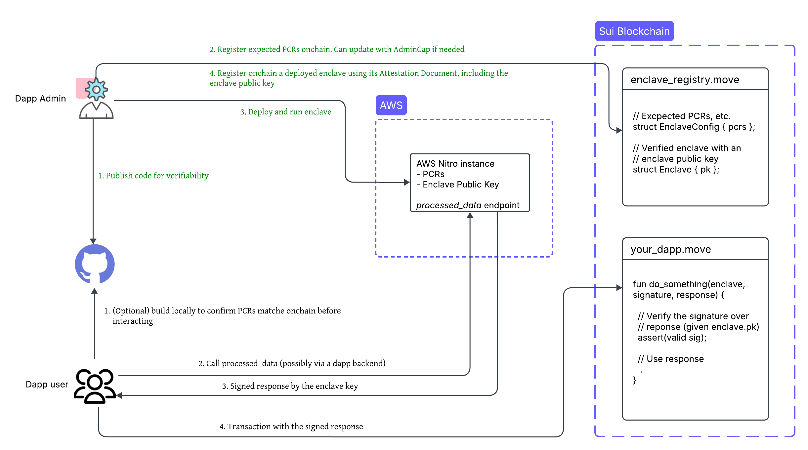

## dApp developer actions

1. [provided template](https://github.com/MystenLabs/nautilus)을 사용하여 재현 가능한 빌드로 Nautilus 오프체인 서버를 생성한다.
2. 투명성과 검증 가능성을 보장하기 위해 서버 코드를 GitHub와 같은 공개 저장소에 게시한다.
3. Sui 스마트 컨트랙트를 사용하여 인스턴스의 플랫폼 구성 레지스터(PCR) - 신뢰 컴퓨팅 기반의 측정값 - 를 등록한다.
4. AWS Nitro Enclave에 서버를 배포한다.
5. Sui 스마트 컨트랙트와 attestation 문서를 사용하여 배포된 enclave를 등록하며, 여기에는 응답 서명을 위한 enclave의 임시 public key가 포함된다.

신뢰 컴퓨팅 기반을 줄이기 위해, 로드 밸런싱, 속도 제한 및 기타 관련 측면을 처리하는 백엔드 서비스를 통해 enclave에 대한 액세스를 라우팅해야 한다.

:::tip

높은 가스 비용으로 인해 enclave 등록 중에만 온체인에서 attestation 문서를 검증한다. 등록 후에는 더 효율적인 메시지 검증을 위해 enclave 키를 사용한다.

:::

## dApp user / client actions

1. (선택 사항) Nautilus 오프체인 서버 코드를 로컬에서 빌드하고 생성된 PCR이 온체인 기록와 일치하는지 확인하여 검증한다.
2. 배포된 enclave에 요청을 보내고 서명된 응답을 받는다.
3. 해당 애플리케이션 로직을 실행하기 전에 검증을 위해 서명된 응답을 온체인에 제출한다.

## Trust model

AWS Nitro Enclave의 attestation 문서에는 AWS를 루트 인증 기관으로 사용하여 온체인에서 검증할 수 있는 인증서 체인이 포함되어 있다. 이 검증은 다음을 확인한다:

- Enclave 인스턴스는 PCR 값으로 검증된 대로 수정되지 않은 소프트웨어를 실행하고 있다.
- 사용자는 인스턴스의 계산이 게시된 소스 코드와 일치하는지 독립적으로 검증할 수 있으며, 이는 투명성과 신뢰를 보장한다.

재현 가능한 빌드를 통해 빌더와 사용자는 enclave 인스턴스 내에서 실행되는 바이너리가 소스 코드의 특정 버전과 일치하는지 선택적으로 검증할 수 있다. 이 접근 방식은 다음과 같은 이점을 제공한다:

- 누구나 바이너리를 빌드하고 비교하여 게시된 소스 코드와의 일관성을 확인할 수 있다.
- 소프트웨어에 대한 모든 변경 사항은 다른 PCR 값을 생성하므로 무단 수정을 감지할 수 있다.
- 재현 가능한 빌드는 신뢰를 런타임에서 빌드 타임으로 이동시켜 dApp의 전반적인 보안 태세를 강화한다.

:::important

재현 가능한 빌드는 소스 코드가 공개되지 않은 경우와 같이 모든 사용 사례에 적용되지 않을 수 있다.

:::
