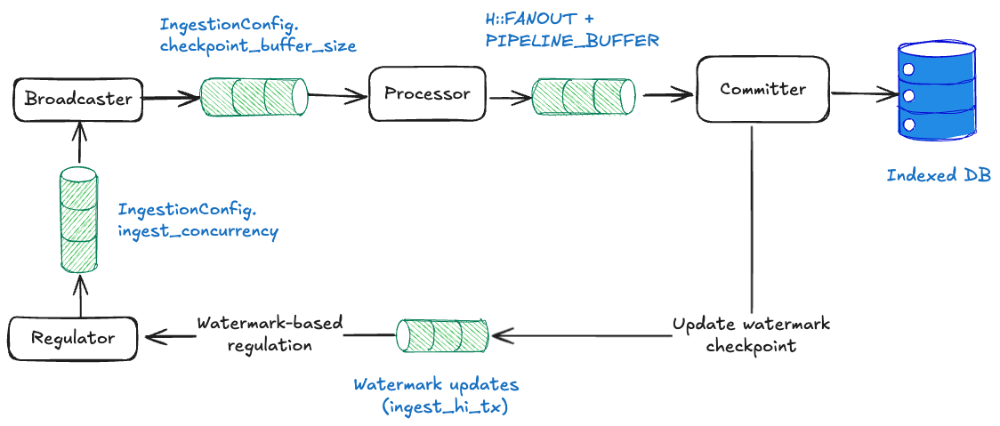
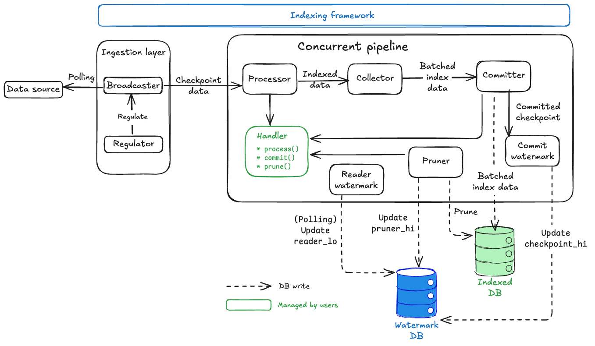
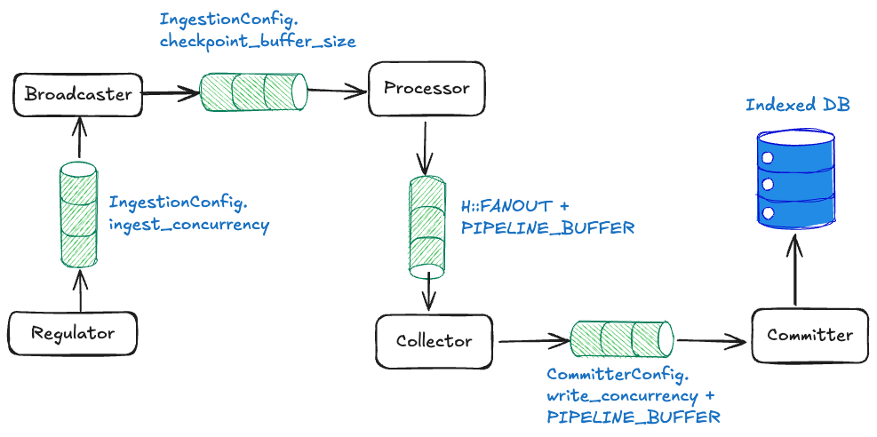

`sui-indexer-alt-framework`는 두 가지 고유한 파이프라인 아키텍처를 제공한다. 올바른 접근 방식을 선택하기 위해 이들의 차이점을 이해하는 것이 중요하다.

## Sequential versus concurrent pipelines

[Sequential pipeline](#sequential-pipeline-architecture) 은 완전한 체크포인트를 순서대로 커밋한다. 각 체크포인트는 다음 체크포인트가 처리되기 전에 완전히 커밋되어 단순하고 일관된 읽기를 보장한다.

[Concurrent pipeline](#concurrent-pipeline-architecture) 은 순서와 관계없이 커밋하며 개별 체크포인트를 부분적으로 커밋할 수 있다. 이를 통해 여러 체크포인트를 동시에 처리하여 더 높은 처리량을 달성할 수 있지만, 일관성을 보장하기 위해 어떤 데이터가 완전히 커밋되었는지 읽기 작업에서 확인해야 한다.

## When to use each pipeline

두 파이프라인 유형 모두 제자리 업데이트, 집계 및 복잡한 비즈니스 로직을 처리할 수 있다. 시퀀셜 파이프라인은 컨커런트 파이프라인에 비해 처리량 제한이 있지만, 둘 중 하나를 선택하는 결정은 성능 요구사항보다는 주로 엔지니어링 복잡성에 관한 것이다.

### Recommended: Sequential pipeline

대부분의 사용 사례에서 여기서 시작한다. 더 직관적인 구현과 유지보수를 제공한다.

<ul classname="list-none pl-2">
<li>
<span classname="text-sui-success-dark">✓</span> 직접적인 커밋과 간단한 쿼리로 직관적인 구현을 원한다.</li>
<li>
<span classname="text-sui-success-dark">✓</span> 팀이 예측 가능하고 디버깅하기 쉬운 동작을 선호한다.</li>
<li>
<span classname="text-sui-success-dark">✓</span> 현재 성능이 요구사항을 충족한다.</li>
<li>
<span classname="text-sui-success-dark">✓</span> 운영의 단순성을 중시한다.</li>
</ul>

### concurrent pipeline

다음과 같은 경우 concurrent pipeline 구현을 고려한다:

<ul classname="list-none pl-2">
<li>
<span classname="text-sui-success-dark">✓</span> 성능 최적화가 필수적이다.</li>
<li>
<span classname="text-sui-success-dark">✓</span> 시퀀셜 처리가 데이터 볼륨을 따라갈 수 없다.</li>
<li>
<span classname="text-sui-success-dark">✓</span> 팀이 성능 이점을 위해 추가적인 구현 복잡성을 처리할 의향이 있다.</li>
</ul>

순서와 관계없는 커밋을 지원하면 파이프라인에 몇 가지 추가 복잡성이 생긴다:

- Watermark 인식 쿼리: 모든 읽기는 어떤 데이터가 완전히 커밋되었는지 확인해야 한다. 자세한 내용은 [the watermark system](#watermark-system)  섹션을 참조한다.
- 복잡한 애플리케이션 로직: 완전한 체크포인트를 처리하는 대신 데이터 커밋을 조각 단위로 처리해야 한다.

## Decision framework

프로젝트에 어떤 파이프라인을 선택해야 할지 확실하지 않다면 구현과 디버깅이 더 쉬운 sequential pipeline 으로 시작한다. 그런 다음 현실적인 부하에서 성능을 측정한다. sequential pipeline 이 프로젝트 요구사항을 충족할 수 없다면 concurrent pipeline 으로 전환한다.

전체 목록은 아니지만 시퀀셜 파이프라인이 요구사항을 충족하지 못할 수 있는 몇 가지 구체적인 시나리오는 다음과 같다:

- 파이프라인이 각 체크포인트에서 청킹과 순서 무관 커밋의 이점을 얻는 데이터를 생성한다. 개별 체크포인트는 많은 데이터나 지연 시간을 추가할 수 있는 개별 쓰기를 생성할 수 있다.
- pruning이 필요한 많은 데이터를 생성하고 있다. 이 경우 컨커런트 파이프라인을 사용해야 한다.

어떤 파이프라인을 사용할지 결정하는 것 외에도 확장에 대해 고려해야 한다. 여러 종류의 데이터를 인덱싱하는 경우 여러 파이프라인과 워터마크를 사용하는 것을 고려한다.

## The watermark system {#watermark-system}

각 파이프라인에 대해 인덱서는 최소한 해당 지점까지의 모든 데이터가 커밋된 가장 높은 체크포인트를 추적한다. 추적은 committer watermark인 `checkpoint_hi_inclusive`를 통해 수행된다. 컨커런트 파이프라인과 시퀀셜 파이프라인 모두 재시작 시 처리를 재개할 위치를 파악하기 위해 `checkpoint_hi_inclusive`에 의존한다.

선택적으로 파이프라인은 pruning이 활성화된 경우 읽기 및 pruning 작업의 안전한 하한을 정의하는 `reader_lo`와 `pruner_hi`를 추적한다. 이러한 watermark는 데이터 무결성을 유지하면서 순서와 관계없는 처리를 가능하게 하므로 concurrent pipeline에 특히 중요하다.

### Safe pruning

Watermark 시스템은 강력한 데이터 라이프사이클 관리 시스템을 만든다:

1. **Guaranteed data availability:**체크포인트 데이터 가용성 규칙을 적용하면 리더가 안전한 쿼리를 수행할 수 있다.
2. **Automatic cleanup process:** 파이프라인은 리텐션 보장을 유지하면서 스토리지가 무한정 증가하지 않도록 pruning되지 않은 체크포인트를 자주 정리한다. Pruning 프로세스는 경쟁 조건을 피하기 위해 안전 지연으로 실행된다.
3. **Balanced approach:** 시스템은 안전성과 효율성 사이의 균형을 유지한다.
    - 스토리지 효율성: 오래된 데이터가 자동으로 삭제된다.
    -  데이터 가용성: 항상 리텐션 양만큼의 완전한 데이터를 유지한다.
    -  안전 보장: 리더가 누락된 데이터 갭을 만나지 않는다.
    - 성능: 순서와 관계없는 처리가 처리량을 극대화한다.

이 watermark 시스템이 concurrent pipeline을 고성능이면서 신뢰할 수 있게 만드는 것으로, 강력한 데이터 가용성 보장과 자동 스토리지 관리를 유지하면서 대규모 처리량을 가능하게 한다.

### Scenario 1: Basic watermark (no pruning)

Pruning이 비활성화된 경우 인덱서는 각 파이프라인의 committer `checkpoint_hi_inclusive` 만 보고한다. 다음 타임라인을 고려한다. 여기서 여러 체크포인트가 처리 중이고 일부는 순서와 관계없이 커밋된다.

```sh
체크포인트 처리 타임라인:

[1000] [1001] [1002] [1003] [1004] [1005]
  ✓      ✓      ✗      ✓      ✗      ✗
         ^
  checkpoint_hi_inclusive = 1001

✓ = 커밋됨 (모든 데이터 기록됨)
✗ = 커밋되지 않음 (처리 중 또는 실패)
```

이 시나리오에서 체크포인트 1003이 커밋되었더라도 1002에 아직 갭이 있기 때문에 `checkpoint_hi_inclusive`는 1001이다. 인덱서는 시작부터  `checkpoint_hi_inclusive`까지의 모든 데이터가 사용 가능하다는 보장을 충족하기 위해 high watermark를 1001로 보고해야 한다.

체크포인트 1002가 커밋된 후에는 1003까지의 데이터를 안전하게 읽을 수 있다.

```sh
[1000] [1001] [1002] [1003] [1004] [1005]
  ✓      ✓      ✓      ✓      ✗       ✗
[---- 안전하게 읽기 가능 -------]
(start   →   checkpoint_hi_inclusive at 1003)
```

### Scenario 2: Pruning enabled

Pruning은 리텐션 정책으로 구성된 파이프라인에 대해 활성화된다. 예를 들어 테이블이 너무 커지고 마지막 4개의 체크포인트만 유지하려면 `retention = 4`로 설정한다. 이는 인덱서가  `checkpoint_hi_inclusive` 와 구성된 리텐션의 차이로 `reader_lo`를 주기적으로 업데이트한다는 것을 의미한다. 별도의 pruning 태스크가 `[pruner_hi, reader_lo]` 사이의 데이터를 pruning하는 역할을 한다.

```sh
[998] [999] [1000] [1001] [1002] [1003] [1004] [1005] [1006]
 🗑️    🗑️     ✓      ✓      ✓      ✓      ✗      ✗      ✗
              ^                    ^
       reader_lo = 1000       checkpoint_hi_inclusive = 1003

🗑️ = Pruning됨 (삭제됨)
✓ = 커밋됨
✗ = 커밋되지 않음
```

현재 watermark:

- `checkpoint_hi_inclusive` = 1003: -  시작부터 1003까지의 모든 데이터가 완전하다(갭 없음). -  1004가 아직 커밋되지 않았기 때문에(갭) 1005로 진행할 수 없다.

- `reader_lo` = 1000: 사용 가능이 보장되는 가장 낮은 체크포인트이다. -  다음과 같이 계산된다: `reader_lo = checkpoint_hi_inclusive - retention + 1`. - `reader_lo` = 1003 - 4 + 1 = 1000.

- `pruner_hi` = 1000: - 삭제된 가장 높은 배타적 체크포인트이다.- 체크포인트 998과 999가 공간을 절약하기 위해 삭제되었다.

명확한 안전 영역:

```sh
[998] [999] [1000] [1001] [1002] [1003] [1004] [1005] [1006]
 🗑️    🗑️     ✓      ✓      ✓      ✓      ✗      ✗      ✓

[--PRUNING됨--][--- 안전한 읽기 영역 ---] [--- 처리 중 ---]
```

### How watermarks progress over time

**Step 1:** 체크포인트 1004가 완료된다.

```sh
[999] [1000] [1001] [1002] [1003] [1004] [1005] [1006] [1007]
 🗑️     ✓      ✓      ✓      ✓      ✓      ✗      ✓      ✗
        ^                           ^
 reader_lo = 1000           checkpoint_hi_inclusive = 1004 (advanced by 1)
 pruner_hi = 1000
```

체크포인트 1004가 이제 커밋되었으므로 1004까지 갭이 없기 때문에 `checkpoint_hi_inclusive`가 1003에서 1004로 진행할 수 있다. `reader_lo`와 `pruner_hi`는 아직 변경되지 않았다.

**Step 2:** Reader watermark가 주기적으로 업데이트된다.

```sh
[999] [1000] [1001] [1002] [1003] [1004] [1005] [1006] [1007]
 🗑️     ✓      ✓      ✓      ✓      ✓      ✗      ✓      ✗
               ^                   ^
        reader_lo = 1001    checkpoint_hi_inclusive = 1004
        (1004 - 4 + 1 = 1001)

pruner_hi = 1000 (pruner가 아직 실행되지 않아 변경되지 않음)
```

별도의 reader watermark 업데이트 태스크(구성 가능한 주기로 실행)가 리텐션 정책에 따라 `reader_lo`를 1001(`1004 - 4 + 1 = 1001`로 계산)로 진행한다. 그러나 pruner가 아직 실행되지 않았으므로 `pruner_hi`는 1000으로 유지된다.

**Step 3:** Pruner가 안전 지연 후 실행된다.

```sh
[999] [1000] [1001] [1002] [1003] [1004] [1005] [1006] [1007]
 🗑️     🗑️     ✓      ✓      ✓      ✓      ✗      ✓      ✗
               ^                   ^
        reader_lo = 1001    checkpoint_hi_inclusive = 1004
        pruner_hi = 1001
```

`pruner_hi` (1000) &lt; `reader_lo` (1001)이므로 pruner는 일부 체크포인트가 리텐션 윈도우 밖에 있음을 감지한다.  `reader_lo` 까지의 모든 요소를 정리하고(체크포인트 1000 삭제) `pruner_hi`를 `reader_lo`(1001)로 업데이트한다.

:::info `reader_lo` 보다 오래된 체크포인트가 다음 이유로 일시적으로 여전히 사용 가능할 수 있다:

- 진행 중인 쿼리를 보호하는 의도적인 지연
-  Pruner가 아직 정리를 완료하지 않음 :::

## Sequential pipeline architecture

Sequential pipeline은 순서화된 처리를 우선시하는 더 간단하지만 강력한 인덱싱 아키텍처를 제공한다. Concurrent pipeline에 비해 일부 처리량을 희생하지만 더 강력한 보장을 제공하고 종종 추론하기가 더 쉽다.

### Architecture overview

Sequential pipeline은 두 개의 주요 컴포넌트로만 구성되어 concurrent pipeline의 6개 컴포넌트 아키텍처보다 훨씬 간단하다.


수집 레이어(`Regulator` + `Broadcaster`)와 `Processor`  컴포넌트는 concurrent pipeline과 동일한 백프레셔 메커니즘, `FANOUT` 병렬 처리 및 `processor()`구현을 사용한다.

핵심 차이점은 정렬, 배칭 및 데이터베이스 커밋을 처리하는 단일 `Committer` 컴포넌트만 있는 극적으로 단순화된 파이프라인 코어이다. 반면 concurrent pipeline은 `Processor` 외에 `Collector`, `Committer`, `CommitterWatermark`, `ReaderWatermark`,  `Pruner`의 5개 별도 컴포넌트가 있다.

### Sequential pipeline components {#sequential-components}

Sequential pipeline에는 두 개의 주요 컴포넌트가 있다.

1. [`Processor`](#seq-processor)
2. [`Committer`](#seq-committer)

#### `Processor` {#seq-processor}

<importcontent source="indexer-pipeline-processor.mdx" mode="snippet"></importcontent>

#### `Committer` {#seq-committer}

Sequential `Committer`는 파이프라인의 주요 컴포넌트이자 주요 커스터마이징 지점이다. 상위 수준에서  `Committer` 는 다음 작업을 수행한다:

1. **Receives** processor로부터 순서와 관계없이 처리된 데이터를 수신한다.
2. **Orders** 체크포인트 시퀀스별로 데이터를 정렬한다.
3. **Batches** 로직을 사용하여 여러 체크포인트를 함께 배칭한다.
4. **Commits** 배치를 데이터베이스에 원자적으로 커밋한다.
5. **Signals** 수집 레이어에 진행 상황을 다시 전달한다.

커스터마이징하려면 코드에서 committer가 호출하는 두 가지 핵심 함수를 사용한다:

`batch()`:  데이터 병합 로직이다.

<importcontent source="crates/sui-indexer-alt-framework/src/pipeline/sequential/mod.rs" mode="code" fun="batch" nocomments></importcontent>

`commit()`: 데이터베이스 쓰기 로직이다.

<importcontent source="crates/sui-indexer-alt-framework/src/pipeline/sequential/mod.rs" mode="code" fun="commit" nocomments></importcontent>

### Sequential pipeline backpressure mechanisms

Sequential pipeline은 메모리 오버플로우와 정렬 관련 데드락을 방지하기 위해 두 가지 레이어의 백프레셔를 사용한다:



#### Channel-based backpressure

Sequential pipeline은 concurrent pipeline과 동일한 채널 기반 흐름 제어를 사용하지만([concurrent pipeline backpressure](#concurrent-backpressure)에서 자세한 메커니즘 참조), 컴포넌트 수가 적어 더 간단한 토폴로지를 가진다:

- **Broadcaster → Processor:** `checkpoint_buffer_size` 슬롯.
- **Processor → Committer:** `FANOUT + PIPELINE_BUFFER` 슬롯.

#### Watermark-based regulation (sequential-specific) {#sequential-watermark-regulation}

Sequential pipeline은 체크포인트를 엄격한 순서로 처리해야 한다(N, 그 다음 N+1, 그 다음 N+2...). 체크포인트 N이 누락되면 사용 가능하더라도 이후 체크포인트를 커밋할 수 없다.

규제 없이 누락된 체크포인트는 다음과 같은 상황에서 데드락을 유발할 수 있다:

1.  파이프라인이 체크포인트 100을 기다린다.
2. 체크포인트 100이 삭제되거나 지연된다.
3.  수집이 버퍼를 101, 102, 103...으로 채운다.
4. 버퍼가 가득 차서 사용 가능할 때 체크포인트 100을 다시 가져올 수 없다.
5. 파이프라인이 영구적으로 멈춘다.

이 함정을 피하기 위해 watermark 진행 보고를 사용할 수 있다. 성공적인 커밋 후 `ingest_hi_tx`  채널을 통해 파이프라인에 `(pipeline_name, highest_committed_checkpoint)`를 regulator에 보내도록 지시한다.

<importcontent source="crates/sui-indexer-alt-framework/src/pipeline/sequential/committer.rs" tag="send"></importcontent>

The `Regulator` receives updates by listening on `ingest_hi_rx`. It then calculates the ingestion boundary across all pipelines (`min_subscriber_watermark + buffer_size`).<br><br>`Regulator`는 `ingest_hi_rx`에서 수신하여 업데이트를 받는다. 그런 다음 모든 파이프라인에 걸쳐 수집 경계를 계산한다(`min_subscriber_watermark +buffer_size`).

<importcontent source="crates/sui-indexer-alt-framework/src/ingestion/regulator.rs" tag="regulator"></importcontent>

이 접근 방식은 다음과 같은 방법으로 데드락을 방지한다:

- `Regulator`는 계산된 경계까지만 체크포인트를 가져온다.
- 어떤 파이프라인도 수집 프론트에서 너무 뒤처지지 않는다.
-  누락된 체크포인트를 재시도하기 위한 버퍼 공간이 사용 가능하도록 보장한다.

Sequential pipeline만 이 유형의 규제가 필요하다. Concurrent pipeline은 체크포인트를 순서와 관계없이 처리할 수 있고 누락된 체크포인트는 전체 진행을 중단하는 것이 아니라 watermark 업데이트만 지연시킨다.

### Performance tuning

Sequential pipeline은 더 기본적인 구성을 가지지만 중요한 튜닝 파라미터가 필요하다:

```rust
let config = SequentialConfig {
    committer: CommitterConfig {
        // Sequential pipeline에는 적용되지 않음
        write_concurrency: 1,
        
         // 배치 수집 빈도(ms 단위) (기본값: 500)
        collect_interval_ms: 1000,
    },
    
   // 라이브 데이터 대비 지연 체크포인트 수 (기본값: 0)
    checkpoint_lag: 100,
};
```

- `collect_interval_ms`: 높은 값은 배치당 더 많은 체크포인트를 허용하여 효율성을 향상시킨다.
- `checkpoint_lag`: 불완전한 데이터 처리를 피하기 위해 라이브 인덱싱에 필수적이다.
- `write_concurrency`: Sequential pipeline에는 적용되지 않는다(항상 단일 스레드 쓰기).

## Concurrent pipeline architecture {#concurrent-pipeline-architecture}

Concurrent pipeline 아키텍처를 살펴보기 전에 [[previous section](#watermark-system) 에서 다룬 watermark 시스템을 이해해야 한다. Watermark 개념(`checkpoint_hi_inclusive`, `reader_lo`, `pruner_hi`, and `retention`)은 concurrent pipeline의 모든 컴포넌트가 작동하고 조정되는 방식의 기본이다.

### Architecture overview

Concurrent pipeline은 데이터 무결성을 유지하면서 최대 처리량을 위해 설계된 정교한 다단계 아키텍처를 통해 원시 체크포인트 데이터를 인덱싱된 데이터베이스 레코드로 변환한다:



핵심 설계 원칙:

- **Watermark coordination:** 일관성 보장과 함께 안전한 순서와 관계없는 처리.
- **Handler abstraction:** 비즈니스 로직이 프레임워크에 연결되는 곳.
- **Automatic storage management:** 프레임워크가 `Watermark` 데이터베이스 내에서 watermark 추적과 데이터 정리를 처리한다.

### Concurrent pipeline components {#concurrent-components}

Sequential pipeline에는 두 개의 주요 컴포넌트가 있다.

1. [`Processor`](#con-processor)
2. [`Collector`](#con-collector)
3. [`Committer`](#con-committer)
4. [`CommitterWatermark`](#con-commit-watermark)
5. [`ReaderWatermark`](#con-reader-watermark)
6. [`Pruner`](#con-pruner)

#### `Processor` {#con-processor}

<importcontent mode="snippet" source="indexer-pipeline-processor.mdx"></importcontent>

#### `Collector` {#con-collector}

`Collector`의 주요 책임은 처리된 데이터를 버퍼링하고 데이터베이스 쓰기를 위한 사용자 구성 가능한 배치를 만드는 것이다.

`Collector`는 여러 `Processor`  워커로부터 순서와 관계없이 처리된 데이터를 수신한다. 그런 다음 최적의 배치 크기(`MIN_EAGER_ROWS`)에 도달하거나 타임아웃이 충족될 때까지(조용한 파이프라인의 전진 진행을 보존하기 위해) 데이터를 버퍼링한다.

<importcontent mode="code" source="crates/sui-indexer-alt-framework/src/pipeline/concurrent/mod.rs" variable="MIN_EAGER_ROWS"></importcontent>

 `Collector`는 여러 체크포인트의 데이터를 단일 데이터베이스 쓰기 배치로 결합하고 너무 많은 데이터가 대기 중일 때(`MAX_PENDING_ROWS`) 백프레셔를 적용한다.

<importcontent mode="code" source="crates/sui-indexer-alt-framework/src/pipeline/concurrent/mod.rs" variable="MAX_PENDING_ROWS"></importcontent>

데이터베이스 쓰기는 비용이 많이 든다. 배칭은 데이터베이스 왕복 횟수를 줄여 처리량을 극적으로 향상시킨다.

#### `Committer` {#seq-committer}

`Committer`는 주로 재시도 로직과 함께 병렬 연결을 사용하여 배칭된 데이터를 데이터베이스에 쓴다. 이를 위해 `Collector`로부터 최적화된 배치를 수신한 다음 병렬 데이터베이스 라이터를 `write_concurrency`까지 생성한다.

<importcontent mode="code" source="crates/sui-indexer-alt-framework/src/pipeline/mod.rs" struct="CommitterConfig"></importcontent>

- 각 라이터는 지수 백오프 재시도와 함께  `Handler::commit()` 메서드를 호출한다.
- 성공적인 쓰기를 `CommitterWatermark` 컴포넌트에 보고한다.

:::important

`Committer` 태스크는 실제로 데이터베이스 작업을 수행하지 않는다. 대신 핸들러의 `commit()` 메서드를 호출한다. 실제 데이터베이스 로직은 직접 구현해야 한다.

:::

#### `CommitterWatermark` {#con-commit-watermark}

`CommitterWatermark`의 주요 책임은 어떤 체크포인트가 완전히 커밋되었는지 추적하고 `Watermark` 테이블의 `checkpoint_hi_inclusive`를 업데이트하는 것이다.

`CommitterWatermark`는 성공적인 `Committer` 쓰기로부터 `WatermarkParts`를 수신한다.

<importcontent mode="code" source="crates/sui-indexer-alt-framework/src/pipeline/mod.rs" struct="WatermarkPart"></importcontent>

`CommitterWatermark` 는 체크포인트 완료 상태의 인메모리 맵을 유지하며 시퀀스에 갭이 없을 때만 `checkpoint_hi_inclusive`를 진행한다. 주기적으로 새로운 `checkpoint_hi_inclusive`를 `Watermark` 데이터베이스에 쓴다.

이 컴포넌트는 해당 지점까지의 모든 데이터가 갭 없이 커밋되었을 때만 `checkpoint_hi_inclusive`가 진행할 수 있다는 중요한 규칙을 적용한다. 이 컴포넌트가 그 중요한 규칙을 적용한다. 자세한 내용은 [watermark system](#watermark-system)을 참조한다.

폴링을 사용하여 업데이트가 즉시가 아닌 구성 가능한 간격(`watermark_interval_ms`)으로 발생하여 일관성과 성능 사이의 균형을 맞춘다.

<importcontent mode="code" source="crates/sui-indexer-alt-framework/src/pipeline/mod.rs" struct="CommitterConfig" highlight="watermark_interval_ms"></importcontent>

#### `CommitterWatermark` {#con-commit-watermark}

`ReaderWatermark`의 주요 책임은 리텐션 정책을 유지하고 안전한 pruning 경계를 제공하기 위해 `reader_lo`를 계산하고 업데이트하는 것이다.

`ReaderWatermark`는 주기적으로(`interval_ms`) `Watermark` 데이터베이스를 폴링하여 현재 `checkpoint_hi_inclusive`를 확인한다. 그런 다음 새로운 `reader_lo = checkpoint_hi_inclusive - retention + 1` 값을 계산하고 `Watermark` 데이터베이스의 `reader_lo`와 `pruner_timestamp`를 업데이트한다. 이 동작은 조기 pruning을 방지하는 안전 버퍼를 제공한다.

`reader_lo` 값은 사용 가능이 보장되는 가장 낮은 체크포인트를 나타낸다. 이 컴포넌트는 리텐션 정책이 유지되도록 보장한다. 자세한 내용은 [watermark system](#watermark-system) 섹션을 참조한다.

#### `Pruner` {#con-pruner}

`Pruner` 의 주요 책임은 리텐션 정책에 따라 오래된 데이터를 제거하고 `pruner_hi`를 업데이트하는 것이다.

`Pruner`는 `reader_lo`  업데이트 후 안전 지연(`delay_ms`)을 기다린다.

<importcontent mode="code" source="crates/sui-indexer-alt-framework/src/pipeline/concurrent/mod.rs" struct="PrunerConfig" highlight="delay_ms"></importcontent>

그런 다음 `Pruner`는 어떤 체크포인트를 안전하게 삭제할 수 있는지 계산하고 최대 `prune_concurrency`개의 병렬 정리 태스크를 생성한다.

<importcontent mode="code" source="crates/sui-indexer-alt-framework/src/pipeline/concurrent/mod.rs" struct="PrunerConfig" highlight="prune_concurrency"></importcontent>

각 태스크는 특정 체크포인트 범위에 대해 `Handler::prune()` 메서드를 호출하고 정리가 완료되면 `pruner_hi`를 업데이트한다.

:::important

`Pruner`  태스크는 실제로 데이터를 삭제하지 않는다. 대신 핸들러의 `prune()` 메서드를 호출한다. 실제 정리 로직은 직접 구현해야 한다.

:::

`Pruner`는 현재 `pruner_hi`와 `reader_lo`에 의해 결정된 안전 경계 사이의 범위에서 작동하여 리더가 영향을 받지 않도록 보장한다. 자세한 내용은 [watermark system](#watermark-system)을 참조한다.

### Handler abstraction

`Handler`는 인덱싱 비즈니스 로직을 구현하는 곳이다. 프레임워크는 세 가지 핵심 메서드를 호출한다:

```rust
trait Processor {
    // Processor 워커에 의해 호출됨
    fn process(&self, checkpoint: &CheckpointData) -> Vec<Self::Value>;
}

trait Handler {
    // Committer 워커에 의해 호출됨
    async fn commit(&[Self::Value], &mut Connection) -> Result<usize>;
    
    // Pruner 워커에 의해 호출됨
    async fn prune(&self, from: u64, to: u64, &mut Connection) -> Result<usize>;
}
```

:::important

프레임워크 컴포넌트(`Committer`, `Pruner`)는 동시성, 재시도 및 watermark 조정을 관리하는 오케스트레이터이다. 실제 데이터베이스 작업은 `Handler` 메서드에서 발생한다.

:::

### Watermark table management

`Watermark`  테이블은 모든 watermark 조정을 관리한다. 프레임워크가 올바른 체크포인트에서 재개하기 위해 이 테이블을 읽으므로 복구에 중요하다.

인덱서를 처음 실행할 때 프레임워크가 자동으로 데이터베이스에 `Watermark` 테이블을 생성하고 관리한다. 테이블은 파이프라인당 하나의 행만 가질 수 있어 여러 인덱서가 동일한 데이터베이스를 공유할 수 있다.

`Watermark` 스키마:

<importcontent mode="code" source="crates/sui-pg-db/src/schema.rs"></importcontent>

### Concurrent pipeline backpressure mechanisms {#concurrent-backpressure}

컴포넌트 아키텍처를 자세히 살펴보았으므로 이제 파이프라인이 컴포넌트 간 채널을 사용하여 캐스케이딩 백프레셔를 통해 메모리 오버플로우를 방지하는 방법을 살펴본다.



#### Channel-level blocking with fixed sizes

각 채널은 가득 차면 자동으로 차단되는 고정 버퍼 크기를 가진다:

**`Regulator` to `Broadcaster`**: `ingest_concurrency` 슬롯 → `Regulator`가 새 fetch 신호를 중단한다.

<importcontent mode="code" source="crates/sui-indexer-alt-framework/src/pipeline/concurrent/mod.rs" struct="buff" highlight="ingest_concurrency"></importcontent>

**`Broadcaster` to `Processor`**: <br>`checkpoint_buffer_size` 슬롯 → `Broadcaster`가 차단되어 업스트림 압력이 발생한다.

<importcontent mode="code" source="crates/sui-indexer-alt-framework/src/ingestion/mod.rs" struct="IngestionConfig" highlight="checkpoint_buffer_size"></importcontent>


**`Processor` to `Collector`**: `FANOUT + PIPELINE_BUFFER` 슬롯 → 모든 워커가 `send()`에서 차단된다.

<importcontent mode="code" source="crates/sui-indexer-alt-framework/src/ingestion/mod.rs" variable="processor_tx"></importcontent>

**`Collector` to `Committer`**: `write_concurrency + PIPELINE_BUFFER` slots → `Collector` stops accepting.<br><br>`write_concurrency + PIPELINE_BUFFER`슬롯 → `Collector`가 수락을 중단한다.

<importcontent mode="code" source="crates/sui-indexer-alt-framework/src/pipeline/concurrent/mod.rs" tag="buff"></importcontent>


어떤 채널이든 가득 차면 압력이 전체 파이프라인을 통해 자동으로 역방향으로 전파된다.

#### Component-level blocking

At the component level, the `Collector` respects memory limits and stops accepting when `pending_rows ≥ MAX_PENDING_ROWS`.<br><br>컴포넌트 수준에서 `Collector`는 메모리 제한을 준수하고 `pending_rows ≥ MAX_PENDING_ROWS`일 때 수락을 중단한다.

<importcontent mode="code" source="crates/sui-indexer-alt-framework/src/pipeline/concurrent/collector.rs" tag="collector"></importcontent>


데이터베이스 연결 제한도 있다. `Committer`는 모든 연결이 사용 중일 때 차단된다.

#### Application-level coordination

`Watermark` 피드백은 `Watermark`  업데이트를 통해 `Regulator`에 진행 상황을 보고하여 애플리케이션 수준 조정을 제공한다. 추가 조정은 제한된 수집을 통해 제공되며, `Regulator`는 현재 watermark보다 제한된 범위 내에서만 페치를 신호한다.

<importcontent mode="code" source="crates/sui-indexer-alt-framework/src/ingestion/regulator.rs" tag="bound"></importcontent>


마지막으로 메모리 보호는 전체 시스템이 예측 가능한 메모리 범위 내에서 작동하도록 보장한다.

#### Backpressure in practice

기본 예제: 느린 데이터베이스 시나리오

1. **Initial state**: 인덱서가 초당 100개의 체크포인트를 처리하고 있다.
2. **Bottleneck appears**: 데이터베이스가 느려져서(높은 부하, 유지보수 또는 유사한 이유) 이제 초당 50개의 커밋만 처리할 수 있다.
3. **Backpressure cascade**:
    - `Committer` 채널이 가득 찬다(충분히 빠르게 커밋할 수 없다).
    - `Collector` 가`Committer` 로 보내기를 중단한다(채널 가득 참).
    - `Processor`워커가 `Collector` 로 보내기를 중단한다(채널 가득 참).
    - `Broadcaster` 가`Processors` 로 보내기를 중단한다(채널 가득 참).
    - `Regulator` 가 새 체크포인트 요청을 중단한다(채널 가득 참).
4. **End result**:
    - 인덱서가 자동으로 데이터베이스 용량에 맞춰 초당 50개의 체크포인트로 느려진다.
    - 메모리가 제한되어 있어 과도한 증가가 없다.
    - 모든 것이 더 느리게 처리되므로 데이터 손실이 없다.
    - 시스템이 병목 지점의 속도로 안정적이다.
5. **Recovery**: 데이터베이스가 빨라지면 채널이 비워지기 시작하고 인덱서가 자동으로 전속력으로 돌아온다.

발생하는 현상:

- 로그와 메트릭에서 체크포인트 진행이 느려진다.
- 안정적인 메모리 사용량(증가 없음).
- 시스템이 반응성을 유지하지만 처리량이 감소한다.

### Performance tuning

다음 섹션에서는 최적의 성능을 위해 구현할 수 있는 구성 설정을 자세히 설명한다.

#### Concurrent pipeline `Handler` constants

`Handler` 상수는 파이프라인 동작을 튜닝하는 가장 직접적인 방법이다. 이들은 `Handler` trait 구현에서 연관 상수로 구현된다.

```rust
impl concurrent::Handler for MyHandler {
    type Store = Db;
    
    // 동시 processor 워커 수 (기본값: 10)
    const FANOUT: usize = 20;
    
    // Committer의 eager 커밋을 트리거하는 최소 행 수 (기본값: 50)
    const MIN_EAGER_ROWS: usize = 100;
    
    // Committer의 백프레셔 임계값 (기본값: 5000)
    const MAX_PENDING_ROWS: usize = 10000;
    
    // 배치당 최대 watermark 수 (기본값: 10,000)
    const MAX_WATERMARK_UPDATES: usize = 5000;
}
```

튜닝 가이드라인:

- **`FANOUT`:** CPU 집약적인 처리의 경우 증가시키고 메모리가 제한된 환경에서는 감소시킨다.
- **`MIN_EAGER_ROWS`:** 낮은 값은 데이터 커밋 지연 시간을 줄이고(개별 데이터가 데이터베이스에 더 빨리 나타남), 높은 값은 전체 처리량을 향상시킨다(더 효율적인 큰 배치).
- **`MAX_PENDING_ROWS`:** Committer가 뒤처질 때 얼마나 많은 데이터가 축적될 수 있는지 제어한다. 높은 값은 더 많은 버퍼 공간을 제공하지만 병목 지점에서 더 많은 메모리를 사용한다.
- **`MAX_WATERMARK_UPDATES`:** 희소한 파이프라인(드문 이벤트)의 경우 낮추고 밀집된 파이프라인의 경우 기본값을 유지한다.

#### `CommitterConfig` optimization

`CommitterConfig`는 데이터가 수집에서 데이터베이스 커밋으로 흐르는 방식을 제어한다:

```rust
let config = ConcurrentConfig {
    committer: CommitterConfig {
        // 병렬 데이터베이스 라이터 수 (기본값: 5)
        write_concurrency: 10,
        
        // Collector가 배치를 확인하는 빈도(ms 단위) (기본값: 500)
        collect_interval_ms: 250,
        
        // Watermark가 업데이트되는 빈도(ms 단위) (기본값: 500)
        watermark_interval_ms: 1000,
    },
    pruner: Some(pruner_config),
};
```

튜닝 가이드라인:

- **`write_concurrency`:**  높은 값은 더 빠른 처리량을 제공하지만 더 많은 데이터베이스 연결을 사용한다. `ensure total_pipelines × write_concurrency < db_connection_pool_size`를 확인한다.
- **`collect_interval_ms`:** 낮은 값은 지연 시간을 줄이지만 CPU 오버헤드를 증가시킨다.
- **`watermark_interval_ms`:** Watermark가 얼마나 자주 업데이트되는지 제어한다. 높은 값은 빈번한 watermark 쓰기로 인한 데이터베이스 경합을 줄이지만 인덱서가 파이프라인 진행에 더 느리게 응답하게 만든다.

### `PrunerConfig` settings

데이터 리텐션과 pruning 성능을 구성한다:

```rust
let pruner_config = PrunerConfig {
    // Pruning 기회 확인 간격(ms 단위) (기본값: 300,000 = 5분)
    interval_ms: 600_000, // 덜 빈번한 확인을 위해 10분
    
    // Reader watermark 업데이트 후 안전 지연(ms 단위) (기본값: 120,000 = 2분)
    delay_ms: 300_000,// 보수적인 pruning을 위해 5분
    
    // 유지할 체크포인트 수 (기본값: 4,000,000)
    retention: 10_000_000,  // 분석을 위해 더 많은 데이터 유지
    
    // 작업당 최대 pruning 체크포인트 수 (기본값: 2,000)
    max_chunk_size: 5_000, // 더 빠른 pruning을 위해 큰 청크
    
    // 병렬 pruning 태스크 수 (기본값: 1)
    prune_concurrency: 3, // 더 빠른 pruning을 위해 더 많은 병렬 처리
};
```

튜닝 가이드라인:

- **`retention`:** 스토리지 비용과 데이터 가용성 요구 사이의 균형을 맞춘다.
- **`max_chunk_size`:** 큰 값은 더 빠른 pruning을 제공하지만 더 긴 데이터베이스 transaction을 유발한다.
- **`prune_concurrency`:** 데이터베이스 연결 제한을 초과하지 않도록 한다.
- **`delay_ms`:** 안전을 위해 증가시키고 적극적인 스토리지 최적화를 위해 감소시킨다.

## Related links

<relatedlink to="/concepts/custom-indexing-framework.mdx"></relatedlink><relatedlink to="/concepts/sui-architecture/transaction-lifecycle.mdx"></relatedlink><relatedlink to="/guides/developer/advanced/custom-indexer.mdx"></relatedlink>
