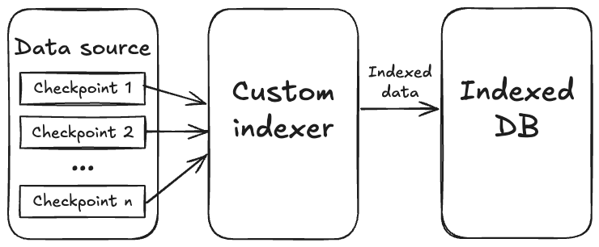
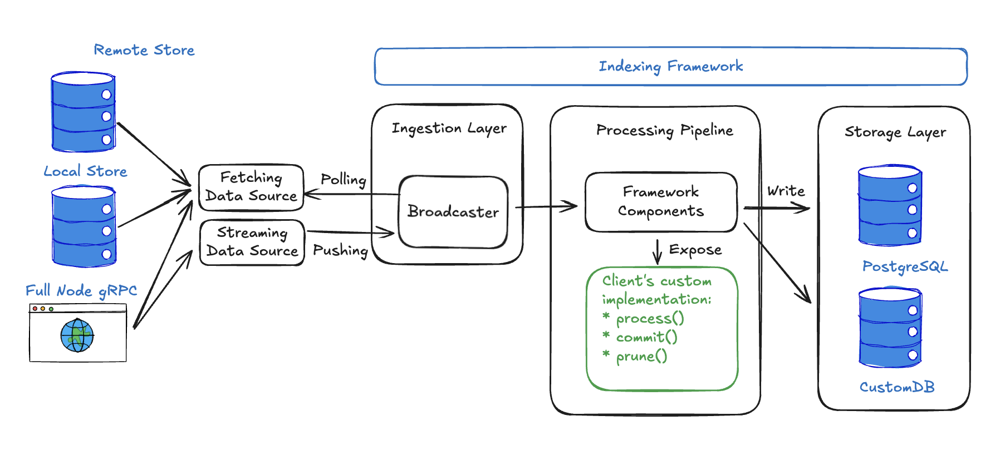

Sui는 transactions, events, object changes 등 풍부하고 복잡한 데이터를 생성한다. Sui가 이러한 데이터에 접근할 수 있는 표준 API를 제공하더라도, 많은 애플리케이션은 특정 events 추적, 분석 집계, 대시보드 구축, 특화된 데이터베이스 생성과 같은 워크플로를 위해 맞춤형 데이터 처리를 필요로 한다. Custom indexers를 사용하면 필요한 특정 blockchain 데이터를 추출하고, 변환하고, 저장할 수 있다. Sui APIs를 반복적으로 조회하거나 복잡한 filtering logic을 구축하는 대신, 원시 blockchain 데이터를 한 번 처리해 원하는 형식으로 저장한다.

Custom indexers는 DEX 거래량 추적, NFT collection activity 모니터링, 분석 대시보드 구축, cross-chain data 집계와 같은 사용 사례를 가능하게 한다. `sui-indexer-alt-framework`를 사용해 Custom indexers를 구축하는데, 이 프레임워크는 데이터 수집, 처리, 저장을 위한 프로덕션 레벨 컴포넌트를 제공하면서 indexing logic에 대한 완전한 제어권도 제공한다.

## When to use

애플리케이션의 데이터 요구사항을 RPC providers의 managed services로 충족할 수 없거나, General-purpose Indexer가 사용 사례에 비해 너무 복잡한 경우 Custom indexers를 사용한다. Custom indexers는 앱별 또는 프로토콜별 로직과 데이터 레이아웃에 적합한 선택이다.

다음과 같은 경우 Custom indexers를 고려한다:

- 애플리케이션 데이터의 types, granularity, retention period를 더 세밀하게 제어해야 한다.
- gRPC 또는 GraphQL RPC가 제공하지 않는 특정 쿼리 패턴이 있다.
- retention 요구사항에 맞춘 커스텀 pruning 전략으로 storage 비용을 최적화하고 싶다.

자체 indexer를 설정하면 지속적인 유지보수와 관련 인프라 및 운영 비용은 사용자가 책임진다.

## How custom indexers fit into the application stack

큰 흐름에서 보면, 인덱싱 프레임워크는 사전 정의된 데이터 소스에서 사용 가능한 최신 checkpoints를 지속적으로 폴링하고 해당 checkpoint data를 파이프라인의 처리 로직으로 스트리밍하는 스트리밍 파이프라인이다.

Sui의 checkpoints는 일관된 blockchain state snapshots를 나타내는 transaction batch이다. 각 checkpoint에는 완전한 transaction details, events, object changes, execution results가 보장된 순서로 포함된다. checkpoints에 대한 자세한 내용은 [Life of a Transaction](/guides/developer/transactions/transaction-lifecycle)를 참조한다.

### Architecture overview

다음 다이어그램은 custom indexer architecture를 자세히 보여준다.

사용자의 indexer는 여러 개의 조정된 백그라운드 작업(스레드)을 가진 하나의 실행 가능한 프로그램으로 동작한다. 수집 레이어는 새로운 checkpoints를 폴링하는 동안 처리 파이프라인은 데이터를 변환하고 저장하며, 이 모든 작업은 동일한 프로세스 내에서 수행된다.

### Data sources

인덱싱 프레임워크는 checkpoint data를 수집하는 방식을 유연하게 선택할 수 있도록 여러 데이터 소스를 지원한다. 이 소스들은 두 가지 범주로 나뉜다:

**Polling-based sources**는 주기적으로 새로운 checkpoints를 확인한다:

- **Remote stores**는 [`https://checkpoints.mainnet.sui.io`](https://checkpoints.mainnet.sui.io/)와 같은 공개 checkpoint repositories에 연결한다. 이 옵션은 가장 단순한 설정을 제공하며 자체 인프라 운영이 필요 없다.
- **Local files**는 로컬 풀 노드가 생성한 checkpoint files를 처리한다. 이 방식은 가장 낮은 지연 시간을 제공하지만, node가 이 files를 자동으로 정리하지 않기 때문에 테스트 용도로만 권장된다.
- **RPC endpoints**는 풀 노드 RPC endpoint에 직접 연결한다. 이 접근 방식은 직접 운영하는 신뢰 가능한 source에서 checkpoints를 가져오거나 remote store가 없는 네트워크(예: Devnet)에 접근할 수 있게 한다.

**Push-based sources**는 새로운 checkpoint data가 생기는 즉시 실시간으로 제공한다:

- **gRPC streaming**은 새로운 checkpoints를 풀 노드에서 사용할 수 있게 되는 즉시 push하므로 polling보다 더 낮은 지연 시간을 제공한다. Streaming은 최신 checkpoints만 내보내기 때문에, 과거 데이터를 가져오고 안정성을 보장하려면 polling-based 폴백 소스도 함께 구성해야 한다.

구성 예시와 각 source를 언제 사용해야 하는지에 대한 자세한 안내는 [Checkpoint Data Sources](/concepts/data-access/indexer-data-integration.mdx#checkpoint-data-sources)를 참조한다.

### Ingestion layer

인덱싱 프레임워크는 checkpoint data를 신뢰성 있게 가져오고 분배하는 복잡한 작업을 처리하는 ingestion layer를 관리한다. `Broadcaster`는 데이터 소스로부터 checkpoints를 받아 병렬로 실행되는 여러 처리 파이프라인에 효율적으로 분배한다. 이는 서로 다른 데이터 처리 워크플로를 동시에 실행하는 indexers에 필수적이다.

`Broadcaster`는 subscribers가 보고한 가장 높은 워터마크를 기준으로 backpressure를 적용해, 가장 느린 pipeline이 처리할 수 있는 속도보다 더 빠르게 데이터를 밀어넣지 않도록 보장한다.

### Processing layer

인덱싱 프레임워크와 사용자의 코드가 모두 processing layer를 관리하며, 이 레이어에서 사용자의 custom logic이 프레임워크와 통합된다. 파이프라인 프레임워크 컴포넌트는 checkpoint 처리를 오케스트레이션하고, 처리량을 극대화하기 위해 동시성을 관리하며, 진행 상황 추적과 데이터 일관성 보장을 위해 워터마크를 유지하고, ingestion부터 storage까지 전체 데이터 흐름을 조정하므로 시스템의 핵심이다. 프레임워크 컴포넌트는 선택한 pipeline 유형에 따라 조정된다:

- **Sequential pipelines**는 배치 기능이 있는 순차 처리에 최적화된 다른 컴포넌트를 사용한다.
- **Concurrent pipelines**는 높은 처리량의 비순차 처리를 위해 `Collector`, `Committer`, `Pruner`와 같은 컴포넌트를 사용한다.

### Storage layer

인덱싱 프레임워크는 유연한 storage layer를 통해 데이터베이스 작업을 추상화한다. PostgreSQL은 Diesel ORM을 사용하는 내장 지원을 제공해 프로덕션 레벨 데이터베이스 작업, connection pooling, migrations, 워터마크 관리를 즉시 제공한다. 커스텀 데이터베이스 구현이 필요한 경우 프레임워크의 storage interfaces를 구현해 문서 저장용 [MongoDB](https://www.mongodb.com/) 또는 분석용 [ClickHouse](https://clickhouse.com/) 등 어떤 데이터베이스도 사용할 수 있다.

## Building custom indexers

애플리케이션 전용 데이터를 위한 자체 pipelines를 구축하려면 [Building Your First Custom Indexer](/guides/developer/accessing-data/custom-indexer/build.mdx)를 참조한다. 필요에 맞는 구성이 이미 준비되어 있을 수 있으므로 [data indexer operator](/references/awesome-sui.mdx#indexers--data-services)에 문의할 수도 있다.
