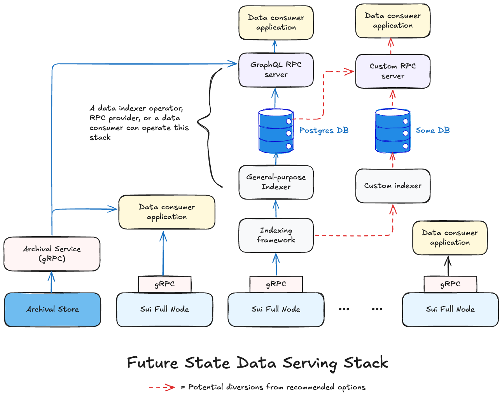

애플리케이션을 구축하고, 네트워크 동작을 분석하고, 네트워크 활동을 감사하기 위해 서로 다른 인터페이스를 통해 [transactions](/guides/developer/transactions/txn-overview.mdx), [checkpoints](/concepts/cryptography/system/checkpoint-verification.mdx), [objects](/guides/developer/objects/object-model.mdx), [events](/guides/developer/accessing-data/using-events.mdx)와 같은 Sui 네트워크 데이터에 접근한다.

Sui 데이터에 접근하는 주요 인터페이스는 다음을 포함한다:

- [gRPC API](/concepts/data-access/grpc): 풀 노드에서 JSON-RPC를 대체한다. 이미 JSON-RPC를 사용하고 있거나 사용 사례의 의존성으로 활용하기 시작했다면 JSON-RPC가 **deprecated**되었으며 gRPC 또는 GraphQL RPC로 마이그레이션해야 한다는 점에 유의하라.

- [GraphQL RPC](/concepts/data-access/graphql-rpc): General-purpose Indexer([custom indexing framework](/concepts/data-access/custom-indexers)의 성능 좋고 확장 가능한 구현)의 관계형 데이터베이스에서 데이터를 읽는 데 사용할 수 있는 경량 서비스이다. 기존 애플리케이션의 JSON-RPC 마이그레이션을 포함해 gRPC의 대안으로 사용할 수 있다.

- [Archival Store and Service](/concepts/data-access/archival-store): pruning 때문에 풀 노드에서 더 이상 사용할 수 없을 수 있는 과거 네트워크 데이터에 대한 장기 저장과 접근을 제공한다. 기본 데이터 접근 메커니즘으로 gRPC를 사용하는 경우 엔드포인트를 풀 노드에서 Archival Service로 변경해 gRPC `LedgerService` APIs를 사용하여 이를 조회할 수 있다. GraphQL RPC를 사용하는 경우 이는 추상화되어 있으므로 직접 상호작용할 필요가 없다.

- [Custom indexers](/concepts/data-access/custom-indexers): custom indexing framework로 애플리케이션 전용 데이터를 위한 [Build your own pipelines](/guides/developer/accessing-data/custom-indexer/build.mdx).

## Latest data access interfaces

:::info
아래 비디오에서 latest 및 legacy Sui data stacks의 비교를 확인하라. 
<iframe width="560" height="315" src="https://www.youtube.com/embed/CL7H4QQSWd0?si=Mt2xo3HNfm2mbRtE" title="YouTube video player" frameborder="0" allow="accelerometer; autoplay; clipboard-write; encrypted-media; gyroscope; picture-in-picture; web-share" referrerpolicy="strict-origin-when-cross-origin" allowfullscreen></iframe>
:::

## Supported SDKs

다음 SDK를 사용하여 Sui의 데이터와 상호작용할 수 있다

- [TypeScript SDK](https://sdk.mystenlabs.com/sui/migrations/sui-2.0/json-rpc-migration)

- [Rust SDK](https://github.com/MystenLabs/sui-rust-sdk)

- 커뮤니티가 유지하는 [Python SDK](https://github.com/FrankC01/pysui)

## When to use gRPC or GraphQL with General-purpose Indexer

다음 표에 언급된 상위 기준을 사용하여 gRPC API와 General-purpose Indexer를 사용하는 GraphQL RPC 중 어느 쪽이 사용 사례에 더 적합한지 판단할 수 있다. 이 목록은 완전하지 않으며 일부 사용 사례에는 두 옵션 모두 적절하게 동작할 수 있다.

| 차원 | gRPC API | GraphQL RPC with General-purpose Indexer |
| -------- | ------- | ------- |
| 애플리케이션 또는 데이터 소비자 유형 | Web3 거래소, DeFi 마켓 메이커 앱, 기타 초저지연 요구가 있는 DeFi 프로토콜 또는 앱에 적합하다. | 웹 애플리케이션 빌더 또는 지연 시간 요구가 다소 완화된 빌더에 적합하다. |
| 쿼리 패턴 | 서로 다른 엔드포인트에서 데이터를 별도로 읽고 클라이언트 측에서 결합해도 괜찮으며 바이너리 형식 덕분에 직렬화, 파싱, 검증이 더 빠르다. | 단일 요청에서 서로 다른 테이블의 데이터를 결합할 수 있어 클라이언트를 더 쉽게 분리할 수 있으며 페이지네이션된 결과를 포함해 유사한 checkpoints 전반에서 서로 다른 테이블의 일관된 데이터를 반환한다. |
| 리텐션 기간 요구사항 | 기본 리텐션 기간은 2주이며 실제 구성은 풀 노드 운영자의 필요와 목표에 따라 달라진다. 표 아래의 이력 관련 정보를 참조하라. | Postgres 데이터베이스의 기본 리텐션 기간은 4주이며 실제 구성은 사용자 요구 또는 RPC provider 또는 data indexer operator의 설정에 따라 달라진다. 표 아래의 이력 관련 정보를 참조하라. |
| 스트리밍 요구사항 | beta 릴리스 전에 스트리밍 또는 구독 API가 포함된다. | Subscription API가 계획되어 있지만 GA 이후에 사용할 수 있다. |
| 증분 비용 | 이미 풀 노드 JSON-RPC를 사용하고 있다면 증분 비용이 거의 없거나 전혀 없다. | 이미 풀 노드 JSON-RPC를 사용하고 있고 리텐션 기간 및 쿼리 패턴 차이가 중요하지 않다면 증분 비용이 다소 크다. |

이 표는 두 옵션의 기본 리텐션 기간만 언급한다. 풀 노드 운영자, RPC provider, 또는 data indexer operator가 성능에 큰 영향을 주지 않고 이를 몇 배 더 높게 구성할 수 있을 것으로 예상된다. 또한 기본적으로 GraphQL RPC 서비스는 기반 Postgres 데이터베이스에 구성된 리텐션 기간을 넘는 과거 데이터에 대해 Archival Store and Service에 직접 연결할 수 있다. 반면 gRPC API에는 Archival Store and Service에 대한 이러한 직접 연결이 없으므로 애플리케이션에서 하나에 직접 연결해야 한다.

gRPC와 GraphQL의 일반적인 차이를 설명하는 다음 글을 참조하라. 차이점의 정확성과 진위는 직접 실험하여 검증하라.

- https://stackoverflow.blog/2022/11/28/when-to-use-grpc-vs-graphql/
- https://blog.postman.com/grpc-vs-graphql/

## Legacy data access interfaces

:::info

<ImportContent source="json-rpc-deprecation.mdx" mode="snippet" />

:::

[JSON-RPC](/references/sui-api.mdx)에 직접 연결하며, 이는 Sui [full nodes](/guides/operator/sui-full-node.mdx)에 호스팅되고 이 full nodes는 [RPC providers](https://sui.io/developers#dev-tools)(`RPC`로 필터링) 또는 [data indexer operators](https://github.com/sui-foundation/awesome-sui?tab=readme-ov-file#indexers--data-services)가 운영한다. Mainnet, Testnet, 또는 Devnet 로드 밸런서 URL은 Sui Foundation이 관리하는 full nodes를 추상화한다. 이는 프로덕션 사용에 권장되지 않는다.

JSON-RPC를 사용하여 실시간 또는 과거 데이터를 얻을 수 있다. 과거 데이터의 리텐션 기간은 node 운영자가 구현하는 [pruning strategy](/guides/operator/data-management.mdx#sui-full-node-pruning-policies)에 따라 달라지지만 모든 full node의 기본 구성은 Sui Foundation이 관리하는 [Archival Store](#archival-store-and-service)로 암묵적으로 폴백한다.
