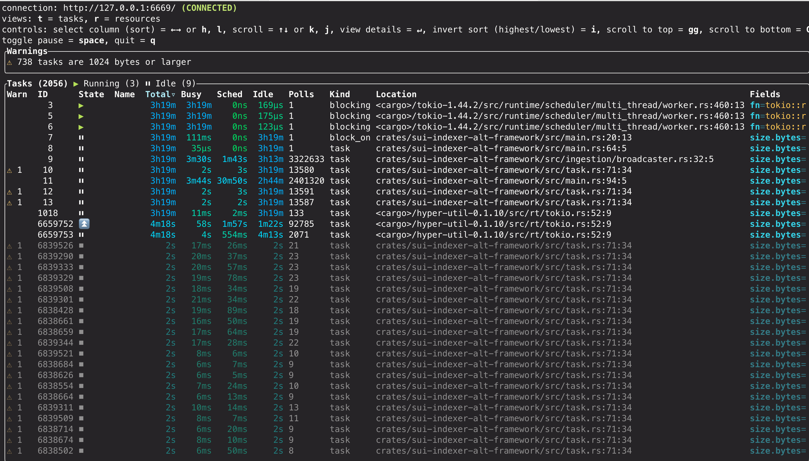

적절한 구성과 리소스 모니터링은 가능한 가장 성능 좋은 custom indexer를 제공한다. 예를 들면:

- 수집, 데이터베이스 connections, pipeline 선택을 위한 런타임 구성 옵션과 `tokio_console` 같은 디버깅 도구의 목적 있는 사용은 indexer 성능을 세밀하게 조정하는 데 도움이 된다. 

- 테이블에 대한 효율적인 데이터 pruning을 목표로 한 합리적인 전략은 시간이 지나도 성능을 유지하게 한다. 

- Prometheus metrics를 노출하고 확장하는 best practices를 따르면 indexer 성능을 추적하는 데 도움이 된다. 

이 기법들을 함께 사용하면 개발과 프로덕션 모두에서 빠르고, 리소스 효율적이며, 모니터링하기 쉬운 indexers를 운영할 수 있다.

## Fine-tuning configurations

인덱싱 프레임워크는 서로 다른 사용 사례의 성능을 최적화하기 위한 여러 수준의 구성을 제공한다. 이 섹션은 기본 구성 옵션을 다루며, 더 복잡한 pipeline별 튜닝은 [Indexer Pipeline Architecture](/concepts/data-access/pipeline-architecture.mdx)에서 다룬다.

### Ingestion layer configuration

checkpoint 데이터가 어떻게 가져와지고 분배되는지 제어한다:

```rust
use sui_indexer_alt_framework::config::ConcurrencyConfig;

let ingestion_config = IngestionConfig {
    // Buffer size across all downstream workers (default: 5000)
    checkpoint_buffer_size: 10000,

    // Concurrency for checkpoint fetches.
    // Adaptive by default: starts at 1 and scales up to 500 based on
    // downstream channel pressure.
    ingest_concurrency: ConcurrencyConfig::Adaptive {
        initial: 1,
        min: 1,
        max: 500,
    },
    // Or use fixed concurrency:
    // ingest_concurrency: ConcurrencyConfig::Fixed { value: 200 },

    // Retry interval for missing checkpoints in ms (default: 200)
    retry_interval_ms: 100,

    // gRPC streaming configuration (applies when --streaming-url is provided)
    // Initial batch size after streaming connection failure (default: 10)
    streaming_backoff_initial_batch_size: 20,

    // Maximum batch size after repeated streaming failures (default: 10000)
    streaming_backoff_max_batch_size: 20000,

    // Timeout for streaming connection in ms (default: 5000)
    streaming_connection_timeout_ms: 10000,

    // Timeout for streaming operations (peek/next) in ms (default: 5000)
    streaming_statement_timeout_ms: 10000,
};
```

**Tuning guidelines:**

- `checkpoint_buffer_size`: 높은 처리량 시나리오에서는 늘리고 메모리 사용량을 줄이려면 낮춘다.
- `ingest_concurrency`: 동시에 실행되는 checkpoint fetch 수를 제어한다. 기본적으로 이는 adaptive이며 1에서 시작해 downstream broadcast channel이 얼마나 차 있는지에 따라 최대 500까지 확장된다. 컨트롤러는 진동을 피하기 위해 dead band(채움률 60%–85%)를 사용하며 channel이 빠르게 비워질 때는 concurrency를 늘리고 적체될 때는 줄인다. 정적 한도를 위해 `ConcurrencyConfig::Fixed`로 재정의하거나 adaptive bounds를 커스터마이즈할 수 있다. Adaptive controller는 채움 비율 임곗값을 재정의하기 위한 `dead_band` parameter도 노출하지만 기본값은 대부분의 워크로드에서 잘 동작한다.
- `retry_interval_ms`: 값이 낮을수록 실시간 데이터의 지연 시간이 줄고 값이 높을수록 불필요한 재시도가 줄어든다.
- `streaming_backoff_initial_batch_size`: 초기 스트리밍 실패 후 polling을 통해 처리할 checkpoints 수이다. 값이 낮을수록 스트리밍 복구가 빨라지고 값이 높을수록 연결 시도가 줄어든다.
- `streaming_backoff_max_batch_size`: 반복 실패 후 polling을 통해 처리할 최대 checkpoints 수이다. 배치 크기는 초기 크기에서 이 최대값까지 지수적으로 증가한다. 값이 높을수록 장시간 장애 동안 연결 시도가 줄어든다.
- `streaming_connection_timeout_ms`: 스트리밍 연결 수립을 기다리는 시간이다. 네트워크가 느릴수록 값을 늘린다.
- `streaming_statement_timeout_ms`: 스트리밍 데이터 작업(peek/next)을 기다리는 시간이다. checkpoints가 크거나 네트워크가 느리면 값을 늘린다.

### Database connection configuration

```rust
let db_args = DbArgs {
    // Connection pool size (default: 100)
    db_connection_pool_size: 200,
    
    // Connection timeout in ms (default: 60,000)
    db_connection_timeout_ms: 30000,
    
    // Statement timeout in ms (default: None)
    db_statement_timeout_ms: Some(120000),
};
```

**Tuning guidelines:**

- `db_connection_pool_size`: 모든 pipelines의 `write_concurrency`를 기준으로 크기를 정한다.
- `db_connection_timeout_ms`: 고부하 시나리오에서 더 빠르게 실패를 감지하려면 줄인다.
- `db_statement_timeout_ms`: 예상 쿼리 복잡도와 데이터베이스 성능을 기준으로 설정한다.

### Command-line arguments

처리를 집중하는 데 도움이 되도록 다음 명령줄 인수를 포함한다. 이 값들은 예시를 위한 것이다. 환경과 목표에 맞는 값을 사용하라. 

```sh
# Checkpoint range control
--first-checkpoint 1000000     # Start from specific checkpoint
--last-checkpoint 2000000      # Stop at specific checkpoint

# Pipeline selection
--pipeline "tx_counts"          # Run specific pipeline only
--pipeline "events"             # Can specify multiple pipelines
```

**Use cases:**

- **Checkpoint range:** 백필과 과거 데이터 처리에 필수적이다.
- **Pipeline selection:** 선택적 재처리 또는 테스트에 유용하다.
- **Skip watermark:** 워터마크 일관성이 필요하지 않을 때 더 빠른 백필을 가능하게 한다.

### Pipeline-specific advanced tuning

pipeline 내부 동작에 대한 깊은 이해가 필요한 복잡한 구성 시나리오는 다음을 참조하라:

- [Sequential pipeline architecture](/concepts/data-access/pipeline-architecture.mdx#sequential-pipeline-architecture)
- [Concurrent pipeline architecture](/concepts/data-access/pipeline-architecture.mdx#concurrent-pipeline-architecture)

## Tokio runtime debugging

성능에 민감한 pipelines나 async runtime 문제를 해결할 때 `sui-indexer-alt-framework`는 async Rust 애플리케이션을 위한 강력한 디버거인 `tokio-console`과 통합된다. 이 도구는 task 실행에 대한 실시간 인사이트를 제공해 성능 병목, 멈춘 tasks, 메모리 문제를 식별하는 데 도움을 준다.

[`tokio-console` GitHub repo](https://github.com/tokio-rs/console)

### When to use Tokio console

Tokio console은 특히 다음에 유용하다:

- **Performance debugging:** 느리거나 블로킹되는 tasks 식별.
- **Memory analysis:** 과도한 메모리를 소비하는 tasks 탐색.
- **Concurrency issues:** 절대 양보하지 않거나 스스로를 과도하게 깨우는 tasks 탐지.
- **Runtime behavior:** task 스케줄링 및 실행 패턴 이해.

### Setup instructions

추가 정보는 Tokio GitHub repo의 [README](https://github.com/tokio-rs/console/blob/main/README.md)를 참조하라.

1. Add dependencies

    `Cargo.toml`에 `telemetry_subscribers` dependency를 추가한다:

    ```rust
    [dependencies]
    telemetry_subscribers = { git = "https://github.com/MystenLabs/sui.git", branch = "main" }
    ```

1. Initialize telemetry

    `main` 함수 시작 부분에 telemetry initialization을 추가한다:

    ```rust
    #[tokio::main]
    async fn main() -> Result<()> {
        // Enable tracing, configured by environment variables
        let _guard = telemetry_subscribers::TelemetryConfig::new()
            .with_env()
            .init();

        // Your indexer code here...
    }
    ```

1. Run with console enabled

    필요한 플래그와 함께 indexer를 시작한다:

    ```bash
    RUSTFLAGS="--cfg tokio_unstable" TOKIO_CONSOLE=1 cargo run
    ```

    **Flag explanations:**

    - `TOKIO_CONSOLE=1`: `telemetry_subscribers`에서 `tokio-console` 통합을 활성화한다.
    - `RUSTFLAGS="--cfg tokio_unstable"`: `tokio-console`이 task instrumentation 데이터를 수집하는 데 필요하다.

1. Launch the console dashboard

    ```sh
    # Install tokio-console if not already installed
    cargo install tokio-console

    # Connect to your running indexer (default: localhost:6669)
    tokio-console
    ```

    성공하면 실행 중인 모든 Tokio task에 대한 정보가 포함된 dashboard가 나타난다:

    

### Console features

console dashboard, 사용 가능한 views, warnings, diagnostic capabilities에 대한 자세한 내용은 공식 [`tokio-console` documentation](https://github.com/tokio-rs/console)을 참조하라.

### Production considerations

`tokio-console`은 런타임 오버헤드를 도입하므로 프로덕션에서는 신중하게 사용해야 한다. 개발 및 staging에서 정기적으로 사용하는 것은 안전하지만 프로덕션 사용은 신중한 평가가 필요하다. 프로덕션에서 활성화하기 전에는 특정 워크로드에 미치는 영향을 측정하기 위해 Tokio console을 활성화한 경우와 비활성화한 경우 모두에서 성능 벤치마크를 실행해야 한다. 시스템 리소스를 모니터링하면서 maintenance windows 또는 목표가 명확한 문제 해결 세션 동안에만 활성화하는 것을 고려하라.

## Metrics

`sui-indexer-alt-framework`는 indexer 성능과 상태를 모니터링하기 위한 내장 Prometheus metrics를 제공한다. 모든 metrics는 HTTP를 통해 자동 노출되며 custom metrics로 확장할 수 있다.

### Built-in metrics

프레임워크는 수집, pipeline 처리, 데이터베이스 작업, 워터마크 관리 전반에 걸친 광범위한 metrics를 추적한다. 사용 가능한 metrics의 전체 목록과 설명은 [`sui-indexer-alt-framework/src/metrics.rs`](https://github.com/MystenLabs/sui/blob/main/crates/sui-indexer-alt-framework/src/metrics.rs)의 `IndexerMetrics` struct를 참조하라.

주요 metric 범주는 다음을 포함한다:

- **Ingestion metrics:** 전역 checkpoint 및 transaction 처리 통계.
- **Pipeline metrics:** pipeline 이름으로 라벨링된 pipeline별 처리 성능.
- **Database metrics:** batch 처리, commit 지연 시간, 실패율.
- **Watermark metrics:** 진행 상황 추적과 지연 측정.

### Accessing metrics

기본적으로 metrics는 [Prometheus format](https://prometheus.io/docs/concepts/data_model/)의 `0.0.0.0:9184/metrics`에서 제공된다. 다음 주소로 재정의할 수 있다:

- 명령줄을 통해:

    ```sh
    $ cargo run --metrics-address "0.0.0.0:8080"
    ```

- 또는 builder 구성을 통해:

    ```rust
    let cluster = IndexerCluster::builder()
        .with_metrics_args(MetricsArgs {
            metrics_address: "0.0.0.0:8080".parse().unwrap(),
        })
    ```

### Adding metric labels

서로 다른 indexer 인스턴스를 구분하려면 metric label prefix를 추가하는 것이 강력히 권장된다:

```rust
let cluster = IndexerCluster::builder()
    .with_metric_label("my_custom_indexer")
```

이렇게 하면 모든 기본 metrics 앞에 접두어가 붙는다(예: `my_custom_indexer_indexer_total_ingested_checkpoints`).

### Adding custom metrics

공유 `Registry`를 사용해 custom metrics를 등록할 수 있다:

```rust
use prometheus::{IntCounter, register_int_counter_with_registry}

// Get the metrics registry before running the cluster
let cluster = IndexerCluster::builder()
    .with_database_url(database_url)
    .with_args(args)
    .build()
    .await?;

// Register custom metrics
let custom_counter = register_int_counter_with_registry!(
    "my_custom_metric_total",
    "Description of my custom metric",
    cluster.metrics().registry(),
)?;
```

### Metrics collection and visualization

프레임워크는 metrics를 HTTP를 통해서만 노출하며 수집과 저장은 사용자의 책임이다. 예를 들어 일부 indexers는 Alloy agent를 사용해 `/metrics` 엔드포인트를 스크랩하고 시각화와 알림을 위해 metrics database에 기록한다.

Grafana Labs 웹사이트의 [Collect Prometheus metrics](https://grafana.com/docs/alloy/latest/collect/prometheus-metrics/)를 참조하라.

## Pruning best practices

테이블이 checkpoint 순서대로 데이터를 pruning한다면 테이블을 partitioning하여 전체 partitions를 드롭하는 것만으로 pruning할 수 있으므로 효율성을 높일 수 있다. 이렇게 하면 보통 하나의 pruner task만 필요하므로 동시 batched `DELETE` queries가 필요하지 않다.

Partition 크기는 핵심적인 절충점이다. 읽기 윈도우 밖으로 벗어날 때까지 삭제할 수 없는 마지막 _active_ partition 하나와 `N`개의 완전한 partitions가 필요하다. Partition이 클수록 스캔할 전체 partitions 수가 줄어 read amplification이 줄어든다. Partition이 작을수록 retention 오버헤드는 줄지만 조회되는 partitions 수는 늘어난다. 예를 들어 10M checkpoints를 유지할 때는 10M partition 하나와 active partition 하나를 사용할 수 있어 최대 2개의 partitions만 조회하거나, 1M partition 10개와 active partition 하나를 사용해 11개의 partitions를 조회할 수 있다. 실제로 epoch별 partitioning은 너무 많은 작은 partitions를 만드는 경향이 있고 partitioning을 전혀 하지 않으면 반복된 `DELETE`가 dead tuples와 fragmentation을 만들어 성능 저하로 이어진다.

더 복잡한 pruning 규칙을 가진 pipelines도 여전히 이점을 얻을 수 있다. 예를 들어 consistent pipelines에서는 같은 key에 대한 더 새로운 record가 있거나 sentinel row인 경우에만 record를 pruning할 수 있다. 별도의 더 가벼운 테이블로 삭제 가능한 records를 추적하고 checkpoint 기준으로 partitioning하면 pruning을 효율적으로 수행할 수 있다.

### Implementation

Partition 관리를 단순화하기 위해 `pg_partman`을 사용할 수 있다. `create_parent`로 partitioned table을 구성한 다음 주기적으로 `run_maintenance`를 실행하는 cron job을 둔다. `run_maintenance`의 올바른 주기를 결정하려면 반복 조정이 필요할 수 있다. 

:::info

기본 키 또는 고유 제약 조건이 있는 테이블은 partitioning scheme에 사용되는 모든 columns를 추가로 포함해야 한다.

:::

```sql
CREATE EXTENSION pg_partman;

SELECT create_parent(
    p_parent_table := 'public.tx_calls',
    p_control := 'cp_sequence_number',
    p_type := 'range',
    p_interval := '10000000',
    p_start_partition := '70000000',
    p_premake := 5,
);

-- Create a maintenance job to run every hour
SELECT cron.schedule('0 * * * *', $$SELECT run_maintenance(p_analyze := false)$$);
```

이 내용은 migration에 포함할 수 있다:

```sql
CREATE EXTENSION IF NOT EXISTS pg_partman;
CREATE EXTENSION IF NOT EXISTS pg_cron;

-- Function to safely set up partitioning for a table
CREATE OR REPLACE FUNCTION safe_create_parent(
    p_schema text,
    p_table text,
    p_control text,
    p_type text,
    p_interval text,
    p_start_partition text,
    p_premake int
) RETURNS text AS $$
DECLARE
    full_table_name text := p_schema || '.' || p_table;
    result_message text;
BEGIN
    -- Check if the table is already managed by pg_partman
    IF NOT EXISTS (
        SELECT 1 FROM part_config
        WHERE parent_table = full_table_name
    ) THEN
        -- If not managed, set up partitioning
        PERFORM create_parent(
            p_parent_table := full_table_name,
            p_control := p_control,
            p_type := p_type,
            p_interval := p_interval,
            p_start_partition := p_start_partition,
            p_premake := p_premake
        );
        result_message := 'CREATED: Partitioning set up for ' || full_table_name;
    ELSE
        -- Table is already managed
        result_message := 'EXISTS: Table ' || full_table_name || ' is already managed by pg_partman';
    END IF;
    
    RETURN result_message;
END;
$$ LANGUAGE plpgsql;

SELECT safe_create_parent('public', 'tx_affected_objects', 'cp_sequence_number', 'range', '10000000', '70000000', 1);

SELECT cron.schedule('0 * * * *', 'SELECT run_maintenance()');
```

이에 대응하는 `down.sql`은 다음과 같다:

```sql
-- Remove the scheduled job
DELETE FROM cron.job WHERE command = 'SELECT run_maintenance()';

-- Undo partitioning for all tables
SELECT undo_partition('public.tx_affected_objects', p_keep_table := true);
```

다음 SQL queries를 사용하여 partitioned table과 cron job이 올바르게 설정되었는지 확인할 수 있다:

```sql
SELECT parent_table, partition_type, control, interval_val
FROM part_config
ORDER BY parent_table;

-- Check maintenance job is scheduled
SELECT jobid, schedule, command, nodename, database, username 
FROM cron.job
WHERE command = 'SELECT run_maintenance()';
```
