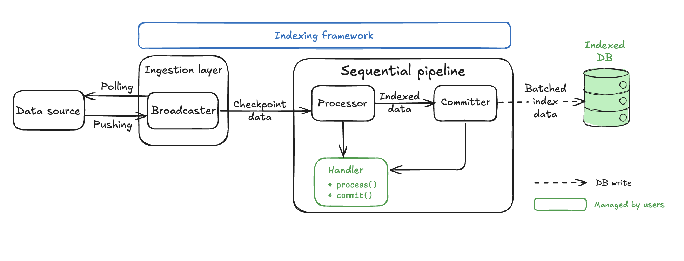
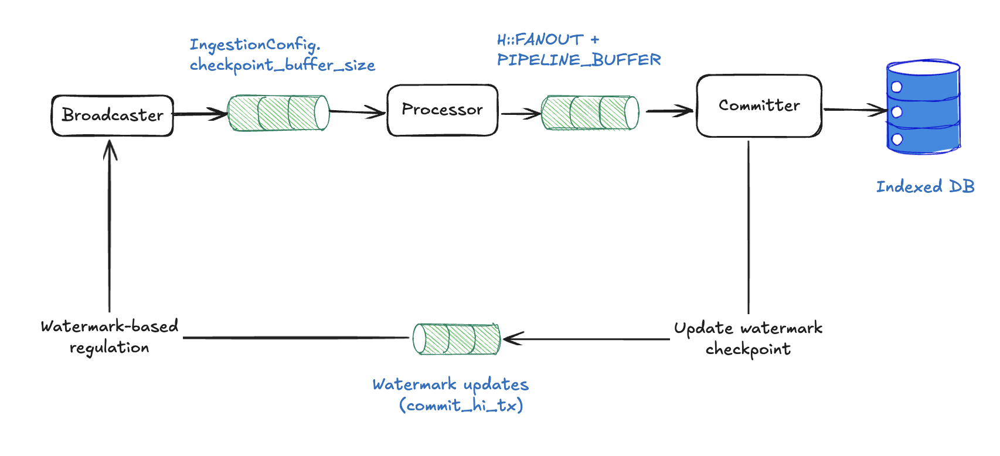
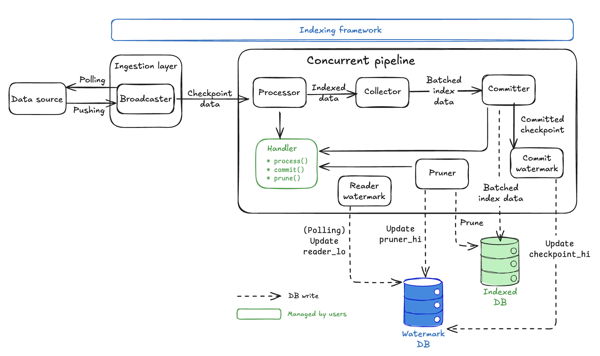
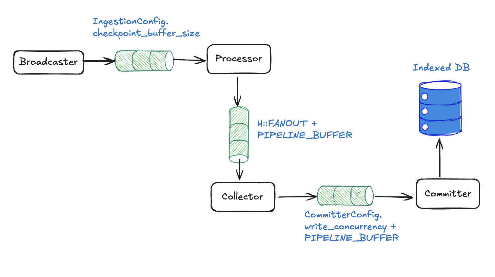

`sui-indexer-alt-framework`는 두 가지 고유한 파이프라인 아키텍처를 제공한다. 올바른 접근 방식을 선택하려면 이 차이점을 이해하는 것이 중요하다.

## Sequential versus concurrent pipelines

[Sequential pipelines](#sequential-pipeline-architecture)은 complete checkpoints를 순서대로 commit한다. 각 checkpoint는 다음 checkpoint보다 먼저 완전히 commit되므로 단순하고 일관된 reads를 보장한다.

[Concurrent pipelines](#concurrent-pipeline-architecture)은 순서와 무관하게 commit하며 개별 checkpoints를 부분적으로 commit할 수 있다. 이를 통해 더 높은 throughput을 위해 여러 checkpoints를 동시에 처리할 수 있지만, 일관성을 보장하려면 reads가 어떤 데이터가 완전히 commit되었는지 확인해야 한다.

## When to use each pipeline

두 파이프라인 유형 모두 in-place updates, aggregations, complex business logic를 처리할 수 있다. Sequential pipelines는 concurrent pipelines에 비해 throughput 제한이 있지만, 둘 중 하나를 선택하는 결정은 성능 요구 사항보다 엔지니어링 복잡성에 더 가깝다.

### Recommended: Sequential pipeline

대부분의 사용 사례에서는 여기서 시작한다. 더 직접적인 구현과 유지보수를 제공한다.

<ul className="list-none pl-2">
<li><span className="text-sui-success-dark">✓</span> 직접적인 commits와 단순한 queries를 갖는 직관적인 구현을 원한다.</li>
<li><span className="text-sui-success-dark">✓</span> 팀이 예측 가능하고 디버깅하기 쉬운 동작을 선호한다.</li>
<li><span className="text-sui-success-dark">✓</span> 현재 성능이 요구 사항을 충족한다.</li>
<li><span className="text-sui-success-dark">✓</span> 운영 단순성을 중요하게 여긴다.</li>
</ul>

### Concurrent pipeline

다음과 같은 경우에는 concurrent pipeline 구현을 고려한다:

<ul className="list-none pl-2">
<li><span className="text-sui-success-dark">✓</span> 성능 최적화가 필수적이다.</li>
<li><span className="text-sui-success-dark">✓</span> sequential processing이 데이터 볼륨을 따라갈 수 없다.</li>
<li><span className="text-sui-success-dark">✓</span> 팀이 성능 이점을 위해 추가적인 구현 복잡성을 감수할 의향이 있다.</li>
</ul>

순서와 무관한 commits를 지원하면 파이프라인에 몇 가지 추가 복잡성이 생긴다:

- Watermark-aware queries: 모든 reads는 어떤 데이터가 완전히 commit되었는지 확인해야 한다. 자세한 내용은 [the watermark system](#watermark-system) 섹션을 참조한다.
- Complex application logic: complete checkpoints를 처리하는 대신 data commits를 조각 단위로 처리해야 한다.

## Decision framework

프로젝트에 어떤 파이프라인을 선택해야 할지 확신이 없다면 구현과 디버깅이 더 쉬운 sequential pipeline으로 시작한다. 그런 다음 현실적인 부하에서 성능을 측정한다. Sequential pipeline이 프로젝트 요구 사항을 충족할 수 없다면 concurrent pipeline으로 전환한다.

전체 목록은 아니지만 sequential pipeline이 요구 사항을 충족하지 못할 수 있는 구체적인 시나리오에는 다음이 포함된다:

- 파이프라인이 각 checkpoint에서 chunking과 out-of-order commits의 이점을 얻는 데이터를 생성한다. 개별 checkpoints는 많은 데이터나 latency를 유발할 수 있는 개별 writes를 생성할 수 있다.
- pruning이 필요한 많은 데이터를 생성하고 있다. 이 경우 concurrent pipeline을 사용해야 한다.

어떤 파이프라인을 사용할지 결정하는 것 외에도 scaling도 고려해야 한다. 여러 종류의 데이터를 indexing한다면 여러 pipelines와 watermarks를 사용하는 것을 고려한다.

## Common pipeline components

Sequential pipelines와 concurrent pipelines는 공통된 components와 concepts를 공유한다. 이러한 공통 요소를 이해하면 두 아키텍처가 어떻게 다른지 더 명확해진다.

### Processor component {#processor}

<ImportContent source="indexer-pipeline-processor.mdx" mode="snippet" />

`Processor` component는 sequential pipelines와 concurrent pipelines에서 동일하게 동작한다. 이는 `Broadcaster`로부터 checkpoint data를 받아 custom logic으로 변환하고, 처리된 결과를 파이프라인의 다음 단계로 전달한다.

### Watermark concepts summary

파이프라인별 아키텍처를 살펴보기 전에 coordination에 사용되는 세 가지 watermarks를 이해한다:

| Watermark | Purpose | Used by |
|-----------|---------|---------|
| `checkpoint_hi_inclusive` | 갭 없이 모든 data가 commit된 가장 높은 checkpoint | 복구와 진행 상황 추적을 위한 양쪽 pipelines |
| `reader_lo` | queries에 사용할 수 있음이 보장되는 가장 낮은 checkpoint | pruning이 활성화된 concurrent pipelines |
| `pruner_hi` | pruning된(deleted) 가장 높은 checkpoint | pruning이 활성화된 concurrent pipelines |

이 watermarks들은 함께 안전한 out-of-order processing, 자동 data cleanup, failures로부터의 recovery를 가능하게 한다.

## The watermark system {#watermark-system}

각 pipeline에 대해 indexer는 최소한 해당 지점까지의 모든 data가 commit된 가장 높은 checkpoint를 추적한다. 추적은 committer watermark인 `checkpoint_hi_inclusive`를 통해 수행된다. Concurrent pipelines와 sequential pipelines 모두 restart 시 처리를 재개할 위치를 이해하기 위해 `checkpoint_hi_inclusive`에 의존한다.

선택적으로 pipeline은 pruning이 활성화된 경우 읽기와 pruning 작업의 안전한 하한을 정의하는 `reader_lo`와 `pruner_hi`를 추적한다. 이러한 watermarks는 data integrity를 유지하면서 out-of-order processing을 가능하게 하므로 concurrent pipelines에 특히 중요하다.

### Safe pruning

Watermark system은 강력한 data lifecycle management system을 만든다:

1. **Guaranteed data availability:** checkpoint data availability rules를 적용하여 readers가 안전한 queries를 수행하도록 보장한다.
1. **Automatic cleanup process:** pipeline은 retention 보장을 유지하면서 storage가 무한히 증가하지 않도록 unpruned checkpoints를 자주 정리한다. Pruning process는 race conditions를 피하기 위해 safety delay와 함께 실행된다.
1. **Balanced approach:** system은 안전성과 효율성 사이의 균형을 맞춘다.
    - Storage efficiency: 오래된 데이터는 자동으로 삭제된다.
    - Data availability: 항상 retention 양만큼의 complete data를 유지한다.
    - Safety guarantees: readers는 누락된 data gaps를 만나지 않는다.
    - Performance: out-of-order processing이 throughput을 극대화한다.

이 watermark system은 concurrent pipelines를 고성능이면서도 신뢰할 수 있게 만들어 주며, 강력한 data availability guarantees와 자동 storage management를 유지하면서 대규모 throughput을 가능하게 한다.

### Scenario 1: Basic watermark (no pruning)

Pruning이 비활성화된 경우 indexer는 각 pipeline committer의 `checkpoint_hi_inclusive`만 보고한다. 다음 타임라인을 생각해 보자. 여기서는 여러 checkpoints가 처리되고 있으며 일부는 순서와 무관하게 commit된다.

```sh
Checkpoint Processing Timeline:

[1000] [1001] [1002] [1003] [1004] [1005]
  ✓      ✓      ✗      ✓      ✗      ✗
         ^
  checkpoint_hi_inclusive = 1001

✓ = Committed (all data written)
✗ = Not Committed (processing or failed)
```

이 시나리오에서 checkpoint 1003이 commit되었더라도 1002에 여전히 gap이 있기 때문에 `checkpoint_hi_inclusive`는 1001이다. Indexer는 start부터 `checkpoint_hi_inclusive`까지의 모든 data를 사용할 수 있다는 보장을 만족하기 위해 high watermark를 1001로 보고해야 한다.

Checkpoint 1002가 commit된 후에는 1003까지의 데이터를 안전하게 읽을 수 있다.

```sh
[1000] [1001] [1002] [1003] [1004] [1005]
  ✓      ✓      ✓      ✓      ✗       ✗
[---- SAFE TO READ -------]
(start   →   checkpoint_hi_inclusive at 1003)
```

### Scenario 2: Pruning enabled

Pruning은 retention policy로 구성된 pipelines에 대해 활성화된다. 예를 들어 table이 너무 커져 마지막 4개의 checkpoints만 유지하려면 `retention = 4`이다. 이는 indexer가 `checkpoint_hi_inclusive`와 구성된 retention의 차이로 `reader_lo`를 주기적으로 업데이트한다는 뜻이다. 별도의 pruning task는 `[pruner_hi, reader_lo]` 사이의 data를 pruning하는 역할을 한다.

```sh
[998] [999] [1000] [1001] [1002] [1003] [1004] [1005] [1006]
 🗑️    🗑️     ✓      ✓      ✓      ✓      ✗      ✗      ✗
              ^                    ^
       reader_lo = 1000       checkpoint_hi_inclusive = 1003

🗑️ = Pruned (deleted)
✓ = Committed  
✗ = Not Committed
```

Current watermarks:

- `checkpoint_hi_inclusive` = 1003:
       - start부터 1003까지의 모든 data가 complete하다(gaps 없음).
       - 1004가 아직 commit되지 않았기 때문에(gap) 1005로 advance할 수 없다.

- `reader_lo` = 1000:
       - availability가 보장되는 가장 낮은 checkpoint이다.
       - 다음과 같이 계산된다: `reader_lo = checkpoint_hi_inclusive - retention + 1`.
       - `reader_lo` = 1003 - 4 + 1 = 1000.

- `pruner_hi` = 1000:
       - 삭제된 가장 높은 exclusive checkpoint이다.
       - checkpoints 998과 999는 공간 절약을 위해 삭제되었다.

Clear safe zones:

```sh
[998] [999] [1000] [1001] [1002] [1003] [1004] [1005] [1006]
 🗑️    🗑️     ✓      ✓      ✓      ✓      ✗      ✗      ✓

[--PRUNED--][--- Safe Reading Zone ---] [--- Processing ---]             
```

### How watermarks progress over time

**Step 1:** Checkpoint 1004가 완료된다.

```sh
[999] [1000] [1001] [1002] [1003] [1004] [1005] [1006] [1007]
 🗑️     ✓      ✓      ✓      ✓      ✓      ✗      ✓      ✗
        ^                           ^
 reader_lo = 1000           checkpoint_hi_inclusive = 1004 (advanced by 1)
 pruner_hi = 1000
```

이제 checkpoint 1004가 commit되었으므로 1004까지 gaps가 없어서 `checkpoint_hi_inclusive`는 1003에서 1004로 advance할 수 있다. `reader_lo`와 `pruner_hi`는 아직 바뀌지 않았다는 점에 유의한다.

**Step 2:** Reader watermark가 주기적으로 업데이트된다.

```sh
[999] [1000] [1001] [1002] [1003] [1004] [1005] [1006] [1007]
 🗑️     ✓      ✓      ✓      ✓      ✓      ✗      ✓      ✗
               ^                   ^
        reader_lo = 1001    checkpoint_hi_inclusive = 1004
        (1004 - 4 + 1 = 1001)

pruner_hi = 1000 (unchanged as pruner hasn't run yet)
```

별도의 reader watermark update task가 주기적으로 실행되며(구성 가능), retention policy에 따라 `reader_lo`를 1001로 advance한다(`1004 - 4 + 1 = 1001`로 계산). 그러나 pruner는 아직 실행되지 않았으므로 `pruner_hi`는 1000으로 유지된다.

**Step 3:** Pruner가 safety delay 이후 실행된다.

```sh
[999] [1000] [1001] [1002] [1003] [1004] [1005] [1006] [1007]
 🗑️     🗑️     ✓      ✓      ✓      ✓      ✗      ✓      ✗
               ^                   ^
        reader_lo = 1001    checkpoint_hi_inclusive = 1004
        pruner_hi = 1001
```

`pruner_hi` (1000) < `reader_lo` (1001)이므로 pruner는 일부 checkpoints가 retention window 밖에 있음을 감지한다. 이는 `reader_lo`까지의 모든 요소를 정리하고(checkpoint 1000 삭제) `pruner_hi`를 `reader_lo`(1001)로 업데이트한다.


:::info
`reader_lo`보다 오래된 checkpoints도 다음 이유 때문에 일시적으로는 여전히 사용 가능할 수 있다:
- in-flight queries를 보호하기 위한 의도적인 delay
- pruner가 cleanup을 아직 완료하지 않음
:::

## Sequential pipeline architecture {#sequential-pipeline-architecture}

Sequential pipelines는 ordered processing을 우선시하는 보다 직접적이면서도 강력한 indexing 아키텍처를 제공한다. Concurrent pipelines에 비해 일부 throughput을 희생하지만 더 강한 guarantees를 제공하며, 대체로 reasoning하기 더 쉽다.

### Architecture overview

Sequential pipeline은 두 개의 주요 components만으로 구성되어 concurrent pipeline의 여섯 component 아키텍처보다 훨씬 단순하다.



`Broadcaster`와 `Processor` components는 concurrent pipeline과 동일한 backpressure mechanisms, adaptive parallel processing, `processor()` implementations를 사용한다. `Processor` component는 [Common pipeline components](#processor) 섹션에서 자세히 설명한다.

핵심 차이점은 ordering, batching, database commits를 처리하는 단 하나의 `Committer` component만 있는 극적으로 단순화된 pipeline core이다. 반대로 concurrent pipelines는 `Processor` 외에 `Collector`, `Committer`, `CommitterWatermark`, `ReaderWatermark`, `Pruner`라는 다섯 개의 별도 components를 가진다.

### Sequential pipeline components {#sequential-components}

Sequential pipelines는 shared [Processor](#processor) 외에 pipeline-specific component 하나, 즉 [`Committer`](#seq-committer)를 가진다.

#### `Committer` {#seq-committer}

Sequential `Committer`는 pipeline의 주요 component이자 주된 customization 지점이다. 높은 수준에서 `Committer`는 다음 작업을 수행한다:

1. **Receives** processor로부터 순서와 무관하게 처리된 data를 받는다.
1. **Orders** data를 checkpoint sequence 기준으로 정렬한다.
1. **Batches** 여러 checkpoints를 사용자의 logic으로 함께 batching한다.
1. **Commits** batch를 데이터베이스에 원자적으로 commit한다.
1. **Signals** ingestion layer에 progress를 다시 전달한다.

이를 customize하기 위해 사용자의 코드는 committer가 호출하는 두 개의 핵심 함수를 사용한다:

`batch()`: data merging logic.

<ImportContent source="crates/sui-indexer-alt-framework/src/pipeline/sequential/mod.rs" mode="code" fun="batch" noComments />

`commit()`: database write logic.

<ImportContent source="crates/sui-indexer-alt-framework/src/pipeline/sequential/mod.rs" mode="code" fun="commit" noComments />

### Sequential pipeline backpressure mechanisms

Sequential pipelines는 memory overflow와 ordering-related deadlocks를 방지하기 위해 두 계층의 backpressure를 사용한다:



#### Channel-based backpressure

Sequential pipelines는 components 수가 적기 때문에 더 단순한 topology로 channel-based flow control을 사용한다:

- **Broadcaster → Processor:** `checkpoint_buffer_size` slots.
- **Processor → Committer:** `processor_channel_size` slots (`num_cpus / 2`가 기본값).

어떤 channel이든 가득 차면 senders는 자동으로 block되며, 이로 인해 파이프라인을 거슬러 올라가는 upstream pressure가 만들어진다. 이 메커니즘은 concurrent pipelines와 동일하게 동작하지만 channel hops 수가 더 적다. Channel-based blocking이 어떻게 전파되는지에 대한 자세한 동작은 [concurrent pipeline backpressure](#concurrent-backpressure)를 참조한다.

#### Watermark-based regulation (sequential-specific) {#sequential-watermark-regulation}

Sequential pipelines는 checkpoints를 엄격한 순서(N, 그다음 N+1, 그다음 N+2...)로 처리해야 한다. Checkpoint N이 누락되면 이후 checkpoints가 존재하더라도 commit할 수 없다.

Regulation이 없으면 누락된 checkpoints는 다음과 같은 상황에서 deadlocks를 일으킬 수 있다:

1. Pipeline이 checkpoint 100을 기다린다.
1. Checkpoint 100이 drop되거나 delay된다.
1. Ingestion이 buffer를 101, 102, 103...으로 채운다.
1. Buffer가 가득 차 사용 가능해졌을 때 checkpoint 100을 다시 fetch할 수 없게 된다.
1. Pipeline이 영구적으로 멈춘다.

이 함정을 피하려면 watermark progress reporting을 사용할 수 있다. Successful commits 후 pipelines가 `commit_hi_tx` channel을 통해 broadcaster에 `(pipeline_name, highest_committed_checkpoint)`를 보내도록 지시한다.

<ImportContent source="crates/sui-indexer-alt-framework/src/pipeline/sequential/committer.rs" tag="send" />
    
`Broadcaster`는 `commit_hi_rx`를 listen하여 updates를 수신한다. 그 후 모든 pipelines 전반의 ingestion boundary를 계산한다(`min_subscriber_watermark + buffer_size`).

<ImportContent source="crates/sui-indexer-alt-framework/src/ingestion/broadcaster.rs" tag="regulator" />

이 접근 방식은 다음과 같이 deadlocks를 방지한다:

- `Broadcaster`는 계산된 boundary까지의 checkpoints만 fetch한다.
- 어떤 pipeline도 ingestion front보다 지나치게 뒤처지지 않는다.
- 누락된 checkpoints를 retry하기 위한 buffer space가 항상 남도록 보장한다.

Concurrent pipelines는 checkpoints를 out-of-order로 처리할 수 있고, 누락된 checkpoints가 전체 progress를 멈추는 대신 watermark updates만 지연시키므로 이러한 유형의 regulation은 sequential pipelines에만 필요하다.

### Performance tuning

Sequential pipelines는 더 기본적인 구성을 갖지만 여전히 중요한 tuning parameters가 필요하다:

```rust
use sui_indexer_alt_framework::config::ConcurrencyConfig;

let config = SequentialConfig {
    committer: CommitterConfig {
        // Not applicable to sequential pipelines
        write_concurrency: 1,

        // Batch collection frequency in ms (default: 500)
        collect_interval_ms: 1000,
    },

    // Checkpoints to lag behind live data (default: 0)
    checkpoint_lag: 100,

    // Adaptive concurrency (default). Starts at 1 and scales up to num_cpus.
    fanout: None,
    // Or use fixed concurrency:
    // fanout: Some(ConcurrencyConfig::Fixed { value: 20 }),
    // Or customize adaptive bounds:
    // fanout: Some(ConcurrencyConfig::Adaptive {
    //     initial: 5,
    //     min: 1,
    //     max: 32,
    // }),

    min_eager_rows: None,
    max_batch_checkpoints: None,
    processor_channel_size: None, // defaults to num_cpus / 2
};
```

- `collect_interval_ms`: 값이 높을수록 batch당 더 많은 checkpoints를 허용하므로 효율성이 좋아진다.
- `checkpoint_lag`: incomplete data 처리를 피하기 위해 live indexing에 필수적이다.
- `write_concurrency`: sequential pipelines에는 적용되지 않는다(항상 single-threaded writes이다).
- `fanout`: 기본적으로 processor concurrency는 adaptive이며, 1에서 시작해 downstream channel pressure에 따라 CPU 개수까지 확장된다. Controller는 processor-to-committer channel의 fill fraction을 모니터링하고 60%와 85% fill 사이의 dead band를 사용해 concurrency를 조정한다. 이는 fixed concurrency(`ConcurrencyConfig::Fixed`)로 override할 수도 있고 adaptive bounds(`ConcurrencyConfig::Adaptive`)를 customize할 수도 있다. 기본 max인 `num_cpus`는 processor가 CPU-bound라고 가정한다. Processor가 IO를 수행한다면(예를 들어 외부 서비스에서 데이터를 가져오는 경우) 더 높은 max를 원할 수 있다. Adaptive controller는 fill-fraction thresholds를 override하는 `dead_band` parameter도 제공하지만, 기본값이면 대부분의 workloads에 충분하다.
- `processor_channel_size`: processor와 committer 사이 channel의 크기를 제어한다. 기본값은 `num_cpus / 2`이다. 이 channel은 adaptive concurrency controller를 구동하는 signal이기도 하다.

## Concurrent pipeline architecture {#concurrent-pipeline-architecture}

Concurrent pipelines는 raw checkpoint data를 indexed database records로 변환하는 정교한 multi-stage architecture를 제공하며, data integrity를 유지하면서 최대 throughput을 달성하도록 설계되었다. [watermark system section](#watermark-system)에서 다룬 watermark system은 모든 component가 coordination하는 방식의 기반이다.

### Architecture overview



Key design principles:

- **Watermark coordination:** 일관성 보장과 함께 안전한 out-of-order processing을 가능하게 한다.
- **Handler abstraction:** business logic가 framework에 연결되는 지점이다.
- **Automatic storage management:** framework가 `Watermark` database 안에서 watermark tracking과 data cleanup을 처리한다.

### Concurrent pipeline components {#concurrent-components}

Concurrent pipelines는 shared [Processor](#processor) 외에 다섯 개의 pipeline-specific components를 가진다:

1. [`Collector`](#con-collector)
1. [`Committer`](#con-committer)
1. [`CommitterWatermark`](#con-commit-watermark)
1. [`ReaderWatermark`](#con-reader-watermark)
1. [`Pruner`](#con-pruner)

#### `Collector` {#con-collector}

`Collector`의 주요 책임은 처리된 data를 buffer하고 database writes를 위한 user-configurable batches를 만드는 것이다.

`Collector`는 여러 `Processor` workers로부터 out-of-order로 처리된 data를 받는다. 그런 다음 최적의 batch size(`MIN_EAGER_ROWS`)에 도달하거나 timeout이 만족될 때까지 data를 buffer한다(조용한 pipelines에서도 forward progress를 보존하기 위함이다).

<ImportContent mode="code" source="crates/sui-indexer-alt-framework/src/pipeline/concurrent/mod.rs" variable="MIN_EAGER_ROWS" />
    
`Collector`는 여러 checkpoints의 data를 하나의 database write batch로 결합하고, pending data가 너무 많을 때(`MAX_PENDING_ROWS`) backpressure를 적용한다.

<ImportContent mode="code" source="crates/sui-indexer-alt-framework/src/pipeline/concurrent/mod.rs" variable="MAX_PENDING_ROWS" />
    
Database writes는 비용이 크므로 batching은 database round trips 수를 줄여 throughput을 크게 향상시킨다.

#### `Committer` {#con-committer}

`Committer`는 주로 retry logic이 있는 parallel connections를 사용해 batched data를 database에 쓴다. 이를 위해 `Collector`로부터 최적화된 batches를 받아 `write_concurrency`까지 parallel database writers를 생성한다.

<ImportContent mode="code" source="crates/sui-indexer-alt-framework/src/pipeline/mod.rs" struct="CommitterConfig" />

- 각 writer는 exponential backoff retry와 함께 사용자의 `Handler::commit()` method를 호출한다.
- Successful writes를 `CommitterWatermark` component에 보고한다.

:::important

`Committer` tasks는 실제 database operations를 수행하지 않는다. 대신 handler의 `commit()` method를 호출한다. 실제 database logic은 직접 구현해야 한다.

:::

#### `CommitterWatermark` {#con-commit-watermark}

`CommitterWatermark`의 주요 책임은 어떤 checkpoints가 완전히 commit되었는지 추적하고 `Watermark` table의 `checkpoint_hi_inclusive`를 업데이트하는 것이다.

`CommitterWatermark`는 성공적인 `Committer` writes로부터 `WatermarkParts`를 받는다.

<ImportContent mode="code" source="crates/sui-indexer-alt-framework/src/pipeline/mod.rs" struct="WatermarkPart"/>
    
`CommitterWatermark`는 checkpoint completion status의 in-memory map을 유지하며, sequence에 gaps가 없을 때만 `checkpoint_hi_inclusive`를 advance한다. 주기적으로 새로운 `checkpoint_hi_inclusive`를 `Watermark` database에 쓴다.

이 component는 해당 지점까지의 모든 data가 gaps 없이 commit되었을 때만 `checkpoint_hi_inclusive`가 advance할 수 있다는 중요한 규칙을 강제한다. 이것이 safe out-of-order processing을 가능하게 하는 방식에 대한 자세한 내용은 [watermark system](#watermark-system)을 참조한다.

Polling을 사용하므로 updates는 즉시 일어나는 대신 구성 가능한 interval(`watermark_interval_ms`)에 따라 발생하며, 일관성과 성능 사이의 균형을 맞춘다.

<ImportContent mode="code" source="crates/sui-indexer-alt-framework/src/pipeline/mod.rs" struct="CommitterConfig" highlight="watermark_interval_ms" />

#### `ReaderWatermark` {#con-reader-watermark}

`ReaderWatermark`의 주요 책임은 retention policy를 유지하고 safe pruning boundaries를 제공하기 위해 `reader_lo`를 계산하고 업데이트하는 것이다.

`ReaderWatermark`는 현재 `checkpoint_hi_inclusive`를 확인하기 위해 `Watermark` database를 주기적으로(`interval_ms`) poll한다. 그런 다음 새로운 `reader_lo = checkpoint_hi_inclusive - retention + 1` 값을 계산하고 `Watermark` database의 `reader_lo`와 `pruner_timestamp`를 업데이트한다. 이 동작은 premature pruning을 방지하는 safety buffer를 제공한다.

`reader_lo` 값은 availability가 보장되는 가장 낮은 checkpoint를 나타낸다. 이 component는 retention policy가 유지되도록 보장한다. `reader_lo`가 safe reading zones를 만드는 방식에 대한 자세한 내용은 [watermark system](#watermark-system) 섹션을 참조한다.

#### `Pruner` {#con-pruner}

`Pruner`의 주요 책임은 retention policies에 따라 오래된 data를 제거하고 `pruner_hi`를 업데이트하는 것이다.

`Pruner`는 `reader_lo`가 업데이트된 후 safety delay(`delay_ms`)를 기다린다.

<ImportContent mode="code" source="crates/sui-indexer-alt-framework/src/pipeline/concurrent/mod.rs" struct="PrunerConfig" highlight="delay_ms" />
    
그런 다음 `Pruner`는 어떤 checkpoints를 안전하게 삭제할 수 있는지 계산하고 최대 `prune_concurrency`개의 parallel cleanup tasks를 생성한다.

<ImportContent mode="code" source="crates/sui-indexer-alt-framework/src/pipeline/concurrent/mod.rs" struct="PrunerConfig" highlight="prune_concurrency" />
    
각 task는 특정 checkpoint ranges에 대해 사용자의 `Handler::prune()` method를 호출하고 cleanup이 완료되면 `pruner_hi`를 업데이트한다.

:::important

`Pruner` tasks는 실제로 data를 삭제하지 않는다. 대신 handler의 `prune()` method를 호출한다. 실제 cleanup logic은 직접 구현해야 한다.

:::

`Pruner`는 현재 `pruner_hi`와 `reader_lo`가 결정하는 safe boundary 사이의 범위에서 동작하므로 readers는 영향을 받지 않는다. 세 watermark coordination에 대한 자세한 내용은 [watermark system](#watermark-system)을 참조한다.

### Handler abstraction

`Handler`는 indexing business logic을 구현하는 곳이다. Framework는 세 가지 핵심 methods를 호출한다:

```rust
trait Processor {
    // Called by Processor workers
    async fn process(&self, checkpoint: &Arc<Checkpoint>) -> anyhow::Result<Vec<Self::Value>>;
}

trait Handler { 
    // Called by Committer workers  
    async fn commit(&[Self::Value], &mut Connection) -> Result<usize>;
    
    // Called by Pruner workers
    async fn prune(&self, from: u64, to: u64, &mut Connection) -> Result<usize>;
}
```

:::important

Framework components(`Committer`, `Pruner`)는 concurrency, retries, watermark coordination을 관리하는 orchestrators이다. 실제 database operations는 사용자의 `Handler` methods에서 수행된다.

:::

### Watermark table management

`Watermark` table은 모든 watermark coordination을 관리한다. Framework가 올바른 checkpoint부터 재개하기 위해 이 table을 읽기 때문에 recovery에 매우 중요하다.

Indexer를 처음 실행하면 framework가 database에 `Watermark` table을 자동으로 만들고 관리한다. 이 table은 pipeline당 하나의 row만 가질 수도 있으므로 여러 indexers가 같은 database를 공유할 수 있다.

`Watermark` schema:

<ImportContent mode="code" source="crates/sui-pg-db/src/schema.rs" />

###  Concurrent pipeline backpressure mechanisms {#concurrent-backpressure}

Component architecture를 살펴봤으므로, 이제 inter-component channels를 사용한 cascading backpressure를 통해 파이프라인이 memory overflow를 방지하는 방법을 본다.



#### Channel-level blocking with fixed sizes

각 channel은 가득 차면 자동으로 block되는 fixed buffer size를 가진다:

**`Broadcaster` to `Processor`**: `checkpoint_buffer_size` slots → `Broadcaster`가 block되어 upstream pressure가 생긴다.

<ImportContent mode="code" source="crates/sui-indexer-alt-framework/src/ingestion/mod.rs" struct="IngestionConfig" highlight="checkpoint_buffer_size" />

**`Processor` to `Collector`**: `processor_channel_size` slots (`num_cpus / 2`가 기본값) → 모든 workers가 `send()`에서 block된다.

<ImportContent mode="code" source="crates/sui-indexer-alt-framework/src/pipeline/concurrent/mod.rs" variable="processor_tx" />
    
**`Collector` to `Committer`**: `collector_channel_size` slots (`num_cpus / 2`가 기본값) → `Collector`가 수락을 중단한다.

<ImportContent mode="code" source="crates/sui-indexer-alt-framework/src/pipeline/concurrent/mod.rs" tag="buff" />

어떤 channel이든 가득 차면 pressure가 전체 pipeline을 통해 자동으로 역방향 전파된다.

#### Component-level blocking

Component 수준에서 `Collector`는 memory limits를 준수하며 `pending_rows ≥ MAX_PENDING_ROWS`일 때 수락을 중단한다.

<ImportContent mode="code" source="crates/sui-indexer-alt-framework/src/pipeline/concurrent/collector.rs" tag="collector" /> 
    
Database connection limits도 존재한다. `Committer`는 모든 connections가 사용 중일 때 block된다.

#### Application-level coordination

`Watermark` feedback은 `Watermark` updates를 통해 `Broadcaster`에 진행 상황을 보고함으로써 application-level coordination을 제공한다. 추가 coordination은 bounded ingestion을 통해 제공되며, `Broadcaster`는 현재 watermark보다 제한된 범위만큼 앞선 fetches에만 신호를 보낸다.

<ImportContent mode="code" source="crates/sui-indexer-alt-framework/src/ingestion/broadcaster.rs" fun="spawn_aborting" /> 
    
마지막으로 memory protection은 전체 system이 예측 가능한 memory bounds 안에서 동작하도록 보장한다.

#### Backpressure in practice

기본 예제: 느린 database 시나리오

1. **Initial state**: indexer가 초당 100개의 checkpoints를 처리하고 있다.
1. **Bottleneck appears**: database가 느려져(높은 부하, maintenance, 또는 유사한 원인) 이제 초당 50개의 commits만 처리할 수 있다.
1. **Backpressure cascade**:
    - `Committer` channel이 가득 찬다(commit을 충분히 빠르게 할 수 없음).
    - `Collector`가 `Committer`로 보내기를 멈춘다(channel full).
    - `Processor` workers가 `Collector`로 보내기를 멈춘다(channel full).
    - `Broadcaster`가 새로운 checkpoints를 fetch해서 `Processors`로 보내는 일을 멈춘다(channel full).
1. **End result**:
    - Indexer가 자동으로 초당 50 checkpoints로 느려져 database capacity에 맞춰진다.
    - Memory는 bounded 상태를 유지하고 runaway growth가 없다.
    - 모든 것이 단지 더 느리게 처리될 뿐이므로 data loss가 없다.
    - System은 bottleneck pace에서 안정적이다.
1. **Recovery**: database 속도가 다시 빨라지면 channels가 비워지기 시작하고 indexer는 자동으로 full speed로 돌아간다.

발생하는 현상:

- 로그와 metrics에서 checkpoint progress가 느려진다.
- Memory usage는 안정적으로 유지된다(증가 없음).
- System은 responsive한 상태를 유지하지만 throughput이 감소한다.

### Performance tuning

다음 섹션에서는 최적의 성능을 위해 구현할 수 있는 configuration settings를 설명한다.

#### Concurrent pipeline `Handler` constants

`Handler` constants는 pipeline behavior를 튜닝하는 가장 직접적인 방법이다. 이는 `Handler` trait 구현의 associated constants로 구현되며 per-handler defaults 역할을 한다.

```rust
impl concurrent::Handler for MyHandler {
    type Store = Db;

    // Minimum rows to trigger eager commit for committer (default: 50)
    const MIN_EAGER_ROWS: usize = 100;

    // Backpressure threshold on collector (default: 5000)
    const MAX_PENDING_ROWS: usize = 10000;

    // Maximum watermarks per batch (default: 10,000)
    const MAX_WATERMARK_UPDATES: usize = 5000;
}
```

이 constants는 재컴파일 없이 `ConcurrentConfig`를 통해 runtime에서 override할 수도 있다. Config values가 존재하면 trait constants보다 우선한다.

```rust
use sui_indexer_alt_framework::config::ConcurrencyConfig;

let config = ConcurrentConfig {
    committer: committer_config,
    pruner: Some(pruner_config),
    // Adaptive concurrency (default). Starts at 1 and scales up to num_cpus.
    fanout: None,
    // Or use fixed concurrency:
    // fanout: Some(ConcurrencyConfig::Fixed { value: 20 }),
    // Or customize adaptive bounds:
    // fanout: Some(ConcurrencyConfig::Adaptive {
    //     initial: 5,
    //     min: 1,
    //     max: 32,
    // }),
    min_eager_rows: Some(100),
    max_pending_rows: Some(10000),
    max_watermark_updates: Some(5000),
    processor_channel_size: None, // defaults to num_cpus / 2
    collector_channel_size: None, // defaults to num_cpus / 2
    committer_channel_size: None, // defaults to num_cpus
};
```

Tuning guidelines:

- **`fanout`:** 기본적으로 processor concurrency는 adaptive이며, 1에서 시작해 downstream channel pressure에 따라 CPU 개수까지 확장된다. Controller는 processor-to-collector channel의 fill fraction을 모니터링하고 60%와 85% fill 사이의 dead band를 사용해 concurrency를 조정한다. 이는 fixed concurrency(`ConcurrencyConfig::Fixed`)로 override하거나 adaptive bounds(`ConcurrencyConfig::Adaptive`)를 customize해서 사용할 수 있다. 기본 max인 `num_cpus`는 processor가 CPU-bound라고 가정한다. Processor가 IO를 수행한다면(예를 들어 외부 서비스에서 데이터를 가져오는 경우) 더 높은 max가 필요할 수 있다. Adaptive controller는 fill-fraction thresholds를 override하는 `dead_band` parameter도 제공하지만, 기본값이면 대부분의 workloads에 충분하다.
- **`processor_channel_size`:** processor와 collector 사이 channel의 크기를 제어한다. 기본값은 `num_cpus / 2`이다. 이 channel은 adaptive concurrency controller를 구동하는 signal이기도 하다.
- **`collector_channel_size`:** collector와 committer 사이 channel의 크기를 제어한다. 기본값은 `num_cpus / 2`이다. Committer가 collector보다 더 빨리 batches를 비우는 경우 늘릴 수 있다.
- **`committer_channel_size`:** committer와 watermark updater 사이 channel의 크기를 제어한다. 기본값은 `num_cpus`이다. 드물게만 튜닝이 필요하다.
- **`MIN_EAGER_ROWS`:** 낮은 값은 data commit latency를 줄이고(개별 data가 database에 더 빨리 나타남), 높은 값은 전체 throughput을 개선한다(더 큰 batches가 더 효율적임).
- **`MAX_PENDING_ROWS`:** committer가 뒤처질 때 얼마나 많은 data가 누적될 수 있는지 제어한다. 높은 값은 더 많은 buffer space를 제공하지만 bottlenecks 동안 더 많은 memory를 사용한다.
- **`MAX_WATERMARK_UPDATES`:** sparse pipelines(드문 events)에서는 낮추고 dense pipelines에서는 기본값을 유지한다.

#### `CommitterConfig` optimization

`CommitterConfig`는 data가 collection에서 database commits로 흐르는 방식을 제어한다:

```rust
let config = ConcurrentConfig {
    committer: CommitterConfig {
        // Number of parallel database writers (default: 5)
        write_concurrency: 10,

        // How often collector checks for batches in ms (default: 500)
        collect_interval_ms: 250,

        // How often watermarks are updated in ms (default: 500)
        watermark_interval_ms: 1000,

        // Maximum random jitter added to watermark interval in ms (default: 0)
        watermark_interval_jitter_ms: 100,
    },
    pruner: Some(pruner_config),
    ..Default::default()
};
```

Tuning guidelines:

- **`write_concurrency`:** 값이 높을수록 throughput은 빨라지지만 더 많은 database connections가 필요하다. `ensure total_pipelines × write_concurrency < db_connection_pool_size`.
- **`collect_interval_ms`:** 낮은 값은 latency를 줄이지만 CPU overhead를 높인다.
- **`watermark_interval_ms`:** watermarks가 얼마나 자주 업데이트되는지 제어한다. 값이 높을수록 빈번한 watermark writes로 인한 database contention은 줄지만, indexer가 pipeline progress에 반응하는 속도는 느려진다.

#### `PrunerConfig` settings

Data retention과 pruning performance를 구성한다:

```rust
let pruner_config = PrunerConfig {
    // Check interval for pruning opportunities in ms (default: 300,000 = 5 min)
    interval_ms: 600_000, // 10 minutes for less frequent checks
    
    // Safety delay after reader watermark update in ms (default: 120,000 = 2 min)  
    delay_ms: 300_000, // 5 minutes for conservative pruning
    
    // How many checkpoints to retain (default: 4,000,000)
    retention: 10_000_000, // Keep more data for analytics
    
    // Max checkpoints to prune per operation (default: 2,000)
    max_chunk_size: 5_000, // Larger chunks for faster pruning
    
    // Parallel pruning tasks (default: 1)
    prune_concurrency: 3, // More parallelism for faster pruning
};
```

Tuning guidelines:

- **`retention`:** storage costs와 data availability needs 사이의 균형을 맞춘다.
- **`max_chunk_size`:** 값이 클수록 pruning은 빨라지지만 database transactions는 더 길어진다.
- **`prune_concurrency`:** database connection limits를 초과하지 않도록 한다.
- **`delay_ms`:** safety를 위해 늘리고 aggressive storage optimization을 위해 줄인다.
