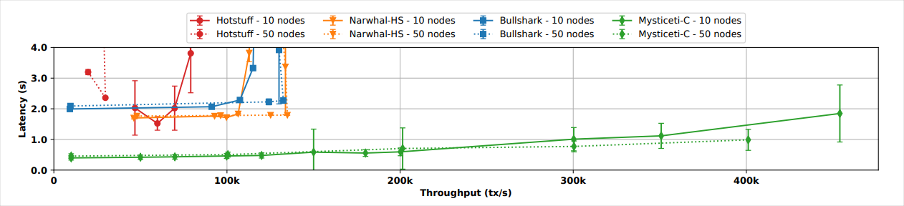

Consensus는 블록체인 네트워크의 대다수 nodes가 어떤 transactions를 final로 처리하고 체인의 영구 이력에 커밋할지를 포함해 네트워크의 현재 상태에 합의하는 과정이다. 이 과정은 악의적이거나 결함이 있는 nodes가 네트워크를 잘못 변경하는 것을 방지한다.

## Validator nodes

Consensus에 참여하려면 validators는 네트워크에 [stake SUI tokens](/guides/operator/validator/validator-rewards.mdx)해야 한다. Sui는 어떤 validators가 네트워크를 운영하고 그들의 voting power가 얼마인지를 결정하기 위해 delegated proof-of-stake (DPoS)를 사용한다. Validators는 transaction fees의 일부, [staking rewards](/guides/operator/validator/validator-rewards.mdx), 그리고 잘못된 행동 시 stake 및 staking rewards의 slashing을 통해 선의로 참여하도록 유도된다.

### Epochs

[epoch](/concepts/sui-architecture/epochs.mdx)은 Sui validators와 그들의 stakes가 변하지 않는 시간 구간이다. [Mainnet](/concepts/sui-architecture/networks.mdx)과 [Testnet](/concepts/sui-architecture/networks.mdx) 모두에서 epoch은 약 24시간이다. epoch 경계에서는 [reconfiguration](/concepts/sui-architecture/epochs.mdx)이 발생할 수 있으며 네트워크에 참여하는 validators 집합과 그들의 voting power를 바꿀 수 있다. 개념적으로 reconfiguration은 이전 epoch의 최종 상태를 genesis로, 새로운 validators 집합을 운영자로 하는 Sui 프로토콜의 새 인스턴스를 시작한다. validator 집합 변화 외에도 staking 및 un-staking, staking rewards 분배와 같은 [tokenomics](/concepts/tokenomics) 작업도 epoch 경계에서 처리된다.

### Quorums

quorum은 특정 epoch 동안 총 voting power의 3분의 2를 초과하는(>2/3) combined voting power를 가진 [validators](/guides/operator/validator/validator-config.mdx) 집합이다. 예를 들어, 모든 validators가 동일한 voting power를 가진 4개의 validators로 운영되는 Sui 인스턴스에서는 3명의 validators를 포함하는 어떤 그룹이든 quorum이다.

quorum 크기 >2/3은 Byzantine fault tolerance (BFT)를 보장한다. validator는 transaction에 quorum의 암호학적 signatures가 함께 있을 때만 transaction을 커밋한다. Sui는 transaction과 그 바이트에 대한 quorum signatures의 조합을 certificate라고 부른다. certificates만 커밋하는 정책은 Byzantine fault tolerance를 보장한다. 즉, >2/3의 validators가 프로토콜을 충실히 따른다면 그들은 결국 committed certificates 집합과 그 effects 모두에 합의하게 된다.

## Write requests

validator는 2가지 유형의 write requests를 처리할 수 있다: transactions와 certificates이다. 높은 수준에서 client는 다음을 수행한다:

- certificate를 형성하는 데 필요한 signatures를 수집하기 위해 quorum의 validators에게 transaction을 전달한다.

- 해당 validator에 상태 변경을 커밋하기 위해 certificate를 validator에 제출한다.

### Transactions

validator가 client로부터 transaction을 받으면 먼저 송신자의 signature를 검증하기 위해 transaction 유효성 검사를 수행한다. 검사가 통과하면 validator는 모든 [owned-objects](/guides/developer/objects/object-ownership/address-owned.mdx)를 lock하고 transaction bytes에 서명한 뒤 signature를 client에 반환한다. client는 quorum으로부터 signatures를 수집하여 certificate를 형성할 때까지 여러 validators에 대해 이 과정을 반복한다.

transaction에 대한 validator signatures를 모아 certificate를 만드는 과정과 certificates를 제출하는 과정은 병렬로 수행될 수 있다. client는 임의의 수의 validators에게 transactions와 certificates를 동시에 multicast할 수 있다. 또는 client는 이 작업들 중 하나 또는 둘 모두를 third-party service provider에 위탁할 수 있다. 이 provider는 certificate 형성을 거부할 수 있으므로 liveness에 대해서는 신뢰해야 하지만, transaction의 effects를 바꿀 수 없고 사용자의 secret key도 필요하지 않으므로 safety에 대해서는 신뢰할 필요가 없다.

### Certificates and certified transactions {#certificates}

client가 certificate를 형성한 뒤 validators에게 제출하면 validators는 certificate 유효성 검사를 수행한다. 이 검사는 서명자들이 현재 epoch의 validators인지와 signatures가 암호학적으로 유효한지를 보장한다. 검사가 통과하면 validators는 certificate 안의 transaction을 실행한다. transaction 실행은 모든 effects를 성공적으로 커밋하거나, abort되어 transaction의 gas input을 차감하는 것 외에는 아무 효과가 없거나 둘 중 하나이다. transaction이 abort될 수 있는 이유로는 명시적 abort instruction, 0으로 나누기 같은 runtime error, 최대 gas budget 초과 등이 있다. 성공하든 abort되든 validator는 inner transaction의 hash로 인덱싱된 certificate를 내구성 있게 저장한다.

client가 transaction effects에 대한 quorum signatures를 수집하면 client는 finality의 약속을 갖게 된다. 이는 transaction effects가 shared database에 지속되며 epoch이 끝날 때까지 커밋되어 모두에게 보이게 된다는 의미이다. 이것이 지연 시간이 한 epoch 전체라는 뜻은 아니다. effects certificate를 사용해 누구에게나 transaction의 finality를 설득할 수 있고, effects에 접근하고 새로운 transactions를 발행할 수도 있기 때문이다. transactions와 마찬가지로 certificate를 validators와 공유하는 과정도 병렬화할 수 있으며 원한다면 third-party service provider에 위탁할 수 있다.

## Mysticeti

Sui는 낮은 지연 시간과 높은 처리량을 모두 최적화하는 _Mysticeti_ 라는 [directed acyclic graph](https://en.wikipedia.org/wiki/Directed_acyclic_graph) 기반 consensus protocol을 사용한다. Mysticeti는 여러 validators가 병렬로 블록을 제안하도록 지원하며, 이는 네트워크의 전체 대역폭을 사용하고 검열 저항성을 제공한다. Mysticeti는 DAGs에서 블록을 커밋하는 데 단 3라운드의 메시지만 요구한다. 이는 실용적인 BFT와 동일하며 이론적 최소치와 일치한다.

Mysticeti는 또한 블록에서 leaders를 병렬로 투표하고 인증할 수 있어 중앙값 및 꼬리 지연 시간을 줄이며, 사용할 수 없는 leaders도 커밋 지연 시간을 크게 증가시키지 않고 허용한다.

consensus 출력에서 transactions의 순서는 각 shared object에 대해 이들이 동작할 수 있는 상대적 순서를 결정한다. 서로 다른 shared objects를 건드리는 transactions의 실행은 여러 코어에서 병렬화된다.

consensus commit의 총 transaction 실행 비용이 임곗값을 초과하면 시스템 과부하를 피하기 위해 consensus 이후에 transactions가 취소될 수 있다.

### Transaction throughput

10개의 nodes를 사용하는 통제된 환경에서 Mysticeti는 지연이 1초를 넘기기 전에 초당 300,000건(TPS)의 transactions를 처리한다. 50개의 nodes에서는 지연이 1초를 초과하기 전에 400,000 TPS를 보인다는 테스트 결과가 있다. 같은 테스트에서 다른 최고 성능의 consensus mechanisms는 150,000 TPS에 도달하지 못하며 관측 지연은 약 2초에서 시작한다.

평균적으로 테스트는 Mysticeti가 약 **0.5초**에 consensus commitment에 도달하고 지속적인 **200,000 TPS**의 처리량을 유지함을 보여준다.

### Decision rule

전통적인 consensus decision rules는 명시적인 블록 검증과 인증을 요구한다. 이 과정은 validators가 consensus에 도달하기 위해 votes에 서명하고 이를 broadcast해야 하므로 통신 오버헤드를 증가시킨다. 반면 Mysticeti는 암묵적 commitment를 제공하여 node 간 통신을 줄이고 대역폭 사용량을 낮춘다.

### Finality

Finality는 transaction 또는 블록이 확인된 후 네트워크에 영구적으로 추가되어 변경되거나 되돌릴 수 없다는 보장이다. 전통적인 blockchain consensus에서 transactions를 확인하는 데 시간이 걸릴 수 있는 이유는 이것이 final로 간주되기 전에 다른 transactions가 이를 참조하는 것에 의존하기 때문이다. 이 과정은 네트워크 활동이 감소하거나 경쟁하는 transactions가 많을 때 느려진다.

Mysticeti는 transactions를 구조에 포함하는 즉시 final로 처리함으로써 이 과정을 단순화한다. 그 결과 추가 확인이나 네트워크 활동을 기다릴 필요가 없으므로, 활동이 적거나 까다로운 네트워크 환경에서 transactions를 확인하는 데 Mysticeti가 더 빠르고 신뢰할 수 있다.

정확성 증명을 포함한 자세한 내용은 [MYSTICETI: Reaching the Latency Limits with Uncertified DAGs](/paper/mysticeti.pdf) 백서를 참조하라.
