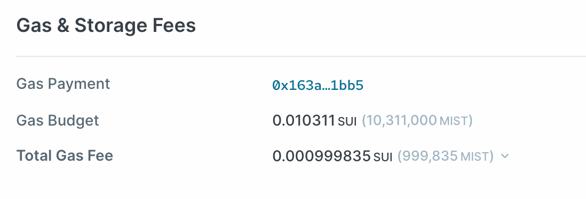

Sui transaction은 실행에 필요한 computation 비용과 해당 transaction이 생성하거나 변경하는 object를 저장하는 데 발생하는 장기적인 비용을 모두 지불해야 한다. 구체적으로, [Sui Gas Pricing](gas-pricing.mdx)은 어떤 transaction이든 다음과 같이 가스 수수료를 지불하도록 되어 있다:

`total_gas_fees = computation_units * reference_gas_price + storage_units * storage_price`

computation 비용과 스토리지 비용은 별개이지만, 각각 computation 또는 스토리지 unit에 해당 가격을 곱해 SUI 단위로 환산한다는 점에서 개념적으로 유사하다.

마지막으로, Sui 스토리지 메커니즘은 transaction이 이전에 저장된 object를 삭제할 때마다 스토리지 리베이트를 제공한다. 따라서 사용자가 지불하는 순 수수료는 가스 수수료에서 데이터 삭제와 관련된 리베이트를 뺀 값과 같다:

`net_gas_fees = computation_gas_fee + storage_gas_fee - storage_rebate`

총 가스 수수료에 대한 정보는 각 transaction block마다 Sui 네트워크 익스플로러에 표시된다:

*Sui 네트워크 익스플로러에 표시된 transaction block의 Gas Fees 섹션이다*

## Gas prices {#gas-prices}

[reference gas price](gas-pricing.mdx#computation-gas-prices)는 transaction을 실행하는 데 드는 실시간 비용을 SUI 단위로 환산하며, validator set은 이를 각 epoch boundary마다 업데이트한다. 마찬가지로 [storage price](gas-pricing.mdx#storage-gas-prices)는 온체인에 데이터를 저장하는 데 드는 장기적인 비용을 SUI 단위로 환산하며, 업데이트 빈도가 낮아 여러 연속된 epoch 동안 일정하게 유지되는 경우가 많다. 일반적인 네트워크 운영 환경에서는 모든 Sui 사용자가 computation과 스토리지에 대해 각각 참조 가스 가격과 스토리지 가격을 지불할 것으로 예상된다.

## Gas units {#gas-units}

가스 unit에는 다음이 포함된다

- [Computation units](#computation)
- [Storage units](#storage)

### Computation units {#computation}

서로 다른 Sui transaction은 처리와 실행에 서로 다른 양의 computation 시간이 필요하다. Sui는 각 transaction을 computation unit 기준으로 측정함으로써 이러한 상이한 운영 부하를 가스 수수료로 환산한다. 일반적으로 더 복잡한 transaction일수록 더 많은 computation unit이 필요하다.

그러나 중요한 점은 Sui computation 가스 스케줄이 bucketing approach를 사용해 거칠게 설계되어 있다는 점이다. 비교적 유사한 두 transaction은 동일한 bucket에 속할 경우 정확히 동일한 양의 computation unit으로 환산되며, 반대로 비교적 상이한 두 transaction은 서로 다른 bucket에 속할 경우 서로 다른 양의 computation unit으로 환산된다. 가장 작은 bucket은 1,000 computation units에 매핑되며, 가장 작은 bucket에 속하는 모든 transaction은 1,000 computation units의 비용이 든다. 가장 큰 bucket은 5,000,000 computation units에 매핑되며, transaction에 이보다 더 많은 computation units가 필요할 경우 해당 transaction은 abort된다.

이와 같은 대략적인 버키팅 접근을 사용하면 두 가지 중요한 목표를 달성할 수 있다:

- _gas golfing_을 통해 가스 수수료의 미세한 이득을 얻기 위해 스마트 계약을 최적화해야 하는 부담에서 벗어나게 한다. 대신 제품과 서비스의 비약적인 개선에 집중할 수 있다.
- 상당한 개발 중단을 일으키지 않고 명령어별 가스 비용을 조정하고 새로운 가스 계측 체계를 실험할 수 있는 자유를 제공한다. 이는 빈번하게 발생할 수 있으므로 시간이 지나도 명령어별 가스 비용이 안정적으로 유지될 것이라고 기대하지 않는 것이 중요하다.

| 구간 하한값 | 구간 상한값 | 연산 단위 |
| --- | --- | --- |
| 0 | 1,000 | 1,000 |
| 1,001 | 5,000 | 5,000 |
| 5,001 | 10,000 | 10,000 |
| 10,001 | 20,000 | 20,000 |
| 20,001 | 50,000 | 50,000 |
| 50,001 | 200,000 | 200,000 |
| 200,001 | 1,000,000 | 1,000,000 |
| 1,000,001 | 5,000,000 | 5,000,000 |
| 5,000,001 | Infinity | transaction은 중단된다 |

### Storage units {#storage}

마찬가지로 Sui transaction은 온체인 스토리지에 새로 기록되는 데이터의 양에 따라 달라진다. 가변 스토리지 unit은 스토리지에 보관되는 byte의 양을 스토리지 unit으로 매핑함으로써 이러한 차이를 포착한다. 현재 Sui 스케줄은 선형 구조이며 각 byte를 100 storage units로 매핑한다. 예를 들어 25 bytes를 저장하는 transaction은 2,500 storage units의 비용이 들고 75 bytes를 저장하는 transaction은 7,500 units의 비용이 든다.

중요하게도, Sui [storage fund](../tokenomics.mdx#storage-fund) 모델에서는 사용자가 데이터를 영구적으로 저장하는 비용을 미리 지불하지만, 해당 데이터가 삭제될 경우 이전에 저장된 데이터에 대해 부분 리베이트를 받을 수 있다. 따라서 사용자가 지불하는 스토리지 비용은 리베이트가 가능한 금액과 리베이트가 가능하지 않은 금액으로 나눌 수 있다. 초기에는 리베이트가 가능한 금액이 스토리지 비용의 99%와 같고, 리베이트가 가능하지 않은 금액은 나머지 1%와 같다.

### Gas budgets {#gas-budgets}

모든 transaction은 가스 예산과 함께 제출해야 한다. 이는 사용자가 지불하는 가스 수수료의 금액에 상한을 제공하며, 특히 Sui 네트워크에 제출하기 전에 transaction의 비용을 정확히 예측하기 어려운 경우에 유용하다.

Sui transaction의 가스 예산은 SUI 단위로 정의되며, 다음 조건을 만족할 경우 transaction은 성공적으로 실행된다:

`gas_budget >= max{computation_fees,total_gas_fees}`

가스 예산이 이 조건을 충족하지 못하면 transaction은 실패하고 가스 예산의 일부가 청구된다. `gas_budget`이 `computation_fees`를 충당하기에 부족한 경우에는 `gas_budget` 전체가 청구된다. `gas_budget`이 `computation_fees`를 충당할 수 있지만 `total_gas_fees`는 충당하지 못하는 경우에는 `computation_fees`에 해당하는 `gas_budget`의 일부와 transaction의 input objects를 변경하는 것과 관련된 비용이 청구된다.

궁극적으로 성공적인 transaction을 위해서는 end user가 transaction의 `total_gas_fees`를 지불해야 한다. 그러나 transaction이 처리되기 전에 computation 시간을 완벽히 예측하기는 어렵기 때문에 `gas_budget` 조건은 transaction이 abort되는 경우를 대비해 `gas_budget`이 transaction의 `computation_fees` 이상이 되도록 요구하기도 한다. 일부 경우—특히 스토리지 리베이트가 커서 총 리베이트 스토리지 비용이 음수가 되는 경우—사용자가 지불하는 총 가스 수수료보다 가스 예산이 더 높을 수도 있다.

중요하게도 최소 가스 예산은 2,000 MIST(0.000002 SUI)이다. 이는 가스 예산이 잘못 지정되어 transaction이 중단되더라도 validator가 최소 2,000 MIST를 보상받도록 보장한다. 또한 이는 최소 가스 예산을 가진 다수의 transaction으로 Sui 네트워크가 스팸 공격을 받는 것을 방지한다. 최대 가스 예산은 500억 MIST 또는 50 SUI이다. 이는 내부 곱셈 연산에서 발생할 수 있는 오버플로우와, 서비스 거부 공격을 위해 가스 제한이 악용되는 상황으로부터 네트워크를 보호한다.

앞서 언급했듯이, 현재 스토리지 리베이트는 최초로 지불된 스토리지 비용의 99%와 같다. 가스 예산은 가스 수수료의 전체 금액에 적용되므로, 종종 transaction은 사용자가 최종적으로 지불하는 총 가스 수수료보다 훨씬 더 큰 가스 예산이 설정되어야만 통과되는 경우가 있다.

### Gas budget examples {#gas-budget-examples}

다음 표는 Sui 네트워크에서의 가스 회계에 대한 몇 가지 예시를 제공한다. 처음 두 행과 마지막 두 행에서는 transaction이 동일한 bucket에 속하므로 computation unit이 동일하다. 그러나 마지막 두 transaction은 처음 두 transaction보다 더 복잡하므로 더 높은 bucket에 속한다. 마지막 transaction에서는 스토리지 리베이트가 충분히 커서 transaction 가스 수수료를 완전히 상쇄하며 실제로 사용자에게 양의 SUI 금액이 다시 지급된다.

이와 같은 예시들은 가스 예산의 중요성을 보여준다. 최소 가스 예산은 transaction이 성공적으로 실행되도록 지정할 수 있는 가장 작은 금액이다. 중요한 점은 스토리지 리베이트가 있는 경우 최소 가스 예산이 사용자가 최종적으로 지불하는 총 가스 수수료의 금액보다 더 크다는 점이며, 이는 마지막 예시에서 사용자가 transaction을 실행한 대가로 양의 금액을 돌려받는 경우에 특히 분명하게 나타난다. 이는 최소 가스 예산이 transaction의 computation 비용보다 커야 하기 때문이다.

|  | 기준 가스 가격 | 연산 단위 | 스토리지 가격 | 스토리지 단위 | 스토리지 리베이트 | 최소 가스 예산 | 순 가스 수수료 |
| --- | --- | --- | --- | --- | --- | --- | --- |
| 10바이트를 저장하는 단순 transaction | 1,000 MIST | 1,000 | 75 MIST | 1,000 | 0 MIST | 1,075,000 MIST | 1,075,000 MIST |
| 10바이트를 저장하고 데이터를 삭제하는 단순 transaction | 500 MIST | 1,000 | 75 MIST | 1,000 | 100,000 MIST | 500,000 MIST | 475,000 MIST |
| 120바이트를 저장하는 복잡한 transaction | 1,000 MIST | 5,000 | 200 MIST | 12,000 | 0 MIST | 7,400,000 MIST | 7,400,000 MIST |
| 120바이트를 저장하고 데이터를 삭제하는 복잡한 transaction | 500 MIST | 5,000 | 200 MIST | 12,000 | 5,000,000 MIST | 2,500,000 MIST | -100,000 MIST |
