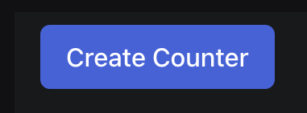
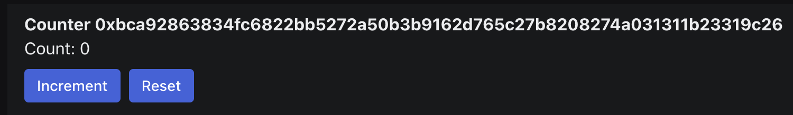

이 예제는 Sui Move module을 빌드하고 이를 React Sui 앱에 연결하는 전체 end-to-end 흐름을 다루면서 기본적인 distributed counter 앱을 빌드하는 과정을 안내한다.

이 앱은 사용자가 누구나 증가시킬 수 있지만 소유자만 재설정할 수 있는 counter를 생성할 수 있게 한다.

이 가이드는 두 부분으로 나뉜다:

1. [Smart Contracts](#smart-contracts): `Counter` 구조와 로직을 설정하는 Move 코드이다.
1. [Frontend](#frontend): 사용자가 `Counter` object를 생성, 증가, 재설정할 수 있게 하는 UI이다.

<ImportContent source="prerequisites.mdx" mode="snippet" />

:::tip Additional resources

[Example source code](https://github.com/MystenLabs/sui/blob/60bb8bdc274b9e5706fd916cd84c13f81e832529/sdk/create-dapp/templates/react-e2e-counter)

:::

## What the guide teaches

- **Shared objects:** 이 가이드는 이 경우 전역적으로 접근 가능한 `Counter` object를 생성하기 위해 [shared objects](/guides/developer/objects/object-ownership/shared.mdx)를 사용하는 방법을 알려 준다.
- **Programmable transaction blocks (PTBs):** 프론트엔드에서 Move module과 상호작용하기 위해 PTB를 사용하는 방법을 배운다.

## Directory structure

시작하려면 모든 project 파일을 담기 위해 시스템에 `react-e2e-counter`라는 새 폴더를 만든다.

이 디렉터리는 다른 이름으로 지정할 수 있지만, 이 가이드의 나머지 부분에서는 이 파일 구조를 참조한다.

그 폴더 안에 `move`와 `src`라는 폴더 두 개를 더 만든다.

`move` 폴더 안에는 `counter` 디렉터리를 만든다.

마지막으로 `counter` 안에 `sources` 폴더를 만든다.

Project마다 고유한 디렉터리 구조가 있지만, 유지 관리를 돕기 위해 코드를 기능별 그룹으로 나누는 것이 일반적이다.

Package 구조와 Sui CLI를 사용해 새 project를 scaffold하는 방법을 더 알아보려면 ["Hello, World!"](/guides/developer/getting-started/hello-world.mdx)를 본다.

:::checkpoint

- 최신 version의 Sui가 설치되어 있으며 터미널 또는 콘솔에서 `sui --version`을 실행하면 현재 설치된 version이 응답으로 반환된다.
- 활성 환경이 예상한 네트워크를 가리키고 있으며 확인하려면 `sui client active-env`를 실행하고, 클라이언트와 서버 API version 불일치 경고를 받으면 Sui repo의 관련 branch(`mainnet`, `testnet`, `devent`)에 있는 version으로 Sui를 업데이트한다.
- 활성 address에 SUI가 있으며 터미널 또는 콘솔에서 `sui client balance`를 실행하고, 잔액이 없다면 faucet에서 [acquire SUI](../getting-started/get-coins.mdx)한다(Mainnet에서는 사용할 수 없다).
- 생성한 파일을 둘 디렉터리가 있으며 이 가이드의 디렉터리 구조와 일치시키려면 최상위 디렉터리 이름은 `react-e2e-counter`이다.

:::

:::tip

<ImportContent source="faucet-online.mdx" mode="snippet" />

:::

## Smart contracts {#smart-contracts}

이 가이드의 이 부분에서는 counter를 생성, 증가, 재설정하는 Move contract를 작성한다.

### `Move.toml`

Smart contract 작성을 시작하려면 `react-e2e-counter/move/counter` 안에 `Move.toml`이라는 파일을 만들고 다음 코드를 그 안에 복사한다.

이 파일은 package manifest 파일이다.

파일 구조를 더 알아보려면 The Move Book의 [Package Manifest](https://move-book.com/concepts/manifest.html)를 본다.

:::info

Testnet이 아닌 네트워크를 대상으로 한다면 Sui dependency의 `rev` 값을 반드시 업데이트한다.

:::

<ImportContent source="packages/create-dapp/templates/react-e2e-counter/move/counter/Move.toml" mode="code" org="MystenLabs" repo="ts-sdks" />

### `Counter` struct

온체인 counter를 정의하는 smart contract 생성을 시작하려면 `react-e2e-counter/move/counter/sources` 폴더 안에 `counter.move` 파일을 만든다.

Smart contract 로직을 담는 module을 정의한다.

```move
module counter::counter {
  // Code goes here
}
```

다음 섹션에서 설명하는 `Counter` struct와 요소를 module에 추가한다.

<ImportContent source="packages/create-dapp/templates/react-e2e-counter/move/counter/sources/counter.move" mode="code" struct="Counter" org="MystenLabs" repo="ts-sdks" noComments />

- `Counter` type은 자신의 `owner` address, 현재 `value`, 그리고 자신의 `id`를 저장한다.

### Creating `Counter`

<ImportContent source="packages/create-dapp/templates/react-e2e-counter/move/counter/sources/counter.move" mode="code" fun="create" org="MystenLabs" repo="ts-sdks" noComments />

`create` 함수에서는 새로운 `Counter` object가 생성되고 [shared](/guides/developer/objects/object-ownership/shared.mdx)된다.

### Incrementing and resetting `Counter`

<ImportContent source="packages/create-dapp/templates/react-e2e-counter/move/counter/sources/counter.move" mode="code" fun="increment" org="MystenLabs" repo="ts-sdks" noComments />

`increment` 함수는 어떤 shared `Counter` object든 그 mutable reference를 받아 `value` field를 증가시킨다.

<ImportContent source="packages/create-dapp/templates/react-e2e-counter/move/counter/sources/counter.move" mode="code" fun="set_value" org="MystenLabs" repo="ts-sdks" noComments />

`set_value` 함수는 어떤 shared `Counter` object든 그 mutable reference, 그 `value` field에 설정할 `value`, 그리고 transaction의 `sender`를 담고 있는 `ctx`를 받는다.

`Counter`의 `owner`만 이 함수를 실행할 수 있다.

:::tip Additional resources

[object references as input](https://move-book.com/move-basics/references.html)에 대해 더 알아본다.

:::

## Finished package

최종 module은 다음과 같아야 한다.

<ImportContent source="packages/create-dapp/templates/react-e2e-counter/move/counter/sources/counter.move" mode="code" org="MystenLabs" repo="ts-sdks" noComments />

:::checkpoint

Smart contract가 완성되었다.

`react-e2e-counter/move/counter`에서 `sui move build` 명령을 실행하면 다음과 유사한 응답을 받아야 한다.

```sh
UPDATING GIT DEPENDENCY https://github.com/MystenLabs/sui.git
INCLUDING DEPENDENCY Sui
INCLUDING DEPENDENCY MoveStdlib
BUILDING counter
```

`sui move build`는 항상 `Move.toml` 파일과 같은 레벨에서 실행한다.

빌드가 성공하면 이제 `react-e2e-counter/move/counter` 안에 `build` 폴더가 생긴다.

:::

### Deployment {#deployment}

<ImportContent source="initialize-sui-client-cli.mdx" mode="snippet" />

다음으로 Sui CLI도 활성 환경으로 `testnet`을 사용하도록 구성한다.

아직 `testnet` 환경을 설정하지 않았다면 터미널 또는 콘솔에서 다음 명령을 실행하여 설정한다:

```sh
$ sui client new-env --alias testnet --rpc https://fullnode.testnet.sui.io:443
```

다음 명령을 실행해 `testnet` 환경을 활성화한다:

```sh
$ sui client switch --env testnet
```

<ImportContent source="publish-to-devnet-with-coins.mdx" mode="snippet" />

이 명령의 출력에는 package를 사용하는 데 저장해 두어야 하는 `packageID` 값이 포함된다.

CLI 배포 출력의 일부 스니펫이다.

```sh
╭──────────────────────────────────────────────────────────────────────────────────────────────────╮
│ Object Changes                                                                                   │
├──────────────────────────────────────────────────────────────────────────────────────────────────┤
│ Created Objects:                                                                                 │
│  ┌──                                                                                             │
│  │ ObjectID: 0x7530c33e4cf3345236601d69303e3fab84efc294194a810dc1cfea13c009e77f                  │
│  │ Sender: 0x8e8cae7791a93778800b88b6a274de5c32a86484593568d38619c7ea71999654                    │
│  │ Owner: Account Address ( 0x8e8cae7791a93778800b88b6a274de5c32a86484593568d38619c7ea71999654 ) │
│  │ ObjectType: 0x2::package::UpgradeCap                                                          │
│  │ Version: 47482286                                                                             │
│  │ Digest: 5aEez7HkJ82Xs5ZArPHJF6Ty38UtprsCvEiyy22hBVRE                                          │
│  └──                                                                                             │
│ Mutated Objects:                                                                                 │
│  ┌──                                                                                             │
│  │ ObjectID: 0x0fcc6d770d80aa409a9645e78ac4810be6400919ac7f507bddd2f9d279da509f                  │
│  │ Sender: 0x8e8cae7791a93778800b88b6a274de5c32a86484593568d38619c7ea71999654                    │
│  │ Owner: Account Address ( 0x8e8cae7791a93778800b88b6a274de5c32a86484593568d38619c7ea71999654 ) │
│  │ ObjectType: 0x2::coin::Coin<0x2::sui::SUI>                                                    │
│  │ Version: 47482286                                                                             │
│  │ Digest: A6TH6ja5TM4S6nZBwB14AB17ZgixCijYX1aNMGHF3syv                                          │
│  └──                                                                                             │
│ Published Objects:                                                                               │
│  ┌──                                                                                             │
│  │ PackageID: 0x7b6a8f5782e57cd948dc75ee098b73046a79282183d51eefb83d31ec95c312aa                 │
│  │ Version: 1                                                                                    │
│  │ Digest: FKAZc1cmQ9FUYudDQBjZPTb1uXDnekKRUbAALuVnwURC                                          │
│  │ Modules: counter                                                                              │
│  └──                                                                                             │
╰──────────────────────────────────────────────────────────────────────────────────────────────────╯
```

[connect to your frontend](#connecting-your-package)에 사용하려고 응답에서 받은 `PackageID` 값을 저장한다.

### Next steps

잘했다.

Move package를 작성하고 배포했다. 🎉

이를 완전한 앱으로 만들려면 [create a frontend](#frontend)해야 한다.


## Frontend {#frontend}

이 app example의 마지막 부분에서는 최종 사용자가 `Counter` object를 생성, 증가, 재설정할 수 있는 frontend(UI)를 빌드한다.


:::info

Frontend 빌드를 건너뛰고 방금 배포한 package를 테스트해 보려면 다음 template을 사용해 이 예제를 생성하고 template의 `README.md` 파일에 있는 지침을 따른다:

<Tabs groupId="packagemanager">
<TabItem label="PNPM" value="pnpm">

```sh
$ pnpm create @mysten/dapp --template react-e2e-counter
```

</TabItem>

<TabItem label="Yarn" value="yarn">

```sh
$ yarn create @mysten/dapp --template react-e2e-counter
```

</TabItem>
</Tabs>

:::

<Tabs className="tabsHeadingCentered--small">
<TabItem value="prereq" label="Prerequisites">

- [x] [Install the latest version of Sui](/guides/developer/getting-started/sui-install).

- [x] [Deploy the complete `counter` Move module](#smart-contracts)를 완료하고 그 설계를 이해한다.

- [x] package manager로 사용할 [`pnpm`](https://pnpm.io/installation) 또는 [`yarn`](https://classic.yarnpkg.com/lang/en/docs/install/#mac-stable)을 설치한다.

</TabItem>
</Tabs>

:::tip Additional resources

- TypeScript를 사용해 Sui와 상호작용하는 기본 사용법을 알아보려면 [Sui TypeScript SDK](https://sdk.mystenlabs.com/typescript)를 본다.
- React.js로 Sui 생태계에서 앱을 개발하기 위한 기본 building block을 알아보려면 [Sui dApp Kit](https://sdk.mystenlabs.com/dapp-kit)를 본다.
- 이 project 안에서 React 기반 Sui 앱을 빠르게 scaffold하는 데 사용되는 [`@mysten/dapp`](https://sdk.mystenlabs.com/dapp-kit/create-dapp)를 본다.

:::

### Overview

UI 디자인은 두 부분으로 구성된다:

- 사용자가 새 `Counter` object를 만들기 위한 버튼
- 사용자가 `value`를 보고 `Counter` object를 증가시키고 재설정하기 위한 `Counter` UI


### Scaffold a new app

첫 번째 단계는 client 앱을 설정하는 것이다.

다음 명령을 실행해 새 앱을 scaffold한다.

<Tabs groupId="packagemanager">
<TabItem label="PNPM" value="pnpm">

```sh
$ pnpm create @mysten/dapp --template react-client-dapp
```

</TabItem>
<TabItem label="Yarn" value="yarn">

```sh
$ yarn create @mysten/dapp --template react-client-dapp
```

</TabItem>
</Tabs>

### Install new dependencies

이 앱은 icon에 `react-spinners` package를 사용한다.

다음 명령을 실행해 설치한다:

<Tabs groupId="packagemanager">
<TabItem label="PNPM" value="pnpm">

```sh
$ pnpm add react-spinners
```

</TabItem>
<TabItem label="Yarn" value="yarn">

```sh
$ yarn add react-spinners
```

</TabItem>
</Tabs>

### Connecting your deployed package {#connecting-your-package}

<details>
<summary>

[deploying your package](#deployment)에서 저장한 `packageId` 값을 project의 새 `src/constants.ts` 파일에 추가한다:

</summary>

```ts
export const DEVNET_COUNTER_PACKAGE_ID = "0xTODO";
export const TESTNET_COUNTER_PACKAGE_ID = "0x7b6a8f5782e57cd948dc75ee098b73046a79282183d51eefb83d31ec95c312aa";
export const MAINNET_COUNTER_PACKAGE_ID = "0xTODO";
```

</details>

<details>
<summary>

`packageID` 상수를 포함하도록 `src/networkConfig.ts` 파일을 업데이트한다.

</summary>

<ImportContent source="packages/create-dapp/templates/react-e2e-counter/src/networkConfig.ts" mode="code" org="MystenLabs" repo="ts-sdks" noComments />

</details>

### Creating `Counter`

새 `Counter` object를 생성할 수단이 필요하다.

<details>
<summary>

`src/CreateCounter.tsx`를 만들고 다음 코드를 추가한다:

</summary>

```tsx
  import { Button, Container } from "@radix-ui/themes";
  import { useState } from "react";
  import ClipLoader from "react-spinners/ClipLoader";

  export function CreateCounter({
    onCreated,
  }: {
    onCreated: (id: string) => void;
  }) {
    const [waitingForTxn, setWaitingForTxn] = useState(false);

    function create() {
      // TODO
    }

    return (
      <Container>
        <Button
          size="3"
          onClick={() => {
            create();
          }}
          disabled={waitingForTxn}
        >
          {waitingForTxn ? <ClipLoader size={20} /> : "Create Counter"}
        </Button>
      </Container>
    );
  }
```

</details>

이 component는 사용자가 counter를 생성할 수 있게 하는 버튼을 렌더링한다.

이제 `create` 함수가 Move module의 `create` 함수를 호출하도록 업데이트한다.

<details>
<summary>

`src/CreateCounter.tsx` 파일의 `create` 함수를 업데이트한다:

</summary>

<ImportContent source="packages/create-dapp/templates/react-e2e-counter/src/CreateCounter.tsx" mode="code" org="MystenLabs" fun="create" repo="ts-sdks" noComments />

</details>

이제 `create` 함수는 새 Sui `Transaction`을 생성하고 Move module의 `create` 함수를 호출한다.

그다음 PTB는 `useSignAndExecuteTransaction` hook을 통해 서명되고 실행된다.

Transaction이 성공하면 새 counter의 ID와 함께 `onCreated` callback이 호출된다.

### Set up routing

이제 사용자가 counter를 생성할 수 있으므로, 그 counter로 라우팅할 방법이 필요하다.

React 앱의 라우팅은 복잡할 수 있지만, 이 예제는 이를 기본적인 수준으로 유지한다.

<details>
<summary>

기본적으로 `CreateCounter` component를 렌더링하고 특정 counter를 표시하고 싶다면 그 ID를 URL의 hash 부분에 넣을 수 있도록 `src/App.tsx` 파일을 설정한다.

</summary>

```tsx
  import { ConnectButton, useCurrentAccount } from "@mysten/dapp-kit-react";
  import { isValidSuiObjectId } from "@mysten/sui/utils";
  import { Box, Container, Flex, Heading } from "@radix-ui/themes";
  import { useState } from "react";
  import { CreateCounter } from "./CreateCounter";

  function App() {
    const currentAccount = useCurrentAccount();
    const [counterId, setCounter] = useState(() => {
      const hash = window.location.hash.slice(1);
      return isValidSuiObjectId(hash) ? hash : null;
    });

    return (
      <>
        <Flex
          position="sticky"
          px="4"
          py="2"
          justify="between"
          style={{
            borderBottom: "1px solid var(--gray-a2)",
          }}
        >
          <Box>
            <Heading>App Starter Template</Heading>
          </Box>

          <Box>
            <ConnectButton />
          </Box>
        </Flex>
        <Container>
          <Container
            mt="5"
            pt="2"
            px="4"
            style={{ background: "var(--gray-a2)", minHeight: 500 }}
          >
            {currentAccount ? (
              counterId ? (
                null
              ) : (
                <CreateCounter
                  onCreated={(id) => {
                    window.location.hash = id;
                    setCounter(id);
                  }}
                />
              )
            ) : (
              <Heading>Please connect your wallet</Heading>
            )}
          </Container>
        </Container>
      </>
    );
  }

  export default App;
```

</details>

이렇게 하면 앱이 URL에서 hash를 읽고 hash가 유효한 object ID이면 counter의 ID를 가져오도록 설정된다.

그다음 counter ID가 있으면 `Counter`를 렌더링한다(이는 다음 단계에서 정의한다).

Counter ID가 없으면 이전 단계의 `CreateCounter` 버튼을 렌더링한다.

Counter가 생성되면 URL을 업데이트하고 counter ID를 설정한다.

현재는 `Counter` component가 아직 없으므로 counter ID로 이동하면 앱에 빈 페이지가 표시된다.

:::checkpoint

이 시점에서 기본적인 라우팅 설정이 완료되었다.

앱을 실행하고 다음이 가능한지 확인한다:

- 새 counter를 생성한다.
- URL에서 counter ID를 본다.

`create counter` 버튼은 다음과 같아야 한다:



:::

### Building your counter user interface

새 파일 `src/Counter.tsx`를 만든다.

Counter에는 세 가지 요소를 표시하려고 한다:

- `getObject` RPC method를 사용해 object에서 가져오는 현재 count.
- `increment` Move 함수를 호출하는 increment 버튼.
- `0`과 함께 `set_value` Move 함수를 호출하는 reset 버튼.
- 이 버튼은 현재 사용자가 counter를 소유한 경우에만 표시된다.

<details>
<summary>

`src/Counter.tsx` 파일에 다음 코드를 추가한다:

</summary>

  ```tsx title='src/Counter.tsx'
  import { bcs } from '@mysten/sui/bcs';
  import { useCurrentAccount, useCurrentClient, useDAppKit } from '@mysten/dapp-kit-react';
  import { Transaction } from '@mysten/sui/transactions';
  import { useMutation, useQuery } from '@tanstack/react-query';

  const CounterStruct = bcs.struct('Counter', {
    id: bcs.Address,
    owner: bcs.Address,
    value: bcs.u64(),
  });

  export function Counter({
    id,
    packageId,
  }: {
    id: string;
    packageId: string;
  }) {
    const client = useCurrentClient();
    const dAppKit = useDAppKit();
    const account = useCurrentAccount();

    const { data: counter, refetch } = useQuery({
      queryKey: ['counter', id],
      queryFn: async () => {
        const object = await client.core.getObject({
          objectId: id,
        });

        const parsed = CounterStruct.parse(object.content);
        return {
          value: Number(parsed.value),
          owner: parsed.owner,
        };
      },
    });

    const { mutate: increment } = useMutation({
      mutationFn: async () => {
        const tx = new Transaction();
        tx.moveCall({
          target: `${packageId}::counter::increment`,
          arguments: [tx.object(id)],
        });

        const result = await dAppKit.signAndExecuteTransaction({
          transaction: tx,
        });
        if (result.$kind === 'FailedTransaction') {
          throw new Error('Transaction failed');
        }
      },
      onSuccess: () => refetch(),
    });

    const { mutate: reset } = useMutation({
      mutationFn: async () => {
        const tx = new Transaction();
        tx.moveCall({
          target: `${packageId}::counter::set_value`,
          arguments: [tx.object(id), tx.pure.u64(0)],
        });

        const result = await dAppKit.signAndExecuteTransaction({
          transaction: tx,
        });
        if (result.$kind === 'FailedTransaction') {
          throw new Error('Transaction failed');
        }
      },
      onSuccess: () => refetch(),
    });

    return (
      <div>
        <div>Count: {counter?.value ?? '--'}</div>
        <button onClick={() => increment()}>Increment</button>
        {account?.address === counter?.owner && (
          <button onClick={() => reset()}>Reset</button>
        )}
      </div>
    );
  }
  ```

</details>

이 스니펫은 핵심 개념을 보여 준다.

이 스니펫은 object를 가져오기 위해 TanStack Query의 `useQuery` hook과 결합된 `useCurrentClient` hook을 사용하여 Sui client를 가져온다.

`useDAppKit` hook은 transaction 서명에 대한 접근을 제공한다.

gRPC API는 object content를 BCS로 인코딩된 bytes로 반환한다는 점에 유의한다.

위 스니펫에는 counter 데이터를 파싱하기 위한 inline BCS type 정의가 포함되어 있다.

프로덕션 용도에서는 [codegen package](https://sdk.mystenlabs.com/typescript/bcs#codegen)가 Move module에서 이러한 type을 자동으로 생성할 수 있다.

전체 template(아래 표시)은 BCS 파싱에 codegen package를 사용한다.


<details>

<summary>

BCS 파싱에 codegen package를 사용하는 `src/Counter.tsx`의 전체 template version:

</summary>

<ImportContent source="packages/create-dapp/templates/react-e2e-counter/src/Counter.tsx" mode="code" org="MystenLabs" repo="ts-sdks" noComments />

</details>

### Updating the routing

이제 `Counter` component가 있으므로 counter ID가 있을 때 이를 렌더링하도록 `App` component를 업데이트해야 한다.

<details>

<summary>

Counter ID가 있을 때 `Counter` component를 렌더링하도록 `src/App.tsx` 파일을 업데이트한다:

</summary>

<ImportContent source="packages/create-dapp/templates/react-e2e-counter/src/App.tsx" mode="code" org="MystenLabs" repo="ts-sdks" noComments />

</details>

:::checkpoint

이 시점에서 완전한 앱이 완성되었다. 🎉

앱을 실행하고 다음이 가능한지 확인한다:

- counter를 생성한다.
- counter를 증가시키고 재설정한다.

`Counter` component는 다음과 같아야 한다:



:::