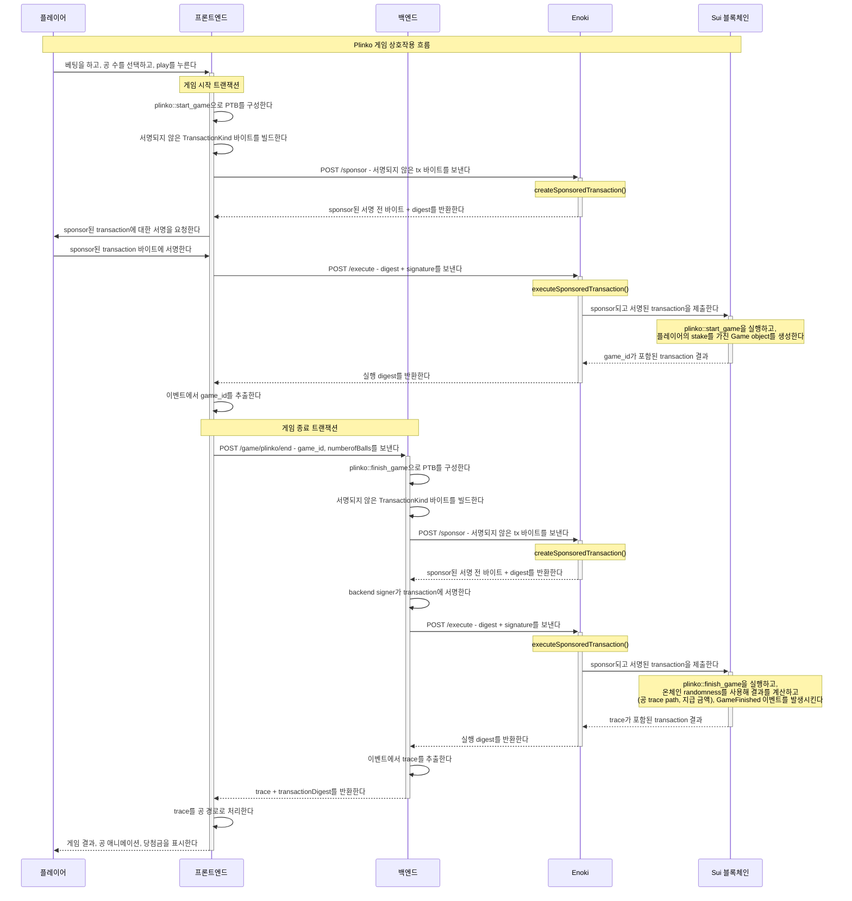

Plinko는 인기 있는 카지노 게임의 예시 구현이다.
Sui의 Plinko 게임은 온체인 randomness를 활용해 공정성과 투명성을 보장한다.
플레이어는 peg가 있는 보드 위에 Plinko 공을 떨어뜨리고, 공은 다양한 multiplier를 나타내는 슬롯으로 무작위로 떨어진다.
이 문서는 게임의 메커니즘, 온체인 randomness 구현, Enoki를 통한 sponsored transactions, 그리고 codegen을 사용하는 TypeScript 통합을 자세히 설명한다.

온체인 Plinko 게임을 구축하는 일은 [Coin Flip](./coin-flip.mdx) 게임 및 [Blackjack](./blackjack.mdx) 게임과 많은 유사점을 가진다.
그 때문에 이 예시는 smart contract(Move module)와 frontend 로직만 다룬다.

<ImportContent source="prerequisites.mdx" mode="snippet" />

:::info

GitHub의 [Plinko repo](https://github.com/MystenLabs/plinko-poc/tree/main)에서 이 예시의 source 파일을 찾을 수 있다.

게임의 한 version은 [Mysten Plinko](https://plinko-poc.vercel.app/)에도 배포되어 있다.

:::

## Gameplay

Sui 블록체인의 smart contract로 구현된 Plinko 게임은 Sui의 네이티브 온체인 randomness를 활용해 공정성과 투명성을 보장한다.
게임은 각 공이 이동하는 trace path를 온체인에서 직접 생성한 안전한 random 값으로 계산하고, 플레이어가 떨어뜨리기로 선택한 Plinko 공의 수를 기준으로 게임 결과를 결정한다.

게임 메커니즘에서는 플레이어가 공 수를 지정하고 일정 금액을 stake하여 게임을 시작한다.
온체인 randomness는 Sui의 Move randomness framework를 통해 제공되며, 각 게임의 randomness가 암호학적으로 안전하고 예측하거나 조작할 수 없도록 보장한다.
플레이어가 선택한 Plinko 공의 수는 게임의 복잡도와 잠재적인 payout에 직접 영향을 주는데, 이는 각 공의 최종 위치가 peg 보드를 통과하는 공의 경로를 결정하는 온체인 random 값에 의해 정해지기 때문이다.

## Sequence diagram



## Move modules

각 module이 만드는 로직을 이해하려면 각 module 코드의 주석을 따라간다.

### `plinko::plinko`

`plinko::plinko` module은 코인 처리, 이벤트 발생, 온체인 randomness, 게임 로직 같은 다양한 Sui 블록체인 기능을 결합해 공정하고 투명한 온체인 Plinko 게임을 만든다.

<details>
<summary>
`plinko.move`
</summary>

```move title="plinko.move"
module plinko::plinko;
use plinko::house_data::{Self as hd, HouseData};
use sui::balance::Balance;
use sui::coin::{Self, Coin};
use sui::dynamic_object_field as dof;
use sui::event::emit;
use sui::random::Random;
use sui::sui::SUI;

// === 오류 ===
const EStakeTooLow: u64 = 0;
const EStakeTooHigh: u64 = 1;
const EInsufficientHouseBalance: u64 = 5;
const EGameDoesNotExist: u64 = 6;
const ENumberOfBallsNotAllowed: u64 = 7;

// === 구조체 ===

/// 게임을 나타내고 누적된 stake를 보관한다.
public struct Game has key, store {
    id: UID,
    game_start_epoch: u64,
    stake: Balance<SUI>,
    player: address,
    fee_bp: u16,
}

// === 이벤트 ===

/// 새 게임이 시작되었을 때 발생한다.
public struct NewGameStarted has copy, drop {
    game_id: ID,
    player: address,
    user_stake: u64,
    fee_bp: u16,
}

/// 게임이 끝났을 때 발생한다.
public struct GameFinished has copy, drop {
    game_id: ID,
    result: u64,
    player: address,
    // 각 공의 이동을 나타내는 trace path
    trace: vector<u8>,
}

// === 공개 함수 ===

/// 새 게임을 생성하는 데 사용하는 함수이다.
public fun start_game(coin: Coin<SUI>, house_data: &mut HouseData, ctx: &mut TxContext): ID {
    let fee_bp = house_data.base_fee_in_bp();
    let (id, new_game) = internal_start_game(coin, house_data, fee_bp, ctx);
    dof::add(house_data.borrow_mut(), id, new_game);
    id
}

/// finish_game은 온체인 randomness를 사용해 결과를 계산하고
/// 자금을 플레이어에게 전송함으로써 게임을 완료한다.
/// 이 함수는 게임 결과와 trace path를 담은 GameFinished 이벤트를 발생시킨다.
entry fun finish_game(
    game_id: ID,
    random: &Random,
    house_data: &mut HouseData,
    num_balls: u64,
    ctx: &mut TxContext,
): (u64, address, vector<u8>) {
    // 게임이 존재하는지 확인한다.
    assert!(game_exists(house_data, game_id), EGameDoesNotExist);

    // 플레이어가 최소 한 개 이상의 공을 선택했고 100개를 넘지 않았는지 확인한다.
    assert!(num_balls > 0 && num_balls <= 100, ENumberOfBallsNotAllowed);

    // 결과 계산을 준비하기 위해 HouseData에서 게임을 가져오고 제거한다.
    let Game {
        id,
        game_start_epoch: _,
        stake,
        player,
        fee_bp: _,
    } = dof::remove<ID, Game>(house_data.borrow_mut(), game_id);

    id.delete();

    // random generator와 변수를 초기화한다.
    let mut random_generator = random.new_generator(ctx);
    let mut trace = vector[];

    // 공 하나당 stake 금액을 계산한다.
    let stake_per_ball = stake.value<SUI>() / num_balls;
    let mut total_funds_amount: u64 = 0;

    // 네이티브 randomness를 사용해 각 공의 결과를 계산한다.
    let mut ball_index = 0;
    while (ball_index < num_balls) {
        let mut state: u64 = 0;

        // 이 공을 위해 12개의 random byte를 생성하고 직접 처리한다.
        let mut i = 0;
        while (i < 12) {
            let byte = random_generator.generate_u8_in_range(0, 255);
            // byte를 trace vector에 추가한다.
            trace.push_back<u8>(byte);
            // 짝수 byte의 수를 센다.
            // 짝수이면 state에 1을 더한다.
            // 홀수 byte -> 0, 짝수 byte -> 1
            // state는 multiplier index를 계산하는 데 사용된다.
            state = if (byte % 2 == 0) { state + 1 } else { state };
            i = i + 1;
        };

        // state를 기준으로 multiplier index를 계산한다.
        let multiplier_index = state % house_data.multiplier().length();
        // house data에서 multiplier를 가져온다.
        let result = house_data.multiplier()[multiplier_index];

        // 이 특정 공에 대한 자금 금액을 계산한다.
        // multiplier 스케일과 SUI 단위를 보정하기 위해 100으로 나눈다.
        let funds_amount_per_ball = (result * stake_per_ball) / 100;
        // 자금 금액을 총 자금 금액에 더한다.
        total_funds_amount = total_funds_amount + funds_amount_per_ball;
        ball_index = ball_index + 1;
    };

    // 플레이어에 대한 payout을 처리하고 게임 결과를 반환한다.
    // 사용 가능한 잔액을 읽고 부족하면 일찍 실패한다.
    let available: u64 = hd::balance(house_data);
    assert!(available >= total_funds_amount, EInsufficientHouseBalance);
    let payout_balance_mut = house_data.borrow_balance_mut();
    let payout_coin: Coin<SUI> = coin::take(payout_balance_mut, total_funds_amount, ctx);

    payout_balance_mut.join(stake);

    // payout 코인을 플레이어에게 전송한다.
    transfer::public_transfer(payout_coin, player);
    // GameFinished 이벤트를 발생시킨다.
    emit(GameFinished {
        game_id,
        result: total_funds_amount,
        player,
        trace,
    });

    // 플레이어에게 보낼 총액을 반환한다(그리고 플레이어 address도 함께 반환한다).
    (total_funds_amount, player, trace)
}


// === Public-View Functions ===

/// 게임이 시작된 epoch를 반환한다.
public fun game_start_epoch(game: &Game): u64 {
    game.game_start_epoch
}

/// 총 stake를 반환한다.
public fun stake(game: &Game): u64 {
    game.stake.value()
}

/// 플레이어의 address를 반환한다.
public fun player(game: &Game): address {
    game.player
}

/// 게임의 수수료를 반환한다.
public fun fee_in_bp(game: &Game): u16 {
    game.fee_bp
}

// === Admin Functions ===

/// 게임이 존재하는지 확인하는 helper 함수이다.
public fun game_exists(house_data: &HouseData, game_id: ID): bool {
    dof::exists_(house_data.borrow(), game_id)
}

/// 게임이 존재하는지 확인하고 게임 Object에 대한 reference를 반환하는 helper 함수이다.
/// 원하는 게임 필드를 가져오기 위해 어떤 accessor와도 함께 사용할 수 있다.
public fun borrow_game(game_id: ID, house_data: &HouseData): &Game {
    assert!(game_exists(house_data, game_id), EGameDoesNotExist);
    dof::borrow(house_data.borrow(), game_id)
}

// === 비공개 함수 ===

/// 새 게임을 생성하는 데 사용하는 내부 helper 함수이다.
/// Stake는 플레이어의 coin에서 가져와 게임의 stake에 추가된다.
fun internal_start_game(
    coin: Coin<SUI>,
    house_data: &HouseData,
    fee_bp: u16,
    ctx: &mut TxContext,
): (ID, Game) {
    let user_stake = coin.value();
    // stake가 최대 stake보다 높지 않은지 확인한다.
    assert!(user_stake <= house_data.max_stake(), EStakeTooHigh);
    // stake가 최소 stake보다 낮지 않은지 확인한다.
    assert!(user_stake >= house_data.min_stake(), EStakeTooLow);
    // house가 이 게임을 진행하기에 충분한 잔액을 가졌는지 확인한다.
    assert!(
        house_data.balance() >= (user_stake * (house_data.multiplier()[0])) / 100,
        EInsufficientHouseBalance,
    );

    let id = object::new(ctx);
    let game_id = object::uid_to_inner(&id);

    // 새 게임 object를 만들고 NewGameStarted 이벤트를 발생시킨다.
    let new_game = Game {
        id,
        game_start_epoch: ctx.epoch(),
        stake: coin.into_balance<SUI>(),
        player: ctx.sender(),
        fee_bp,
    };
    // NewGameStarted 이벤트를 발생시킨다.
    emit(NewGameStarted {
        game_id,
        player: ctx.sender(),
        user_stake,
        fee_bp,
    });

    (game_id, new_game)
}
```

</details>

#### Error codes

오류 처리는 module에 필수적인 요소이며, 각 코드는 다양한 실패 상태 또는 잘못된 작업을 나타낸다:

- `EStakeTooLow`: 제공된 stake가 최소 임계값보다 낮음을 나타낸다.
- `EStakeTooHigh`: stake가 허용된 최대 한도를 초과함을 나타낸다.
- `EInsufficientHouseBalance`: house가 게임 결과를 감당할 만큼 충분한 잔액을 가지고 있지 않음을 나타낸다.
- `EGameDoesNotExist`: 참조한 게임을 찾을 수 없을 때 사용된다.
- `ENumberOfBallsNotAllowed`: 플레이어가 유효하지 않은 공 수를 선택했음을 나타낸다(1 이상 100 이하이어야 한다).

#### Events

- `NewGameStarted`: 새 게임이 시작될 때 발생하며 game ID, 플레이어 address, stake, 수수료 basis point 같은 핵심 세부 정보를 담는다.
- `GameFinished`: 게임이 끝날 때 발생하며 game ID, 결과, 플레이어 address, 각 공이 Plinko 보드를 통과한 경로를 담은 trace를 포함한 결과 세부 정보를 담는다.

#### Structures

- `Game`: 개별 게임 세션을 나타내며 game ID, 게임 시작 epoch, stake 금액, 플레이어 address, 수수료 basis point 같은 정보를 보관한다.

#### Key functions

- `start_game`: 플레이어의 stake coin, house data, transaction context를 받아 새 Plinko 게임 세션을 시작한다. game ID를 반환한다.
- `finish_game`: 온체인 randomness를 사용해 결과를 계산하고, 각 공이 이동한 경로를 추적하고, 총 당첨금을 플레이어에게 분배함으로써 게임을 완료한다. 이 함수는 Sui randomness framework의 Random object를 받는 entry 함수이다.

#### Accessors

게임 속성에 대한 읽기 전용 접근을 제공한다:

- `game_start_epoch`: 게임이 시작된 epoch를 반환한다
- `stake`: 총 stake 금액을 반환한다
- `player`: 플레이어의 address를 반환한다
- `fee_in_bp`: basis point 단위 수수료를 반환한다

#### Public helper functions

- `game_exists`: house data 안에 게임이 존재하는지 확인한다.
- `borrow_game`: 추가 처리를 위해 game object에 대한 reference를 가져온다.

#### Internal helper functions

- `internal_start_game`: 새 게임 생성을 지원하는 핵심 유틸리티로, stake 한도 준수, house 잔액 충분성, 고유 game ID 생성을 보장한다.

### `plinko::house_data`

`plinko::house_data` module은 게임의 treasury와 구성을 관리한다.
이 module은 house 자금 저장, 게임 parameter 설정(예: 최대 및 최소 stake), 게임 수수료 처리, 당첨금 계산에 사용하는 multiplier vector 관리 기능을 제공한다.
이 module은 게임 설정을 조정하는 함수와 house 자금을 관리하는 함수를 제공한다.

<details>
<summary>
`house_data.move`
</summary>

```move title="house_data.move"
module plinko::house_data;
use sui::balance::{Self, Balance};
use sui::coin::{Self, Coin};
use sui::package;
use sui::sui::SUI;

// === 오류 ===
const ECallerNotHouse: u64 = 0;
const EInsufficientBalance: u64 = 1;

// === 구조체 ===

/// house가 관리하는 구성 및 Treasury shared object이다.
public struct HouseData has key {
    id: UID,
    // house의 잔액이며 house의 누적 당첨금도 포함한다.
    balance: Balance<SUI>,
    // house 또는 게임 운영자의 address이다.
    house: address,
    // 플레이어가 단일 게임에서 베팅할 수 있는 최대 stake 금액이다.
    max_stake: u64,
    // 게임 플레이에 필요한 최소 stake 금액이다.
    min_stake: u64,
    // 플레이된 게임에서 누적된 수수료이다.
    fees: Balance<SUI>,
    // 기본 수수료를 basis point로 나타낸 값이다. 1 basis point = 0.01%이다.
    base_fee_in_bp: u16,
    // 게임 결과를 기준으로 당첨금을 계산하는 데 사용하는 multiplier이다.
    multiplier: vector<u64>,
}

/// house data를 초기화하기 위한 일회용 capability이다.
/// initializer에서 생성되어 sender에게 전송된다.
public struct HouseCap has key {
    id: UID,
}

/// publisher를 생성하기 위한 one time witness로 사용된다.
public struct HOUSE_DATA has drop {}

fun init(otw: HOUSE_DATA, ctx: &mut TxContext) {
    // Publisher object를 생성하고 sender에게 전송한다.
    package::claim_and_keep(otw, ctx);

    // HouseCap object를 생성하고 sender에게 전송한다.
    let house_cap = HouseCap {
        id: object::new(ctx),
    };
    transfer::transfer(house_cap, ctx.sender());
}

/// 오직 한 번만, 그리고 contract 생성자만 호출해야 하는 initializer 함수이다.
/// house data object를 초기 잔액으로 초기화한다.
/// 또한 나중에 업데이트할 수 있는 최대 및 최소 stake 값을 설정한다.
/// house address와 기본 수수료를 basis point 단위로 저장한다.
/// 이 object는 같은 package 인스턴스가 생성한 모든 게임에 관여한다.
public fun initialize_house_data(
    house_cap: HouseCap,
    coin: Coin<SUI>,
    multiplier: vector<u64>,
    ctx: &mut TxContext,
) {
    assert!(coin.value() > 0, EInsufficientBalance);

    let mut house_data = HouseData {
        id: object::new(ctx),
        balance: coin.into_balance(),
        house: ctx.sender(),
        max_stake: 10_000_000_000, // 10 SUI = 10^9.
        min_stake: 100_000_000, // 0.1 SUI.
        fees: balance::zero(),
        base_fee_in_bp: 100, // basis point 기준 1%.
        multiplier: vector[],
    };

    house_data.set_multiplier_vector(multiplier);

    let HouseCap { id } = house_cap;
    id.delete();

    transfer::share_object(house_data);
}

// === Public-Mutative Functions ===

public fun update_multiplier_vector(
    house_data: &mut HouseData,
    v: vector<u64>,
    ctx: &mut TxContext,
) {
    assert!(ctx.sender() == house_data.house(), ECallerNotHouse);
    house_data.multiplier = vector[];
    house_data.set_multiplier_vector(v);
}

/// house 잔액을 보충하는 데 사용하는 함수이다. 누구나 호출할 수 있다.
/// house는 여러 account를 가질 수 있으므로 treasury 잔액을 제공하는 기능은 제한하지 않는다.
public fun top_up(house_data: &mut HouseData, coin: Coin<SUI>, _: &mut TxContext) {
    coin::put(&mut house_data.balance, coin)
}

/// house object의 전체 잔액을 출금하는 함수이다.
/// 이 함수는 house만 호출할 수 있다
public fun withdraw(house_data: &mut HouseData, ctx: &mut TxContext) {
    // 오직 house address만 자금을 출금할 수 있다.
    assert!(ctx.sender() == house_data.house(), ECallerNotHouse);

    let total_balance = house_data.balance();
    let coin = coin::take(&mut house_data.balance, total_balance, ctx);
    transfer::public_transfer(coin, house_data.house());
}

/// house는 house object에 누적된 수수료를 출금할 수 있다.
public fun claim_fees(house_data: &mut HouseData, ctx: &mut TxContext) {
    // 오직 house address만 수수료 자금을 출금할 수 있다.
    assert!(ctx.sender() == house_data.house(), ECallerNotHouse);

    let total_fees = house_data.fees();
    let coin = coin::take(&mut house_data.fees, total_fees, ctx);
    transfer::public_transfer(coin, house_data.house());
}

/// house는 최대 stake를 업데이트할 수 있다. 이로써 더 큰 stake를 허용할 수 있다.
public fun update_max_stake(house_data: &mut HouseData, max_stake: u64, ctx: &mut TxContext) {
    // 오직 house address만 기본 수수료를 업데이트할 수 있다.
    assert!(ctx.sender() == house_data.house(), ECallerNotHouse);

    house_data.max_stake = max_stake;
}

/// house는 최소 stake를 업데이트할 수 있다. 이로써 더 작은 stake를 허용할 수 있다.
public fun update_min_stake(house_data: &mut HouseData, min_stake: u64, ctx: &mut TxContext) {
    // 오직 house address만 최소 stake를 업데이트할 수 있다.
    assert!(ctx.sender() == house_data.house(), ECallerNotHouse);

    house_data.min_stake = min_stake;
}

// === Public-View Functions ===

/// house의 잔액을 반환한다.
public fun balance(house_data: &HouseData): u64 {
    house_data.balance.value()
}

/// house의 address를 반환한다.
public fun house(house_data: &HouseData): address {
    house_data.house
}

/// house의 최대 stake를 반환한다.
public fun max_stake(house_data: &HouseData): u64 {
    house_data.max_stake
}

/// house의 최소 stake를 반환한다.
public fun min_stake(house_data: &HouseData): u64 {
    house_data.min_stake
}

/// house의 수수료를 반환한다.
public fun fees(house_data: &HouseData): u64 {
    house_data.fees.value()
}

/// 기본 수수료를 반환한다.
public fun base_fee_in_bp(house_data: &HouseData): u16 {
    house_data.base_fee_in_bp
}

/// multiplier vector를 반환한다
public fun multiplier(house_data: &HouseData): vector<u64> {
    house_data.multiplier
}

// === Public-Friend Functions ===

/// house ID에 대한 reference를 반환한다.
public(package) fun borrow(house_data: &HouseData): &UID {
    &house_data.id
}

/// house 잔액에 대한 mutable reference를 반환한다.
public(package) fun borrow_balance_mut(house_data: &mut HouseData): &mut Balance<SUI> {
    &mut house_data.balance
}

/// house 수수료에 대한 mutable reference를 반환한다.
public(package) fun borrow_fees_mut(house_data: &mut HouseData): &mut Balance<SUI> {
    &mut house_data.fees
}

/// house ID에 대한 mutable reference를 반환한다.
public(package) fun borrow_mut(house_data: &mut HouseData): &mut UID {
    &mut house_data.id
}

// === 비공개 함수 ===

fun set_multiplier_vector(house_data: &mut HouseData, v: vector<u64>) {
    house_data.multiplier.append(v);
}

// === 테스트 함수 ===

#[test_only]
public fun init_for_testing(ctx: &mut TxContext) {
    init(HOUSE_DATA {}, ctx);
}
```
</details>

#### Error codes

이 module은 예외 상황을 처리하기 위한 특정 오류 코드를 정의한다:

- `ECallerNotHouse`: 특정 작업을 오직 house(게임 운영자)만 수행할 수 있도록 보장한다.
- `EInsufficientBalance`: 최소 자금 수준이 필요한 작업에 잔액이 부족함을 나타낸다.

#### Structures

- `HouseData`: house의 운영 parameter를 저장하는 key 구성 object로, house의 잔액, stake 한도, 누적 수수료, 기본 수수료율, 게임 결과를 위한 multiplier 설정을 포함한다.
- `HouseCap`: house data를 초기화할 권한이 있음을 나타내는 고유 capability이다.
- `HOUSE_DATA`: setup 단계에서 한 번 사용되는 house data 초기화를 위한 one time witness이다.

#### Initialization function

- `init`: house data 관리를 위한 필수 capability와 object를 생성해 house 환경을 준비한다.

#### Public functions

- `initialize_house_data`: 잔액, stake 한도, multiplier를 포함한 house의 초기 구성을 설정한다.
- `top_up`: 게임 운영을 지원하기 위해 house 잔액에 자금을 추가할 수 있게 한다.
- `withdraw`: house가 자신의 잔액을 출금할 수 있게 하며, 이는 house의 운영 능력에 영향을 주는 중요한 함수이다.
- `claim_fees`: house가 게임 활동에서 누적된 수수료를 수집할 수 있게 한다.
- `update_max_stake`: 게임의 최대 stake 한도를 조정한다.
- `update_min_stake`: 최소 stake 요구 사항을 변경한다.
- `update_multiplier_vector`: 게임 결과 계산에 사용하는 multiplier vector를 업데이트한다.

#### Internal helper functions

- `set_multiplier_vector`: 초기 multiplier vector를 설정하는 데 내부적으로 사용된다.

#### Accessors

house data 속성에 대한 읽기 전용 및 mutable 접근을 제공해, 승인된 컨텍스트 안에서 잔액 조회, stake 한도 조회, 수수료 조회, 구성 수정 같은 작업을 가능하게 한다:

- `balance`: house의 현재 잔액을 반환한다.
- `house`: house의 address를 가져온다.
- `max_stake`, `min_stake`: 현재 stake 한도에 접근한다.
- `fees`: 게임 운영에서 누적된 수수료를 보여준다.
- `base_fee_in_bp`: basis point 단위 기본 수수료율을 제공한다.
- `multiplier`: 게임 결과 계산에 사용하는 multiplier vector를 반환한다.

#### Test utilities

- `init_for_testing`: test 환경에서 house data를 초기화해 module test를 돕는 유틸리티 함수이다.

## Enoki sponsorship

Plinko 게임은 transaction sponsorship을 위해 [Enoki](https://docs.enoki.mystenlabs.com/)를 활용해 마찰 없는 사용자 경험을 보여준다.
이 덕분에 플레이어는 가스 수수료를 위한 SUI 토큰을 보유할 필요 없이 게임과 상호작용할 수 있어 진입 장벽이 크게 낮아진다.

### How sponsorship works

Sponsorship 흐름은 Enoki client와 함께 동작하는 두 개의 backend API endpoint로 나뉜다:

1. **`/sponsor` endpoint**: frontend에서 서명되지 않은 transaction 바이트를 받아 `enokiClient.createSponsoredTransaction()`을 호출해 sponsorship을 적용한다. sponsor되었지만 아직 서명되지 않은 transaction 바이트와 digest를 반환한다.

2. **`/execute` endpoint**: transaction digest와 사용자 서명을 받아 `enokiClient.executeSponsoredTransaction()`을 호출해 sponsor되고 서명된 transaction을 블록체인에 제출한다.

전체 흐름은 다음과 같이 동작한다:

1. **Frontend constructs transaction**: UI는 필요한 Move 호출(`plinko::start_game` 등)을 포함한 programmable transaction block(PTB)을 빌드하고 이를 `TransactionKind` 바이트로 직렬화한다.

2. **Request sponsorship**: 서명되지 않은 transaction 바이트를 `/sponsor`로 보내면 sponsor된 서명 전 바이트가 반환된다.

3. **User signs**: 플레이어가 자신의 지갑을 통해 sponsor된 transaction 바이트에 서명한다.

4. **Execute transaction**: 서명된 transaction을 `/execute`로 보내면 블록체인에 제출된다.

이 두 단계 과정은 다음을 보장한다:
- 플레이어는 transaction에 서명만 하면 된다(소유권 증명)
- 게임 운영자가 Enoki를 통해 모든 가스 수수료를 부담한다
- 사용자 경험이 매끄럽고 Web2와 유사하다
- **Important:** sponsored transaction을 위해 coin을 생성할 때 `useGasCoin: false`를 설정한다

### Implementation Example

#### Backend: `/sponsor` endpoint

```typescript
import { enokiClient } from "../EnokiClient";

export const POST = async (req: NextRequest) => {
  try {
    const { transactionKindBytes, sender } = await req.json();
    const sponsored = await enokiClient.createSponsoredTransaction({
      network: process.env.NEXT_PUBLIC_SUI_NETWORK_NAME as
        | "mainnet"
        | "testnet"
        | "devnet",
      transactionKindBytes,
      sender,
      allowedAddresses: [sender],
    });

    return NextResponse.json(
      { bytes: sponsored.bytes, digest: sponsored.digest },
      { status: 200 }
    );
  } catch (error) {
    console.error("Sponsorship failed:", error);
    return NextResponse.json({ error: "Sponsorship failed" }, { status: 500 });
  }
};
```

#### Backend: `/execute` endpoint

```typescript
import { enokiClient } from "../EnokiClient";

export const POST = async (req: NextRequest) => {
  try {
    const { digest, signature } = await req.json();
    const executionResult = await enokiClient.executeSponsoredTransaction({
      digest,
      signature,
    });
    return NextResponse.json(
      { digest: executionResult.digest },
      { status: 200 }
    );
  } catch (error) {
    console.error("Execution failed:", error);
    return NextResponse.json({ error: "Execution failed" }, { status: 500 });
  }
};
```

#### Frontend: Complete sponsorship flow

```typescript
// 1) tx를 생성하고 TransactionKind 바이트를 가져온다
const tx = new Transaction();
tx.setSender(sender);
const betCoin = coinWithBalance({
  type: "0x2::sui::SUI",
  balance: betInMist,
  useGasCoin: false, // sponsorship에 중요하다
})(tx);
tx.add(
  plinko.startGame({
    package: process.env.NEXT_PUBLIC_PACKAGE_ADDRESS,
    arguments: [betCoin, `${process.env.NEXT_PUBLIC_HOUSE_DATA_ID}`],
  })
);

const txBytes = await tx.build({
  client,
  onlyTransactionKind: true,
});

// 2) 서명되지 않은 TxBytes를 sponsor한다
const sponsorResp = await fetch("/api/sponsor", {
  method: "POST",
  headers: { "Content-Type": "application/json" },
  body: JSON.stringify({
    transactionKindBytes: toBase64(txBytes),
    sender,
  }),
});

if (!sponsorResp.ok) {
  console.error("Failed to sponsor transaction:", sponsorResp.status);
  showError("Failed to sponsor transaction. Please try again.");
  return;
}

const { bytes: sponsoredBytes, digest: sponsoredDigest } =
  (await sponsorResp.json()) as { bytes: string; digest: string };

// 3) sponsor된 TxBytes에 서명한다
const { signature } = await signTransaction({
  transaction: sponsoredBytes,
});

// 4) sponsor되고 서명된 TxBytes를 실행한다
const execResp = await fetch("/api/execute", {
  method: "POST",
  headers: { "Content-Type": "application/json" },
  body: JSON.stringify({ digest: sponsoredDigest, signature }),
});
```

## TypeScript Integration with Codegen

Plinko frontend는 [Mysten의 codegen tool](https://www.npmjs.com/package/@mysten/codegen?activeTab=readme)을 사용해 Move smart contract에서 TypeScript binding을 자동 생성한다.
이는 여러 장점을 제공한다:

### Usage example

Transaction block을 수동으로 빌드하는 대신 생성된 함수를 사용할 수 있다:

```typescript
import { plinko } from './generated/plinko';

// 자동 완성이 가능한 type-safe 함수 호출
const tx = plinko.startGame({
  coin: coinObject,
  houseData: houseDataId,
});
```

## Deployment

Plinko repository의 [setup folder](https://github.com/MystenLabs/plinko-poc/tree/main/setup)로 이동해 `publish.sh` script를 실행한다.
Smart contract를 배포하고 로컬에서 테스트하는 방법은 [README instructions](https://github.com/MystenLabs/plinko-poc/blob/main/README.md)을 참조한다.


## Frontend

Plinko frontend는 React로 구축되었으며 Enoki를 통한 sponsored transactions를 사용해 Sui 블록체인과 통합된다.
애플리케이션은 최종 사용자에게서 블록체인 복잡성을 감추면서도 상호작용 가능하고 반응형인 게임 경험을 제공한다.

### State management and setup

- **State hooks:** 애플리케이션은 `finalPaths`, `isPlaying`, `totalWon` 등을 포함한 게임 상태를 관리하기 위해 React의 `useState`를 사용한다. 이 상태들은 현재 게임 상태를 추적하고 UI를 실시간으로 업데이트한다.

- **Sponsored transactions:** frontend는 Enoki의 `/sponsor`와 `/execute` API를 활용해 gasless 경험을 제공한다. backend가 모든 transaction 수수료를 sponsor하므로 플레이어는 SUI 토큰 없이도 게임과 상호작용할 수 있다.

- **TypeScript integration:** codegen에서 생성한 TypeScript binding은 type-safe contract 상호작용을 제공해 오류를 줄이고 developer 경험을 향상시킨다.

## UI components and styling

`MatterSim`과 `PlinkoSettings` 컴포넌트는 Plinko frontend의 기반이다.
모든 컴포넌트와 source 파일의 코드를 보려면 [Plinko repo](https://github.com/MystenLabs/plinko-poc/tree/main/app/src)를 참조한다.

### Simulation component

[`MatterSim` component](https://github.com/MystenLabs/plinko-poc/blob/main/app/src/components/MatterSim.tsx)는 떨어지는 Plinko 공의 사실적인 물리를 사용해 게임 보드를 렌더링한다.
이 컴포넌트는 게임 동역학을 시뮬레이션하기 위해 2D physics engine인 [Matter.js](https://brm.io/matter-js/)를 사용한다.

```ts
import Matter, {
  Engine,
  Render,
  Runner,
  Bodies,
  Composite,
  Vector,
  Events,
  Body,
  Common,
} from "matter-js";
```

이 컴포넌트는 `GameFinished` 이벤트에서 발생한 온체인 randomness로 생성된 ball path(trace 데이터)를 받는다.
각 경로는 공 하나당 12바이트로 구성되며, 각 바이트는 각 peg에서 공이 왼쪽(홀수)으로 움직일지 오른쪽(짝수)으로 움직일지를 결정한다.
`MatterSim`은 각 공을 미리 정해진 경로로 유도하기 위해 custom force를 사용하면서도 자연스러운 공 하강을 위해 중력 같은 물리 원리를 적용한다.
이 물리 시뮬레이션은 온체인 결과와 일치하는 부드럽고 사실적인 움직임을 제공하며, 블록체인 randomness가 공정성을 보장하는 매력적인 시각적 경험을 만든다.

## Plinko settings component

[`PlinkoSettings` component](https://github.com/MystenLabs/plinko-poc/blob/main/app/src/components/PlinkoSettings.tsx)는 사용자가 자신의 선호에 따라 게임 플레이 경험을 맞춤 설정할 수 있게 해주는 Plinko 게임 UI의 핵심 구성 요소이다.
이 React 컴포넌트는 사용자가 떨어뜨릴 Plinko 공 수를 선택하고, 공당 베팅 크기를 설정하고, **Play** 버튼을 눌러 게임 라운드를 시작할 수 있게 한다.

### Customization options

- `betSize` (per ball): 플레이어는 공 하나당 베팅할 금액을 지정할 수 있다. 이는 사용자가 자신의 위험과 잠재적 보상을 관리할 수 있게 하는 핵심 기능이다.
- `numberOfBalls`: 이 설정은 플레이어가 단일 라운드에서 플레이할 공 수를 선택할 수 있게 해주며, 총 베팅 크기가 공당 베팅 크기와 공 수의 곱이 되므로 게임에 전략 요소를 추가한다.

## User interaction and feedback

게임 시작: 플레이어는 원하는 공 수를 선택하고 공당 베팅 크기를 설정한 뒤 **Play** 버튼을 눌러 새 게임을 시작할 수 있다.
이 동작은 게임을 시작하며, 현재 게임이 끝나고 마지막 공이 끝에 도달할 때까지 새 게임이 시작되지 않도록 플레이 도중에는 버튼이 비활성화된다.
투명성과 참여를 위해 플레이어가 Sui network explorer에서 게임 세부 정보를 볼 수 있는 링크도 제공된다.