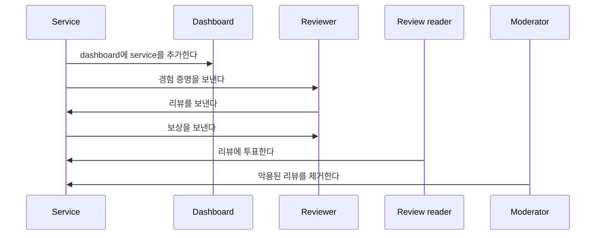

다음 문서는 Sui에서 음식 서비스 산업을 위한 리뷰 평점 플랫폼의 예시 구현을 설명한다.
리뷰를 평가하는 데 사용하는 알고리즘을 공개하지 않는 기존의 리뷰 평점 플랫폼과 달리, 이 예시는 모두가 보고 검증할 수 있도록 온체인에 게시된 알고리즘을 사용한다.
Sui에서 계산에 드는 낮은 가스 비용 덕분에 모든 리뷰를 온체인에 제출하고, 점수를 매기고, 정렬하는 것이 경제적으로 가능하다.

<ImportContent source="prerequisites.mdx" mode="snippet" />

## Personas

Reviews Rating 예시의 일반적인 워크플로에는 네 명의 행위자가 있다.

- Service: 리뷰 요청자.
- Dashboard: 리뷰 허브.
- Reviewer: 리뷰 작성자.
- Moderator: 리뷰 목록 편집자.



### Service owners

Service owners는 플랫폼에 자신의 서비스를 등록하는 restaurant 같은 주체이다.
이들은 자신의 서비스에 대한 고평점 리뷰를 받아 더 많은 고객을 끌어들이고자 한다.

Service owners는 보상 풀로 사용할 특정 양의 SUI를 할당한다.
풀의 자산은 고평점 리뷰에 대한 보상을 제공하는 데 사용된다.
경험 증명 (PoE) NFT는 리뷰어가 서비스를 사용했음을 확인하며, 리뷰어는 나중에 이를 소각해 검증된 리뷰를 제공할 수 있다.
Service owners는 개별 리뷰어를 식별하기 위해 고객에게 고유 식별자(예를 들어 QR 코드 사용)를 제공한다.

### Reviewers

Reviewers는 리뷰 시스템을 사용하는 서비스 소비자이다.
Reviewers는 서비스의 특정 측면을 자세히 설명하는 코멘트와 별점 형태의 피드백을 제공해 다른 사람에게 정보를 전달한다.
리뷰에는 평점이 매겨지며, 가장 효과적인 리뷰가 가장 높은 평점을 받는다.
Service owners는 자신의 서비스에 대한 평점이 가장 높은 리뷰 10개에 보상을 지급한다.
보상을 얼마나 자주 분배할지는 서비스 소유자의 재량에 달려 있으며, 예를 들어 보상은 일주일에 한 번 또는 한 달에 한 번 분배할 수 있다.

### Review readers

Review readers는 서비스 선택에 대해 정보에 기반한 결정을 내리기 위해 리뷰에 접근한다.
Readers는 투표를 던져 리뷰를 평가한다.
Review readers의 평가는 리뷰를 평가하는 알고리즘에 반영되며, 가장 높은 평점을 받은 리뷰의 작성자가 보상을 받는다.
이 가이드의 일부로 구현되지는 않았지만, 이 예시는 리뷰에 투표한 review readers에게 보상의 일부를 지급하도록 확장할 수 있다.

### Moderators

Moderators는 리뷰의 내용을 모니터링하며 부적절한 콘텐츠가 포함된 리뷰를 삭제할 수 있다.

모더레이터를 위한 인센티브 메커니즘은 이 가이드에서 구현하지 않았지만, 서비스 소유자는 모두 순환 방식으로 모더레이터에게 가는 풀에 비용을 낼 수 있다.
사람들은 각 모더레이터가 받는 보상의 비율에 영향을 미치기 위해 모더레이터에게 stake할 수 있으며, 그 한도는 체인에서 validator에게 stake하는 방식과 유사하고 모더레이터의 결정은 stake 가중치의 정족수로 결정된다.
이 과정은 모더레이터가 자신의 일을 잘 수행하도록 인센티브를 부여한다.

## How reviews are scored

리뷰는 온체인에서 다음 기준을 사용해 점수가 매겨진다:

- Intrinsic score (IS): 리뷰 내용의 길이.
- Extrinsic score (ES): 리뷰가 받는 투표 수.
- Verification multiplier (VM): PoE가 있는 리뷰는 평점을 높이기 위한 배수를 받는다.

```
Total Score = (IS + ES) * VM
```

## Smart contracts

이 예시의 backend 로직을 만드는 module은 여러 개이다.

### `dashboard.move`

`dashboard.move` module은 service를 묶는 `Dashboard` struct를 정의한다.

```move
/// Dashboard는 service의 모음이다
public struct Dashboard has key, store {
    id: UID,
    service_type: String
}
```

Service는 요리 유형, 지리적 위치, 운영 시간, Google Maps ID 등의 속성으로 그룹화된다.
기본적인 예시를 유지하기 위해 이 예시는 `service_type`만 저장한다(예를 들어 fast food, Chinese, Italian).

```move
/// 새 dashboard를 생성한다
public fun create_dashboard(
    service_type: String,
    ctx: &mut TxContext,
) {
    let db = Dashboard {
        id: object::new(ctx),
        service_type
    };
    transfer::share_object(db);
}

/// service를 dashboard에 등록한다
public fun register_service(db: &mut Dashboard, service_id: ID) {
    df::add(&mut db.id, service_id, service_id);
}
```

`Dashboard`는 [shared object](/guides/developer/objects/object-ownership/shared.mdx)이므로 어떤 서비스 소유자든 자신의 서비스를 dashboard에 등록할 수 있다.
서비스 소유자는 자신의 서비스 속성과 가장 잘 맞는 dashboard를 찾아 등록해야 한다.
Dynamic field는 dashboard에 등록된 service 목록을 저장한다.
Dynamic fields에 대해 더 알아보려면 [The Move Book](https://move-book.com/programmability/dynamic-fields.html)을 참조한다.
Service는 동시에 여러 dashboard에 등록될 수 있다.
예를 들어 Chinese-Italian fusion restaurant는 Chinese dashboard와 Italian dashboard 둘 다에 등록될 수 있다.

:::info

Object 유형 간 차이에 대한 자세한 내용은 [Object Ownership Basics](/guides/developer/objects/object-ownership)을 참조한다.

:::

### `review.move`

이 module은 `Review` struct를 정의한다.

```move
/// service에 대한 리뷰를 나타낸다
public struct Review has key, store {
    id: UID,
    owner: address,
    service_id: ID,
    content: String,
    // 고유 점수
    len: u64,
    // 외부 점수
    votes: u64,
    time_issued: u64,
    // 경험 증명
    has_poe: bool,
    total_score: u64,
    overall_rate: u8,
}

/// 리뷰의 총점을 업데이트한다
fun update_total_score(rev: &mut Review) {
    rev.total_score = rev.calculate_total_score();
}

/// 리뷰의 총점을 계산한다
fun calculate_total_score(rev: &Review): u64 {
    let mut intrinsic_score: u64 = rev.len;
    intrinsic_score = math::min(intrinsic_score, 150);
    let extrinsic_score: u64 = 10 * rev.votes;
    // VM = 1.0 또는 2.0 중 하나이다(사용자에게 경험 증명이 있으면)
    let vm: u64 = if (rev.has_poe) { 2 } else { 1 };
    (intrinsic_score + extrinsic_score) * vm
}
```

리뷰 내용 외에도 총점을 계산하는 데 필요한 모든 요소가 `Review` object에 저장된다.

`Review`는 [shared object](/guides/developer/objects/object-ownership/shared.mdx)이므로 누구나 리뷰에 투표하고 `total_score` 필드를 업데이트할 수 있다.
`total_score`가 업데이트된 뒤에는 [`update_top_reviews`](#casting-votes) 함수를 호출해 `Service` object의 `top_reviews` 필드를 업데이트할 수 있다.

### `service.move`

이 module은 서비스 소유자가 관리하는 `Service` struct를 정의한다.

```move
const MAX_REVIEWERS_TO_REWARD: u64 = 10;

/// service를 나타낸다
public struct Service has key, store {
    id: UID,
    reward_pool: Balance<SUI>,
    reward: u64,
    top_reviews: vector<ID>,
    reviews: ObjectTable<ID, Review>,
    overall_rate: u64,
    name: String
}
```

#### Reward distribution

상위 리뷰어에게는 같은 금액이 보상으로 지급되며, 보상은 최대 10명에게 분배된다.
리뷰어에게 분배할 `SUI` 토큰 풀은 `reward_pool` 필드에 저장되고 각 참여자에게 지급할 `SUI` 토큰 수량은 `reward` 필드에서 구성한다.

#### Storage for reviews

누구나 service에 리뷰를 제출할 수 있기 때문에 `Service`는 shared object로 정의된다.
모든 리뷰는 `ObjectTable<ID, Review>` 타입을 가진 `reviews` 필드에 저장된다.
`reviews`는 shared object의 자식으로 저장되지만 여전히 각 `ID`로 접근할 수 있다.
`ObjectTable`에 대한 자세한 내용은 The Move Book의 [Dynamic Collections](https://move-book.com/programmability/dynamic-collections.html#objecttable)을 참조한다.

즉 누구나 transaction explorer로 가서 object ID로 리뷰 object를 찾을 수는 있지만, 그 object ID로 리뷰를 transaction 입력으로 사용할 수는 없다.

:::info

`Table`과 `ObjectTable`의 차이에 대한 자세한 내용은 The Move Book의 [Dynamic Collections](https://move-book.com/programmability/dynamic-collections.html)을 참조한다.

:::

가장 높은 평점을 받은 리뷰는 `vector<ID>` 타입인 `top_reviews` 필드에 저장된다.
보상받을 수 있는 리뷰의 최대 수가 10개이기 때문에 단순 vector로 상위 리뷰를 저장할 수 있다.
`top_reviews`의 요소는 리뷰의 `total_score`를 기준으로 정렬되며 가장 높은 평점을 받은 리뷰가 앞에 온다.
Vector는 리뷰의 `ID`를 담고 있으며, 이 `ID`로 관련 `reviews`에서 콘텐츠와 투표 수를 가져올 수 있다.

#### Casting votes

Reader는 다음과 같이 리뷰에 투표해 평점을 매길 수 있다:

```move
/// 리뷰에 추천을 추가하고 top_reviews를 재정렬한다
public fun upvote(service: &mut Service, review_id: ID) {
    let review = &mut service.reviews[review_id];
    review.upvote();
    service.reorder(review_id, review.get_total_score());
}

/// 리뷰가 업데이트된 뒤 top_reviews를 재정렬한다
/// 리뷰가 top_reviews에 없으면 top 10 안에 드는 경우 추가한다
/// 그렇지 않으면 순서를 다시 정렬한다
fun reorder(
    service: &mut Service,
    review_id: ID,
    total_score: u64
) {
    let (contains, idx) = service.top_reviews.index_of(&review_id);
    if (!contains) {
        service.update_top_reviews(review_id, total_score);
    } else {
        service.top_reviews.remove(idx);
        let idx = service.find_idx(total_score);
        service.top_reviews.insert(review_id, idx);
    }
}

/// 필요하면 top_reviews를 업데이트한다
fun update_top_reviews(
    service: &mut Service,
    review_id: ID,
    total_score: u64
) {
    if (service.should_update_top_reviews(total_score)) {
        let idx = service.find_idx(total_score);
        service.top_reviews.insert(review_id, idx);
        service.prune_top_reviews();
    };
}

/// top_reviews에서 리뷰의 인덱스를 찾는다
fun find_idx(service: &Service, total_score: u64): u64 {
    let mut i = service.top_reviews.length();
    while (0 < i) {
        let review_id = service.top_reviews[i - 1];
        if (service.get_total_score(review_id) > total_score) {
            break
        };
        i = i - 1;
    };
    i
}

/// top_reviews가 MAX_REVIEWERS_TO_REWARD를 넘으면 잘라낸다
fun prune_top_reviews(
    service: &mut Service
) {
    let len = service.top_reviews.length();
    if (len > MAX_REVIEWERS_TO_REWARD) {
        service.top_reviews.pop_back();
    };
}
```

누군가 리뷰에 투표할 때마다 리뷰의 `total_score`가 업데이트되고 `update_top_reviews` 함수가 필요에 따라 `top_reviews` 필드를 업데이트한다.
투표를 하면 `top_reviews` 필드의 순서도 다시 정렬되어 가장 높은 평점의 리뷰가 항상 맨 위에 오도록 보장한다.

#### Authorization

```move
/// service에서 admin 작업을 수행하는 데 사용할 수 있는 capability이다
struct AdminCap has key, store {
    id: UID,
    service_id: ID
}

/// 리뷰를 삭제하는 데 사용할 수 있는 모더레이터를 나타낸다
struct Moderator has key {
    id: UID,
}
```

이 예시는 권한 관리를 위해 capabilities pattern을 따른다.
예를 들어 `SERVICE OWNERS`에게는 `AdminCap`을 주고 `MODERATORS`에게는 `Moderator`를 주어 오직 이들만 특권 작업을 수행할 수 있게 한다.
Capabilities pattern에 대해 더 알아보려면 [The Move Book](https://move-book.com/programmability/capability.html)을 참조한다.

## Deployment

Repository의 [setup folder](https://github.com/MystenLabs/reviews-ratings-poc/tree/main/setup)로 이동해 `publish.sh` script를 실행한다.
Smart contract 배포에 대해서는 [README instructions](https://github.com/MystenLabs/reviews-ratings-poc/blob/main/README.md)을 참조한다.

## Frontend

Frontend module은 React로 작성되었으며 리뷰 평점 플랫폼과 상호작용하기 위한 반응형 사용자 경험을 제공하도록 구성되어 있다.
[`page` component](https://github.com/MystenLabs/reviews-ratings-poc/blob/main/app/src/app/page.tsx)는 사용자가 `SERVICE OWNER`, `MODERATOR`, 또는 `REVIEWER`로 로그인하는 것을 지원한다.
이 예시에는 `REVIEW READER` 역할이 구현되어 있지 않지만, `REVIEWER`도 리뷰를 읽고 투표를 던질 수 있다.

### Directories structure

Frontend는 NextJS App Router의 [project structure](https://nextjs.org/docs/app/building-your-application/routing)를 따르는 NextJS project이다.
Frontend의 주요 코드는 [app/src/](https://github.com/MystenLabs/reviews-ratings-poc/blob/main/app/src/app/) 디렉터리에 있다.

주요 하위 디렉터리는 다음과 같다:

- [app/](https://github.com/MystenLabs/reviews-ratings-poc/blob/main/app/src/app/): 페이지의 주요 코드와 전역 스타일.
- [components/](https://github.com/MystenLabs/reviews-ratings-poc/tree/main/app/src/app/components): 하위 디렉터리로 구성된 앱의 재사용 가능한 컴포넌트.
- [hooks/](https://github.com/MystenLabs/reviews-ratings-poc/tree/main/app/src/app/hooks): 앱에서 사용하는 custom hook.
- [moderator/](https://github.com/MystenLabs/reviews-ratings-poc/tree/main/app/src/app/moderator): `MODERATOR`를 위한 페이지.
- [serviceOwner/](https://github.com/MystenLabs/reviews-ratings-poc/tree/main/app/src/app/serviceOwner): `SERVICE OWNER`를 위한 페이지.
- [types/](https://github.com/MystenLabs/reviews-ratings-poc/tree/main/app/src/app/types): 앱에서 사용하는 type/interface.
- [user/](https://github.com/MystenLabs/reviews-ratings-poc/tree/main/app/src/app/user): `REVIEWER`를 위한 페이지.

### Connect button

dApp Kit에는 지갑을 연결하고 연결을 끊는 버튼을 표시하는 `ConnectButton`이라는 사전 구축된 React.js 컴포넌트가 포함되어 있다.
이 컴포넌트는 지갑 연결과 연결 해제 로직을 처리한다.

사용자가 지갑을 연결할 수 있도록 탐색 막대에 `ConnectButton`을 배치한다:

```ts title='src/app/components/navbar/Navbar.tsx'
import { ConnectButton } from '@mysten/dapp-kit-react';
import { usePathname } from 'next/navigation';

import { useAuthentication } from '@/app/hooks/useAuthentication';

export const Navbar = () => {
	const pathname = usePathname();
	console.log(pathname);
	const { user, handleLogout } = useAuthentication();

	return (
		<div
			className="grid grid-cols-12 w-full items-center p-[8px] h-[80px] border-b-gray-400 border-b-[1px] sticky top-0"
			style={{
				background: 'white',
			}}
		>
			<div className="col-span-3 flex space-x-3 items-center">
				<div className="text-red-600 text-2xl font-bold cursor-pointer" onClick={handleLogout}>
					Restaurant Reviews
				</div>
			</div>

			<div className="col-span-6 flex space-x-3 justify-center">
				{pathname !== '/' && (
					<h6 className="mb-4 text-2xl leading-none tracking-tight text-gray-400">
						logged in as{' '}
						<span className="underline underline-offset-3 decoration-8 decoration-blue-400 dark:decoration-blue-600">
							{user.role === 'user' && 'USER'}
							{user.role === 'serviceOwner' && 'SERVICE OWNER'}
							{user.role === 'moderator' && 'MODERATOR'}
						</span>
					</h6>
				)}
			</div>

			<div className="col-span-3 flex justify-end gap-[14px]">
				<ConnectButton />
			</div>
		</div>
	);
};
```

### Type definitions

모든 type 정의는 `src/app/types/`에 있다.

`Review`와 `Service`는 review object와 service object를 나타낸다.

```ts title='src/app/types/Review.ts'
export interface Review {
	id: string;
	owner: string;
	service_id: string;
	content: string;
	len: number;
	votes: number;
	time_issued: number;
	has_poe: boolean;
	total_score: number;
}
```

```ts title='src/app/types/Service.ts'
export interface Service {
	id: string;
	name: string;
	stars: number;
	reward?: number;
	pool?: number;
}
```

### Execute transaction hook

Frontend에서는 여러 위치에서 transaction을 실행해야 할 수 있으므로 transaction 실행 로직을 추출해 어디서나 재사용하는 편이 낫다.
Execute transaction hook을 살펴본다.

```ts title='src/app/hooks/useSignAndExecuteTransaction.ts'
import { Transaction } from '@mysten/sui/transactions';
import { useDAppKit } from '@mysten/dapp-kit-react';
import { toast } from 'react-hot-toast';

export const useSignAndExecuteTransaction = () => {
	const dAppKit = useDAppKit();
	const handleSignAndExecuteTransaction = async (
		tx: Transaction,
		operation: String,
		setIsLoading: any,
	) => {
		try {
			const resp = await dAppKit.signAndExecuteTransaction({
				transaction: tx,
			});
			setIsLoading(false);
			console.log(resp);

			if (resp.$kind === 'Transaction') {
				console.log(`${operation} operation successful`);
				toast.success(`${operation} operation successful`);
				return resp;
			} else {
				console.log(`${operation} operation failed`);
				toast.error(`${operation} operation failed.`);
				return resp;
			}
		} catch (err) {
			setIsLoading(false);
			console.log(`${operation} operation failed`);
			console.log(`${operation} error : `, err);
			toast.error(`Something went wrong, ${operation} operation failed.`);
		}
	};
	return { handleSignAndExecuteTransaction };
};
```

`Transaction`을 입력으로 받아 현재 연결된 지갑 계정으로 서명하고 transaction을 실행한 뒤 실행 결과를 반환하고 마지막으로 transaction의 성공 여부를 나타내는 기본 toast 메시지를 표시한다.

dApp Kit의 `useDAppKit()` hook을 사용해 `DAppKitProvider`에 구성된 Sui client와 지갑 기능에 접근한다.
`signAndExecuteTransaction()` 함수는 현재 연결된 지갑을 사용해 transaction에 서명하고 한 번의 호출로 실행한다.
이 함수는 사용자가 선택한 지갑으로 transaction을 검토하고 서명할 수 있도록 UI를 표시한다.
`react-hot-toast`도 또 다른 의존성으로 사용해 사용자에게 transaction 상태를 toast로 보여준다.

### Components and custom hooks for state management

- Custom hooks: 코드를 가능한 한 구조적으로 유지하기 위해 여러 custom hook을 사용해 service와 연결된 리뷰 목록을 관리한다. [useGetReviews](https://github.com/MystenLabs/reviews-ratings-poc/blob/main/app/src/app/hooks/useGetReviews.ts) custom hook은 service를 캡슐화해 리뷰를 표에 표시하는 데 필요한 모든 정보(`nameOfService`, `listOfReviews`, `listOfStars` 같은 필드 포함)를 노출한다. [useDashboardCreation](https://github.com/MystenLabs/reviews-ratings-poc/blob/main/app/src/app/hooks/useDashboardCreation.ts)과 [useServiceReview](https://github.com/MystenLabs/reviews-ratings-poc/blob/main/app/src/app/hooks/useServiceReview.ts) 같은 여러 추가 custom hook도 자체 상태와 로직을 캡슐화해 코드를 읽기 쉽고 유지보수 가능하게 만든다.

- Component for adding a new review: [AddReview](https://github.com/MystenLabs/reviews-ratings-poc/blob/main/app/src/app/components/review/AddReview.tsx) 컴포넌트는 새 리뷰 생성을 돕기 위해 구현되었다. 이 컴포넌트는 `USER`로부터 리뷰 항목을 수집하기 위해 [servicePage](https://github.com/MystenLabs/reviews-ratings-poc/blob/main/app/src/app/service/[id]/page.tsx)에서 렌더링되며, transaction을 실행하기 위해 `useDAppKit` hook의 `signAndExecuteTransaction` 함수를 사용한다.

- Proof of experience generation: PoE는 고객이 restaurant에서 식사한 뒤 `SERVICE OWNER`가 mint하는 NFT이며, 고객은 나중에 이를 소각해 고평점 리뷰를 작성할 수 있다. NFT mint는 [ownedServicePage](https://github.com/MystenLabs/reviews-ratings-poc/blob/main/app/src/app/serviceOwner/ownedServices/page.tsx) 컴포넌트가 담당한다. 이 컴포넌트는 [useServicePoEGeneration](https://github.com/MystenLabs/reviews-ratings-poc/blob/main/app/src/app/hooks/useServicePoeGeneration.ts) custom hook을 사용한다.

- Delete a review: 모더레이터는 부적절한 콘텐츠가 포함된 리뷰를 삭제할 수 있다. [moderatorRemovePage](https://github.com/MystenLabs/reviews-ratings-poc/blob/main/app/src/app/moderator/remove/[id]/[nft]/page.tsx) 컴포넌트는 리뷰를 삭제하는 데 사용된다.