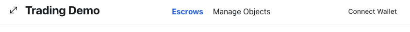
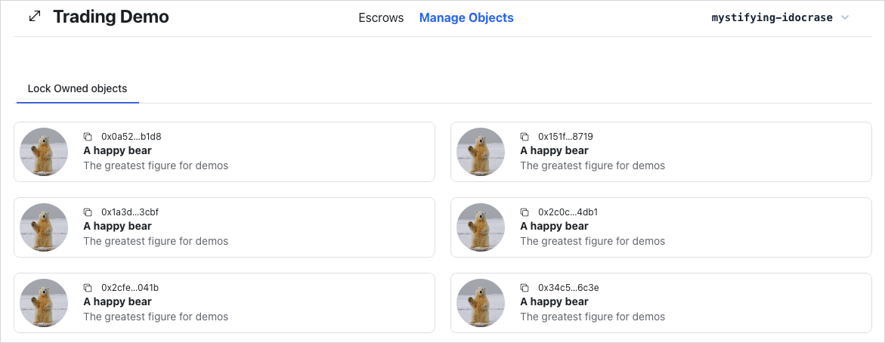
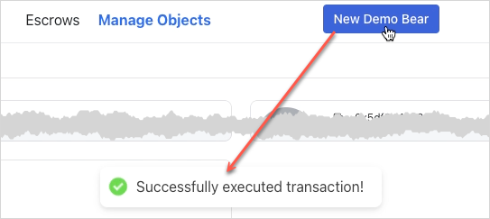
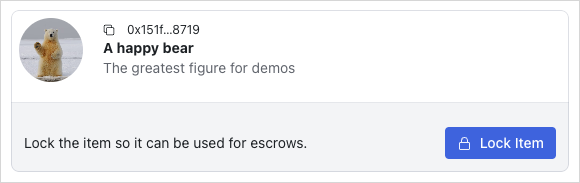
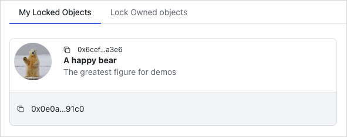
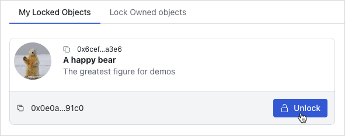
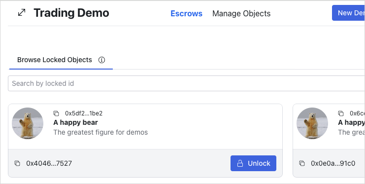
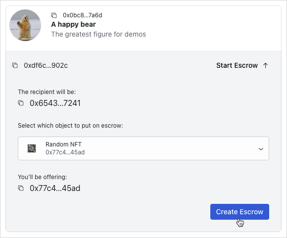
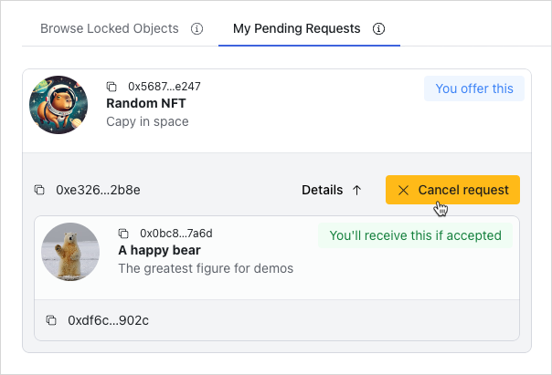
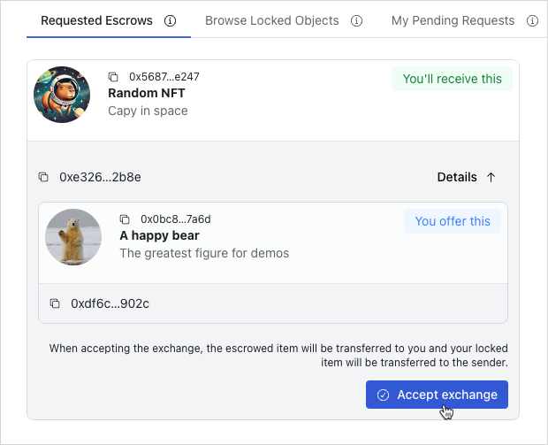

이 가이드는 Sui에서 atomic swap을 수행하는 앱을 만드는 방법을 보여준다.
Atomic swap은 신뢰할 수 있는 third party를 요구하지 않는다는 점에서 escrow와 비슷하다.

이 가이드에는 세 개의 주요 섹션이 있다:

1. [Smart Contracts](#smart-contracts): 상태를 보관하고 swap을 수행하는 Move 코드이다.
1. [Backend](#backend): 거래를 발견하기 위해 chain state를 index하는 서비스와, 이 데이터를 읽기 위한 API 서비스이다.
1. [Frontend](#frontend): 사용자가 판매할 object를 등록하고 거래를 수락할 수 있게 하는 UI이다.

<ImportContent source="prerequisites.mdx" mode="snippet" />

<ImportContent source="app-examples-swap-source.mdx" mode="snippet" />

## What the guide teaches

- **Shared objects:** 이 가이드는 [shared objects](/guides/developer/objects/object-ownership/shared.mdx)를 사용하는 방법을 설명하며, 이 경우에는 거래하려는 두 Sui 사용자 사이의 escrow 역할을 하도록 사용한다. Shared objects는 Sui만의 고유한 개념이다. 어떤 transaction과 어떤 signer든지, 변경 사항이 해당 타입을 정의한 package가 정한 요구 사항을 충족하기만 하면 그것을 수정할 수 있다.
- **Composability:** 이 가이드는 완전한 composability를 가능하게 하는 방식으로 Move 코드를 설계하는 방법을 설명한다. 이 앱에서는 거래를 처리하는 Move 코드가 거래 대상 object를 정의하는 코드에 대해 완전히 알지 못하며, 그 반대도 마찬가지이다.

이 가이드는 또한 다음을 수행하는 앱을 구축하는 방법도 보여준다:

- **Is trustless:** 사용자는 어떤 third party도 신뢰하거나 비용을 지불할 필요가 없으며, chain이 swap을 관리한다.
- **Avoids rug-pulls:** 사용자가 거래를 시작한 뒤 거래 대상으로 원하는 object가 tamper되지 않았음을 보장한다.
- **Preserves liveness:** 다른 당사자가 응답을 멈추더라도 사용자는 언제든 거래에서 빠져나와 자신의 object를 되찾을 수 있다.

## Directory structure

먼저 시스템에 `trading`이라는 새 folder를 만들고 여기에 모든 파일을 넣는다.
그 folder 안에 `api`, `contracts`, `frontend`라는 세 folder를 더 만든다.
이 예시의 일부 helper script는 이 디렉터리 이름을 대상으로 하므로 이 디렉터리 구조를 유지한다.
프로젝트마다 각자의 디렉터리 구조가 있지만, 유지보수를 돕기 위해 코드를 기능별 그룹으로 나누는 것은 흔한 방식이다.

:::checkpoint

- 최신 version의 Sui가 설치되어 있다. terminal 또는 console에서 `sui --version`을 실행하면 현재 설치된 version이 응답되어야 한다.
- 활성 환경이 예상한 network를 가리키고 있다. 이를 확인하려면 `sui client active-env`를 실행한다. client와 server API version 불일치 경고를 받으면 Sui repo의 관련 branch(`mainnet`, `testnet`, `devnet`)에 있는 version으로 Sui를 업데이트한다.
- 활성 address에 SUI가 있다. terminal 또는 console에서 `sui client balance`를 실행한다. 잔액이 없으면 faucet에서 [acquire SUI](/guides/developer/getting-started/get-coins.mdx)한다(Mainnet에서는 사용할 수 없다).
- 생성하는 파일을 둘 디렉터리가 있다. 가이드 후반부에서 제공하는 helper 함수를 사용한다면 제안된 디렉터리 이름이 중요하다.

:::

## Smart contracts {#smart-contracts}

이 가이드의 이 부분에서는 trustless swap을 수행하는 Move contract를 작성한다.
가이드는 package를 처음부터 만드는 방법을 설명하지만, 따라 하기 위해 Sui repo에 있는 예시 코드의 fork나 복사본을 사용해도 된다.
package 구조와 Sui CLI를 사용해 새 프로젝트를 scaffold하는 방법을 더 알아보려면 [Hello, World!](/guides/developer/getting-started/hello-world.mdx)를 참조한다.

### `Move.toml`

smart contract 작성을 시작하려면 `contracts` folder 안에 `escrow` folder를 만든다(권장 디렉터리 이름을 사용하는 경우).
그 folder 안에 `Move.toml`이라는 파일을 만들고 다음 코드를 복사해 넣는다.
이 파일은 package manifest file이다.
파일 구조를 더 알아보려면 The Move Book의 [Package Manifest](https://move-book.com/concepts/manifest.html)를 참조한다.

:::info

Testnet이 아닌 다른 network를 대상으로 한다면 Sui dependency의 `rev` 값을 반드시 업데이트한다.

:::

<ImportContent source="examples/trading/contracts/escrow/Move.toml" mode="code" />

### `Locked` and `Key`

manifest file을 준비했으므로 이제 이 프로젝트의 Move asset을 만들기 시작한다.
`escrow` folder에서 `Move.toml` 파일과 같은 수준에 `sources` folder를 만든다.
이것이 Move package의 일반적인 파일 구조이다.
`sources` 안에 `lock.move`라는 새 파일을 만든다.
이 파일은 거래에 포함되는 object를 잠그는 로직을 담고 있다.
이 파일의 전체 source code는 다음과 같으며, 뒤이어 나오는 섹션들이 각 구성 요소를 자세히 설명한다.

:::tip

codeblock 상단의 제목을 클릭하면 GitHub에서 해당 source file을 열 수 있다.

:::

<details>

<summary>

`lock.move`

</summary>

<ImportContent source="examples/trading/contracts/escrow/sources/lock.move" mode="code" />

</details>

거래가 시작된 뒤에는 거래 당사자가 자신이 거래하기로 한 object를 수정하지 못하게 해야 한다.
예를 들어 게임 내 아이템을 거래한다고 가정할 때, 모든 attachment가 달린 무기를 거래하기로 합의했는데 소유자가 거래 직전에 attachment를 모두 떼어낼 수 있다.

전통적인 거래에서는 보통 third party가 아이템을 escrow로 보관하여 거래가 끝나기 전에 tamper되지 않았는지 확인한다.
이는 그 third party가 스스로 tamper하지 않을 것이라고 신뢰하거나, 그런 일이 일어나지 않도록 비용을 지불하거나, 둘 다 해야 함을 뜻한다.

그러나 trustless swap에서는 Move의 safety 속성을 이용해, 다른 누구도 개입시키지 않고 object 소유자가 거래하기로 한 object version을 tamper하지 않았음을 증명하도록 강제할 수 있다.

이를 위해 거래 가능한 object가 **single-use key**로 **locked**되어 있어야 하도록 요구하고, 거래를 마무리할 때 소유자가 그 key를 제공하도록 한다.

object를 tamper하려면 그것을 unlock해야 하고, 그러면 key가 소비된다.
그 결과 거래를 끝낼 key가 더 이상 남지 않게 된다.

<ImportContent
	source="examples/trading/contracts/escrow/sources/lock.move"
	mode="code"
	struct="Locked,Key"
	noComments
/>

- `Locked<T>` 타입은 그것을 unlock하는 key의 `ID`와 자신의 `id`를 저장한다. 잠기는 object는 [dynamic object field](/guides/developer/objects/dynamic-fields.mdx)로 추가되어, 오프체인에서 여전히 원래 ID로 읽을 수 있다.
- 대응하는 `Key` 타입은 자신의 `id`만 저장한다.

lock과 key는 `lock` 및 `unlock` 함수의 signature를 통해 single-use가 된다.
`lock`은 `T: store` 타입의 어떤 object든 받으며(`store` ability는 이를 `Locked<T>` 안에 저장하기 위해 필요하다), `Locked<T>`와 이에 대응하는 `Key`를 모두 만든다:

<details>

<summary>

`lock.move`의 `lock` 함수

</summary>

<ImportContent
	source="examples/trading/contracts/escrow/sources/lock.move"
	mode="code"
	fun="lock"
	noComments
/>

</details>

`unlock` 함수는 `Locked<T>`와 `Key`를 값으로 받아(즉 둘 다 소비하며), lock에 맞는 올바른 key가 제공된 경우 내부의 `T`를 반환한다:

<details>

<summary>

`lock.move`의 `unlock` 함수

</summary>

<ImportContent
	source="examples/trading/contracts/escrow/sources/lock.move"
	mode="code"
	variable="ELockKeyMismatch"
	noComments
/>

<ImportContent
	source="examples/trading/contracts/escrow/sources/lock.move"
	mode="code"
	fun="unlock"
	noTitle
	noComments
/>

</details>

이 둘은 lock 작업 전에 해당 lock과 key가 존재할 수 없고, unlock이 성공한 뒤에도 더 이상 존재하지 않음을 함께 보장한다.
즉 single use이다.

:::tip Additional resources

- The Move Book에 정의된 [Move Package](https://move-book.com/concepts/packages.html)
- Concepts: [Wrapped Objects](/guides/developer/objects/versioning.mdx#wrapped-objects)

:::

### Testing `Locked` and `Key`

Move의 타입 시스템은 주어진 `Key`를 재사용할 수 없음을 보장한다(`unlock`이 이를 값으로 받기 때문이지만), 일부 속성은 test로 확인할 필요가 있다:

- 잠긴 object는 그 key로 unlock할 수 있어야 한다.
- 잘못된 key로 object를 unlock하려고 하면 실패해야 한다.

test는 object를 만드는 helper 함수로 시작한다.
object 타입은 `store` ability만 있으면 무엇이든 상관없다.
test는 mint를 위한 `#[test_only]` 함수를 제공하므로 `Coin<SUI>`를 사용한다:

<ImportContent
	source="examples/trading/contracts/escrow/sources/lock.move"
	mode="code"
	fun="test_coin"
	noComments
/>

- 모든 test 관련 함수와 import는 게시된 package에 나타나지 않도록 `#[test_only]`로 annotation된다. test를 별도 module(예: `lock_tests.move`)로 분리하고 그 module을 `#[test_only]`로 표시하는 방식으로도 할 수 있다.
- `test_scenario` module은 test에서 `&mut TxContext`에 접근할 수 있도록 사용된다(새 object를 만드는 데 필요하다). 여러 transaction을 시뮬레이션할 필요는 없지만 `TxContext` 접근이 필요한 test는 대신 `sui::tx_context::dummy`를 사용해 test context를 만들 수 있다.

첫 번째 test는 test용 object를 만들고, 그것을 lock한 뒤 unlock하는 방식으로 동작하며, abort 없이 실행이 끝나야 한다.
마지막 두 줄은 test coin과 test scenario object를 정리해 Move compiler가 문제 삼지 않도록 하기 위해 존재하는데, Move의 값은 `drop` ability가 없으면 자동으로 정리되지 않기 때문이다.

<ImportContent
	source="examples/trading/contracts/escrow/sources/lock.move"
	mode="code"
	fun="test_lock_unlock"
	noComments
/>

다른 test는 abort가 발생해야 하는 실패 시나리오를 검증한다.
이 test는 두 개의 locked object를 만들고(이번에는 값이 단순 `u64`이다), 한쪽의 key로 다른 쪽을 unlock하려고 시도하며, 이 시도는 실패해야 한다(`expected_failure` attribute로 지정).

이전 test와 달리 같은 정리 작업은 필요하지 않는데, 코드가 종료될 것으로 예상되기 때문이다.
그 대신 abort가 일어나기를 기대하는 코드 뒤에 또 다른 abort를 추가한다(이 두 번째 abort에는 다른 코드를 사용해야 한다).

<ImportContent
	source="examples/trading/contracts/escrow/sources/lock.move"
	mode="code"
	fun="test_lock_key_mismatch"
	noComments
/>

:::tip Additional resources

- Concepts: [Test Scenario](/guides/developer/getting-started/hello-world.mdx)
- The Move Book에 정의된 [Drop ability](https://move-book.com/move-basics/drop-ability.html)
- The Move Book의 [Testing] Move code discussion

:::

:::checkpoint

이 시점에서 다음을 갖추었다:

- manifest file(`Move.toml`)로 구성된 Move package
- `sources` folder 안의 `lock.move` 파일

`escrow` folder에서 terminal 또는 console에 `sui move test`를 실행한다.
성공하면 다음과 비슷한 응답을 받아 package가 build되고 test가 통과했음을 확인할 수 있다:

```
INCLUDING DEPENDENCY Sui
INCLUDING DEPENDENCY MoveStdlib
BUILDING escrow
Running Move unit tests
[ PASS    ] escrow::lock::test_lock_key_mismatch
[ PASS    ] escrow::lock::test_lock_unlock
Test result: OK. Total tests: 2; passed: 2; failed: 0
```

Move compiler는 build가 성공하면 `escrow` 안에 `build` subfolder를 만든다는 점을 알 수 있다.
이 folder에는 package의 compile된 bytecode, package dependency의 코드, 그리고 build에 필요한 다양한 다른 파일이 들어 있다.
이 시점에서는 이 파일들이 있다는 점만 알고 있으면 된다.
`build`의 내용까지 완전히 이해할 필요는 없다.

:::

### The `Escrow` protocol {#escrow}

`escrow` folder 안에 `shared.move`라는 새 파일을 만든다.
이 파일의 코드는 shared `Escrow` object를 만들고 거래 로직을 완성한다.
이 파일의 전체 source code는 다음과 같으며, 뒤이어 나오는 섹션들이 각 구성 요소를 자세히 설명한다.

<details>

<summary>

`shared.move`

</summary>

<ImportContent
	source="examples/trading/contracts/escrow/sources/shared.move"
	mode="code"
	noComments
/>

</details>

거래는 세 단계로 진행된다:

1. 첫 번째 당사자가 자신이 거래하려는 object를 lock한다. 이는 앞서 작성한 `lock` module이 이미 처리한다.
1. 두 번째 당사자는 자신의 object를 escrow에 올리고 첫 번째 당사자의 object에 대한 관심을 등록한다. 이는 `escrow`라는 새 module이 처리한다.
1. 첫 번째 당사자는 자신의 locked object와 그것을 unlock할 key를 제공해 거래를 완료한다. 모든 검사가 통과하면 자신의 object는 두 번째 당사자에게 전송되고, 두 번째 당사자의 object는 자신이 받을 수 있게 된다.

두 번째와 세 번째 단계를 구현하는 것부터 시작할 수 있으며, 이를 위해 escrow된 object를 보관할 새 타입을 정의한다.
이 타입은 `escrowed` object와 `id: UID`를 보관하고(그 자체로도 object이기 때문), 거래가 일어날 때 일치하는지 확인하기 위해 `sender`와 의도된 `recipient`도 기록하며, object를 담고 있는 `Locked<U>`를 unlock하는 key의 `ID`를 기록해 첫 번째 당사자의 object에 대한 관심을 등록한다.

<ImportContent
	source="examples/trading/contracts/escrow/sources/shared.move"
	mode="code"
	struct="Escrow"
	noComments
	singleSpace
/>

또한 `Escrow` object를 만드는 함수도 만들어야 한다.
이 object는 이를 만든 address가(해당 object를 반환해야 할 경우를 대비해) 접근할 수 있어야 하고, 의도된 recipient도 swap을 완료하기 위해 접근해야 하므로 shared object이다.

<details>

<summary>

`shared.move`의 `create` 함수

</summary>

<ImportContent
	source="examples/trading/contracts/escrow/sources/shared.move"
	mode="code"
	tag="noemit"
	noComments
/>

</details>

두 번째 당사자가 응답을 멈추면 첫 번째 당사자는 자신의 object를 unlock할 수 있다.
대칭적인 경우에 두 번째 당사자도 자신의 object를 회수할 수 있도록 하는 함수를 만들어야 한다.

- `Escrow` object는 shared object라 누구나 접근할 수 있으므로 caller가 `sender`와 일치하는지 확인해야 한다.
- escrow된 object를 꺼낸 뒤 정리할 수 있도록 `Escrow`를 값으로 받으며, 이를 통해 sender의 storage rebate를 회수하고 chain에 남는 사용되지 않는 object를 정리할 수 있다.

<details>

<summary>

`shared.move`의 `return_to_sender` 함수

</summary>

<ImportContent
	source="examples/trading/contracts/escrow/sources/shared.move"
	mode="code"
	fun="return_to_sender"
	noComments
/>

</details>

마지막으로 첫 번째 당사자가 거래를 완료할 수 있도록 하는 함수도 추가해야 한다.

- 이 함수 또한 swap이 완료된 뒤 `Escrow`를 소비하므로 값을 받아들인다.
- transaction sender가 의도된 recipient(첫 번째 당사자)인지, 그리고 그가 제공한 key의 ID가 object가 escrow될 때 지정된 key와 일치하는지를 확인한다. 이는 tampering이 일어나지 않았음을 보장하는데, 이 key는 object를 unlock하는 데 사용되지 않았을 때만 제공할 수 있고, 그것은 `create` 호출과 `swap` 호출 사이에 object가 `Locked<U>`를 벗어나지 않았음을 증명하기 때문이다. `lock` module을 살펴보면 সেখানে 있는 동안 object가 수정될 수 없음을 확인할 수 있다.
- `unlock` 호출은 제공된 key가 전달된 locked object와 일치하는지도 추가로 확인한다.
- escrow된 object를 recipient address로 전송하는 대신 `swap` 함수가 반환한다. transaction sender가 recipient라는 점을 이미 확인했기 때문에 이렇게 할 수 있고, 이 방식이 API를 더 composable하게 만든다. Programmable transaction block(PTB)은 object를 받은 직후 전송할지 아니면 다른 작업을 할지를 결정하는 유연성을 제공한다.

<details>

<summary>

`shared.move`의 `swap` 함수

</summary>

<ImportContent
	source="examples/trading/contracts/escrow/sources/shared.move"
	mode="code"
	variable="EMismatchedSenderRecipient,EMismatchedExchangeObject"
	singleSpace
	noComments
/>

<ImportContent
	source="examples/trading/contracts/escrow/sources/shared.move"
	mode="code"
	fun="swap"
	noComments
	noTitle
/>

</details>

:::tip Additional resources

- [Full source code](https://github.com/MystenLabs/sui/blob/705ee1ed3ce8cfadc4597c6facb6769d7dfb5896/examples/trading/contracts/escrow/sources/shared.move)
- Concepts: [Shared Objects](/guides/developer/objects/object-ownership/shared)
- Concepts: [Shared Object Deletion](https://blog.sui.io/ephemeral-shared-objects/)
- Concepts: [PTBs](/guides/developer/transactions/ptbs/prog-txn-blocks)

:::

### Testing

`escrow` module에 대한 test는 `lock`보다 더 복잡한데, 서로 다른 sender의 여러 transaction을 시뮬레이션하고 shared objects와 상호작용할 수 있는 `test_scenario` 기능을 활용하기 때문이다.

이 가이드는 성공적인 swap에 대한 test에 집중하지만, 나머지 모든 test도 뒤에서 링크로 확인할 수 있다.

lock test와 마찬가지로 test coin을 mint하는 함수부터 만든다.
또한 transaction sender를 나타내는 상수 `ALICE`, `BOB`, `DIANE`도 만든다.

<ImportContent
	source="examples/trading/contracts/escrow/sources/shared.move"
	mode="code"
	fun="test_coin"
	noComments
/>

test 본문은 `test_scenario::begin` 호출로 시작해서 `test_scenario::end` 호출로 끝난다.
각 새 transaction의 시작에서 `ALICE` 또는 `BOB` 중 하나를 선택하므로 `begin`에 어떤 address를 넘기든 상관없고, 따라서 `@0x0`으로 설정한다:

<ImportContent
	source="examples/trading/contracts/escrow/sources/shared.move"
	mode="code"
	tag="test"
/>

첫 번째 transaction은 `BOB`가 coin을 만들고 그것을 lock하는 것이다.
나중에 필요하므로 coin의 ID와 key의 ID를 기억해 두어야 한다.
그런 다음 locked object와 key 자체를 `BOB`에게 전송하는데, 이는 실제 transaction에서 일어날 일과 같다.
test에서 transaction을 시뮬레이션할 때는 chain에 transaction 사이로 기록되어야 하는 전체 object가 아니라 primitive value만 유지해야 한다.

이 transaction들을 `test_successful_swap` 함수 안의 `begin`과 `end` 호출 사이에 작성한다.

<ImportContent
	source="examples/trading/contracts/escrow/sources/shared.move"
	mode="code"
	variable="i2"
	noComments
/>

다음으로 `ALICE`가 와서 `Escrow`를 설정하며, 이때 자신의 coin을 lock한다.
그들은 `BOB`의 key ID인 `ik2`를 참조하여 `BOB`의 coin에 대한 관심을 등록한다:

<ImportContent
	source="examples/trading/contracts/escrow/sources/shared.move"
	mode="code"
	variable="i1"
	noComments
/>

마지막으로 `BOB`가 `swap`을 호출해 거래를 완료한다.
`take_shared` 함수는 shared 입력을 받는 상황을 시뮬레이션하는 데 사용된다.
타입 추론을 사용해 이 object가 `Escrow`여야 함을 알아내고, 직전 transaction에서 `ALICE`가 공유한 이 타입의 마지막 object를 찾는다.
마찬가지로 소유 입력을 받는 상황을 시뮬레이션하기 위해 `take_from_sender`를 사용하며(이 경우 `BOB`의 lock과 key), `swap`이 반환한 coin은 PTB 일부로 호출된 것처럼 transfer 명령 뒤에 따라오는 방식으로 다시 `BOB`에게 전송된다.

<ImportContent
	source="examples/trading/contracts/escrow/sources/shared.move"
	mode="code"
	tag="bob"
	noComments
/>

나머지 test는 `ALICE`가 `BOB`의 coin을 가지며 그 반대도 성립하는지를 확인하도록 설계되어 있다.
필요한 확인을 수행하기 전에 이전 transaction의 effects가 commit되었는지 보장하기 위해 `next_tx`를 먼저 호출한다.

<ImportContent
	source="examples/trading/contracts/escrow/sources/shared.move"
	mode="code"
	tag="finish"
	noComments
/>

:::tip Additional resources

- Guides: [Test Scenario](../../../guides/developer/getting-started/hello-world)

:::

### Observability

이제 `escrow` Move package는 기능적으로 동작한다.
이를 chain에 publish하고 transaction을 만들어 trustless swap을 수행할 수 있다.
이 transaction을 만들려면 `Locked`, `Key`, `Escrow` object의 ID를 알아야 한다.

`Locked`와 `Key` object는 보통 transaction sender가 소유하므로 Sui RPC를 통해 조회할 수 있지만, `Escrow` object는 shared object이므로 sender와 recipient 기준으로 조회할 수 있으면 유용하다(그래야 사용자가 자신이 제안한 거래와 받은 거래를 볼 수 있다).

sender나 recipient 기준으로 `Escrow` object를 조회하려면 custom indexing이 필요하며, indexer가 관련 transaction을 쉽게 식별할 수 있도록 `escrow.move`에 다음 **events**를 추가한다:

<ImportContent
	source="examples/trading/contracts/escrow/sources/shared.move"
	mode="code"
	struct="EscrowCreated,EscrowSwapped,EscrowCancelled"
	noComments
/>

escrow 생명주기의 여러 부분을 담당하는 함수들이 이 이벤트를 발생시킨다.
그러면 custom indexer는 전체 chain state가 아니라 이 이벤트를 내보내는 transaction만 구독해 처리할 수 있다:

<details>

<summary>

`shared.move` 함수에 포함된 `emit` 이벤트

</summary>

<ImportContent
	source="examples/trading/contracts/escrow/sources/shared.move"
	mode="code"
	dep="sui::event"
/>

<ImportContent
	source="examples/trading/contracts/escrow/sources/shared.move"
	mode="code"
	fun="create,swap,return_to_sender"
	noTitle
	noComments
/>

</details>

:::tip Additional resources

- Concepts: [Events in The Move Book](https://move-book.com/programmability/events.html)
- Guide: [Using Events](/guides/developer/accessing-data/using-events.mdx)

:::

:::checkpoint

이제 `sources` folder 안에 `shared.move`와 `lock.move` 파일이 있다.
상위 `escrow` folder에서 terminal 또는 console에 `sui move test`를 실행한다.
성공하면 다음과 비슷한 응답을 받아 package가 build되고 test가 통과했음을 확인할 수 있다:

```
INCLUDING DEPENDENCY Sui
INCLUDING DEPENDENCY MoveStdlib
BUILDING escrow
Running Move unit tests
[ PASS    ] escrow::lock::test_lock_key_mismatch
[ PASS    ] escrow::shared::test_mismatch_object
[ PASS    ] escrow::lock::test_lock_unlock
[ PASS    ] escrow::shared::test_mismatch_sender
[ PASS    ] escrow::shared::test_object_tamper
[ PASS    ] escrow::shared::test_return_to_sender
[ PASS    ] escrow::shared::test_return_to_sender_failed_swap
[ PASS    ] escrow::shared::test_successful_swap
Test result: OK. Total tests: 8; passed: 8; failed: 0
```

:::

### Next steps

Move package를 작성했다. 🎉

이를 완전한 앱으로 만들려면 frontend를 만들어야 한다.
그러나 frontend가 업데이트되려면 escrows가 생성되고 swaps가 이행될 때 블록체인을 listen해야 한다.

이를 위해 다음 단계에서 indexing 서비스를 만든다.

## Backend indexer {#backend}

이제 contract가 events를 내보내도록 조정되었으므로, 모든 활성 `Escrow` object를 추적하고 sender나 recipient 기준으로 object를 조회하는 API를 노출하는 indexer를 작성할 수 있다.

indexer는 다음 schema를 가진 Prisma DB를 기반으로 한다:

<details>

<summary>

`schema.prisma`

</summary>

<ImportContent source="examples/trading/api/prisma/schema.prisma" mode="code" />

</details>

indexer의 핵심은 `setupListeners`라는 함수에서 초기화되는 event loop이다.

<ImportContent source="examples/trading/api/indexer.ts" mode="code" />

indexer는 `escrow` module과 관련된 이벤트를 `queryEvent` filter로 조회하고, 이미 처리한 최신 이벤트를 나타내는 cursor를 추적하여 재시작되더라도 올바른 위치에서 indexing을 이어갈 수 있다.
이 filter는 Move package의 `escrow` module에서 나온 타입의 이벤트를 찾는다(아래에 나오는 `event-indexer.ts` 코드를 참조한다).

핵심 event job은 polling 방식으로 동작한다.
최신 cursor 다음의 이벤트를 RPC에서 조회해 callback으로 보내 처리한다.
새 이벤트가 한 페이지보다 많다고 감지되면 즉시 다음 페이지를 요청한다.
그렇지 않으면 다음 polling interval이 올 때까지 기다렸다가 다시 확인한다.

<details>

<summary>

`event-indexer.ts`

</summary>

<ImportContent source="examples/trading/api/indexer/event-indexer.ts" mode="code" />

</details>

callback은 event를 읽고 그에 맞게 database를 업데이트하는 책임을 가진다.
데모 목적상 SQLite를 사용하므로 escrow된 각 object마다 database에 별도의 `UPSERT`를 실행해야 한다.
그러나 production 환경에서는 데이터 흐름을 최적화하기 위해 database 요청을 배치 처리하는 편이 바람직하다.

<details>

<summary>

`escrow-handler.ts`

</summary>

<ImportContent source="examples/trading/api/indexer/escrow-handler.ts" mode="code" />

</details>

:::tip Additional resources

- [Full source code](https://github.com/MystenLabs/sui/tree/705ee1ed3ce8cfadc4597c6facb6769d7dfb5896/examples/trading/api)
- Reference: [JSON-RPC](https://docs.sui.io/sui-api-ref)

:::

### API service

indexer가 수집한 데이터는 frontend가 읽을 수 있도록 API로 제공할 수 있다.
다음 절을 따라 TypeScript로 Node 위에서 실행되는 Express 기반 API를 구현한다.

#### Query parameters

API가 URL의 query string을 database `WHERE` query의 parameter로 받아들이기를 원한다.
따라서 URL query string을 추출해 Prisma에 유효한 query parameter로 파싱하는 utility가 필요하다.
`parseWhereStatement()` 함수는 caller가 URL query string에서 key 집합을 필터링하고, 해당 key-value 쌍을 Prisma가 이해하는 올바른 형식으로 변환할 수 있게 해준다.

<details>

<summary>

`api-queries.ts`의 `parseWhereStatement`

</summary>

<ImportContent
	source="examples/trading/api/utils/api-queries.ts"
	mode="code"
	enumeration="WhereParamTypes"
/>

<ImportContent
	source="examples/trading/api/utils/api-queries.ts"
	mode="code"
	type="WhereParam"
	noTitle
/>

<ImportContent
	source="examples/trading/api/utils/api-queries.ts"
	mode="code"
	variable="parseWhereStatement"
	noTitle
/>

</details>

#### Query pagination

pagination은 API가 모든 데이터를 한꺼번에 반환하지 않고 충분하고 정렬된 chunk를 반환하도록 하기 위한 또 다른 핵심 요소이며, 이는 DDOS attack 벡터가 될 수 있는 문제를 방지한다.
`WHERE` parameter와 마찬가지로 URL query string에서 유효한 pagination parameter로 받아들일 key 집합을 정의한다.
`parsePaginationForQuery()` utility 함수는 미리 정한 key인 `sort`, `limit`, `cursor`를 필터링하고 해당 key-value 쌍을 Prisma가 소비할 수 있는 `ApiPagination`으로 파싱해 이를 돕는다.

이 예시에서는 후속 query가 다음 페이지를 이어서 가져올 수 있도록 database model의 `id` field를 cursor로 사용한다.

<details>

<summary>

`api-queries.ts`의 `parsePaginationForQuery`

</summary>

<ImportContent
	source="examples/trading/api/utils/api-queries.ts"
	mode="code"
	type="ApiPagination"
/>

<ImportContent
	source="examples/trading/api/utils/api-queries.ts"
	mode="code"
	variable="parsePaginationForQuery"
	noTitle
/>

</details>

#### API endpoints

모든 endpoint는 `server.ts`에 정의되어 있다.
endpoint는 두 개이다:

- `Locked` object를 조회하는 `/locked`.
  유효한 query key: - `deleted`: Boolean - `creator`: String - `keyId`: String - `objectId`: String

- `Escrow` object를 조회하는 `/escrows`.
  유효한 query key: - `cancelled`: Boolean - `swapped`: Boolean - `recipient`: String - `sender`: String

URL query string을 미리 정의한 utility에 전달해 Prisma가 사용할 수 있는 올바른 parameter를 출력한다.

<details>

<summary>

`server.ts`

</summary>

<ImportContent source="examples/trading/api/server.ts" mode="code" />

</details>

### Deployment {#deployment}

이제 indexer와 API 서비스가 준비되었으므로 move package를 배포하고 indexer와 API 서비스를 시작할 수 있다.

1. `pnpm install --ignore-workspace` 또는 `yarn install --ignore-workspace`를 실행해 dependency를 설치한다.

2. `pnpm db:setup:dev` 또는 `yarn db:setup:dev`를 실행해 database를 설정한다.

3. Sui package를 배포한다

<details>

<summary>

배포 지침

</summary>

<ImportContent source="initialize-sui-client-cli.mdx" mode="snippet" />

다음으로 Sui CLI가 활성 환경으로 `testnet`을 사용하도록 구성한다.

사용 가능한 환경 목록을 보려면 다음 명령을 사용한다:

```sh
$ sui client envs
```

아직 `testnet` 환경을 설정하지 않았다면 terminal 또는 console에서 다음 명령을 실행한다:

```sh
$ sui client new-env --alias testnet --rpc https://fullnode.testnet.sui.io:443
```

다음 명령을 실행해 `testnet` 환경을 활성화한다:

```sh
$ sui client switch --env testnet
```

package를 Testnet에 publish하려면 먼저 Testnet SUI token이 필요하다.
이를 받으려면 다음 명령을 실행한다:

```sh
$ sui client faucet
```

Testnet account에서 SUI를 얻는 다른 방법은 [Get SUI Tokens](/guides/developer/getting-started/get-coins)를 참조한다.

이제 Testnet SUI가 들어 있는 account가 있으므로 contract를 배포할 수 있다.

Testnet에서 데모 데이터를 만들 수 있도록 smart contract를 publish하는 helper 함수가 몇 가지 있다.
smart contract를 publish하는 helper 함수는 `escrow`와 `demo` 디렉터리 양쪽 모두에 build된 smart contract가 있기를 기대한다.
필요하다면 두 디렉터리에서 모두 `sui move build`를 실행한다.
환경에 맞는 올바른 source를 가리키도록 manifest의 Sui dependency를 반드시 업데이트한다.

smart contract를 publish하고 demo 데이터를 생성하려면:

1. `api` folder에서 다음 명령을 실행해 smart contract를 publish한다:

```sh
$ npx ts-node helpers/publish-contracts.ts
```

성공하면 backend 루트 디렉터리에 `demo-contract.json`과 `escrow-contract.json`이 생성된다.
이 파일들은 contract address를 포함하며 backend와 frontend가 contract와 상호작용하는 데 사용된다.

2. 잠기지 않은 demo object와 locked demo object를 생성한다

```sh
$ npx ts-node helpers/create-demo-data.ts
```

3. demo escrow를 생성한다

```sh
$ npx ts-node helpers/create-demo-escrows.ts
```

database를 초기화하고 싶다면(예: 깨끗한 데모를 위해) `pnpm db:reset:dev && pnpm db:setup:dev` 또는 `yarn db:reset:dev && yarn db:setup:dev`를 실행한다.

</details>

4. `pnpm dev` 또는 `yarn dev`를 실행해 API와 indexer를 모두 실행한다.

5. [http://localhost:3000/escrows](http://localhost:3000/escrows) 또는 [http://localhost:3000/locked](http://localhost:3000/locked)에 접속한다

:::checkpoint

이제 indexer가 실행 중이어야 한다.

- `localhost:3000`에 접속하면 서비스가 실행 중이라는 메시지 `{"message":"🚀 API is functional 🚀"}`를 받는다.
- `localhost:3000/escrows`에 접속하면 helper script가 만들어 둔 demo escrow 데이터를 볼 수 있다. 마찬가지로 `http://localhost:3000/locked`에 접속하면 script가 demo object용으로 만든 raw JSON이 표시된다.

:::

### Next steps

코드가 Testnet에 성공적으로 배포되었으므로 이제 trading 데이터를 표시하고 사용자가 Move module과 상호작용할 수 있게 하는 [create a frontend](#frontend)를 만들 수 있다.

## Frontend {#frontend}

앱 예시의 마지막 부분에서는 최종 사용자가 거래를 발견하고 등록된 escrow와 상호작용할 수 있는 frontend(UI)를 구축한다.

<Tabs className="tabsHeadingCentered--small">
<TabItem value="prereq" label="Prerequisites">

- [x] [Install the latest version of Sui](/guides/developer/getting-started/sui-install).

- [x] [Complete the smart contracts](#smart-contracts)하고 그 설계를 이해한다.

- [x] 온체인 데이터를 index하고 API를 통해 노출하는 방법을 배우기 위해 [Implement the backend](#backend)를 완료한다.

- [x] [Deploy your smart contracts and started the backend indexer](#deployment).

- [x] package manager로 사용할 [`pnpm`](https://pnpm.io/installation) 또는 [`yarn`](https://classic.yarnpkg.com/lang/en/docs/install/#mac-stable)을 설치한다.

</TabItem>
</Tabs>

<ImportContent source="app-examples-swap-source.mdx" mode="snippet" />

:::tip Additional resources

- TypeScript로 Sui와 상호작용하는 기본 사용법은 [Sui TypeScript SDK](https://sdk.mystenlabs.com/typescript)를 참조한다.
- React.js와 함께 Sui ecosystem에서 앱을 개발하기 위한 기본 building block을 배우려면 [Sui dApp Kit](https://sdk.mystenlabs.com/dapp-kit)를 참조한다.
- 이 프로젝트 안에서 React 기반 Sui 앱을 빠르게 scaffold하기 위해 사용되는 [`@mysten/dapp`](https://sdk.mystenlabs.com/dapp-kit/create-dapp)를 참조한다.

:::

### Overview

UI 디자인은 세 부분으로 구성된다:

- 사용자가 지갑을 연결하고 다른 페이지로 이동할 수 있게 하는 버튼을 포함한 header
- 사용자가 escrow 거래를 준비할 수 있도록 자신이 소유한 object를 관리하는 `Manage Objects` 영역
- 사용자가 거래를 발견하고 만들고 실행할 수 있도록 하는 `Escrows` 영역

### Scaffold a new app

첫 번째 단계는 client app을 설정하는 것이다.
`frontend` folder에서 다음 명령을 실행해 새 앱을 scaffold한다.

<Tabs groupId="packagemanager">

<TabItem label="PNPM" value="pnpm">

```sh
$ pnpm create @mysten/dapp --template react-client-dapp
```

</TabItem>

<TabItem label="Yarn" value="yarn">

```sh
$ yarn create @mysten/dapp --template react-client-dapp
```

</TabItem>

</Tabs>

앱 이름을 물으면 원하는 이름을 제공한다.
앱 scaffold는 제공한 이름의 새 디렉터리에 생성된다.
이 방식은 이미 이 folder를 채우고 있을 수 있는 예시 source code와 작업 코드를 분리하는 데 편리하다.
이후 나오는 codeblock은 기본 예시 위치의 코드를 가리킨다.
자신의 코드는 제공한 앱 이름이 포함된 경로를 갖는다는 점을 염두에 둔다.

### Setting up import aliases

먼저 import alias를 설정해 코드를 더 읽기 쉽고 유지보수하기 쉽게 만든다.
이렇게 하면 상대 경로 대신 `@/`를 사용해 파일을 import할 수 있다.

<details>

<summary>

`tsconfig.json`의 내용을 다음과 같이 교체한다:

</summary>

<ImportContent source="examples/trading/frontend/tsconfig.json" mode="code" />

</details>

`compilerOptions` 아래의 paths 옵션이 TypeScript aliasing을 정의한다.
여기서는 alias `@/*`를 `./src/*` 디렉터리에 매핑하므로, `@/`를 사용할 때마다 TypeScript는 이를 `src` folder를 가리키는 참조로 해석한다.
이 설정은 project에서 파일을 import할 때 긴 상대 경로를 줄여 준다.

<details>

<summary>

`vite.config.ts`의 내용을 다음과 같이 교체한다:

</summary>

<ImportContent source="examples/trading/frontend/vite.config.ts" mode="code" />

</details>

Vite도 build 과정에서 import를 올바르게 resolve하려면 aliasing을 알고 있어야 한다.
`vite.config.ts`의 `resolve.alias` 설정에서 alias `@`를 `/src` 디렉터리에 매핑한다.

### Adding Tailwind CSS

스타일링 과정을 단순화하고 codebase를 깔끔하고 유지보수하기 쉽게 유지하기 위해 이 가이드는 utility-first CSS class를 제공해 custom design을 빠르게 구축할 수 있게 해주는 Tailwind CSS를 사용한다.
앱 project의 루트에서 다음 명령을 실행해 Tailwind CSS와 dependency를 추가한다:

<Tabs groupId="packagemanager">
<TabItem label="PNPM" value="pnpm">

```sh
$ pnpm add tailwindcss@latest postcss@latest autoprefixer@latest
```

</TabItem>
<TabItem label="Yarn" value="yarn">

```sh
$ yarn add tailwindcss@latest postcss@latest autoprefixer@latest
```

</TabItem>
</Tabs>

다음으로 다음 명령을 실행해 Tailwind CSS configuration file을 생성한다:

```sh
$ npx tailwindcss init -p
```

<details>

<summary>

`tailwind.config.js`의 내용을 다음과 같이 교체한다:

</summary>

<ImportContent source="examples/trading/frontend/tailwind.config.js" mode="code" />

</details>

<details>

<summary>

`src/styles/` 디렉터리를 추가하고 `base.css`를 넣는다:

</summary>

<ImportContent source="examples/trading/frontend/src/styles/base.css" mode="code" />

</details>

### Connecting your deployed package

먼저 [scripts in the api directory](#deployment)를 통해 package를 배포한다.

<details>

<summary>

그런 다음 `src/constants.ts` 파일을 만들고 다음 내용을 채운다:

</summary>

<ImportContent source="examples/trading/frontend/src/constants.ts" mode="code" />

</details>

:::warning

project 이름을 사용해 앱을 만들었고 그래서 `src` 파일이 `frontend`의 하위 folder 안에 있다면 import 문에 한 단계 더 nesting된(`../`) 경로를 추가해야 한다.

:::

### Add helper functions and UI components

<details>

<summary>

`src/utils/` 디렉터리를 만들고 다음 파일을 추가한다:

</summary>

<ImportContent source="examples/trading/frontend/src/utils/helpers.ts" mode="code" />

</details>

`src/components/` 디렉터리를 만들고 다음 component들을 추가한다:

<details>

<summary>

`ExplorerLink.tsx`

</summary>

<ImportContent source="examples/trading/frontend/src/components/ExplorerLink.tsx" mode="code" />

</details>

<details>

<summary>

`InfiniteScrollArea.tsx`

</summary>

<ImportContent
	source="examples/trading/frontend/src/components/InfiniteScrollArea.tsx"
	mode="code"
/>

</details>

<details>

<summary>

`Loading.tsx`

</summary>

<ImportContent source="examples/trading/frontend/src/components/Loading.tsx" mode="code" />

</details>

<details>

<summary>

`SuiObjectDisplay.tsx`

</summary>

<ImportContent source="examples/trading/frontend/src/components/SuiObjectDisplay.tsx" mode="code" />

</details>

필요한 dependency를 설치한다:

<Tabs groupId="packagemanager">
<TabItem label="PNPM" value="pnpm">

```sh
$ pnpm add react-hot-toast
```

</TabItem>
<TabItem label="Yarn" value="yarn">

```sh
$ yarn add react-hot-toast
```

</TabItem>
</Tabs>

### Set up routing {#routing}

import한 template에는 페이지가 하나뿐이다.
더 많은 페이지를 추가하려면 routing을 설정해야 한다.

먼저 필요한 dependency를 설치한다:

<Tabs groupId="packagemanager">
<TabItem label="PNPM" value="pnpm">

```sh
$ pnpm add react-router-dom
```

</TabItem>
<TabItem label="Yarn" value="yarn">

```sh
$ yarn add react-router-dom
```

</TabItem>
</Tabs>

<details>

<summary>

그런 다음 `src/routes/` 디렉터리를 만들고 `index.tsx`를 추가한다. 이 파일은 routing 구성을 담고 있다:

</summary>

<ImportContent source="examples/trading/frontend/src/routes/index.tsx" mode="code" />

</details>

`src/routes/` 디렉터리에 다음 파일들을 각각 추가한다:

<details>

<summary>

`root.tsx`. 이 파일은 모든 페이지에서 렌더링되는 root component를 담고 있다:

</summary>

<ImportContent source="examples/trading/frontend/src/routes/root.tsx" mode="code" />

</details>

<details>

<summary>

`LockedDashboard.tsx`. 이 파일은 `Manage Objects` 페이지용 component를 담고 있다.

</summary>

```tsx
export function LockedDashboard() {
	return (
		<div>
			<h1>Locked Dashboard</h1>
		</div>
	);
}
```

</details>

<details>

<summary>

`EscrowDashboard.tsx`. 이 파일은 `Escrows` 페이지용 component를 담고 있다.

</summary>

```tsx
export function EscrowDashboard() {
	return (
		<div>
			<h1>Escrow Dashboard</h1>
		</div>
	);
}
```

</details>

<details>

<summary>

`src/main.tsx`에서 `App` component를 `RouterProvider`로 교체하고 `Theme` component의 `"dark"`를 `"light"`로 바꿔 업데이트한다:

</summary>

<ImportContent source="examples/trading/frontend/src/main.tsx" mode="code" />

</details>

dApp Kit은 Sui 블록체인에 query 및 mutation 호출을 수행하기 위한 hook 집합을 제공한다.
이 hook들은 `@tanstack/react-query`의 query 및 mutation hook 위에 놓인 얇은 wrapper이다.

:::tip Additional resources

- Docs: 웹사이트에서 서로 다른 route로 이동하는 데 사용하는 [React Router](https://reactrouter.com/en/main)
- Docs: [TanStack Query](https://tanstack.com/query/latest/docs/framework/react/overview)

:::

<details>

<summary>

`src/components/Header.tsx`를 만든다. 이 파일은 navigation link와 connect wallet button을 담고 있다:

</summary>

```tsx
import { ConnectButton } from '@mysten/dapp-kit-react';
import { SizeIcon } from '@radix-ui/react-icons';
import { Box, Container, Flex, Heading } from '@radix-ui/themes';
import { NavLink } from 'react-router-dom';

const menu = [
	{
		title: 'Escrows',
		link: '/escrows',
	},
	{
		title: 'Manage Objects',
		link: '/locked',
	},
];

export function Header() {
	return (
		<Container>
			<Flex position="sticky" px="4" py="2" justify="between" className="border-b flex flex-wrap">
				<Box>
					<Heading className="flex items-center gap-3">
						<SizeIcon width={24} height={24} />
						Trading Demo
					</Heading>
				</Box>

				<Box className="flex gap-5 items-center">
					{menu.map((item) => (
						<NavLink
							key={item.link}
							to={item.link}
							className={({ isActive, isPending }) =>
								`cursor-pointer flex items-center gap-2 ${
									isPending ? 'pending' : isActive ? 'font-bold text-blue-600' : ''
								}`
							}
						>
							{item.title}
						</NavLink>
					))}
				</Box>

				<Box className="connect-wallet-wrapper">
					<ConnectButton />
				</Box>
			</Flex>
		</Container>
	);
}
```

</details>

dApp Kit에는 지갑 연결과 연결 해제를 위한 버튼을 표시하는 미리 만들어진 React.js component인 `ConnectButton`이 들어 있다.
지갑 연결과 연결 해제 로직은 매끄럽게 처리되므로 같은 로직을 곳곳에 반복해 작성할 필요가 없다.

:::checkpoint

이 시점에서 기본 routing 구성이 준비되어야 한다.
앱을 실행하고 다음이 가능한지 확인한다:

- `Manage Objects`와 `Escrows` 페이지 사이를 이동할 수 있다.
- 지갑을 연결하고 연결 해제할 수 있다.

스타일이 적용되어야 한다.
`Header` component는 다음과 같이 보여야 한다:



:::

### Type definitions

<details>

<summary>

모든 타입 정의는 `src/types/types.ts`에 있다. 이 파일을 만들고 다음 내용을 추가한다:

</summary>

<ImportContent source="examples/trading/frontend/src/types/types.ts" mode="code" />

</details>

`ApiLockedObject`와 `ApiEscrowObject`는 indexing과 API 서비스가 반환하는 `Locked` 및 `Escrow` indexed data model을 나타낸다.

`EscrowListingQuery`와 `LockedListingQuery`는 각각 `/escrow`와 `/locked` endpoint에서 가져오도록 API 서비스에 제공하는 query parameter model이다.

### Display owned objects

이제 연결된 wallet address가 소유한 object를 표시한다.
이것이 `Manage Objects` 페이지이다.

<details>

<summary>

먼저 `src/components/locked/LockOwnedObjects.tsx` 파일을 추가한다:

</summary>

```tsx
import { useCurrentAccount, useCurrentClient } from '@mysten/dapp-kit-react';
import { useInfiniteQuery } from '@tanstack/react-query';

import { InfiniteScrollArea } from '@/components/InfiniteScrollArea';
import { SuiObjectDisplay } from '@/components/SuiObjectDisplay';

/**
 * 연결된 wallet address가 소유한 모든 object를 가져오고
 * 사용자가 이를 lock하여 escrow에 사용할 수 있게 하는 component이다.
 */
export function LockOwnedObjects() {
	const account = useCurrentAccount();
	const client = useCurrentClient();

	const { data, fetchNextPage, isFetchingNextPage, hasNextPage, refetch } = useInfiniteQuery({
		queryKey: ['listOwnedObjects', account?.address],
		queryFn: async ({ pageParam }) => {
			const result = await client.core.listOwnedObjects({
				owner: account?.address!,
				cursor: pageParam ?? undefined,
			});
			return result;
		},
		initialPageParam: null as string | null,
		getNextPageParam: (lastPage) => (lastPage.hasNextPage ? lastPage.cursor : null),
		enabled: !!account,
		select: (data) => data.pages.flatMap((page) => page.objects),
	});

	return (
		<InfiniteScrollArea
			loadMore={() => fetchNextPage()}
			hasNextPage={hasNextPage}
			loading={isFetchingNextPage}
		>
			{data?.map((obj) => (
				<SuiObjectDisplay key={obj.objectId} object={obj}></SuiObjectDisplay>
			))}
		</InfiniteScrollArea>
	);
}
```

</details>

dApp Kit의 `useCurrentClient()` hook과 TanStack Query의 `useInfiniteQuery`를 사용해 Sui 블록체인에서 직접 owned object를 가져온다.
`useCurrentClient()` hook은 설정된 Sui client를 반환하며, 그 `core.listOwnedObjects()` method를 사용해 페이지 단위로 owned object를 가져온다.
연결된 wallet account를 `owner`로 전달한다.
반환된 데이터는 query key `listOwnedObjects`에 해당하는 cache에 저장된다.
이후 단계에서는 mutation이 성공한 뒤 이 cache를 invalidate하여 데이터가 자동으로 다시 fetch되도록 한다.

<details>

<summary>

다음으로 `LockOwnedObjects` component를 포함하도록 `src/routes/LockedDashboard.tsx`를 업데이트한다:

</summary>

```tsx
import { Tabs } from '@radix-ui/themes';
import { useState } from 'react';

import { LockOwnedObjects } from '@/components/locked/LockOwnedObjects';

export function LockedDashboard() {
	const tabs = [
		{
			name: 'Lock Owned objects',
			component: () => <LockOwnedObjects />,
		},
	];

	const [tab, setTab] = useState(tabs[0].name);

	return (
		<Tabs.Root value={tab} onValueChange={setTab}>
			<Tabs.List>
				{tabs.map((tab, index) => {
					return (
						<Tabs.Trigger key={index} value={tab.name} className="cursor-pointer">
							{tab.name}
						</Tabs.Trigger>
					);
				})}
			</Tabs.List>
			{tabs.map((tab, index) => {
				return (
					<Tabs.Content key={index} value={tab.name}>
						{tab.component()}
					</Tabs.Content>
				);
			})}
		</Tabs.Root>
	);
}
```

</details>

:::checkpoint

앱을 실행하고 다음이 가능한지 확인한다:

- 연결된 wallet account의 owned object를 볼 수 있다.

object가 보이지 않으면 demo 데이터를 생성하거나 wallet을 연결해야 할 수 있다.
다음 단계를 마친 뒤에는 object를 mint할 수 있다.



:::

### Execute transaction hook {#execute-transaction-hook}

frontend에서는 transaction을 여러 위치에서 실행해야 할 수 있다.
transaction 실행 로직을 추출해 어디서나 재사용한다.
execute transaction hook을 만들고 살펴본다.

<details>

<summary>

`src/hooks/useTransactionExecution.ts`를 만든다:

</summary>

<ImportContent
	source="examples/trading/frontend/src/hooks/useTransactionExecution.ts"
	mode="code"
/>

</details>

입력은 `Transaction`이다.
현재 연결된 wallet account로 서명하고, transaction을 실행하고, 실행 결과를 반환하며, 마지막으로 transaction 성공 여부를 나타내는 기본 toast 메시지를 표시한다.

`src/main.tsx`에 설정된 Sui client instance를 가져오기 위해 dApp Kit의 `useCurrentClient()` hook을 사용한다.
`useSignTransaction()` 함수는 현재 연결된 wallet을 사용해 transaction에 서명하는 데 도움이 되는 dApp kit의 또 다른 hook이다.
이 hook은 사용자가 선택한 wallet으로 transaction을 검토하고 서명하도록 UI를 표시한다.
transaction을 실행하려면 Sui TypeScript SDK의 client instance에서 `executeTransaction()`을 사용한다.

### Generate demo data

:::info

demo bear smart contract의 전체 source code는 [Trading Contracts Demo directory](https://github.com/MystenLabs/sui/tree/main/examples/trading/contracts/demo)에서 확인할 수 있다.

:::

UI에서 escrow 사용자 흐름을 직접 테스트하고 시연할 수 있도록 실제 세계의 asset을 나타내는 dummy object를 만드는 utility 함수가 필요하다.

<details>

<summary>

`src/mutations/demo.ts`를 만든다:

</summary>

<ImportContent source="examples/trading/frontend/src/mutations/demo.ts" mode="code" />

</details>

앞서 언급했듯이 이 예시는 `@tanstack/react-query`를 사용해 server state를 query하고 cache하고 mutate한다.
server state는 remote server에만 존재하는 데이터이며, 이를 가져오거나 업데이트하는 유일한 방법은 이러한 remote server와 상호작용하는 것이다.
이 경우 그것은 API일 수도 있고 Sui 블록체인 RPC일 수도 있다.

Sui 블록체인에서 데이터를 mutate하기 위한 transaction 호출을 실행할 때는 `useMutation()` hook을 사용한다.
`useMutation()` hook은 여러 입력을 받는다.
그러나 이 예시에서는 두 개만 필요하다.
첫 번째 parameter인 `mutationFn`은 주요 mutate 로직을 실행할 함수를 받고, 두 번째 parameter인 `onSuccess`는 mutate 로직이 성공했을 때 실행되는 callback이다.

주요 mutate 로직에는 `demo_bear::new`라는 package의 Move 호출을 실행해 dummy bear object를 만들고, 같은 `Transaction` 안에서 이를 연결된 wallet account로 전송하는 과정이 포함된다.
이 예시는 transaction을 실행하기 위해 [Execute Transaction Hook](#execute-transaction-hook) 단계의 `executeTransaction()` hook을 재사용한다.

주요 mutate 로직을 `useMutation()` 안에 감싸는 또 다른 이점은 server state를 저장하는 cache에 접근하고 이를 조작할 수 있다는 점이다.
이 예시는 적절한 callback에서 query 호출을 사용해 remote server에서 cache를 가져온다.
이 경우에는 `onSuccess` callback이다.
transaction이 성공하면 `listOwnedObjects`라는 cache key의 cache 데이터를 invalidate하고, 그러면 `@tanstack/react-query`가 invalidated data에 대해 자동으로 re-fetch 메커니즘을 처리한다.
이를 위해 [Set up Routing](#routing) 단계에서 `useQueryClient()` hook으로 가져온 `@tanstack/react-query` configured client instance의 `invalidateQueries()`를 사용한다.

이제 dummy bear object를 만드는 로직은 존재한다.
이제 이 로직을 header의 버튼에 연결하기만 하면 된다.

<details>

<summary>

`Header.tsx`

</summary>

<ImportContent source="examples/trading/frontend/src/components/Header.tsx" mode="code" />

</details>

:::checkpoint

앱을 실행하고 다음이 가능한지 확인한다:

- demo bear object를 mint하고 `Manage Objects` tab에서 볼 수 있다.



:::

### Locking owned objects

object를 lock하려면 `{PACKAGE_ID}::lock::lock`으로 식별되는 `lock` Move 함수를 실행한다.
구현 방식은 이전 mutation 함수와 비슷하다.
`@tanstack/react-query`의 `useMutation()`을 사용해 주요 로직을 감싼다.
lock 함수는 잠글 object와 그 type을 요구하는데, smart contract `lock` 함수가 generic이어서 type parameter가 필요하기 때문이다.
`Locked` object와 `Key` object를 만든 뒤에는 같은 transaction 안에서 이를 연결된 wallet account로 전송한다.

owned object를 잠그는 로직을 별도 mutate 함수로 분리해 discoverability와 캡슐화를 높인다.

<details>

<summary>

`src/mutations/locked.ts`를 만든다:

</summary>

```tsx
import { useCurrentAccount } from '@mysten/dapp-kit-react';
import { SuiObjectData } from '@mysten/sui/jsonRpc';
import { Transaction } from '@mysten/sui/transactions';
import { useMutation } from '@tanstack/react-query';

import { CONSTANTS } from '@/constants';
import { useTransactionExecution } from '@/hooks/useTransactionExecution';

/**
 * object를 lock하기 위한 PTB를 빌드하고 실행한다.
 */
export function useLockObjectMutation() {
	const account = useCurrentAccount();
	const executeTransaction = useTransactionExecution();

	return useMutation({
		mutationFn: async ({ object }: { object: SuiObjectData }) => {
			if (!account?.address) throw new Error('You need to connect your wallet!');
			const txb = new Transaction();

			const [locked, key] = txb.moveCall({
				target: `${CONSTANTS.escrowContract.packageId}::lock::lock`,
				arguments: [txb.object(object.objectId)],
				typeArguments: [object.type!],
			});

			txb.transferObjects([locked, key], txb.pure.address(account.address));

			return executeTransaction(txb);
		},
	});
}
```

</details>

`useLockObjectMutation` hook을 포함하도록 `src/components/locked/LockOwnedObjects.tsx`를 업데이트한다:

<details>

<summary>

`LockOwnedObjects.tsx`

</summary>

<ImportContent
	source="examples/trading/frontend/src/components/locked/LockOwnedObjects.tsx"
	mode="code"
/>

</details>

:::checkpoint

앱을 실행하고 다음이 가능한지 확인한다:

- owned object를 lock할 수 있다.

object는 owned object 목록에서 사라져야 한다.
나중 단계에서 locked object를 보고 unlock할 수 있다.



:::

### Display owned locked objects

`src/components/locked/OwnedLockedList.tsx`를 살펴보며 **My Locked Objects** tab을 확인한다.
이 목록을 가져오는 로직이 어떻게 동작하는지에 집중한다.

<details>

<summary>

`OwnedLockedList.tsx`

</summary>

<ImportContent
	source="examples/trading/frontend/src/components/locked/OwnedLockedList.tsx"
	mode="code"
/>

</details>

이 query 패턴은 `LockOwnedObjects` component의 패턴과 비슷하다.
차이점은 owned object 대신 locked object를 가져온다는 점이다.
`Locked` object는 smart contract의 struct 타입이므로 query 호출에 struct type을 `filter`로 전달해야 한다.
struct type은 보통 `{PACKAGE_ID}::{MODULE_NAME}::{STRUCT_TYPE}` 형식으로 식별된다.

##### `LockedObject` and `Locked` component

`<LockedObject />`(`src/components/locked/LockedObject.tsx`) component는 주로 온체인 `SuiObjectData` `Locked` object를 대응하는 `ApiLockedObject`로 매핑하는 역할을 하며, 최종 렌더링은 `<Locked />` component에 위임한다.
prop `itemId`가 제공되지 않았다면 `<LockedObject />`는 TanStack Query의 `useQuery` hook과 `useCurrentClient()` hook을 사용해 `getDynamicFieldObject` RPC endpoint를 호출하여 locked item object ID를 가져온다.
이 smart contract에서는 locked item이 [dynamic object field](/guides/developer/objects/dynamic-fields.mdx)에 들어 있다는 점을 떠올리면 된다.

<details>

<summary>

`LockedObject.tsx`

</summary>

<ImportContent
	source="examples/trading/frontend/src/components/locked/LockedObject.tsx"
	mode="code"
/>

</details>

`<Locked />`(`src/components/locked/partials/Locked.tsx`) component는 주로 `ApiLockedObject`를 렌더링하는 역할을 맡는다.
이후에는 locked object를 unlock하고 locked object에서 escrow를 만드는 등 여러 온체인 상호작용도 포함하게 된다.

<details>

<summary>

`Locked.tsx`

</summary>

```tsx
import { useCurrentAccount, useCurrentClient } from '@mysten/dapp-kit-react';
import { useQuery } from '@tanstack/react-query';

import { SuiObjectDisplay } from '@/components/SuiObjectDisplay';
import { ApiLockedObject } from '@/types/types';

import { ExplorerLink } from '../../ExplorerLink';

/**
 * 가능하면 `Locked` component는 `LockedObject`를 통해서만 사용한다.
 *
 * 이 component는 API에서 직접 가져온 데이터도 렌더링할 수 있지만,
 * object는 전송 가능하므로 온체인 state에서 ownership도 검증하는 편을 선호하며,
 * API는 모든 ownership 변화를 추적할 수 없다.
 */
export function Locked({
	locked,
	hideControls,
}: {
	locked: ApiLockedObject;
	hideControls?: boolean;
}) {
	const account = useCurrentAccount();
	const client = useCurrentClient();

	const suiObject = useQuery({
		queryKey: ['getObject', locked.itemId],
		queryFn: async () => {
			const { object } = await client.core.getObject({
				objectId: locked.itemId,
			});
			return object;
		},
	});

	const getLabel = () => {
		if (locked.deleted) return 'Deleted';
		if (hideControls) {
			if (locked.creator === account?.address) return 'You offer this';
			return "You'll receive this if accepted";
		}
		return undefined;
	};

	const getLabelClasses = () => {
		if (locked.deleted) return 'bg-red-50 rounded px-3 py-1 text-sm text-red-500';
		if (hideControls) {
			if (!!locked.creator && locked.creator === account?.address)
				return 'bg-blue-50 rounded px-3 py-1 text-sm text-blue-500';
			return 'bg-green-50 rounded px-3 py-1 text-sm text-green-700';
		}
		return undefined;
	};

	return (
		<SuiObjectDisplay object={suiObject.data!} label={getLabel()} labelClasses={getLabelClasses()}>
			<div className="p-4 pt-1 text-right flex flex-wrap items-center justify-between">
				{
					<p className="text-sm flex-shrink-0 flex items-center gap-2">
						<ExplorerLink id={locked.objectId} isAddress={false} />
					</p>
				}
			</div>
		</SuiObjectDisplay>
	);
}
```

</details>

`OwnedLockedList` component를 포함하도록 `src/routes/LockedDashboard.tsx`를 업데이트한다:

<details>

<summary>

`LockedDashboard.tsx`

</summary>

<ImportContent source="examples/trading/frontend/src/routes/LockedDashboard.tsx" mode="code" />

</details>

:::checkpoint

앱을 실행하고 다음이 가능한지 확인한다:

- 연결된 wallet account의 locked object를 볼 수 있다.



:::

### Unlocking owned objects

object를 unlock하려면 `{PACKAGE_ID}::lock::unlock`으로 식별되는 `unlock` Move 함수를 실행한다.
`unlock` 함수에 `Locked` object, 이에 대응하는 `Key`, 원래 object의 struct type을 제공하고, unlock된 object를 현재 연결된 wallet account로 전송한다.
또한 성공 시 1초 뒤 query key `locked`의 cache 데이터를 invalidate하여 `react-query`가 해당 query key에 대한 데이터를 자동으로 다시 가져오게 하는 `onSuccess` callback도 구현한다.

owned object를 unlock하는 일은 이 애플리케이션에서 또 다른 중요한 온체인 작업이며 복잡한 부분이다.
discoverability와 캡슐화를 높이기 위해 이 로직을 별도의 mutate 함수로 분리한다.

<details>

<summary>

`src/mutations/locked.ts`

</summary>

<ImportContent source="examples/trading/frontend/src/mutations/locked.ts" mode="code" />

</details>

`useUnlockObjectMutation` hook을 포함하도록 `src/components/locked/partials/Locked.tsx`를 업데이트한다:

<details>

<summary>

`Locked.tsx`

</summary>

```tsx
import { useCurrentAccount, useCurrentClient } from '@mysten/dapp-kit-react';
import { ArrowDownIcon, ArrowUpIcon, LockOpen1Icon } from '@radix-ui/react-icons';
import { Button } from '@radix-ui/themes';
import { useQuery } from '@tanstack/react-query';
import { useState } from 'react';

import { SuiObjectDisplay } from '@/components/SuiObjectDisplay';
import { useUnlockMutation } from '@/mutations/locked';
import { ApiLockedObject } from '@/types/types';

import { ExplorerLink } from '../../ExplorerLink';

/**
 * 가능하면 `Locked` component는 `LockedObject`를 통해서만 사용한다.
 *
 * 이 component는 API에서 직접 가져온 데이터도 렌더링할 수 있지만,
 * object는 전송 가능하므로 온체인 state에서 ownership도 검증하는 편을 선호하며,
 * API는 모든 ownership 변화를 추적할 수 없다.
 */
export function Locked({
	locked,
	hideControls,
}: {
	locked: ApiLockedObject;
	hideControls?: boolean;
}) {
	const [isToggled, setIsToggled] = useState(false);
	const account = useCurrentAccount();
	const client = useCurrentClient();
	const { mutate: unlockMutation, isPending } = useUnlockMutation();

	const suiObject = useQuery({
		queryKey: ['getObject', locked.itemId],
		queryFn: async () => {
			const { object } = await client.core.getObject({
				objectId: locked.itemId,
			});
			return object;
		},
	});

	const isOwner = () => {
		return !!locked.creator && account?.address === locked.creator;
	};

	const getLabel = () => {
		if (locked.deleted) return 'Deleted';
		if (hideControls) {
			if (locked.creator === account?.address) return 'You offer this';
			return "You'll receive this if accepted";
		}
		return undefined;
	};

	const getLabelClasses = () => {
		if (locked.deleted) return 'bg-red-50 rounded px-3 py-1 text-sm text-red-500';
		if (hideControls) {
			if (!!locked.creator && locked.creator === account?.address)
				return 'bg-blue-50 rounded px-3 py-1 text-sm text-blue-500';
			return 'bg-green-50 rounded px-3 py-1 text-sm text-green-700';
		}
		return undefined;
	};

	return (
		<SuiObjectDisplay object={suiObject.data!} label={getLabel()} labelClasses={getLabelClasses()}>
			<div className="p-4 pt-1 text-right flex flex-wrap items-center justify-between">
				{
					<p className="text-sm flex-shrink-0 flex items-center gap-2">
						<ExplorerLink id={locked.objectId} isAddress={false} />
					</p>
				}
				{!hideControls && isOwner() && (
					<Button
						className="ml-auto cursor-pointer"
						disabled={isPending}
						onClick={() => {
							unlockMutation({
								lockedId: locked.objectId,
								keyId: locked.keyId,
								suiObject: suiObject.data!,
							});
						}}
					>
						<LockOpen1Icon /> Unlock
					</Button>
				)}
			</div>
		</SuiObjectDisplay>
	);
}
```

</details>

:::checkpoint

앱을 실행하고 다음이 가능한지 확인한다:

- locked object를 unlock할 수 있다.



:::

### Display locked objects to escrow

`LockedList` component를 포함하도록 `src/routes/EscrowDashboard.tsx`를 업데이트한다:

<details>

<summary>

`EscrowDashboard.tsx`

</summary>

```tsx
import { InfoCircledIcon } from '@radix-ui/react-icons';
import { Tabs, Tooltip } from '@radix-ui/themes';
import { useState } from 'react';

import { LockedList } from '../components/locked/ApiLockedList';

export function EscrowDashboard() {
	const tabs = [
		{
			name: 'Browse Locked Objects',
			component: () => (
				<LockedList
					params={{
						deleted: 'false',
					}}
					enableSearch
				/>
			),
			tooltip: 'Browse locked objects you can trade for.',
		},
	];

	const [tab, setTab] = useState(tabs[0].name);

	return (
		<Tabs.Root value={tab} onValueChange={setTab}>
			<Tabs.List>
				{tabs.map((tab, index) => {
					return (
						<Tabs.Trigger key={index} value={tab.name} className="cursor-pointer">
							{tab.name}
							<Tooltip content={tab.tooltip}>
								<InfoCircledIcon className="ml-3" />
							</Tooltip>
						</Tabs.Trigger>
					);
				})}
			</Tabs.List>
			{tabs.map((tab, index) => {
				return (
					<Tabs.Content key={index} value={tab.name}>
						{tab.component()}
					</Tabs.Content>
				);
			})}
		</Tabs.Root>
	);
}
```

</details>

`src/components/locked/ApiLockedList.tsx`를 추가한다:

<details>

<summary>

`ApiLockedList.tsx`

</summary>

<ImportContent
	source="examples/trading/frontend/src/components/locked/ApiLockedList.tsx"
	mode="code"
/>

</details>

이 hook은 삭제되지 않은 시스템 `Locked` object를 paginated 방식으로 API에서 모두 가져온다.
그 다음 최신 상태가 표시되도록 온체인 state를 추가로 가져온다.

<details>

<summary>

`src/hooks/useGetLockedObject.ts`를 추가한다

</summary>

<ImportContent source="examples/trading/frontend/src/hooks/useGetLockedObject.ts" mode="code" />

</details>

:::checkpoint

앱을 실행하고 다음이 가능한지 확인한다:

- `Escrows` 페이지의 `Browse Locked Objects` tab에서 locked object를 볼 수 있다.



:::

### Create escrows

escrow를 생성하려면 `src/mutations/escrow.ts`의 `useCreateEscrowMutation` hook을 통해 mutate 함수를 포함한다.
이 hook은 거래할 escrow 대상 item과 다른 party의 `ApiLockedObject`를 parameter로 받는다.
그런 다음 `{PACKAGE_ID}::shared::create` Move 함수를 호출하고 escrow할 item, 교환할 locked object의 key ID, 그리고 escrow의 recipient(locked object의 owner)을 제공한다.

<details>

<summary>

`escrow.ts`

</summary>

```tsx
import { useCurrentAccount } from '@mysten/dapp-kit-react';
import { SuiObjectData } from '@mysten/sui/jsonRpc';
import { Transaction } from '@mysten/sui/transactions';
import { useMutation } from '@tanstack/react-query';

import { CONSTANTS } from '@/constants';
import { useTransactionExecution } from '@/hooks/useTransactionExecution';
import { ApiLockedObject } from '@/types/types';

/**
 * escrow를 생성하기 위한 PTB를 빌드하고 실행한다.
 */
export function useCreateEscrowMutation() {
	const currentAccount = useCurrentAccount();
	const executeTransaction = useTransactionExecution();

	return useMutation({
		mutationFn: async ({ object, locked }: { object: SuiObjectData; locked: ApiLockedObject }) => {
			if (!currentAccount?.address) throw new Error('You need to connect your wallet!');

			const txb = new Transaction();
			txb.moveCall({
				target: `${CONSTANTS.escrowContract.packageId}::shared::create`,
				arguments: [
					txb.object(object.objectId!),
					txb.pure.id(locked.keyId),
					txb.pure.address(locked.creator!),
				],
				typeArguments: [object.type!],
			});

			return executeTransaction(txb);
		},
	});
}
```

</details>

<details>

<summary>

`useCreateEscrowMutation` hook을 포함하도록 `src/components/locked/partials/Locked.tsx`를 업데이트한다

</summary>

<ImportContent
	source="examples/trading/frontend/src/components/locked/partials/Locked.tsx"
	mode="code"
/>

</details>

<details>

<summary>

`src/components/escrows/CreateEscrow.tsx`를 추가한다

</summary>

<ImportContent
	source="examples/trading/frontend/src/components/escrows/CreateEscrow.tsx"
	mode="code"
/>

</details>

:::checkpoint

앱을 실행하고 다음이 가능한지 확인한다:

- escrow를 생성할 수 있다.

object는 `Escrows` 페이지의 `Browse Locked Objects` tab에 있는 locked object 목록에서 사라져야 한다.
나중 단계에서 escrows를 보고 수락하거나 취소할 수 있다.



:::

### Cancel escrows

escrow를 취소하려면 `src/mutations/escrow.ts`의 `useCancelEscrowMutation` hook을 통해 mutation을 만든다.
cancel 함수는 escrow `ApiEscrowObject`와 그 온체인 데이터를 받는다.
`{PACKAGE_ID}::shared::return_to_sender` Move 호출은 generic이므로 escrow된 object의 type parameter를 요구한다.
그 다음 `{PACKAGE_ID}::shared::return_to_sender`를 실행하고, 반환된 escrow 대상 object를 escrow 생성자에게 전송한다.

<details>

<summary>

`escrow.ts`

</summary>

```tsx
import { useCurrentAccount } from '@mysten/dapp-kit-react';
import { SuiObjectData } from '@mysten/sui/jsonRpc';
import { Transaction } from '@mysten/sui/transactions';
import { useMutation, useQueryClient } from '@tanstack/react-query';

import { CONSTANTS, QueryKey } from '@/constants';
import { useTransactionExecution } from '@/hooks/useTransactionExecution';
import { ApiEscrowObject, ApiLockedObject } from '@/types/types';

/**
 * escrow를 생성하기 위한 PTB를 빌드하고 실행한다.
 */
export function useCreateEscrowMutation() {
	const currentAccount = useCurrentAccount();
	const executeTransaction = useTransactionExecution();

	return useMutation({
		mutationFn: async ({ object, locked }: { object: SuiObjectData; locked: ApiLockedObject }) => {
			if (!currentAccount?.address) throw new Error('You need to connect your wallet!');

			const txb = new Transaction();
			txb.moveCall({
				target: `${CONSTANTS.escrowContract.packageId}::shared::create`,
				arguments: [
					txb.object(object.objectId!),
					txb.pure.id(locked.keyId),
					txb.pure.address(locked.creator!),
				],
				typeArguments: [object.type!],
			});

			return executeTransaction(txb);
		},
	});
}

/**
 * escrow를 취소하기 위한 PTB를 빌드하고 실행한다.
 */
export function useCancelEscrowMutation() {
	const currentAccount = useCurrentAccount();
	const executeTransaction = useTransactionExecution();
	const queryClient = useQueryClient();

	return useMutation({
		mutationFn: async ({
			escrow,
			suiObject,
		}: {
			escrow: ApiEscrowObject;
			suiObject: SuiObjectData;
		}) => {
			if (!currentAccount?.address) throw new Error('You need to connect your wallet!');
			const txb = new Transaction();

			const item = txb.moveCall({
				target: `${CONSTANTS.escrowContract.packageId}::shared::return_to_sender`,
				arguments: [txb.object(escrow.objectId)],
				typeArguments: [suiObject?.type!],
			});

			txb.transferObjects([item], txb.pure.address(currentAccount?.address!));

			return executeTransaction(txb);
		},

		onSuccess: () => {
			setTimeout(() => {
				queryClient.invalidateQueries({ queryKey: [QueryKey.Escrow] });
			}, 1_000);
		},
	});
}
```

</details>

<details>

<summary>

`src/components/escrows/Escrow.tsx`를 추가한다

</summary>

```tsx
import { useCurrentAccount, useCurrentClient } from '@mysten/dapp-kit-react';
import { ArrowDownIcon, ArrowUpIcon, Cross1Icon } from '@radix-ui/react-icons';
import { Button } from '@radix-ui/themes';
import { useQuery } from '@tanstack/react-query';
import { useState } from 'react';

import { SuiObjectDisplay } from '@/components/SuiObjectDisplay';
import { CONSTANTS, QueryKey } from '@/constants';
import { useGetLockedObject } from '@/hooks/useGetLockedObject';
import { useCancelEscrowMutation } from '@/mutations/escrow';
import { ApiEscrowObject } from '@/types/types';

import { ExplorerLink } from '../ExplorerLink';
import { LockedObject } from '../locked/LockedObject';

/**
 * escrow를 표시하고 사용자가 이를 수락하거나 취소할 수 있게 하는 component이다.
 * API가 반환한 `escrow` object를 받는다.
 */
export function Escrow({ escrow }: { escrow: ApiEscrowObject }) {
	const account = useCurrentAccount();
	const client = useCurrentClient();
	const [isToggled, setIsToggled] = useState(true);
	const { mutate: cancelEscrowMutation, isPending: pendingCancellation } =
		useCancelEscrowMutation();

	const suiObject = useQuery({
		queryKey: ['getObject', escrow?.itemId],
		queryFn: async () => {
			const { object } = await client.core.getObject({
				objectId: escrow?.itemId,
			});
			return object;
		},
	});

	const lockedData = useQuery({
		queryKey: [QueryKey.Locked, escrow.keyId],
		queryFn: async () => {
			const res = await fetch(`${CONSTANTS.apiEndpoint}locked?keyId=${escrow.keyId}`);
			return res.json();
		},
		select: (data) => data.data[0],
		enabled: !escrow.cancelled,
	});

	const { data: suiLockedObject } = useGetLockedObject({
		lockedId: lockedData.data?.objectId,
	});

	const getLabel = () => {
		if (escrow.cancelled) return 'Cancelled';
		if (escrow.swapped) return 'Swapped';
		if (escrow.sender === account?.address) return 'You offer this';
		if (escrow.recipient === account?.address) return "You'll receive this";
		return undefined;
	};
	const getLabelClasses = () => {
		if (escrow.cancelled) return 'text-red-500';
		if (escrow.swapped) return 'text-green-500';
		if (escrow.sender === account?.address)
			return 'bg-blue-50 rounded px-3 py-1 text-sm text-blue-500';
		if (escrow.recipient === account?.address)
			return 'bg-green-50 rounded px-3 py-1 text-sm text-green-700';
		return undefined;
	};

	return (
		<SuiObjectDisplay object={suiObject.data!} label={getLabel()} labelClasses={getLabelClasses()}>
			<div className="p-4 flex gap-3 flex-wrap">
				{
					<p className="text-sm flex-shrink-0 flex items-center gap-2">
						<ExplorerLink id={escrow.objectId} isAddress={false} />
					</p>
				}
				<Button
					className="ml-auto cursor-pointer bg-transparent text-black"
					onClick={() => setIsToggled(!isToggled)}
				>
					Details
					{isToggled ? <ArrowUpIcon /> : <ArrowDownIcon />}
				</Button>
				{!escrow.cancelled && !escrow.swapped && escrow.sender === account?.address && (
					<Button
						color="amber"
						className="cursor-pointer"
						disabled={pendingCancellation}
						onClick={() =>
							cancelEscrowMutation({
								escrow,
								suiObject: suiObject.data!,
							})
						}
					>
						<Cross1Icon />
						Cancel request
					</Button>
				)}
				{isToggled && lockedData.data && (
					<div className="min-w-[340px] w-full justify-self-start text-left">
						{suiLockedObject?.data && (
							<LockedObject
								object={suiLockedObject.data}
								itemId={lockedData.data.itemId}
								hideControls
							/>
						)}

						{!lockedData.data.deleted && escrow.recipient === account?.address && (
							<div className="text-right mt-5">
								<p className="text-xs pb-3">
									When accepting the exchange, the escrowed item is transferred to you and your
									locked item is transferred to the sender.
								</p>
							</div>
						)}
						{lockedData.data.deleted &&
							!escrow.swapped &&
							escrow.recipient === account?.address && (
								<div>
									<p className="text-red-500 text-sm py-2 flex items-center gap-3">
										<Cross1Icon />
										The locked object has been deleted so you cannot accept this anymore.
									</p>
								</div>
							)}
					</div>
				)}
			</div>
		</SuiObjectDisplay>
	);
}
```

</details>

<details>

<summary>

`src/components/escrows/EscrowList.tsx`를 추가한다

</summary>

<ImportContent
	source="examples/trading/frontend/src/components/escrows/EscrowList.tsx"
	mode="code"
/>

</details>

<details>

<summary>

`EscrowList` component를 포함하도록 `src/routes/EscrowDashboard.tsx`를 업데이트한다

</summary>

```tsx
import { useCurrentAccount } from '@mysten/dapp-kit-react';
import { InfoCircledIcon } from '@radix-ui/react-icons';
import { Tabs, Tooltip } from '@radix-ui/themes';
import { useState } from 'react';

import { EscrowList } from '../components/escrows/EscrowList';
import { LockedList } from '../components/locked/ApiLockedList';

export function EscrowDashboard() {
	const account = useCurrentAccount();
	const tabs = [
		{
			name: 'Browse Locked Objects',
			component: () => (
				<LockedList
					params={{
						deleted: 'false',
					}}
					enableSearch
				/>
			),
			tooltip: 'Browse locked objects you can trade for.',
		},
		{
			name: 'My Pending Requests',
			component: () => (
				<EscrowList
					params={{
						sender: account?.address,
						swapped: 'false',
						cancelled: 'false',
					}}
					enableSearch
				/>
			),
			tooltip: 'Escrows you have initiated for third party locked objects.',
		},
	];

	const [tab, setTab] = useState(tabs[0].name);

	return (
		<Tabs.Root value={tab} onValueChange={setTab}>
			<Tabs.List>
				{tabs.map((tab, index) => {
					return (
						<Tabs.Trigger key={index} value={tab.name} className="cursor-pointer">
							{tab.name}
							<Tooltip content={tab.tooltip}>
								<InfoCircledIcon className="ml-3" />
							</Tooltip>
						</Tabs.Trigger>
					);
				})}
			</Tabs.List>
			{tabs.map((tab, index) => {
				return (
					<Tabs.Content key={index} value={tab.name}>
						{tab.component()}
					</Tabs.Content>
				);
			})}
		</Tabs.Root>
	);
}
```

</details>

:::checkpoint

앱을 실행하고 다음이 가능한지 확인한다:

- `Escrows` 페이지의 `My Pending Requests` tab에서 escrows를 볼 수 있다.
- 자신이 요청한 escrow를 취소할 수 있다.



:::

### Accept escrows

escrow를 수락하려면 `src/mutations/escrow.ts`의 `useAcceptEscrowMutation` hook을 통해 mutation을 만든다.
이제 구현 방식이 꽤 익숙할 것이다.
accept 함수는 escrow `ApiEscrowObject`와 locked object `ApiLockedObject`를 받는다.
`{PACKAGE_ID}::shared::swap` Move 호출은 generic이므로 escrow된 object와 locked object의 type parameter를 요구한다.
Sui client instance에서 `multiGetObjects`를 사용해 object 세부 정보를 조회한다.
마지막으로 `{PACKAGE_ID}::shared::swap` Move 호출을 실행하고, 반환된 escrow 대상 item을 연결된 wallet account로 전송한다.
mutation이 성공하면 cache를 invalidate해 데이터가 자동으로 다시 fetch되도록 한다.

<details>

<summary>

`escrow.ts`

</summary>

```tsx
import { useCurrentAccount, useCurrentClient } from '@mysten/dapp-kit-react';
import { SuiObjectData } from '@mysten/sui/jsonRpc';
import { Transaction } from '@mysten/sui/transactions';
import { useMutation, useQueryClient } from '@tanstack/react-query';

import { CONSTANTS, QueryKey } from '@/constants';
import { useTransactionExecution } from '@/hooks/useTransactionExecution';
import { ApiEscrowObject, ApiLockedObject } from '@/types/types';

/**
 * escrow를 생성하기 위한 PTB를 빌드하고 실행한다.
 */
export function useCreateEscrowMutation() {
	const currentAccount = useCurrentAccount();
	const executeTransaction = useTransactionExecution();

	return useMutation({
		mutationFn: async ({ object, locked }: { object: SuiObjectData; locked: ApiLockedObject }) => {
			if (!currentAccount?.address) throw new Error('You need to connect your wallet!');

			const txb = new Transaction();
			txb.moveCall({
				target: `${CONSTANTS.escrowContract.packageId}::shared::create`,
				arguments: [
					txb.object(object.objectId!),
					txb.pure.id(locked.keyId),
					txb.pure.address(locked.creator!),
				],
				typeArguments: [object.type!],
			});

			return executeTransaction(txb);
		},
	});
}

/**
 * escrow를 취소하기 위한 PTB를 빌드하고 실행한다.
 */
export function useCancelEscrowMutation() {
	const currentAccount = useCurrentAccount();
	const executeTransaction = useTransactionExecution();
	const queryClient = useQueryClient();

	return useMutation({
		mutationFn: async ({
			escrow,
			suiObject,
		}: {
			escrow: ApiEscrowObject;
			suiObject: SuiObjectData;
		}) => {
			if (!currentAccount?.address) throw new Error('You need to connect your wallet!');
			const txb = new Transaction();

			const item = txb.moveCall({
				target: `${CONSTANTS.escrowContract.packageId}::shared::return_to_sender`,
				arguments: [txb.object(escrow.objectId)],
				typeArguments: [suiObject?.type!],
			});

			txb.transferObjects([item], txb.pure.address(currentAccount?.address!));

			return executeTransaction(txb);
		},

		onSuccess: () => {
			setTimeout(() => {
				queryClient.invalidateQueries({ queryKey: [QueryKey.Escrow] });
			}, 1_000);
		},
	});
}

/**
 * escrow를 수락하기 위한 PTB를 빌드하고 실행한다.
 */
export function useAcceptEscrowMutation() {
	const currentAccount = useCurrentAccount();
	const client = useCurrentClient();
	const executeTransaction = useTransactionExecution();
	const queryClient = useQueryClient();

	return useMutation({
		mutationFn: async ({
			escrow,
			locked,
		}: {
			escrow: ApiEscrowObject;
			locked: ApiLockedObject;
		}) => {
			if (!currentAccount?.address) throw new Error('You need to connect your wallet!');
			const txb = new Transaction();

			const { objects } = await client.core.getObjects({
				objectIds: [escrow.itemId, locked.itemId],
			});

			const escrowType = objects.find(
				(x) => !(x instanceof Error) && x.objectId === escrow.itemId,
			)?.type;

			const lockedType = objects.find(
				(x) => !(x instanceof Error) && x.objectId === locked.itemId,
			)?.type;

			if (!escrowType || !lockedType) {
				throw new Error('Failed to fetch types.');
			}

			const item = txb.moveCall({
				target: `${CONSTANTS.escrowContract.packageId}::shared::swap`,
				arguments: [
					txb.object(escrow.objectId),
					txb.object(escrow.keyId),
					txb.object(locked.objectId),
				],
				typeArguments: [escrowType, lockedType],
			});

			txb.transferObjects([item], txb.pure.address(currentAccount.address));

			return executeTransaction(txb);
		},

		onSuccess: () => {
			setTimeout(() => {
				queryClient.invalidateQueries({ queryKey: [QueryKey.Escrow] });
			}, 1_000);
		},
	});
}
```

</details>

<details>

<summary>

`useAcceptEscrowMutation` hook을 포함하도록 `src/components/escrows/Escrow.tsx`를 업데이트한다

</summary>

<ImportContent source="examples/trading/frontend/src/components/escrows/Escrow.tsx" mode="code" />

</details>

<details>

<summary>

`EscrowList` component를 포함하도록 `src/routes/EscrowDashboard.tsx`를 업데이트한다

</summary>

<ImportContent source="examples/trading/frontend/src/routes/EscrowDashboard.tsx" mode="code" />

</details>

:::checkpoint

앱을 실행하고 다음이 가능한지 확인한다:

- 다른 사람이 요청한 escrow를 수락할 수 있다.



:::

### Finished frontend

이 시점에서 사용자가 거래를 발견하고 등록된 escrow와 상호작용할 수 있는 완전히 동작하는 frontend를 갖추게 된다.
UI는 사용자가 쉽게 탐색하고 애플리케이션과 상호작용할 수 있도록 사용자 친화적이고 직관적으로 설계되었다.
앱을 직접 탐색하고 여러 기능을 시험해 본다.