앱에 zkLogin을 통합하려면 [available providers](#openid-providers) 중 적어도 하나의 OAuth client가 필요하다.
이 provider들의 Client ID와 redirect URI를 zkLogin 프로젝트에서 사용하게 된다.
예를 들어 다음 TypeScript 코드는 테스트를 위한 Google login URL을 구성한다.

```typescript
const REDIRECT_URI = '<YOUR_SITE_URL>';

const params = new URLSearchParams({
	// OpenID provider로 client ID와 redirect URI를 구성한다
	client_id: $CLIENT_ID,
	redirect_uri: $REDIRECT_URI,
	response_type: 'id_token',
	scope: 'openid',
	// nonce 생성에 대한 자세한 내용은 아래를 참조한다
	nonce: nonce,
});

const loginURL = `https://accounts.google.com/o/oauth2/v2/auth?${params}`;
```

## OpenID providers

<ImportContent source="openid-providers.mdx" mode="snippet" />

## Configuring an OpenID provider

관련 provider에서 client ID(앞선 예시의 `$CLIENT_ID`)와 redirect URI(앞선 예시의 `$REDIRECT_URI`)를 구성하는 방법에 대한 안내를 보려면 탭을 선택한다.

<Tabs groupId="oauth-providers">

<TabItem label="Google" value="google">

1. 브라우저에서 [Google Cloud dashboard](https://console.cloud.google.com/projectselector2/home/dashboard)로 이동한다. Google Cloud account에 sign in하거나 등록한다.
1. Google Cloud dashboard navigation을 사용해 **APIs & Services** > **Credentials**를 연다.

    

1. Credentials 페이지에서 **CREATE CREDENTIALS** > **OAuth client ID**를 선택한다.

    

1. 애플리케이션의 **Application type**과 **Name**을 설정한다.

    

1. **Authorized redirect URIs** 섹션에서 **ADD URI** 버튼을 클릭한다. field에 redirect URI 값을 설정한다. 이는 wallet 또는 application frontend여야 한다.

    

1. **Create**를 클릭한다. 성공하면 Google Cloud가 **OAuth client created** 대화상자와 함께 metadata를 표시하며, 여기에는 **Client ID**가 포함된다. 대화상자를 닫으려면 **OK**를 클릭한다.

이제 새 OAuth client가 Credentials 페이지의 **OAuth 2.0 Client IDs** 섹션에 나타나야 한다.
client 옆에 표시되는 **Client ID**를 클릭해 값을 clipboard에 복사한다.
redirect URI와 다른 client 데이터에 접근하려면 client 이름을 클릭한다.

</TabItem>

<TabItem label="Facebook" value="facebook">

1. Facebook developer account를 등록하고 [dashboard](https://developers.facebook.com/apps/)에 접근한다.

1. **Build your app**를 선택한 다음 **Products**를 선택하고 그다음 **Facebook Login**을 선택하면 client ID를 찾을 수 있다. redirect URL을 설정한다. 이는 wallet 또는 application frontend여야 한다.


_Facebook developer account에 가입한다_


_Settings로 이동한다_

</TabItem>

<TabItem label="Twitch" value="twitch">

1. Twitch developer account를 등록한다. [dashboard](https://dev.twitch.tv/console)에 접근한다.

1. **Register Your Application**로 이동한 다음 **Application**으로 이동하면 client ID를 찾을 수 있다. redirect URL을 설정한다. 이는 wallet 또는 application frontend여야 한다.

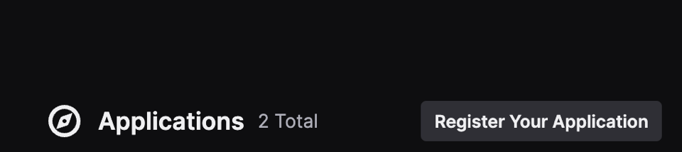

_Twitch developer account에 가입한다_

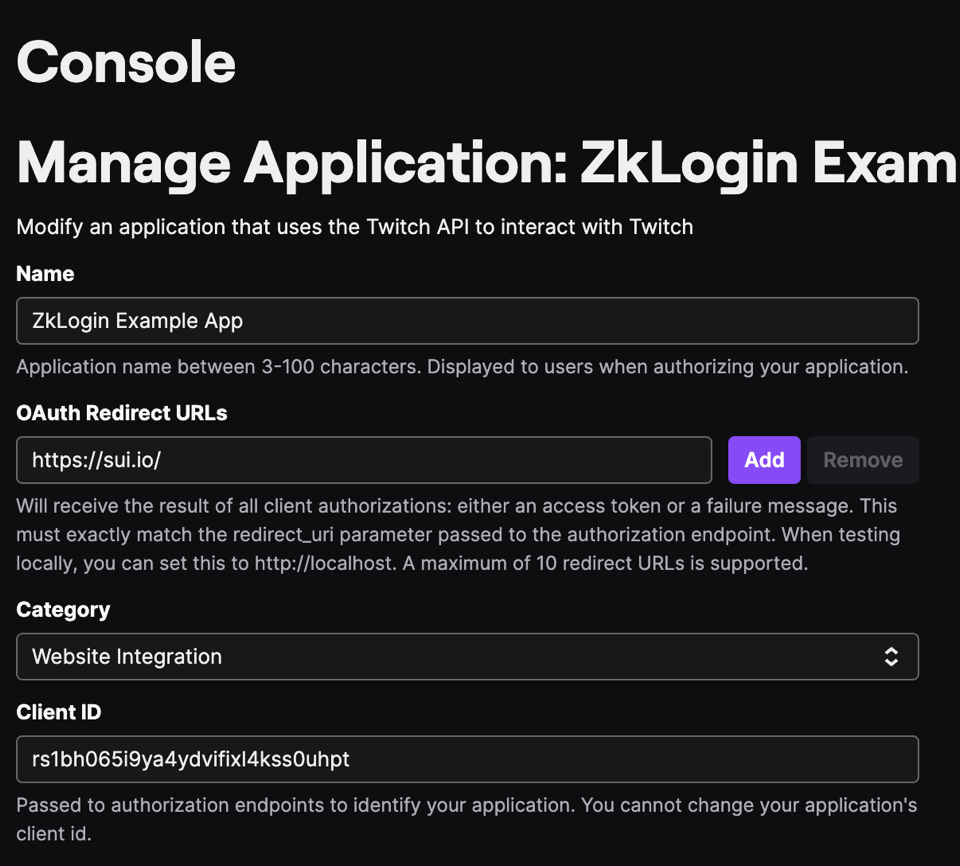

_Console로 이동한다_

</TabItem>

<TabItem label="Kakao" value="kakao">

1. Kakao developer account를 등록한다. [dashboard](https://developers.kakao.com/console/app)에 접근해 application을 추가한다.

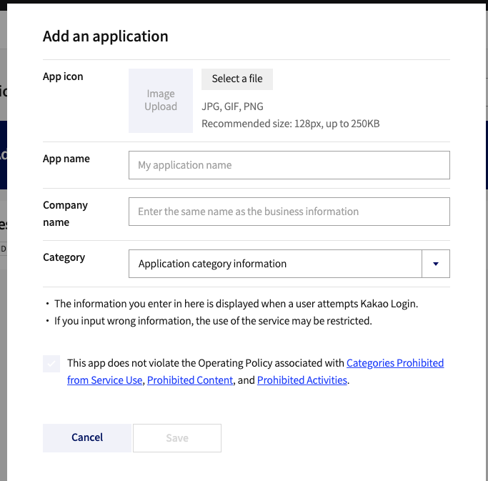

_Kakao에 application을 추가한다_

1. **App Keys**로 이동하면 플랫폼별 해당 client ID를 찾을 수 있다.

- Native app key: Android 또는 iOS SDK를 통해 API를 호출할 때 사용한다.
- JavaScript key: JavaScript SDK를 통해 API를 호출할 때 사용한다.
- REST API key: REST API를 통해 API를 호출할 때 사용한다.

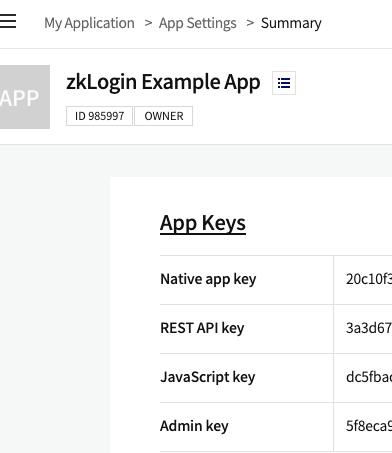

_client ID를 찾는다_

1. **Kakao Login Activation**과 **OpenID Connect Activation**을 켠다. **Product Settings** 아래의 **Kakao Login**에서 redirect URL을 설정한다. 이는 wallet 또는 application frontend여야 한다.

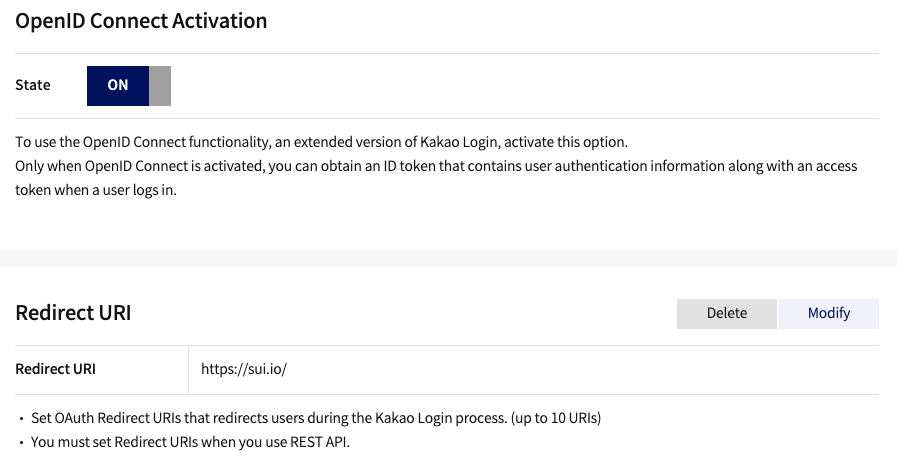

_redirect URL을 설정한다_

</TabItem>

<TabItem label="Slack" value="slack">

1. Slack developer account를 등록한다. [dashboard](https://api.slack.com/apps)에 접근하고 **Create New App**으로 이동한 다음 **From scratch**를 선택한다.

	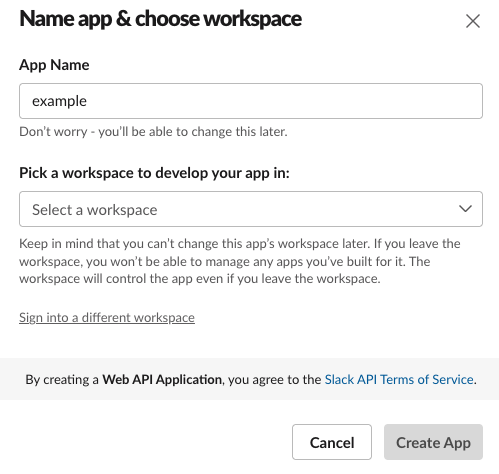

	_Slack에서 app을 생성한다_

1. **App Credentials** 아래에서 Client ID와 Client Secret을 찾는다.

	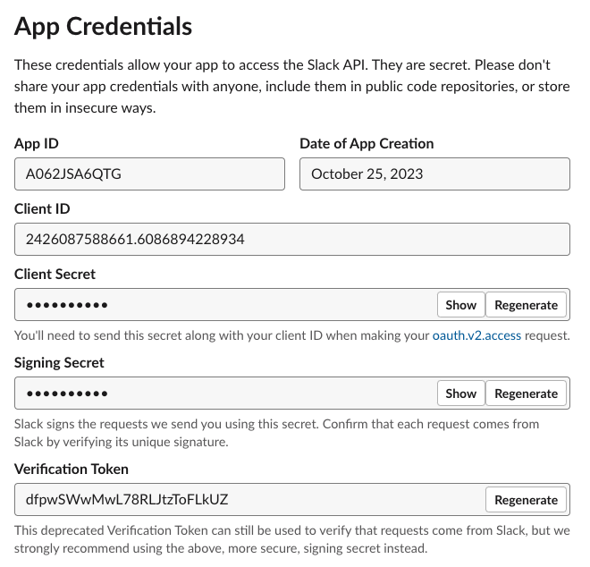

	_Client ID와 Client Secret을 찾는다_

1. **Features** 아래의 **OAuth & Permissions**에서 Redirect URL을 설정한다. 이는 wallet 또는 application frontend여야 한다.

	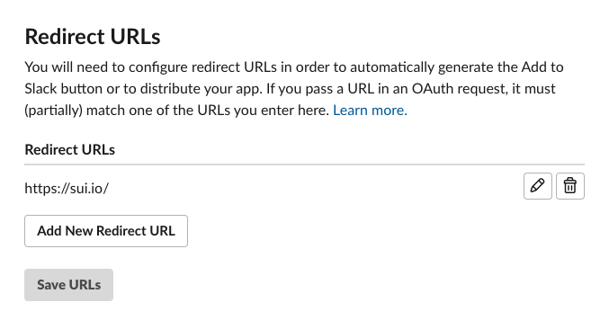

	_redirect URL을 설정한다_

</TabItem>

<TabItem label="Apple" value="apple">

1. [Apple developer account](https://developer.apple.com/)를 등록한다. **Certificates, Identifiers and Profiles** 섹션으로 이동한다.

	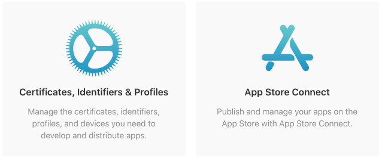
	
	_여기에서 Certificates, Identifiers and Profiles를 생성할 수 있다_

1. App ID를 생성한다.
    - sidebar에서 **Identifiers**를 선택하고 파란색 plus 아이콘을 클릭해 새 항목을 생성한다.
    - identifier type으로 **App IDs**를 선택하고 **Continue**를 클릭한다.
    - 다음 화면에서 App ID에 대한 설명용 이름과 reverse-dns 형식의 고유 Bundle ID(예: `com.example.app`)를 입력한다.
    - capability 목록까지 스크롤을 내려 **Sign In with Apple** 옆의 상자를 체크해 활성화한다.

	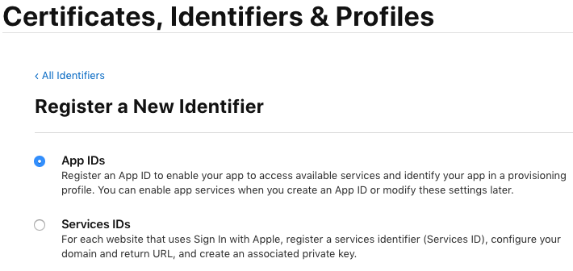
	
	_이렇게 App ID에 대해 Sign In with Apple을 활성화할 수 있다_

1. Services ID를 생성한다.

	Services ID는 앱의 특정 인스턴스를 식별하며 OAuth `client_id`로 사용된다. 웹 앱에서 **Sign In with Apple**을 사용하려면 Services ID가 필요하다.

	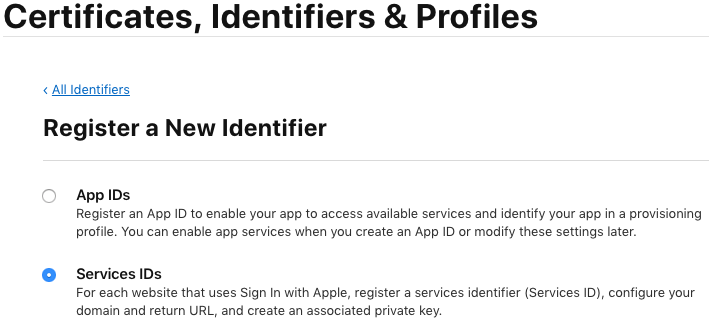

	_여기에서 Services ID를 생성한다_

1. 새 identifier를 생성하고 identifier type으로 **Services IDs**를 선택한다.

    - 다음 단계에서 sign-in 과정 중 사용자에게 표시될 앱 이름과 OAuth `client_id`로 사용할 고유 identifier를 입력한다. **Sign In with Apple** 옆의 상자를 체크해 반드시 활성화한다.
	- 앱의 domain과 redirect URL을 설정하려면 **Sign In with Apple** 옆의 **Configure** 버튼을 클릭한다. 앱이 호스팅되는 domain 이름과 Apple에서 오는 OAuth response를 처리할 redirect URL을 지정해야 한다.

	이전 단계에서 만든 App ID를 Primary App ID로 선택한다. 이렇게 하면 Services ID가 App ID와 연결된다.

	앱의 domain 이름(예: example-app.com)과 Apple의 authorization code를 수신할 redirect URL(예: https://example-app.com/redirect)을 입력한다. Apple은 localhost 또는 IP address를 유효한 domain이나 redirect URL로 허용하지 않는다는 점에 유의한다.

	이 단계를 완료할 때까지 **Save**, 그다음 **Continue**, **Register**를 차례로 클릭한다.

	이제 앱의 App ID와 Services ID가 생성되었다. Services ID의 identifier가 OAuth `client_id`이다. 이 예시에서는 `com.example.client`이다.

	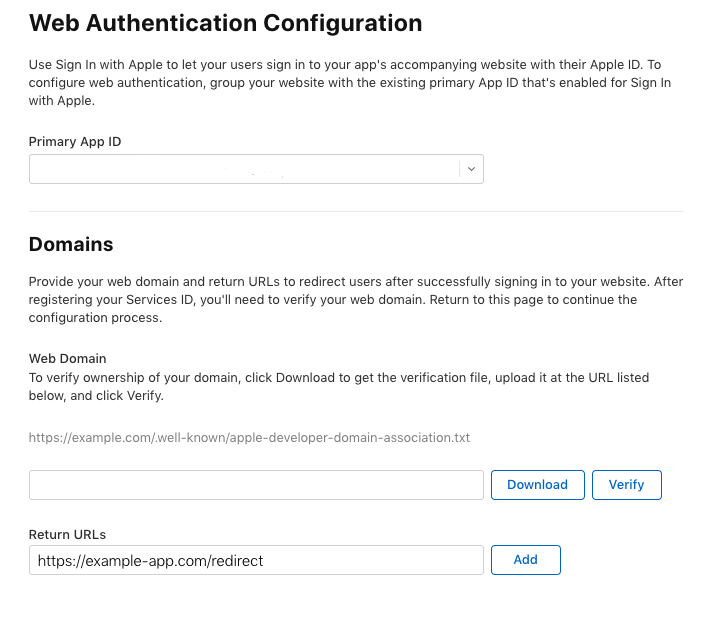
	
	_여기에서 redirect URL을 설정한다_

</TabItem>

<TabItem label="Microsoft" value="microsoft">

1. [Microsoft Entra admin center](https://entra.microsoft.com/)에 등록하고 sign in한다.
1. 왼쪽 nav에서 **Applications** > **App registrations**를 선택한다.

	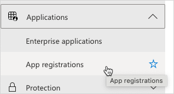
1. 왼쪽 상단의 **New Registration** 버튼을 클릭해 **Register an application** 페이지를 연다.

	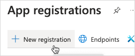
1. **Name** field에 application 이름을 입력하고, 적절한 **Supported account types** option을 선택하고, **Redirect URI** 값을 설정한다. 설정을 마쳤으면 **Register**를 클릭한다.

	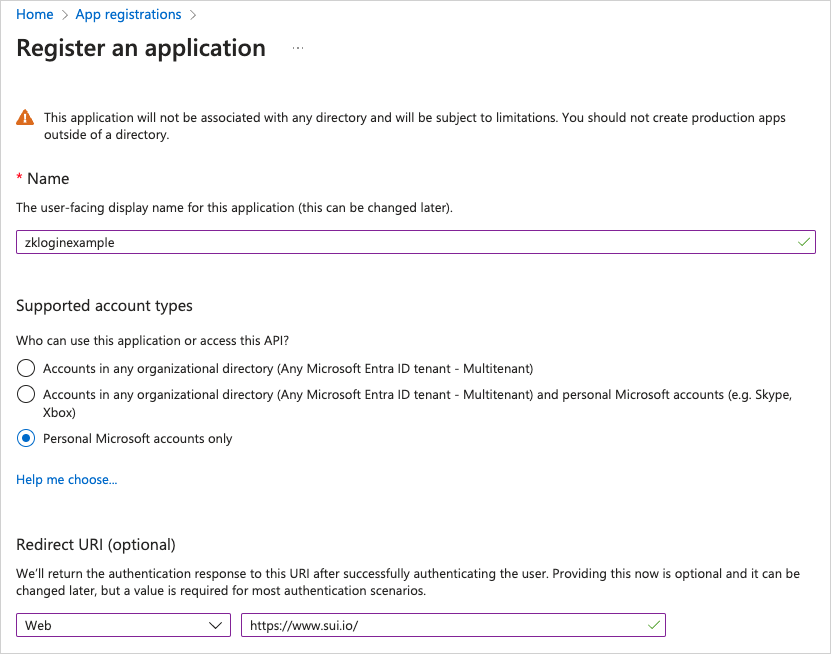
1. **Register** 버튼을 클릭하면 admin center가 application view를 연다. application view의 왼쪽 nav에서 **Authentication**을 선택한다.

	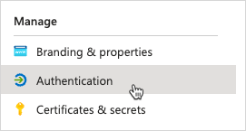
1. **Implicit grant and hybrid flows** 섹션에서 **ID tokens (used for implicit and hybrid flows)** 상자를 체크한다.

	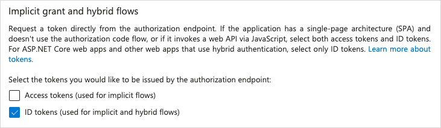
1. **Save**를 클릭한다.
1. Client ID는 application의 **Overview** 탭에 있는 **Essentials** 섹션에서 확인할 수 있다.

	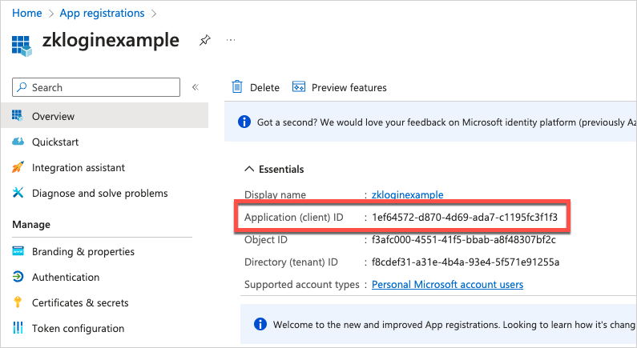
</TabItem>

</Tabs>