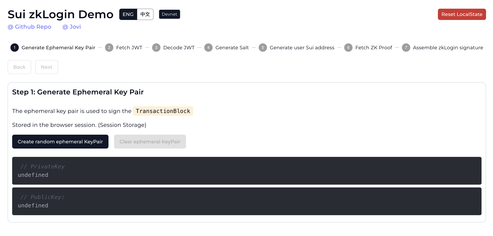

Sui community는 개발자가 Sui zkLogin의 각 단계에 대한 포괄적인 이해를 할 수 있도록 example을 만들었다.

- [Sui zkLogin Example](https://sui-zklogin.vercel.app/)

이 example은 Sui zkLogin의 전체 과정을 다음과 같이 일곱 단계로 나눈다:

1. Generate ephemeral key pair
1. Fetch JWT
1. Decode JWT
1. Generate salt
1. Generate user Sui address
1. Fetch ZK proof
1. Assemble zkLogin signature

각 단계에는 대응되는 code snippet이 포함되어 있으며, 각 단계에 필요한 데이터를 얻는 방법에 대한 안내를 제공한다.

## Operating environment

이 example은 Sui Devnet에서 실행된다.
사용자가 생성하는 모든 데이터는 client-side(브라우저)에 로컬로 저장된다.
zero-knowledge proof(ZK proof)의 획득은 [Mysten Labs-maintained proving service](/guides/developer/cryptography/zklogin-integration/)를 호출하여 수행된다.
따라서 이 example을 실행하기 위해 추가로 배포된 backend server(또는 Docker container)는 필요하지 않다.

## Storage locations for key data

다음 표는 example이 사용하는 핵심 데이터의 저장 위치를 보여준다:

| Data | Storage location |
| --- | --- |
| Ephemeral key pair | `window.sessionStorage` |
| Randomness | `window.sessionStorage` |
| User salt | `window.localStorage` |
| Max epoch | `window.localStorage` |

user salt는 브라우저의 `localStorage`에 장기 저장된다.
따라서 `localStorage`를 수동으로 지우지 않는 한, 동일한 JWT(이 example에서는 같은 Google account로 login하는 경우)를 사용해 현재 salt 값으로 생성된 대응 zkLogin address에 언제든 접근할 수 있다.

:::caution

브라우저나 기기를 바꾸면 동일한 JWT를 사용하더라도 이전에 생성된 Sui zkLogin address에 접근할 수 없게 된다.

:::

## Troubleshooting

- **ZK Proof request failure:**
  - 여러 randomness 또는 user salt를 만드는 과정에 불일치가 있어 request failure가 발생할 수 있다. UI 오른쪽 상단의 **Reset Button**을 클릭해 전체 과정을 다시 시작한다.

- **Request test tokens failure:**
  - faucet server request 빈도 제한을 초과했기 때문에 발생한다.
  - Sui [#devnet-faucet](https://discord.com/channels/916379725201563759/971488439931392130) 또는 [#testnet-faucet](https://discord.com/channels/916379725201563759/1037811694564560966) Discord channel로 가서 test coin을 요청할 수 있다.

- 제안 사항은 issue 등록을 통해 프로젝트 GitHub repo에 언제든 환영하며, 물론 pull request도 매우 환영한다.