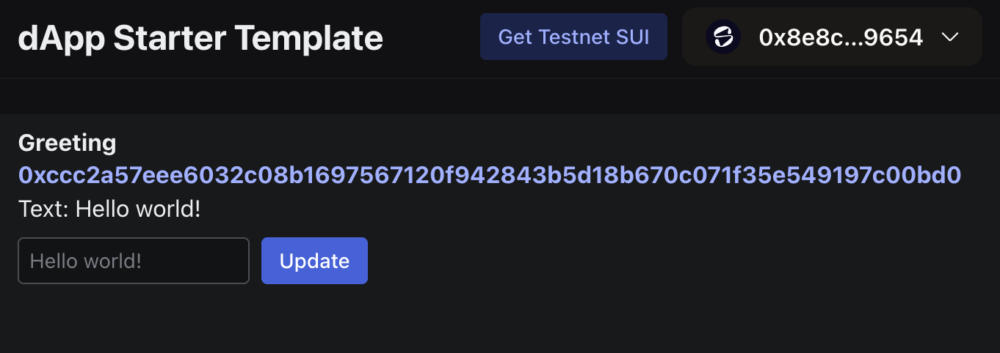

이전 가이드인 ["Hello, World!"](/guides/developer/getting-started/hello-world.mdx)에서 Move package를 배포하고 이와 상호작용하여 text "Hello world!"를 저장하는 object를 생성했다.

이 가이드는 React 인터페이스를 그 "Hello, World!" package에 연결해 모든 사용자가 브라우저에서 Move package와 상호작용하고 사용자 지정 greeting을 설정할 수 있는 방법을 보여 준다.

<Tabs className="tabsHeadingCentered--small">
<TabItem value="prereq" label="Prerequisites">

- [x] [Install the latest version of Sui](/guides/developer/getting-started/sui-install.mdx).

- [x] [Configure the Sui client](/guides/developer/getting-started/configure-sui-client.mdx).

- [x] [Create a Sui address](/guides/developer/getting-started/get-address.mdx).

- [x] [Get SUI Testnet tokens](/guides/developer/getting-started/get-coins.mdx).

- [x] ["Hello, World!"](/guides/developer/getting-started/hello-world.mdx) 가이드를 완료하고 게시한 Move package의 ID를 가지고 있어야 한다.

- [x] package manager로 사용할 [`pnpm`](https://pnpm.io/installation)을 설치한다.

- [x] [Slush](https://slush.app/) wallet을 만든다.

</TabItem>
</Tabs>

## Call the Move package

먼저 [followed the "Hello, World!"](https://github.com/MystenLabs/sui-stack-hello-world.git) example guide를 완료했고 CLI에서 `sui-stack-hello-world/move/hello-world` 디렉터리 안에 있는지 확인한다.

그다음 object 정보를 조회해 Move package가 여전히 Testnet에서 사용 가능한지 확인한다:

```
$ sui client object <PACKAGE_ID>
```

`<PACKAGE_ID>`를 Move package의 ID로 바꾼다.

:::danger

Package가 더 이상 존재하지 않거나 package ID를 다시 얻어야 한다면 ["Hello, World!"](https://github.com/MystenLabs/sui-stack-hello-world.git) guide의 단계를 따른다.

:::

## View the frontend source code

"Hello, World!" example project에서 `sui-stack-hello-world/ui` 하위 디렉터리에는 프론트엔드 인터페이스 source code 파일이 들어 있다:

```
.
├── eslint.config.js
├── index.html
├── package.json
├── pnpm-lock.yaml
├── prettier.config.cjs
├── src
│   ├── App.tsx
│   ├── constants.ts
│   ├── CreateGreeting.tsx
│   ├── dapp-kit.ts
│   ├── Greeting.tsx
│   ├── main.tsx
│   ├── networkConfig.ts
│   └── vite-env.d.ts
├── tsconfig.json
├── tsconfig.node.json
└── vite.config.mts
```

### `App.tsx`

`App.tsx` 파일에는 React 앱을 위한 기본 starter template를 만드는 코드가 들어 있다.

이 파일에는 app에 Slush wallet을 연결하는 버튼과 Testnet SUI를 받기 위해 Sui Faucet을 여는 버튼이 포함되어 있다.

<ImportContent source="/ui/src/App.tsx" mode="code" org="MystenLabs" repo="sui-stack-hello-world" />

### `CreateGreeting.tsx`

`CreateGreeting.tsx` 파일에는 Move package에 transaction을 만들고 전송하는 logic이 들어 있다.

이 transaction은 package의 `new` 함수를 호출하고, 이 함수는 값 `Hello world!`를 가진 Move object를 생성한다.

["Hello, World!"](/guides/developer/getting-started/hello-world.mdx) guide에서 이 함수를 `sui client call --package <PACKAGE_ID> --module greeting --function new` 명령으로 CLI를 통해 수동 호출했다.

<ImportContent source="/ui/src/CreateGreeting.tsx" mode="code" org="MystenLabs" repo="sui-stack-hello-world" />

### `Greeting.tsx`

`Greeting.tsx` 파일에도 Move package에 transaction을 만들고 전송하는 logic이 들어 있다.

하지만 이 transaction은 package의 `update_text` 함수를 호출하며, 이 함수는 text를 수정해 "Hello world!"를 사용자가 선택한 text로 바꾼다.

<ImportContent source="/ui/src/Greeting.tsx" mode="code" org="MystenLabs" repo="sui-stack-hello-world" />

## Connect the React interface to your Move package

`constants.ts` 파일은 React app을 Move package에 연결하는 위치이다.

이 파일에는 Move package ID를 상수 `TESTNET_HELLO_WORLD_PACKAGE_ID`로 설정하는 한 줄이 들어 있다.

기본적으로 이 파일에는 예시 package ID가 들어 있다.

이 파일을 수정해 대신 자신의 Move package ID를 넣는다.

<ImportContent source="/ui/src/constants.ts" mode="code" org="MystenLabs" repo="sui-stack-hello-world" />

이 상수는 `networkConfig.ts` 파일에서 사용된다:

<ImportContent source="/ui/src/networkConfig.ts" mode="code" org="MystenLabs" repo="sui-stack-hello-world" />

## Install frontend dependencies

이제 아직 해당 위치에 있지 않다면 `sui-stack-hello-world/ui` 디렉터리로 이동하고 필요한 프론트엔드 dependency를 설치한다:

```sh
$ pnpm install
```

## Run the React application

로컬 개발 환경에서 React 애플리케이션을 시작한다:

```sh
$ pnpm dev
```

그다음 브라우저에서 `http://localhost:5173/`를 연다.

App이 Slush wallet 연결을 요청한다.

**Connect Wallet**을 클릭하고 프롬프트가 표시되면 인증한 다음 연결을 승인한다.

## Send SUI tokens to your Slush wallet

이전 가이드에서 CLI에서 사용한 address로 SUI token을 보낸 뒤 브라우저에서 새 Slush wallet을 만들었다면, Slush wallet으로 SUI token을 보내야 할 가능성이 크다.

Slush wallet address는 CLI에서 생성하고 사용한 address와 다르고 별개이다.

[Testnet SUI](/guides/developer/getting-started/get-coins.mdx) instructions를 따라 Testnet token을 Slush address로 전송한다.

## Use the frontend interface

다음으로 **Create Greeting** 버튼을 클릭한다.

코드에서 이 버튼은 `CreateGreeting.ts`에 저장된 logic을 활성화해 Move package로 transaction을 전송하고, 이 transaction이 `new` 함수를 호출하여 `Greeting` object를 생성한다.

Slush wallet이 이 transaction의 승인을 요청한다.

:::danger

문제가 있으면 transaction 승인 프롬프트에 오류 메시지가 표시된다.

흔한 오류에는 gas 코인이 부족하거나 Move package ID가 올바르지 않아 발생하는 "Unable to Process Transaction"이 포함된다.

이 오류를 해결하려면 [Obtain Testnet SUI](/guides/developer/getting-started/get-coins.mdx)하거나 [confirm you have the correct Move package ID](/guides/developer/getting-started/hello-world.mdx).

:::

Transaction을 승인하면 브라우저 창에 `Greeting` object의 ID와 내용이 표시되며, 기본값은 "Hello world!"이다.

이 text를 바꾸려면 기본값 아래 text box에 다른 greeting을 입력하고 **Update**를 클릭한다.

Slush wallet이 transaction 승인을 요청한다.



Transaction을 승인한 후 새 greeting이 표시된다:


<div className="next-steps-module">
  <div className="next-steps-header">
    <h3>Next steps</h3>
  </div>
  <div className="next-steps-grid">
    <Card className="plausible-event-name=hello+data+button"
      title="Access Sui Data"
      href="/concepts/data-access/data-serving"
    >
      Sui에서 data에 접근하는 방법을 더 알아본다.
    </Card>
    <Card className="plausible-event-name=hello+community+button"
      title="Join the Community"
      href="/guides/developer/getting-started/next-steps"
    >
      Sui developer 커뮤니티에 참여하고, 다른 example project를 시도하거나, 더 많은 문서를 읽는다.
    </Card>
  </div>
</div>