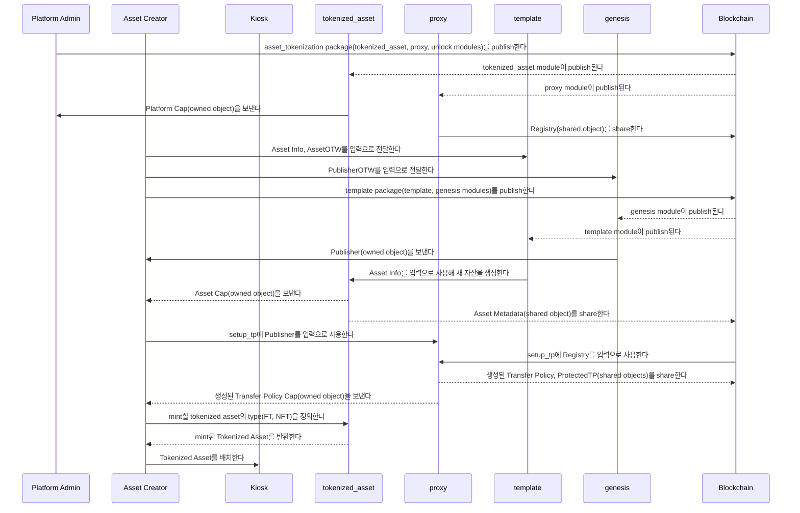
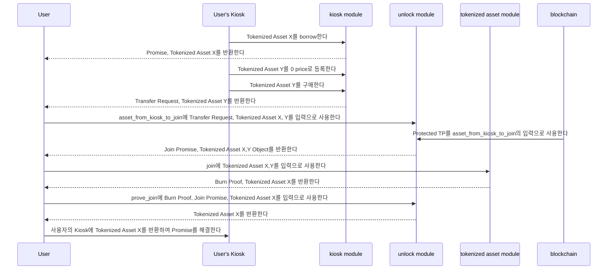
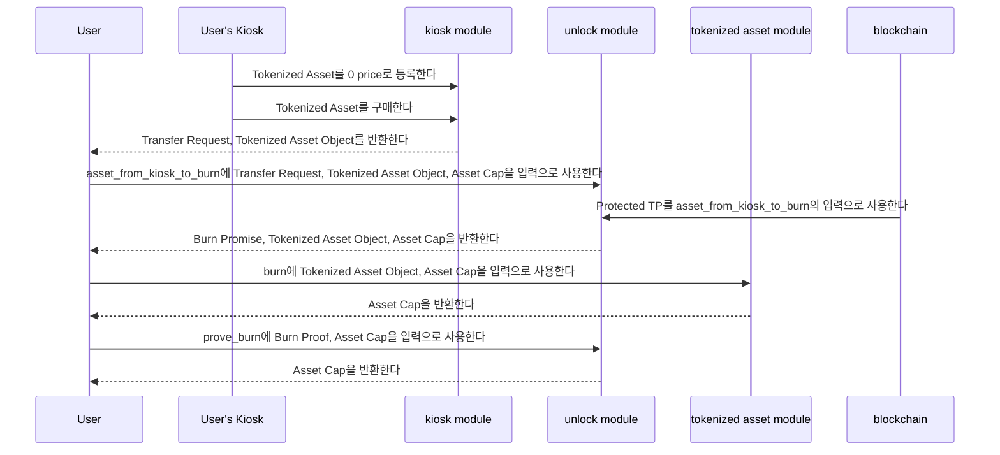

자산 토큰화는 부동산, 예술품, 원자재, 주식, 또는 그 밖의 가치 있는 자산과 같은 실물 자산을 blockchain network의 디지털 token으로 표현하는 과정을 의미한다. 이는 자산의 ownership 또는 권리를 디지털 token으로 변환하고, 그 token을 blockchain에 기록하고 관리하는 과정을 포함한다.

## High-level overview

이 개념은 고가 자산을 더 작고 더 저렴한 단위로 나누어 자산의 ownership 또는 일부를 나타내는 것이다.

이 전략은 디지털 자산의 sole owner가 되는 대신 일부에 투자함으로써 위험을 완화하고자 하는 투자자들의 더 넓은 참여를 가능하게 하여, 더 폭넓은 투자자에게 접근성을 확장한다.

이 패턴은 추가 기능이 있는 [ERC1155](https://eips.ethereum.org/EIPS/eip-1155) multi-token standard와 유사하다. 이는 Sui에서 구현하고자 하는 Solidity 기반 사용 사례에 적합한 선택이 되게 한다.

- **Asset creation**

  각 자산은 총 공급량으로 분할되며, 각 분할분은 대체 불가능 토큰(NFT) 또는 대체 가능 토큰(FT) type collectible로 표현된다. 이는 각 개별 분할분이 1 이상과 같은 잔액을 유지하고, 모든 분할분을 합치면 자산의 총 공급량에 도달하도록 보장한다.

  총 공급량 외에도 각 자산은 이름, 설명 등 다양한 다른 field로 정의된다. 이러한 field는 함께 자산의 metadata를 형성하며, 자산의 모든 분할분 전반에 걸쳐 일관되게 유지된다.

- **NFTs vs FTs distinction**

  tokenized asset가 mint될 때마다 시스템은 이를 새로운 metadata와 함께 생성할 수 있다. 새로운 metadata가 포함되면 tokenized asset는 고유해져 NFT로 바뀐다. 이 경우 잔액은 1로 제한되며, 이는 이 자산의 단일 instance만 존재함을 의미한다.

  추가 metadata가 없으면 시스템은 tokenized asset를 FT로 분류하여 잔액이 1을 초과하도록 허용하고, 따라서 동일한 자산의 동일한 instance가 여러 개 존재할 수 있게 한다.

  FT는 잔액이 1보다 클 때 서로 병합(join)되거나 분할될 수 있는 능력을 가진다. 이 기능은 필요에 따라 token unit을 집계하거나 분할할 수 있게 하여 다양한 수량을 유연하게 처리할 수 있게 한다.

  앞서 언급했듯 tokenized asset의 모든 collectible은 NFT이든 FT이든 합치면 자산의 최대 총 공급량에 도달할 수 있다.

- **Burnability**

  자산을 생성할 때 자산의 분할분이 circulation에서 제거되거나 파괴될 수 있는지 정의할 수 있다. 자산을 제거하거나 파괴하는 과정을 burning이라고 한다.

  tokenized asset가 burnable이면, 분할분을 burn할 때 circulating supply는 burn된 item의 잔액만큼 감소한다. 그러나 total supply는 일정하게 유지되므로, 필요하다면 burn된 분할분을 다시 mint하여 자산의 미리 정해진 total supply를 유지할 수 있다.

## Move packages

Sui의 모든 스마트 계약과 마찬가지로 Move는 자산 토큰화를 구동하는 logic을 제공한다.

### `asset_tokenization` package

:::info

이 reference implementation은 tokenized asset가 정의된 policy 안에서 동작하도록 보장하기 위해 [Kiosk standard](../../../standards/kiosk.mdx)를 사용한다. royalty, commission 등의 rule을 지원하는 marketable tokenized asset를 가지려면 구현을 제시된 그대로 사용한다.

Kiosk가 요구 사항이 아니라면 unlock module과 transfer policy에 관련된 proxy method 일부를 제외할 수 있다.

:::

세부사항을 보려면 module을 선택한다:

<Tabs groupId="modules">

<TabItem label="tokenized_asset" value="tokenized_asset">

`tokenized_asset` module은 `coin` library와 유사한 방식으로 동작한다.

이 module은 새로운 One-Time Witness type을 받으면 분할 자산의 고유 표현을 생성한다. 이 module은 `Coin` module에 있는 일부 method와 유사한 구현을 사용한다. 이 module은 새로운 자산 생성, minting, splitting, joining, burning을 포함해 자산 토큰화와 관련된 기능을 포괄한다. 자세한 정보는 The Move Book의 [One Time Witness](https://move-book.com/programmability/one-time-witness.html)를 참조한다.

**Structs**

- `AssetCap`

  분할 NFT로 표현되는 각 새 자산에 대해 `AssetCap`을 생성한다. 대부분의 시나리오에서는 이를 owned object로 생성한 뒤, 접근 제한된 method 호출을 위해 플랫폼 administrator에게 transfer할 수 있다.

  ```rust
  struct AssetCap<phantom T> {
      id: UID,
      // 현재 circulation 중인 supply
      supply: Supply<T>,
      // 어느 시점에든 존재하도록 허용되는 최대 total supply
      total_supply: u64,
      // 자산을 burn할 수 있는지 여부를 결정한다
      burnable: bool
  }
  ```

- `AssetMetadata`

  `AssetMetadata` struct는 분할하려는 전체 자산을 나타내는 metadata를 정의한다. 이는 shared object여야 한다.

  ```rust
  struct AssetMetadata<phantom T> has key, store {
          id: UID,
          /// 자산의 이름
          name: String,
          // 어느 시점에든 존재하도록 허용되는 최대 total supply
          total_supply: u64,
          /// 자산의 symbol
          symbol: ascii::String,
          /// 자산의 설명
          description: String,
          /// 자산 logo의 URL
          icon_url: Option<Url>
      }
  ```

- `TokenizedAsset`

  `TokenizedAsset`는 남은 supply보다 작거나 같은 지정 잔액으로 mint된다. 자산의 `VecMap`이 값으로 채워져 있어 여러 고유 entry를 나타내면 NFT로 간주한다. 반대로 자산의 `VecMap`이 채워져 있지 않아 개별 entry가 없음을 나타내면 FT로 간주한다.

  ```rust
  struct TokenizedAsset<phantom T> has key, store {
          id: UID,
          /// tokenized asset의 잔액
          balance: Balance<T>,
          /// VecMap이 채워져 있으면 NFT로 간주하고, 그렇지 않으면 자산을 FT로 간주한다.
          metadata: VecMap<String, String>,
          /// 자산 image의 URL(optional)
          image_url: Option<Url>,
      }
  ```

- `PlatformCap`

  `PlatformCap`은 contract를 배포하는 개인에게 발행되는 capability를 의미한다. 이 capability는 플랫폼 기능에 관련된 특정 permission 또는 authority를 부여하여, deployer가 배포된 contract 내에서 특정 제어된 action 또는 access right를 갖게 한다.

  ```rust
  /// contract를 배포하는 사람에게 발행되는 capability
  struct PlatformCap has key, store { id: UID }
  ```

**Functions**

- `init`

  이 함수는 `PlatformCap`을 생성하고 이를 transaction sender에게 transfer한다.

  ```rust
  fun init(ctx: &mut TxContext) {}
  ```

- `new_asset`

  이 함수는 자산의 새로운 표현을 생성하고 그 핵심 속성을 정의하는 책임을 가진다. 실행되면 `AssetCap`과 `AssetMetadata`라는 2개의 distinct object를 반환한다. 이 object는 시스템 내에서 자산을 정의하는 데 필요한 정보와 특성을 캡슐화한다.

  ```rust
  public fun new_asset<T: drop>(
          witness: T,
          total_supply: u64,
          symbol: ascii::String,
          name: String,
          description: String,
          icon_url: Option<Url>,
          burnable: bool,
          ctx: &mut TxContext
      ): (AssetCap<T>, AssetMetadata<T>) {}
  ```

- `mint`

  이 함수는 tokenized asset의 minting을 수행한다. 이 과정에서 새로운 metadata가 도입되면 tokenized asset는 고유해져 잔액이 1로 설정된 NFT가 생성된다. 반대로 새로운 metadata가 추가되지 않으면 시스템은 tokenized asset를 FT로 분류하고 제공된 인자에 지정된 대로 그 잔액이 1을 초과할 수 있게 허용한다. 실행되면 함수는 tokenized asset object를 반환한다.

  ```rust
  public fun mint<T>(
          cap: &mut AssetCap<T>,
          keys: vector<String>,
          values: vector<String>,
          value: u64,
          ctx: &mut TxContext
      ): TokenizedAsset<T> {}
  ```

- `split`

  이 함수는 FT type의 tokenized asset 하나와 1보다 큰 잔액, 그리고 object의 잔액보다 작은 값을 받아 tokenized asset에 split operation을 수행한다. 이 operation은 기존 tokenized asset를 2개의 개별 tokenized asset로 나눈다. 새로 생성된 tokenized asset는 주어진 값과 같은 잔액을 가지며, 제공된 object의 잔액은 지정된 값만큼 감소한다. 완료되면 함수는 새로 생성된 tokenized asset를 반환한다. 이 함수는 NFT type의 tokenized asset를 받거나 작동하지 않는다.

  ```rust
  public fun split<T>(
          self: &mut TokenizedAsset<T>,
          split_amount: u64,
          ctx: &mut TxContext
      ): TokenizedAsset<T> {}
  ```

- `join`

  이 함수는 FT type의 tokenized asset 2개를 받아 tokenized asset에 merge operation을 실행한다. 이 operation은 첫 번째 tokenized asset의 잔액을 두 번째 tokenized asset의 잔액만큼 증가시키는 것을 포함한다. 이후 시스템은 두 번째 tokenized asset를 burn하거나 circulation에서 제거한다. 과정이 끝나면 함수는 burn된 tokenized asset의 ID를 반환한다.

  이 함수는 NFT type의 tokenized asset를 받거나 작동하지 않는다.

  ```rust
  public fun join<T>(
          self: &mut TokenizedAsset<T>,
          other: TokenizedAsset<T>
      ): ID {}
  ```

- `burn`

  이 함수는 `assetCap`을 parameter로 요구하여 호출을 플랫폼 admin으로만 제한한다. 추가로 operation의 일부로 burn되는 tokenized asset를 받는다. 제공된 tokenized asset를 burn하면 circulating supply는 burn된 item의 잔액만큼 감소한다. 이 함수는 burnable한 tokenized asset를 요구한다.

  ```rust
  public fun burn<T>(
          cap: &mut AssetCap<T>,
          tokenized_asset: TokenizedAsset<T>
      )
  ```

- `total_supply`

  이 함수는 자산의 최대 supply를 반환한다.

  ```rust
  public fun total_supply<T>(cap: &AssetCap<T>): u64 {}
  ```

- `supply`

  이 함수는 자산의 현재 circulating supply를 반환한다.

  ```rust
  public fun supply<T>(cap: &AssetCap<T>): u64 {}
  ```

- `value`

  이 함수는 tokenized asset의 잔액을 반환한다.

  ```rust
  public fun value<T>(tokenized_asset: &TokenizedAsset<T>): u64 {}
  ```

- `create_vec_map_from_arrays`

  이 internal helper 함수는 `VecMap<String, String>`를 채운다. 이는 `VecMap` data structure 안에서 key-value pair를 채우거나 설정하는 과정을 돕는다.

  ```rust
  fun create_vec_map_from_arrays(
          keys: vector<String>,
          values: vector<String>
      ): VecMap<String, String> {}
  ```

</TabItem>

<TabItem label="proxy" value="proxy">

`proxy` module은 type owner가 publisher 관련 operation을 실행하는 데 사용하는 method로 구성된다.

**Structs**

- `Proxy`

  `PROXY` struct는 publisher를 claim하기 위한 One-Time Witness (OTW)를 나타낸다.

  ```rust
  struct PROXY has drop {}
  ```

- `Registry`

  이 shared object는 `Publisher` object를 위한 repository 역할을 하며, 특히 tokenized asset에 대한 transfer policy 생성 및 관리를 제어하고 제한하는 용도로 의도되었다. 이 object에 대한 mutable access는 실제 publisher에게만 독점적으로 허용된다.

  ```rust
  struct Registry has key {
          id: UID,
          publisher: Publisher
      }
  ```

- `ProtectedTP`

  이는 비어 있는 transfer policy를 저장하는 shared object이다. 사용자가 생성한 각 type `<T>`마다 하나씩 생성해야 한다. 이 object의 관여는 unlock module에서 드러난다.

  ```rust
  struct ProtectedTP<phantom T> has key, store {
          id: UID,
          policy_cap: TransferPolicyCap<T>,
          transfer_policy: TransferPolicy<T>
      }
  ```

**Functions**

- `init`

  이 함수는 `Publisher` object를 생성하고 이를 registry 안에 캡슐화한 뒤 `Registry` object를 share하는 책임이 있다.

  ```rust
  fun init(otw: PROXY, ctx: &mut TxContext) {}
  ```

- `setup_tp`

  이 함수는 registry 안에 중첩된 publisher와 sender의 publisher를 활용한다. 이는 `TokenizedAsset<T>` type 전용 transfer policy와 연관된 transfer policy cap을 생성하고 반환한다. 이 type `T`는 `Publisher` object에서 파생된다.

  또한 `ProtectedTP<T>` object 안에 래핑된 비어 있는 transfer policy를 생성하고 이를 share한다. 이 기능은 특정 조건에서 Kiosk lock rule을 override하는 데 사용할 수 있다.

  ```rust
  public fun setup_tp<T: drop>(
          registry: &Registry,
          publisher: &Publisher,
          ctx: &mut TxContext
      ): (TransferPolicy<TokenizedAsset<T>>,
          TransferPolicyCap<TokenizedAsset<T>>) {}
  ```

- `new_display`

  이 함수는 registry 안에 중첩된 publisher와 sender의 publisher를 사용해 `Publisher` object 안에 캡슐화된 `T`에 대해 type `TokenizedAsset<T>`의 비어 있는 `Display`를 생성하고 반환한다.

  ```rust
  public fun new_display<T: drop>(
          registry: &Registry,
          publisher: &Publisher,
          ctx: &mut TxContext
      ): Display<TokenizedAsset<T>> {}
  ```

- `transfer_policy`

  이 함수는 `protectedTP`가 제공되면 type `TokenizedAsset<T>` 전용으로 설계된 transfer policy를 반환한다.

  ```rust
  public(friend) fun transfer_policy<T>(
          protected_tp: &ProtectedTP<T>
      ): &TransferPolicy<T> {}

  ```

- `publisher_mut`

  이 함수는 platform cap owner만 접근할 수 있다. publisher에 대한 mutable reference를 얻기 위해 registry를 인자로 요구한다.

  ```rust
  public fun publisher_mut(
      _: &PlatformCap,
      registry: &mut Registry
  ): &mut Publisher {}
  ```

</TabItem>

<TabItem label="unlock" value="unlock">

`unlock` module은 authorized된 burning과 joining만을 위해 tokenized asset를 unlocking하는 것을 가능하게 한다.

이는 tokenized asset type creator가 rule이나 policy 같은 기본 requirement 집합을 따를 필요 없이 kiosk asset에 대해 이 operation을 가능하게 할 수 있게 한다.

**Structs**

- `JoinPromise`

  join의 의도된 범위를 넘어 object를 영구적으로 unlock하려는 시도를 방지하기 위해 promise object를 설정한다.

  ```rust
  struct JoinPromise {
      /// burn된 tokenized asset의 잔액이 추가될 item이다.
      item: ID,
      /// burned는 burn될 tokenized asset의 id이다
      burned: ID,
      /// 병합 뒤 item의 기대 최종 잔액이다
      expected_balance: u64
  }
  ```

- `BurnPromise`

  지정된 object의 영구적인 burning을 보장하기 위해 생성되는 promise object이다.

  ```rust
  struct BurnPromise {
    expected_supply: u64
  }
  ```

**Functions**

- `asset_from_kiosk_to_join`

  이 helper 함수는 kiosk에 lock된 tokenized asset의 joining을 돕기 위해 의도되었다. 이는 burn 대상인 tokenized asset를 unlocking하는 것을 도우며, 같은 type의 다른 tokenized asset가 결국 그 잔액을 포함하게 될 것임을 `JoinPromise`를 반환함으로써 보장한다.

  ```rust
  public fun asset_from_kiosk_to_join<T>(
    self: &TokenizedAsset<T>, // A
    to_burn: &TokenizedAsset<T>, // B
    protected_tp: &ProtectedTP<TokenizedAsset<T>>, // unlocker
    transfer_request: TransferRequest<TokenizedAsset<T>> // b에 대한 transfer request
  ): JoinPromise {}
  ```

- `prove_join`

  unlock된 tokenized asset가 성공적으로 burn되었고 그 잔액이 기존 tokenized asset에 통합되었음을 입증하는 데 사용하는 함수이다.

  ```rust
  public fun prove_join<T>(
    self: &TokenizedAsset<T>,
    promise: JoinPromise,
    proof: ID) {
  }
  ```

- `asset_from_kiosk_to_burn`

  kiosk에 lock된 tokenized asset의 burning을 돕는 helper 함수이다. 이는 unlocking을 돕는 동시에 circulating supply가 감소할 것이라는 promise를 `BurnPromise`를 반환함으로써 보장한다.

  ```rust
  public fun asset_from_kiosk_to_burn<T>(
      to_burn: &TokenizedAsset<T>,
      asset_cap: &AssetCap<T>,
      protected_tp: &ProtectedTP<TokenizedAsset<T>>,
      transfer_request: TransferRequest<TokenizedAsset<T>>,
    ): BurnPromise {
  }
  ```

- `prove_burn`

  asset cap의 circulating supply가 burn된 tokenized asset의 잔액만큼 줄어들도록 보장한다.

  ```rust
  public fun prove_burn<T>(
    asset_cap: &AssetCap<T>,
    promise: BurnPromise) {
  }
  ```

</TabItem>

</Tabs>

### `template` package

브라우저에서의 매끄러운 자산 생성을 지원하기 위해 Rust Wasm 기능 활용을 가능하게 하는 예시 사용 사례 package이다.

이는 launchpad 접근 방식과 유사하며, 새 자산이 tokenized asset로 표현되어야 할 때마다 template package 역할을 한다.

실질적으로 이는 사용자가 이 template contract의 field를 즉석에서 편집하고 그 편집을 포함한 채 publish할 수 있게 한다.
이 package는 자산 토큰화에 필요한 구분된 기능에 대응하는 두 개의 essential module을 구현한다.
Rust Wasm이 어떻게 구현되었는지에 대한 자세한 내용은 [Web Assembly](#webassembly-wasm-and-template-package) 섹션에서 찾을 수 있다.

- **Modules**

  - `template`

    이는 새 자산 정의를 지원하는 module이다.

    새 자산을 분할 자산으로 표현해야 할 때 이 module을 `<template>::<TEMPLATE>`로 수정하는데, 여기서 `<template>`(대문자)는 이 새 자산의 OTW이다.

    이 module은 자산에 대한 새 field 선언을 돕는 `asset_tokenization::tokenized_asset::new_asset(...)` method를 호출한다:

    - `witness`: OTW `NEW_ASSET`
    - `total_supply`: 어느 시점에든 존재하도록 허용되는 total supply
    - `symbol`: 자산의 symbol
    - `name`: 자산의 이름
    - `description`: 자산의 설명
    - `icon_url`: 자산 logo의 URL(optional)
    - `burnable`: 자산을 admin이 burn할 수 있는지 정의하는 Boolean

  - `genesis`

    sender가 publisher를 claim할 수 있도록 OTW를 포함하는 genesis type의 module이다.

### Publish and mint tokenized sequence diagram



### Join sequence diagram

다음 sequence diagram은 join flow가 어떻게 진행되는지 보여준다. 다음 flow는 다음을 가정한다:

- tokenized asset X와 Y는 type creator에 의해 이미 mint되었다.
- tokenized asset X와 Y는 이미 사용자의 kiosk 안에 배치되고 lock되었다.
- 모든 것은 같은 programmable transaction block(PTB)에서 실행된다.



### Burn sequence diagram

다음 sequence diagram은 burn flow를 보여주며 다음을 가정한다:

- tokenized asset는 type creator에 의해 이미 mint되었다.
- tokenized asset는 이미 사용자의 Kiosk 안에 배치되고 lock되었다.
- 모든 것은 같은 PTB에서 실행된다.



## Variations

제공된 package와 module은 프로젝트에 맞게 자산 토큰화를 구현할 수 있는 방법을 보여준다. 특정 사용 사례는 편의를 위해 contract를 변경하거나 새 기능을 도입하도록 요구할 가능성이 높다.

### Example convenience alteration

PTB 안에서 여러 단계로 unlock 기능을 구현하는 대신, 자산의 purchase, borrowing, unlocking, joining을 한 함수 안에서 모두 수행하는 method를 만드는 것도 가능하다. joining operation에 대해 이것이 어떻게 보이는지는 다음과 같다:

```rust
public fun kiosk_join<T>(
	kiosk: &mut Kiosk,
  kiosk_cap: &KioskOwnerCap,
	protected_tp: &ProtectedTP<TokenizedAsset<T>>,
  ta1_id: ID,
  ta2_id: ID,
  ctx: &mut TxContext
) {

	kiosk::list<TokenizedAsset<T>>(kiosk, kiosk_cap, ta2_id, 0);
	let (ta1, promise_ta1) = kiosk::borrow_val(kiosk, kiosk_cap, ta1_id);
	let coin = coin::zero<SUI>(ctx);
	let (ta2, request) = kiosk::purchase(kiosk, ta2_id, coin);

	let tp_ref = proxy::transfer_policy(protected_tp);
	let (_item, _paid, _from) = transfer_policy::confirm_request(
	    tp_ref,
	    request
	);

	tokenized_asset::join(&mut ta1, ta2);

	kiosk::return_val(kiosk, ta1, promise_ta1);
}
```

### Example alteration for use case

:::caution

다음 예시는 `AssetCap<T>`를 두 개의 새 object인 `Treasury<T>`와 `AdminCap<T>`로 분리한다(사실상 대체한다). 원래 package에 정의된 method에 대한 access는 이제 이 변경이 원치 않는 효과를 도입할 수 있으므로 주의 깊게 다시 설계해야 한다. 이 필수적인 재설계는 이 예시에 완전히 포함되어 있지 않으며, 시연 목적(또는 심화 연습)으로 일부 method만 변경된다.

:::

사용자도 admin뿐 아니라 자산을 burn할 수 있게 하고 싶다고 가정해 보자. 이것은 여전히 authorized된 operation이어야 하지만, 특정 사용 사례 목적(예: 모은 collectible 전부를 burn해 결합하는 경우)을 위해 tokenized asset를 소비하는 유연성을 제공한다. 이를 달성하기 위해 admin은 burn할 수 있는 자산의 ID를 담은 ticket를 mint할 수 있다. 이 기능을 지원하려면 smart contract를 재설계하고 admin을 각 자산의 treasury와 분리해야 하며, 이 treasury는 이제 supply 관련 정보만 보유한다. 발생해야 하는 변경의 예시는 다음과 같다:

**Structs**

receiver가 이를 거래할 수 없도록 `key` ability만 가진 ticket를 만든다.

```rust
struct BurnTicket<phantom T> has key {
	id: UID,
	tokenized_asset_id: ID // 이 ticket로 burn access를 얻는 tokenized asset
}
```

이제 treasury 관련 정보만 보유하는 struct(`AssetCap`를 분할한 결과이므로 더는 이 설계의 일부가 아니다)는 shared object로 생성된다. `mint` 같은 함수도 이제 `Treasury` object와 `AdminCap` object를 모두 입력으로 받도록 변경한다.

```rust
struct Treasury<phantom T> has key, store {
	id: UID,
	supply: Supply<T>,
  total_supply: u64,
}
```

`AssetCap` 기능의 다른 절반으로 burnability 설정과 admin capability를 유지하는 owned object는 type `<T>`의 creator에게 전송된다.

```rust
struct AdminCap<phantom T> has key, store {
	id: UID,
	burnable: bool
}
```

**Method Signatures**

여기서 `AdminCap`은 admin capability이자 type insurance 둘 다 역할을 한다. 이 ticket로 삭제할 수 있도록 허용되는 자산 type의 정보 둘 다를 인코딩한다.
이 함수는 자산 T가 burnable임을 assert하고 `BurnTicket<T>`를 반환해야 한다.

```rust
public fun mint_burn_ticket<T>(
	cap: &AdminCap<T>,
	tokenized_asset_id: ID,
	ctx: &mut TxContext
): BurnTicket
```

사용자 측의 burning은 그들이 shared `Treasury` object에 접근하도록 요구한다. 이 함수는 tokenized asset를 burn하고 supply를 감소시킨다.

```rust
public fun burn_with_ticket<T>(
	treasury: &mut Treasury<T>,
	self: TokenizedAsset<T>,
	ticket: BurnTicket<T>)
```

# Deployment

<ImportContent source="initialize-sui-client-cli.mdx" mode="snippet" />

## Publishing

이 단계에서는 contract를 수동으로 배포할지, 아니면 contract를 자동으로 배포하고 `.env`의 Asset Tokenization 관련 field 대부분을 설정해 주는 publish bash script를 사용할지 선택할 수 있다.
`.env.template` file은 script가 자동으로 채우는 변수를 나타낸다.
다음 reference를 볼 수 있다:

```
SUI_NETWORK = 선택한 network의 rpc endpoint | publish script가 자동 채움
ASSET_TOKENIZATION_PACKAGE_ID = `asset_tokenization` package를 publish해 생성됨 | publish script가 자동 채움
REGISTRY = `asset_tokenization` package를 publish해 생성됨 | publish script가 자동 채움

TEMPLATE_PACKAGE_ID = `template` package를 publish해 생성됨
ASSET_CAP_ID = `template` package를 publish해 생성됨
ASSET_METADATA_ID = `template` package를 publish해 생성됨
ASSET_PUBLISHER = `template` package를 publish해 생성됨

PROTECTED_TP = `setup_tp` 함수를 호출해 생성됨
TRANSFER_POLICY = `setup_tp` 함수를 호출해 생성됨

OWNER_MNEMONIC_PHRASE = 자신의 mnemonic | publish 전에 terminal에서 로컬로 export할 수 있음
BUYER_MNEMONIC_PHRASE = buyer의 mnemonic | publish 전에 terminal에서 로컬로 export할 수 있음
TARGET_KIOSK = kiosk id
BUYER_KIOSK = kiosk id


TOKENIZED_ASSET = tokenized asset id(minting으로 생성됨)
FT1 = tokenized asset id(join 대상)
FT2 = tokenized asset id(join 대상)
```

publishing에 대한 자세한 내용은 setup folder의 [README](https://github.com/MystenLabs/asset-tokenization/tree/main/setup)를 확인한다.

### Publishing packages

구체적인 지침은 package를 선택한다.

<ImportContent source="info-gas-budget.mdx" mode="snippet" />

<Tabs>

<TabItem label="asset_tokenization" value="asset_tokenization">

### Manually

프로젝트의 `move/asset_tokenization` directory에서 terminal 또는 console에 다음을 입력한다:

```sh
$ sui client publish --gas-budget <GAS-BUDGET>
```

gas budget에는 `20000000` 같은 표준 값을 사용한다.

package는 성공적으로 deploy되어야 하며, 그 뒤 다음을 보게 된다:

```sh
UPDATING GIT DEPENDENCY https://github.com/MystenLabs/sui.git
INCLUDING DEPENDENCY Sui
INCLUDING DEPENDENCY MoveStdlib
BUILDING asset_tokenization
Successfully verified dependencies on-chain against source.
```

또한 많은 정보와 transactional effect를 볼 수 있다.

생성된 object에서 `package ID`와 `registry ID`를 선택하여 자신의 `.env` file 각 field에 저장해야 한다.

이후 `Move.toml` file을 수정해야 한다. `[addresses]` 섹션 아래의 `0x0`를 같은 `package ID`로 바꾼다. 선택적으로 `[package]` 섹션 아래에 `published-at = <package ID>`를 추가한다(`sui client publish`를 실행한 뒤 `Move.lock` file이 보인다면 이 단계는 필요하지 않다).

### Automatically

자동으로 채워지는 field는 `SUI_NETWORK`, `ASSET_TOKENIZATION_PACKAGE_ID`, `REGISTRY`이다.

bash script로 publish하려면 다음을 실행한다:

```sh
$ npm run publish-asset-tokenization
```

publish 후에는 Manual flow에서 설명한 대로 `Move.toml` file을 편집할 수 있다.

이 과정에 대한 자세한 내용은 setup folder의 [README](https://github.com/MystenLabs/asset-tokenization/tree/main/setup)를 참조한다.

</TabItem>

<TabItem label="template" value="template">

### Manually

프로젝트의 `move/template` directory에서 terminal 또는 console에 다음을 입력한다:

```sh
$ sui client publish --gas-budget <GAS-BUDGET>
```

gas budget에는 `20000000` 같은 표준 값을 사용한다.

package는 성공적으로 deploy되어야 하며, 그 뒤 다음을 보게 된다:

```sh
UPDATING GIT DEPENDENCY https://github.com/MystenLabs/sui.git
INCLUDING DEPENDENCY asset_tokenization
INCLUDING DEPENDENCY Sui
INCLUDING DEPENDENCY MoveStdlib
BUILDING template
Successfully verified dependencies on-chain against source.
```

또한 많은 정보와 transactional effect를 볼 수 있다.

생성된 object에서 `package ID`, asset `metadata ID`, `asset cap ID`, `Publisher ID`를 선택하여 자신의 `.env` file 각 field에 저장해야 한다.

### Automatically

template package의 automatic deployment 과정은 WASM library를 통해 새 자산을 publish하는 것을 의미한다. quick start 단계는 다음과 같다:

- `asset_tokenization/Move.toml`의 `[addresses]` 섹션에 `asset_tokenization` package address가 설정되어 있는지 확인한다. 이 address는 원래 package deployment와 같아야 한다.
- `sui client publish`를 실행한 뒤 `Move.lock` file이 있으면 다음 단계로 진행한다. 없다면 `asset_tokenization/Move.toml` file의 `published-at` field 주석이 해제되어 있고 최신 package deployment 주소로 채워져 있는지 확인한다.
- `publishNewAsset` 함수의 입력 parameter를 변경하여 template field를 수정한다.
- `npm run publish-template`를 실행한다.
- 생성된 object에서 _Template Package ID_, _asset metadata ID_, _asset cap ID_, _publisher ID_를 선택하여 자신의 **`.env`** file 각 field에 저장해야 한다.

이 과정에 대한 자세한 내용은 setup folder의 [README](https://github.com/MystenLabs/asset-tokenization/tree/main/setup)를 참조한다.

</TabItem>

</Tabs>

## WebAssembly (WASM) and template package {#webassembly-wasm-and-template-package}

:::tip

WASM library에 대한 public facing reference는 Sui repo subfolder의 [move-binary-format-wasm](https://www.npmjs.com/package/@mysten/move-bytecode-template)에서 찾을 수 있다.

:::

이 기능은 web에서 Move bytecode serialization과 deserialization을 가능하게 하려는 의도로 개발되었다. 본질적으로 이 기능은 web environment에서 기존 contract를 편집할 수 있게 한다.

자산 토큰화의 경우 이러한 편집은 우리가 토큰화하려는 physical 또는 digital asset를 나타내는 새 type를 생성하고 publish할 수 있게 한다.

### Bytecode manipulation {#bytecode-manipulation}

:::caution

template package에 수정이 가해질 때마다 이 과정을 반복해야 한다. constant name 변경과 같은 일부 alteration은 생성되는 bytecode에 영향을 미치지 않는다는 점에 유의한다.

:::

이 편집을 수행하는 방법으로 넘어가기 전에, library가 template module bytecode를 어떻게 노출하는지 이해하는 것이 중요하다. 이 과정은 현재 수동이다. 이를 위해 compiled bytecode를 빌드하고 가져와야 한다. 이를 수행하려면 template folder 안으로 이동하여 다음 command를 실행한다:

```sh
$ xxd -c 0 -p build/template/bytecode_modules/template.mv | head -n 1
```

<details>
  <summary>
  Console response
  </summary>

받아야 하는 response는 다음과 비슷하게 보인다:

```sh
a11ceb0b060000000a010010021026033637046d0a05776807df01ec0108cb03800106cb043
e0a8905050c8e0549001303140107010d01120215021602170004020001000c01000101010c
010001020307000302070100000403070006050200070607000009000100010a0a0b0102021
2050700030c010401000311060401000418050800050e0601010c050f1001010c06100d0e00
070b050300030304030109060c070f02080007080600040b040108070b010108000b0201080
00b04010807010807010b04010900010a020109000108030108050108000809000308030805
08050b0401080701070806020b010109000b02010900010b02010800010608060105010b010
10800020900050841737365744361700d41737365744d65746164617461064f7074696f6e06
537472696e670854454d504c415445095478436f6e746578740355726c0561736369690b647
56d6d795f6669656c6404696e6974096e65775f6173736574156e65775f756e736166655f66
726f6d5f6279746573046e6f6e65066f7074696f6e137075626c69635f73686172655f6f626
a6563740f7075626c69635f7472616e736665720673656e64657204736f6d6506737472696e
670874656d706c6174650f746f6b656e697a65645f6173736574087472616e736665720a747
85f636f6e746578740375726c04757466380000000000000000000000000000000000000000
000000000000000000000000000000000000000000000000000000000000000000000000000
000000000000100000000000000000000000000000000000000000000000000000000000000
02d9ebdef1e3cb5eb135362572b18faeb61259afe651a463f1384745ebd7fd51da030864000
000000000000a02070653796d626f6c0a0205044e616d650a020c0b4465736372697074696f
6e0a02090869636f6e5f75726c0101010a02010000020108010000000002230704070621040
738000c02050b0704110938010c020b020c050b0007000701110207021105070311050b0507
050a0138020c040c030b0438030b030b012e110838040200
```

</details>

받은 출력을 복사하여 [bytecode-template.ts](https://github.com/MystenLabs/asset-tokenization/blob/main/setup/src/utils/bytecode-template.ts) file 안에 있는 `getBytecode` method의 return instruction에 붙여 넣는다.

추가로 template package에는 두 개의 module이 포함되어 있고 따라서 또 다른 dependency가 있으므로, genesis module의 bytecode도 비슷한 방식으로 가져와야 한다. 하지만 이 module bytecode는 편집되지 않으며 있는 그대로 사용된다. 이 operation은 WASM library 자체와 직접 관련되지는 않지만, 편집된 template module을 성공적으로 deploy하는 데 필요하다. genesis의 bytecode를 얻으려면 `template` folder로 이동하여 다음을 실행한다:

```sh
$ xxd -c 0 -p build/template/bytecode_modules/genesis.mv | head -n 1
```

출력 형식은 template module과 비슷하지만 길이가 더 짧다. template module에 대해 했던 것과 마찬가지로 이 출력도 복사해야 하지만, 이번에는 [genesis_bytecode.ts](https://github.com/MystenLabs/asset-tokenization/blob/main/setup/src/utils/genesis_bytecode.ts) file 안에 있는 bytecode constant 변수에 붙여 넣어야 한다.

위 설정이 완료되면 library는 이제 bytecode를 deserialize하고 편집하고 다시 serialize하여 publish할 수 있도록 조작할 수 있다.

### Closer view of the template module

template module을 살펴보면 몇 개의 constant가 정의되어 있음을 볼 수 있다:

```rust
...
const TOTAL_SUPPLY: u64 = 100;
const SYMBOL: vector<u8> = b"Symbol";
const NAME: vector<u8> = b"Name";
const DESCRIPTION: vector<u8> = b"Description";
const ICON_URL: vector<u8> = b"icon_url";
const BURNABLE: bool = true;
...
```

이 constant는 WASM library가 수정할 수 있는 reference point 역할을 한다. 실제로 편집을 수행하고 deploy하는 TypeScript code를 보면 이러한 field가 어떻게 식별되고 업데이트되는지 확인할 수 있다:

```tsx
...
const template = getBytecode();

const compiledModule = new CompiledModule(
  JSON.parse(wasm.deserialize(template))
)
  .updateConstant(0, totalSupply, "100", "u64")
  .updateConstant(1, symbol, "Symbol", "string")
  .updateConstant(2, asset_name, "Name", "string")
  .updateConstant(3, description, "Description", "string")
  .updateConstant(4, iconUrl, "icon_url", "string")
  .updateConstant(5, burnable, "true", "bool")
  .changeIdentifiers({
    template: moduleName,
    TEMPLATE: moduleName.toUpperCase(),
  });

const bytesToPublish = wasm.serialize(JSON.stringify(compiledModule));
...
```

constant를 업데이트하는 데 사용하는 `updateConstant` method를 살펴본다. 이 method는 네 개의 인자를 받는다:

- 선언된 constant가 constant pool 안에서 가질 `idx`(index)이다. 순서는 Move file에 정의된 첫 constant를 0으로 하여 순차적이며, 연속되는 각 constant마다 1씩 증가한다.
- 변경하려는 constant의 업데이트된 값을 담는 `value`이다.
- constant의 현재 값을 담는 `expectedValue`이다.
- constant의 현재 type을 담는 `expectedType`이다.

마지막 두 인자는 이 library가 compiled bytecode를 직접 조작하고 있어 꽤 위험하므로, 잘못된 constant를 실수로 업데이트할 위험을 최소화하기 위해 필요하다.

추가로 `changeIdentifiers` method는 identifier를 업데이트하는데, 우리의 경우 module name과 struct name이다. 이 method는 module 안의 현재 identifier name을 key로, 변경하려는 원하는 이름을 value로 갖는 JSON object를 인자로 받는다.

마지막으로 변경된 template module을 deploy하려면 빌드하고 publish한다:

```tsx
...
const tx = new Transaction();
  tx.setGasBudget(100000000);
  const [upgradeCap] = tx.publish({
    modules: [[...fromHex(bytesToPublish)], [...fromHex(genesis_bytecode)]],
    dependencies: [
      normalizeSuiObjectId("0x1"),
      normalizeSuiObjectId("0x2"),
      normalizeSuiObjectId(packageId),
    ],
  });

  tx.transferObjects(
    [upgradeCap],
    tx.pure(signer.getPublicKey().toSuiAddress(), "address")
  );
...
```

[Bytecode manipulation](#bytecode-manipulation) 섹션에서 언급했듯 publish해야 하는 module은 template와 genesis이므로 `modules` array에 2개의 element가 있는 것이다. 또한 관련 package의 `Move.toml` file에 정의된 dependency를 반드시 포함해야 한다. 앞서 사용한 `packageId`는 `asset_tokenization` package가 deploy된 address이다.

## TypeScript

이제 deploy된 smart contract와 자신의 tokenized asset와 상호작용하기 시작할 수 있다.

프로젝트 setup directory 안의 terminal 또는 console에서 다음 command를 사용한다:

- **`create-tp`**

  먼저 다음 command로 `TransferPolicy`와 `ProtectedTP`를 생성한다:

  ```sh
  $ npm run call create-tp
  ```

  command를 실행한 뒤 console은 transaction의 effect를 보여준다.

  Sui network explorer에서 transaction digest를 검색하면 생성된 object를 찾을 수 있다. 그 다음 이 object에서 `TransferPolicy ID`와 `ProtectedTP ID`를 선택하여 자신의 `.env` file 각 field에 저장한다.

- **Add rules**

  프로젝트의 `setup/src/functions` directory에 있는 `transferPolicyRules.ts` file에서 code를 수정하여 transfer policy에 원하는 rule을 포함할 수 있다.

  수정할 code snippet:

  ```rust
  // 사용 가능한 모든 rule add/remove 함수를 사용하는 시연이다.
      // 이 command들은 chain할 수 있다.
      tpTx
          .addFloorPriceRule('1000')
          .addLockRule()
          .addRoyaltyRule(percentageToBasisPoints(10), 0)
          // .addPersonalKioskRule()
          // .removeFloorPriceRule()
          // .removeLockRule()
          // .removeRoyaltyRule()
          // .removePersonalKioskRule()
  ```

  `npm run call tp-rules` command를 실행하면 rule이 자신의 transfer policy에 추가된다.

  이제 투자자는 설정한 rule에 따라 자산의 분할분을 거래할 수 있다.

- **`select-kiosk`**

  marketable asset를 원한다면 tokenized asset를 kiosk 안에 배치해야 한다. 그 뒤 이를 등록하고 다른 사용자에게 판매할 수 있다. 설정한 policy 바깥에서 향후 무단 사용을 방지하려면 object를 kiosk 안에 lock한다.

  best practice는 모든 operation에 하나의 포괄적인 kiosk를 권장한다. 그러나 항상 그런 것은 아니다. 따라서 이 프로젝트는 여러 kiosk를 소유하더라도 일관성과 더 나은 관리를 위해 단 하나의 personal kiosk만 사용하도록 요구한다.

  이 rule을 강제하려면 `npm run call select-kiosk` command를 실행한다. 그러면 이 프로젝트에서 사용할 특정 kiosk ID가 제공된다.

  그런 다음 제공된 Kiosk ID를 자신의 `.env` file 적절한 field에 저장한다.

- **`mint`**

  프로젝트의 `setup/src/functions` directory에 있는 `mint.ts` file에서 code를 편집하여 자신의 자산에 대해 원하는 type(NFT/FT)과 잔액을 mint할 수 있다.

  앞서 언급했듯 추가 metadata가 제공되면 tokenized asset는 값이 1인 NFT로 취급된다. 반면 추가 metadata가 없으면 tokenized asset는 FT로 간주되며, 1을 초과할 수 있는 잔액을 선택할 유연성이 있다.

  수정해야 하는 code의 예시는 다음과 같다:

  ```rust
  // metadata가 없는 예시 -> FT
  function getVecMapValues() {

    const keys : string[] = [];
    const values : string[] = [];

    return { keys, values };
  }
  ```

  또는

  ```rust
  // metadata가 있는 예시 -> NFT
  function getVecMapValues() {
  	const keys = [
  	  "Piece",
  	  "Is it Amazing?",
  	  "In a scale from 1 to 10, how good?",
    ];
    const values = ["8/100", "Yes", "11"];

    return { keys, values };
  }
  ```

  `npm run call mint` command를 실행하면 새 tokenized asset가 mint된다. 이후 참조를 위해 object의 `ID`를 `.env` file에 저장할 수 있다.

- **`lock`**

  kiosk 안의 object를 lock하는 것은 설정된 policy를 넘어서는 무단 사용을 방지하기 위해 중요하다.

  `npm run call lock` command를 실행하면 새로 mint한 tokenized asset가 자신의 kiosk 안에 안전하게 고정된다.

  command를 실행하기 전에 `.env` file의 `TOKENIZED_ASSET` field가 lock하려는 object로 채워져 있는지 확인한다.

- **`mint-lock`**

  `npm run call mint-lock` command를 실행하면 mint와 lock 함수가 순차적으로 수행되어, mint된 자산이 생성되고 즉시 kiosk 안에 lock된다.

- **`list`**

  이제 tokenized asset가 kiosk 안에 배치되고 lock되었으므로 판매용으로 등록할 수 있다.

  프로젝트의 `setup/src/functions` directory에 있는 `listItem.ts` file에서 code를 조정하여 등록할 원하는 자산을 지정할 수 있다.

  수정할 code snippet:

  ```rust
  const SALE_PRICE = '100000';
    kioskTx
      .list({
          itemId,
          itemType,
          price: SALE_PRICE,
      })
      .finalize();
  ```

  `npm run call list` command를 실행하면 tokenized asset가 등록되어 판매 가능 상태가 된다.

- **`purchase`**

  사용자가 item을 구매하려면 먼저 판매용으로 등록되어 있어야 한다. 사용자가 구매할 item을 선택한 뒤에는 `setup/src/functions` directory의 `purchaseItem.ts` file에서 찾을 수 있는 다음 code snippet을 수정해야 한다.

  ```rust
  const item = {
      itemType: tokenizedAssetType,
      itemId: tokenized_asset ?? tokenizedAssetID,
      price: "100000",
      sellerKiosk: targetKioskId,
  };
  ```

  item과 그 type을 지정하는 것 외에도 buyer는 purchase transaction을 성공적으로 실행하기 위해 구체적인 price와 seller의 kiosk ID를 설정해야 하며, 이는 `npm run call purchase`를 실행함으로써 수행된다.

- **`join`**

  `npm run call join` command를 실행하면 FT type의 지정된 tokenized asset 2개가 서로 병합된다. command를 실행하기 전에 `.env` file의 `FT1`과 `FT2` field가 병합하려는 object로 채워져 있는지 확인한다.

- **`burn`**

  tokenized asset를 burn하려면 `npm run call burn` command를 실행한다. 이 action 뒤 지정된 자산은 파괴된다. command를 실행하기 전에 `.env` file의 `TOKENIZED_ASSET` field가 burn하려는 object로 채워져 있는지 확인한다.

- **`get-balance`**

  `npm run call get-balance` command를 실행하면 지정된 tokenized asset에 연결된 잔액 값을 가져올 수 있다.

- **`get-supply`**

  `npm run call get-supply` command를 실행하면 자산의 현재 circulating supply를 나타내는 값을 가져올 수 있다.

- **`get-total-supply`**

  `npm run call get-total-supply` command를 실행하면 자산의 current circulating supply를 나타내는 값을 가져올 수 있다.