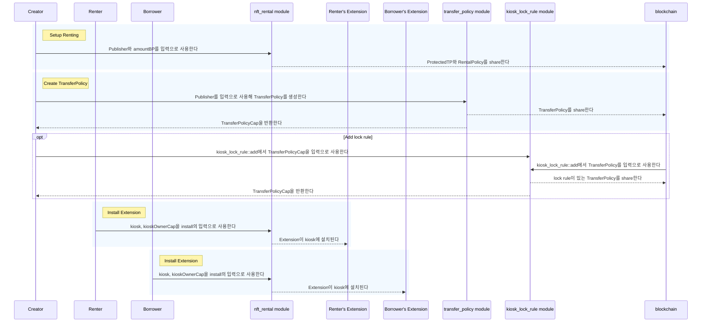
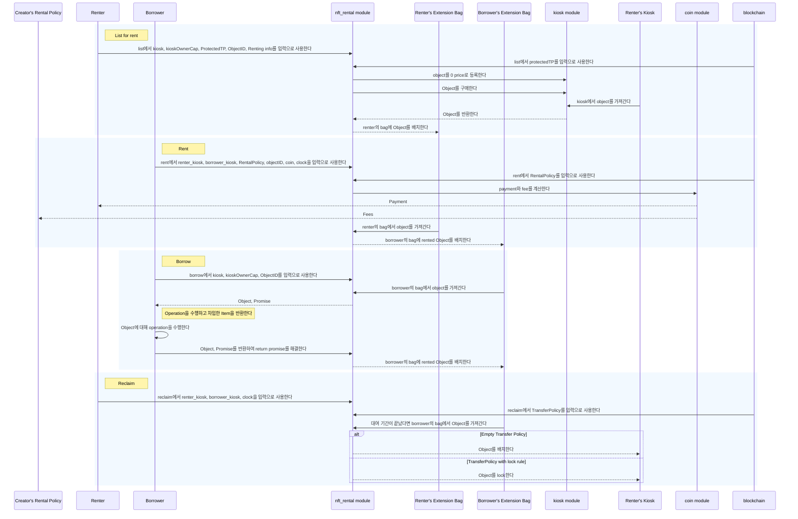
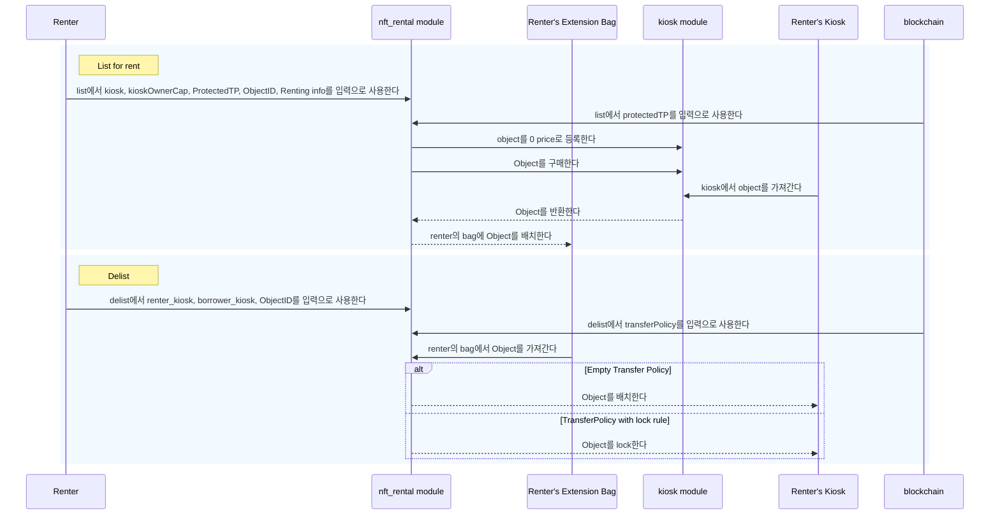

NFT renting은 특정 NFT에 대한 ownership이나 possession이 없는 개인이 이를 일시적으로 활용하거나 경험할 수 있게 하는 메커니즘이다. 이 과정을 구현하는 방식은 대여 transaction을 위한 infrastructure를 구축하기 위해 [Kiosk Apps standard](../../../standards/kiosk-apps.mdx)를 활용한다. 이 접근 방식은 [Ethereum ERC-4907](https://eips.ethereum.org/EIPS/eip-4907) renting standard와 밀접하게 맞아떨어지므로 Sui에 구현하려는 Solidity 기반 사용 사례에 적합한 선택이다.

NFT Rental 예시는 다음 프로젝트 요구 사항을 충족한다:

- 대여자가 지정한 기간 동안 자신의 자산을 대여할 수 있게 한다(list for renting).
- 대여자가 대여 기간을 정의할 수 있게 한다.
  - 차입자는 대여 기간을 준수해야 한다.
- 차입자는 NFT에 대한 mutable 또는 immutable 접근을 얻을 수 있다.
  - Immutable 접근은 read-only이다.
  - Mutable 접근의 경우, 대여자는 downgrade와 upgrade operation을 고려하고 이를 대여 수수료에 포함해야 한다.
- 대여 기간이 끝난 뒤 item은 정상적으로 판매할 수 있다.
- creator가 정의한 royalty는 [transfer policy rules](/guides/developer/objects/transfers/custom-rules.mdx)를 포괄함으로써 준수된다.

## Use cases

실제 세계의 NFT 대여 예시에 대한 일부 사용 사례는 다음을 포함한다:

- [Gaming](#gaming)
- [Ticketing](#ticketing)
- [Virtual land](#virtual-land)
- [Temporary assets and subscriptions](#temp-assets-subs)

### Gaming

게임에서 NFT 대여가 사용자 경험에 유익할 수 있는 경우는 여러 가지가 있다:

- **In-game assets:** NFT는 고유한 인게임 item, character, skin, accessory를 나타낼 수 있다. 플레이어는 이러한 자산을 안전하게 대여할 수 있다.
- **Ownership and authenticity:** NFT는 ownership에 대한 투명하고 변경 불가능한 기록을 제공하여, 실제로 자신의 인게임 item을 소유한 플레이어가 이를 대여하고 대여 기간이 만료된 뒤 대여 중이던 item을 다시 돌려받을 수 있도록 보장한다. 이는 fraud와 counterfeit 같은 문제를 완화할 수 있다.
- **Cross-game integration:** NFT 대여는 여러 게임에 걸쳐 동작할 수 있어, 플레이어가 한 게임에서 다른 게임으로 자신의 고유 item이나 character를 가지고 가서 대여할 수 있게 하며, interoperability를 촉진한다.
- **Gaming collectibles:** NFT는 게임 내 디지털 collectible을 나타낼 수 있어, 플레이어가 고유한 item을 대여할 수 있는 디지털 자산 생태계를 만든다.

### Ticketing

ticketing 영역에서 NFT는 transferability를 향상시키는 데 핵심적인 역할을 한다. 이러한 디지털 자산은 ticket의 안전하고 추적 가능한 transfer, resale, rental을 가능하게 하여 secondary market 내 counterfeit ticket의 위험을 줄인다. NFT의 blockchain 기반 특성은 각 transaction에서 transparency와 authenticity를 보장하여, 사용자가 ticket 관련 활동에 참여할 때 신뢰할 수 있고 fraud에 강한 수단을 제공한다. 이 혁신은 ticket holder의 과정을 단순화할 뿐 아니라 더 신뢰할 수 있고 효율적인 secondary ticket market에 기여한다.

### Virtual land {#virtual-land}

metaverse에서 virtual land와 office를 대여하면 비즈니스는 유연한 해결책을 얻을 수 있는데, 이는 event company가 영구 acquisition을 약속하지 않고 gathering을 주최할 수 있게 하고 virtual office를 통한 원격 근무를 가능하게 하기 때문이다. 이 접근 방식은 비용 효율적인 대안을 제공할 뿐 아니라 디지털 비즈니스 운영의 진화하는 역학과도 맞물린다.

### Temporary assets and subscriptions {#temp-assets-subs}

temporary asset와 subscription은 rental NFT의 주목할 만한 적용 사례이며, 고급 virtual casino 또는 큐레이션된 디지털 패션 같은 virtual experience에 대한 접근성을 제공한다. 이러한 NFT는 다양한 예산에 대응하여 audience reach를 넓힌다. subscription rental은 디지털 자산 pool까지 확장되어 사용자가 일정한 수의 item에 대해 매월 비용을 지불할 수 있게 함으로써 접근성, 사용자 유지, 획득을 촉진한다. holder는 사용하지 않는 subscription을 대여하여 자신에게 손실이 없게 할 수 있고, protocol에는 잠재 고객 증가를, 임시 holder에게는 약속 없는 trial을 제공할 수 있다. 이는 다양한 시나리오에서 rental NFT의 적응성과 사용자 중심 매력을 보여준다.

## Smart contract design

:::warning

자산이 대여 중일 때 kiosk를 transfer하면 예상치 못한 동작이 발생할 수 있다. kiosk transfer를 완전히 허용하지 않으려면 personal kiosk 사용을 고려한다.

:::

대여 smart contract는 [Kiosk Apps](../../../standards/kiosk-apps.mdx) standard를 사용한다. 대여자와 차입자는 모두 참여하기 위해 Kiosk extension을 설치해야 하고, 차입되는 자산 type의 creator는 extension이 royalty를 강제하면서 대여를 관리할 수 있도록 rental policy와 `ProtectedTP` object를 생성해야 한다.

:::info

이 구현은 일 단위로 rental fee를 부과한다. 필요하다면 로직을 다시 용도 변경하고 업데이트하여 시간 단위 또는 심지어 초 단위 과금도 지원할 수 있다.

:::

## Move modules

NFT Rental 예시는 단일 module인 `nft_rental.move`를 사용한다. 이 file의 source는 `examples` directory의 [sui repository](https://github.com/MystenLabs/sui/tree/main/examples/move/nft-rental/sources/nft_rental.move)에서 찾을 수 있다. source code에는 예시의 logic과 structure를 따라가기 쉽게 해 주는 광범위한 주석이 포함되어 있다.

### `nft_rental`

`nft_rental` module은 다음 operation을 통해 lending 또는 borrowing을 가능하게 하는 API를 제공한다:

- List for renting
- Delist from renting
- Rent
- Borrow by reference and borrow by value
- Reclaim for the lender

### Structs

`nft_rental` module의 object model은 `Rentables` object에서 시작하여 앱의 구조를 제공한다. 이 struct는 `drop` ability만 가지며 Kiosk `Rentables` extension의 extension key 역할을 한다.

```move
public struct Rentables has drop {}
```

`Rented` struct는 대여 중인 item을 나타낸다. 이 struct가 포함하는 유일한 field는 object의 ID이다. 누군가 item을 적극적으로 차입하고 있을 때 차입자의 `Bag` entry에서 dynamic field key로 사용된다. 이 struct는 모든 dynamic field key에 필요하기 때문에 `store`, `copy`, `drop` ability를 가진다.

```move
public struct Rented has store, copy, drop { id: ID }
```

`Listed` struct는 등록된 item을 나타낸다. 이 struct가 포함하는 유일한 field는 object의 ID이다. item이 대여용으로 등록된 뒤 대여자의 `Bag` entry에서 dynamic field key로 사용된다. `Rented`와 마찬가지로 이 struct는 모든 dynamic field key에 필요하기 때문에 `store`, `copy`, `drop` ability를 가진다.

```move
public struct Listed has store, copy, drop { id: ID }
```

`Promise` struct는 값에 의한 차입을 위해 생성된다. `Promise`는 item을 extension의 `Bag`에 다시 반환해야만 해결할 수 있는 hot potato(자신의 module 안에서만 pack 및 unpack할 수 있는 capability 없는 struct)로 동작한다.

`Promise` field는 다른 object 내부에 래핑되어서는 안 되므로 `store` ability가 없다.
또한 `return_val` 함수만 이를 consume할 수 있어야 하므로 `drop` ability도 없다.

```move
public struct Promise {
  item: Rented,
  duration: u64,
  start_date: u64,
  price_per_day: u64,
  renter_kiosk: address,
  borrower_kiosk: ID
}
```

`Rentable` struct는 대여 중인 자산을 담는 wrapper object이다. 대여 기간, 비용, 대여자에 관련된 정보를 포함한다.
이 struct는 값 `T`를 저장하는데, `T` 역시 분명 `store`를 가지기 때문에 `store` ability가 필요하다.

```move
public struct Rentable<T: key + store> has store {
  object: T,
  /// 일 단위로 제공되는 전체 대여 시간이다.
  duration: u64,
  /// 처음에는 정의되지 않았지만 누군가 대여하면 업데이트된다.
  start_date: Option<u64>,
  price_per_day: u64,
  /// object가 가져온 kiosk ID이다.
  kiosk_id: ID,
}
```

`RentalPolicy` struct는 모든 creator가 mint하는 shared object이다. 이 struct는 creator가 각 rent invocation으로부터 받는 royalty를 정의한다.

```move
public struct RentalPolicy<phantom T> has key, store {
  id: UID,
  balance: Balance<SUI>,
  /// 참고: Move는 float number를 지원하지 않는다.
  ///
  /// float를 표현해야 한다면 원하는
  /// precision을 정하고 더 큰 integer 표현을 사용해야 한다.
  ///
  /// 예를 들어 percentage는 basis point를 사용해 표현할 수 있다:
  /// 10000 basis point는 100%를 나타내고 100 basis point는 1%를 나타낸다.
  amount_bp: u64
}
```

`ProtectedTP` object는 creator가 대여를 가능하게 하려고 mint하는 shared object이다. 이 object는 비어 있는 `TransferPolicy`에 대한 authorized access를 제공한다.
이는 일부는 Kiosk가 royalty가 강제되는 item과 그 tradability 주변에 부과하는 제한 때문에 필요하다.
추가로 이는 rental module이 처리하는 자산이 항상 tradable이라는 보장을 유지하면서 Extension framework 안에서 동작할 수 있게 해 준다.

protected된 빈 transfer policy는 extension이 추가 rule을 해결할 필요 없이(lock rule, loyalty rule 등) 자산을 transfer할 수 있게 하여 rental 과정을 가능하게 하는 데 필요하다. creator가 rental에 royalty를 강제하려면 앞서 자세히 설명한 `RentalPolicy`를 사용할 수 있다.

```move
public struct ProtectedTP<phantom T> has key, store {
  id: UID,
  transfer_policy: TransferPolicy<T>,
  policy_cap: TransferPolicyCap<T>
}
```

### Function signatures

NFT Rental 예시는 프로젝트의 logic을 정의하는 다음 함수를 포함한다.

`install` 함수는 kiosk에 `Rentables` extension을 설치할 수 있게 한다. 대여 과정을 중개하는 당사자는 사용자가 자신의 kiosk에 extension을 설치하도록 보장할 책임이 있다.

```move
public fun install(
  kiosk: &mut Kiosk,
  cap: &KioskOwnerCap,
  ctx: &mut TxContext
){
  kiosk_extension::add(Rentables {}, kiosk, cap, PERMISSIONS, ctx);
}
```

`remove` 함수는 kiosk owner만 extension을 제거할 수 있게 한다. transaction이 성공하려면 extension storage가 비어 있어야 한다. extension storage는 사용자가 더 이상 어떤 item도 차입하거나 대여하지 않게 되면 비워진다. `kiosk_extension::remove` 함수는 실행 전에 ownership 검사를 수행한다.

```move
public fun remove(kiosk: &mut Kiosk, cap: &KioskOwnerCap, _ctx: &mut TxContext){
  kiosk_extension::remove<Rentables>(kiosk, cap);
}
```

`setup_renting` 함수는 type `T`에 대한 `ProtectedTP`와 `RentalPolicy` object를 mint하고 share한다. type `T`의 publisher만 이 action을 수행할 수 있다.

```move
public fun setup_renting<T>(publisher: &Publisher, amount_bp: u64, ctx: &mut TxContext) {
  // 비어 있는 TP를 만들고 ProtectedTP<T> object를 share한다.
  // 이는 특정 조건에서 lock rule을 우회하는 데 사용할 수 있다.
  // 접근할 방법이 없도록 cap 내부에 ProtectedTP를 저장하는데,
  // 이는 이 policy를 수정하고 싶지 않기 때문이다
  let (transfer_policy, policy_cap) = transfer_policy::new<T>(publisher, ctx);

  let protected_tp = ProtectedTP {
    id: object::new(ctx),
    transfer_policy,
    policy_cap,
  };

  let rental_policy = RentalPolicy<T> {
    id: object::new(ctx),
    balance: balance::zero<SUI>(),
    amount_bp,
  };

  transfer::share_object(protected_tp);
  transfer::share_object(rental_policy);
}
```

`list` 함수는 `Rentables` extension의 bag 안에 자산을 등록할 수 있게 하며, 자산 ID를 key로, `Rentable` wrapper object를 value로 하는 bag entry를 생성한다. type `T`의 creator만 생성할 수 있는 `ProtectedTP` transfer policy가 존재해야 한다. 이 함수는 item이 이미 kiosk에 배치되어 있고(선택적으로 lock되었을 수도 있다고) 가정한다.

```move
public fun list<T: key + store>(
  kiosk: &mut Kiosk,
  cap: &KioskOwnerCap,
  protected_tp: &ProtectedTP<T>,
  item_id: ID,
  duration: u64,
  price_per_day: u64,
  ctx: &mut TxContext,
) {

  // Rentables extension이 설치되지 않았으면 중단한다.
  assert!(kiosk_extension::is_installed<Rentables>(kiosk), EExtensionNotInstalled);

  // metadata field를 최신 상태로 유지하기 위해 kiosk owner를 transaction sender로 설정한다.
  // 이는 올바른 사람이 결제를 받도록 보장하는 데에도 중요하다.
  // owner를 업데이트하지 않은 채 사용자 간에 kiosk가 transfer되었을 수 있는 경우
  // 예기치 않은 결과를 방지한다.
  kiosk.set_owner(cap, ctx);

  // item을 0 SUI에 등록한다.
  kiosk.list<T>(cap, item_id, 0);

  // 0 coin을 만든다.
  let coin = coin::zero<SUI>(ctx);
  // item을 0 SUI로 구매한다.
  let (object, request) = kiosk.purchase<T>(item_id, coin);

  // 이 module을 통해서만 protected되고 접근 가능한 빈 TransferPolicy로 TransferRequest를 해결한다.
  let (_item, _paid, _from) = protected_tp.transfer_policy.confirm_request(request);

  // 관련 metadata와 함께 item을 Rentable struct로 감싼다.
  let rentable = Rentable {
    object,
    duration,
    start_date: option::none<u64>(),
    price_per_day,
    kiosk_id: object::id(kiosk),
  };

  // rentable을 extension의 bag에 listed 상태로 배치한다(place_in_bag은 nft_rental.move file에 정의된 helper method이다).
  place_in_bag<T, Listed>(kiosk, Listed { id: item_id }, rentable);
}
```

`delist` 함수는 현재 대여 중이 아닌 한 대여자가 item을 delist할 수 있게 한다. 이 함수는 또한 object를 owner의 kiosk에 다시 배치하거나(lock rule이 있으면 lock한다). royalty를 적용하고 싶지 않더라도 비어 있는 `TransferPolicy`를 mint해야 한다. 어느 시점에 royalty를 강제하고 싶어지면 기존 `TransferPolicy`를 언제든 업데이트할 수 있다.

```move
public fun delist<T: key + store>(
  kiosk: &mut Kiosk,
  cap: &KioskOwnerCap,
  transfer_policy: &TransferPolicy<T>,
  item_id: ID,
  _ctx: &mut TxContext,
) {

  // cap이 Kiosk와 일치하지 않으면 중단한다.
  assert!(kiosk.has_access(cap), ENotOwner);

  // extension의 Bag에서 rentable item을 제거한다(take_from_bag은 nft_rental.move file에 정의된 helper method이다).
  let rentable = take_from_bag<T, Listed>(kiosk, Listed { id: item_id });

  // Rentable object를 분해한다.
  let Rentable {
    object,
    duration: _,
    start_date: _,
    price_per_day: _,
    kiosk_id: _,
  } = rentable;

  // lock rule이 있으면 owner의 Kiosk에 자산을 다시 lock하여 이를 준수한다.
  if (has_rule<T, LockRule>(transfer_policy)) {
    kiosk.lock(cap, transfer_policy, object);
  } else {
    kiosk.place(cap, object);
  };
}
```

`rent` 함수는 등록된 `Rentable`을 대여할 수 있게 한다. `Rentables` extension이 설치되어 있는 한 누구든 다른 사용자를 대신해 item을 차입시킬 수 있다. `rental_policy`는 수수료로 유지되어 rental policy의 잔액에 더해지는 coin의 비율을 정의한다.

```move
public fun rent<T: key + store>(
  renter_kiosk: &mut Kiosk,
  borrower_kiosk: &mut Kiosk,
  rental_policy: &mut RentalPolicy<T>,
  item_id: ID,
  mut coin: Coin<SUI>,
  clock: &Clock,
  ctx: &mut TxContext,
) {

  // Rentables extension이 설치되지 않았으면 중단한다.
  assert!(kiosk_extension::is_installed<Rentables>(borrower_kiosk), EExtensionNotInstalled);

  let mut rentable = take_from_bag<T, Listed>(renter_kiosk, Listed { id: item_id });

  // 결과가 u64로 저장될 수 있도록 보장하면서 대여 일수에 따라 대여 가격을 계산한다.
  let max_price_per_day = MAX_VALUE_U64 / rentable.duration;
  assert!(rentable.price_per_day <= max_price_per_day, ETotalPriceOverflow);
  let total_price = rentable.price_per_day * rentable.duration;

  // 결제에는 정확한 잔액만 허용하며 거스름돈은 주지 않는다.
  let coin_value = coin.value();
  assert!(coin_value == total_price, ENotEnoughCoins);

  // 주어진 basis point 양(percentage)을 사용해 fees_amount를 계산하면서
  // 결과가 64-bit unsigned integer에 들어가도록 보장한다.
  let mut fees_amount = coin_value as u128;
  fees_amount = fees_amount * (rental_policy.amount_bp as u128);
  fees_amount = fees_amount / (MAX_BASIS_POINTS as u128);

  // 주어진 basis point 양(percentage)을 사용해 fees_amount를 계산하면서 결과가 64-bit unsigned integer에 들어가도록 보장한다.
  let fees = coin.split(fees_amount as u64, ctx);

  // 주어진 coin의 fee balance를 RentalPolicy balance와 병합한다.
  coin::put(&mut rental_policy.balance, fees);
  // 결제를 대여자에게 transfer한다.
  transfer::public_transfer(coin, renter_kiosk.owner());
  rentable.start_date.fill(clock.timestamp_ms());

  place_in_bag<T, Rented>(borrower_kiosk, Rented { id: item_id }, rentable);
}
```

`borrow` 함수는 차입자가 자신의 bag에서 `Rentable`을 reference로 획득할 수 있게 한다.

```move
public fun borrow<T: key + store>(
  kiosk: &mut Kiosk,
  cap: &KioskOwnerCap,
  item_id: ID,
  _ctx: &mut TxContext,
): &T {
  // cap이 Kiosk와 일치하지 않으면 중단한다.
  assert!(kiosk.has_access(cap), ENotOwner);
  let ext_storage_mut = kiosk_extension::storage_mut(Rentables {}, kiosk);
  let rentable: &Rentable<T> = &ext_storage_mut[Rented { id: item_id }];
  &rentable.object
}
```

`borrow_val` 함수는 차입자가 `Rentable`을 되돌려주겠다는 agreement 또는 promise와 함께 일시적으로 획득할 수 있게 한다. `Promise`는 `Rentable`에 대한 모든 정보를 저장하여 object가 반환될 때 `Rentable`을 다시 구성할 수 있게 한다.

```move
public fun borrow_val<T: key + store>(
  kiosk: &mut Kiosk,
  cap: &KioskOwnerCap,
  item_id: ID,
  _ctx: &mut TxContext,
): (T, Promise) {
  // cap이 Kiosk와 일치하지 않으면 중단한다.
  assert!(kiosk.has_access(cap), ENotOwner);
  let borrower_kiosk = object::id(kiosk);

  let rentable = take_from_bag<T, Rented>(kiosk, Rented { id: item_id });

  // Rentable의 metadata를 담는 Promise struct를 구성한다.
  let promise = Promise {
    item: Rented { id: item_id },
    duration: rentable.duration,
    start_date: *option::borrow(&rentable.start_date),
    price_per_day: rentable.price_per_day,
    renter_kiosk: rentable.kiosk_id,
    borrower_kiosk
  };

  // rentable을 분해하고 wrapped item T와 함께 promise를 반환한다.
  let Rentable {
    object,
    duration: _,
    start_date: _,
    price_per_day: _,
    kiosk_id: _,
  } = rentable;

  (object, promise)
}
```

`return_val` 함수는 차입자가 차입한 item을 반환할 수 있게 한다.

```move
public fun return_val<T: key + store>(
  kiosk: &mut Kiosk,
  object: T,
  promise: Promise,
  _ctx: &mut TxContext,
) {
  assert!(kiosk_extension::is_installed<Rentables>(kiosk), EExtensionNotInstalled);

  let Promise {
    item,
    duration,
    start_date,
    price_per_day,
    renter_kiosk,
    borrower_kiosk,
  } = promise;

  let kiosk_id = object::id(kiosk);
  assert!(kiosk_id == borrower_kiosk, EInvalidKiosk);

  let rentable = Rentable {
    object,
    duration,
    start_date: option::some(start_date),
    price_per_day,
    kiosk_id: renter_kiosk,
  };

  place_in_bag(kiosk, item, rentable);
}
```

:::note

`reclaim` 기능은 수동으로 호출되며, rental service provider는 대여자에게 `reclaim`을 상기시킬 책임이 있다. 따라서 이 때문에 차입자가 대여 기간보다 더 오래 자산을 보유하게 될 수 있다. 이는 `borrow` 및 `borrow_val` 함수에 assertion을 추가하여 대여 기간이 만료되었는지 확인하게 함으로써 현재 contract를 수정하여 완화할 수 있다.

:::

`reclaim` 함수는 대여 기간이 끝난 뒤 owner가 자산을 다시 회수하여 자신의 kiosk 안에 배치할 수 있게 한다. lock rule이 있으면 예시는 또한 owner kiosk 안에 item을 lock한다.

```move
public fun reclaim<T: key + store>(
  renter_kiosk: &mut Kiosk,
  borrower_kiosk: &mut Kiosk,
  transfer_policy: &TransferPolicy<T>,
  clock: &Clock,
  item_id: ID,
  _ctx: &mut TxContext,
) {

  // Rentables extension이 설치되지 않았으면 중단한다.
  assert!(kiosk_extension::is_installed<Rentables>(renter_kiosk), EExtensionNotInstalled);

  let rentable = take_from_bag<T, Rented>(borrower_kiosk, Rented { id: item_id });

  // Rentable struct를 분해하여 이를 대여자의 Kiosk에 다시 배치한다.
  let Rentable {
    object,
    duration,
    start_date,
    price_per_day: _,
    kiosk_id,
  } = rentable;

  // 제공된 kiosk가 item을 처음 차입한 kiosk와 다르면 중단한다.
  assert!(object::id(renter_kiosk) == kiosk_id, EInvalidKiosk);

  let start_date_ms = *option::borrow(&start_date);
  let current_timestamp = clock.timestamp_ms();
  let final_timestamp = start_date_ms + duration * SECONDS_IN_A_DAY;

  // 대여 기간이 아직 지나지 않았으면 중단한다.
  assert!(current_timestamp > final_timestamp, ERentingPeriodNotOver);

  // lock rule이 있으면 owner의 kiosk에 자산을 다시 lock하여 이를 준수한다.
  if (transfer_policy.has_rule<T, LockRule>()) {
    kiosk_extension::lock<Rentables, T>(
      Rentables {},
      renter_kiosk,
      object,
      transfer_policy,
    );
  } else {
    kiosk_extension::place<Rentables, T>(
      Rentables {},
      renter_kiosk,
      object,
      transfer_policy,
    );
  };
}
```

## Sequence diagrams

:::note

이 구현은 각 creator가 활성화 동작으로서 비어 있더라도 `TransferPolicy`를 생성하여 `Rentables` extension이 동작할 수 있게 한다고 가정한다. 이는 `setup_renting` method를 호출하는 것에 더해 필요한 요구 사항이다.

:::

### Initialize

초기화 과정은 flow의 일부이지만 각 엔티티마다 한 번만 발생한다:

- creator가 대여를 허용하려는 새 type에 대해
  - 선택적 lock rule과 함께 `setup_renting` 및 `TransferPolicy` 생성을 호출하는 것을 포함한다
- 이 framework를 사용해 이전에 차입한 적이 없는 차입자에 대해
  - 사용자용 kiosk가 없으면 생성해야 한다
  - 자신의 kiosk에 extension을 설치하는 것을 포함한다
- 이 framework를 사용해 이전에 대여한 적이 없는 대여자에 대해
  - 사용자용 kiosk가 없으면 생성해야 한다
  - 자신의 kiosk에 extension을 설치하는 것을 포함한다



### List-Rent-Borrow-Reclaim



### List-Delist



## Deployment

<ImportContent source="initialize-sui-client-cli.mdx" mode="snippet" />

<ImportContent source="publish-to-devnet-with-coins.mdx" mode="snippet" />