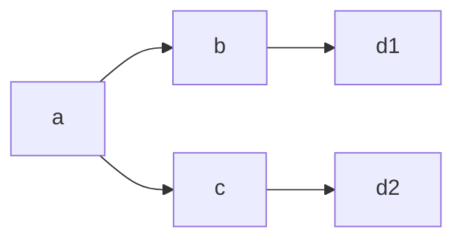
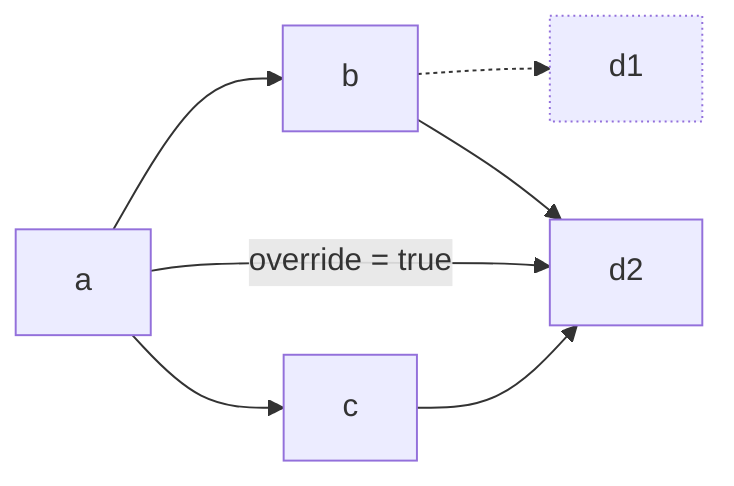

Move package는 Sui blockchain에 단일 object로 함께 게시하는 Move module의 모음이다.
package는 다른 package에 의존할 수 있으며, 온체인 identity를 유지한 채 시간이 지나도 upgrade할 수 있다.
Move package manager는 dependency를 관리하고 network에 package를 게시하는 데 도움을 준다.

:::info

Version 1.63은 Move package system에 큰 변화를 도입했다.
이 문서는 새 system을 설명한다.
이전 system 문서는 [automated address management](/guides/developer/packages/automated-address-management.mdx)를 참조하고, 차이점과 새 system으로 마이그레이션하는 방법은 [the migration guide](/references/package-managers/package-manager-migration.mdx)를 참조한다.

:::

## Package-related files

package 작성자는 package directory 루트에 manifest file(`Move.toml`)를 제공해 package를 구성한다.
이 파일에는 package에 대한 metadata와 dependency 목록이 들어 있다.

처음으로 Move package를 build할 때 package management system은 manifest file의 정보를 사용해 package dependency의 source code를 찾는다.
system은 dependency의 정확한 version을 lockfile(`Move.lock`)에 저장한다.
system은 이 과정을 _pinning_이라고 부른다.

예를 들어 manifest가 git repository의 branch를 dependency로 지정할 수 있다.
package system은 그 dependency를 특정 commit에 pinning하여 이후 build가 정확히 같은 source를 사용하도록 한다.

협업자, CI job, source code를 검증하려는 사용자가 모두 같은 dependency version을 사용하도록 `Move.lock` 파일을 source control에 commit해야 한다.
package system은 manifest file이 바뀌거나 `sui move update-deps` 명령을 실행한 경우에만 dependency를 다시 pinning한다.
`Move.lock`은 수동으로 편집하면 안 된다.

package management system이 사용하는 세 번째 파일은 publication file(`Published.toml`)이다.
package를 게시할 때마다 package system은 온체인 address, upgrade capability address, package build에 사용한 compiler version 정보 등 publication metadata로 이 파일을 갱신한다.
`Published.toml` 파일은 source control에 commit해야 한다.

마지막으로 `test-publish` 명령은 일반적으로 `Pub.<env-name>.toml`로 이름 붙는 ephemeral publication file을 사용한다.
이 파일에는 local network 게시처럼 공유를 의도하지 않은 임시 게시에 대한 정보가 들어 있다.
이 파일은 source control에 commit하면 안 된다.

## Dependencies

dependency를 사용하면 package가 다른 package의 코드를 사용할 수 있다.

### Adding dependencies

dependency를 추가하려면 manifest의 `[dependencies]` 섹션에 줄을 추가한다.
예를 들어 `mvr` package `@potatoes/ascii`에 의존하려면 다음과 같이 작성한다:

```toml
[package]
name = "example"

[dependencies]
ascii = { r.mvr = "@potatoes/ascii" }
```

그런 다음 Move source code에서 `ascii` package의 module을 참조한다:

```move
module example::example_module;

use ascii::ascii;
use ascii::char;
```

이 package를 build하면 package system이 ascii package의 source code를 다운로드하여 사용한다.
게시되면 package는 ascii `Published.toml` file에서 참조한 온체인 package object에 연결된다.

### Dependency types

Move package system은 각기 다른 사용 사례에 맞는 4가지 dependency type을 지원한다:

 - Move registry(`mvr`) dependency는 ecosystem에서 게시된 package에 의존하는 데 권장되는 방식이다.
 - local dependency는 단일 repository에 여러 package가 들어 있을 때 사용한다.
 - git dependency는 아직 Move registry에 게시되지 않은 package에 의존할 때 사용할 수 있다.
 - system dependency는 Sui에 포함된 built-in package에 사용한다.

이 섹션의 나머지 부분에서는 이러한 dependency type을 자세히 설명한다.

#### Move registry (`mvr`) dependencies (recommended)

다른 package에 의존하는 선호 방식은 `mvr`라고 부르는 Move registry를 사용하는 것이다.
[Move registry](https://moveregistry.com/)는 게시된 package를 그 source code와 연결하는 온체인 database이다.

`mvr` 이름이 `@example/package`인 package에 의존하려면 `[dependencies]` 섹션에 `example = { r.mvr = "@example/package" }`를 추가한다.

**Advantages:**
- environment(Mainnet 및 Testnet)에 맞는 올바른 version을 자동으로 resolve한다.
- package source code가 검증되고 이용 가능함을 보장한다.
- 게시된 package에 의존하는 가장 단순한 방법이다.

#### Local dependencies

local dependency는 같은 repository 안의 다른 package에 의존하고 싶을 때 유용하다.
예를 들어 repository에 `packages/a`와 `packages/b` directory에 Move package가 있고 package `a`가 package `b`에 의존하길 원한다면 `packages/a/Move.toml`에 `b = { local = "../b" }`를 추가한다.

**Advantages:**
- 개발 중 빠른 반복 작업이 가능하다.
- 변경 사항을 시험하기 위해 package를 게시할 필요가 없다.
- 관련 package를 동기화된 상태로 유지할 수 있다.

#### Git dependencies

git dependency는 git repository에 저장된 package에 의존할 때 사용할 수 있다.
git dependency에는 repository URL, repository 안에서 package를 포함하는 subdirectory, revision(branch, tag 또는 40자 commit hash)이 포함되어야 한다.
예를 들어 `usdc` package에 dependency를 추가하려면 manifest에 다음을 추가할 수 있다:

```toml
[dependencies]
usdc = { git = "https://github.com/circlefin/stablecoin-sui.git", subdir = "packages/usdc", rev = "master" }
```

manifest file은 TOML로 작성되므로 inline table을 확장해서 쓸 수도 있다.
앞선 예시는 다음과 동일하다:

```toml
[dependencies.usdc]
git = "https://github.com/circlefin/stablecoin-sui.git"
subdir = "packages/usdc"
rev = "master"
```

:::caution

축약된 commit hash를 사용할 수는 있지만, 그렇게 하면 전체 git history를 다운로드해야 하므로 전체 40자 hash를 포함하는 것보다 효율이 떨어진다.

:::

#### System dependencies

:::info

system dependency는 이전 system에는 존재하지 않으며, implicit dependency도 다르게 동작한다.

:::

여러 package가 Sui에 built-in으로 포함되어 있다.
`system` dependency type을 사용해 이러한 package에 의존할 수 있다.
사용 가능한 system package는 `std`, `sui`, `sui_system`, `bridge`, `deepbook`이다.

하지만 다음 사항에 유의해야 한다:

 - `[package]` 섹션에 `implicit-dependencies = false`를 쓰지 않는 한 `std`와 `sui` package는 암묵적으로 포함된다.
 - 따라서 이를 명시적으로 포함할 필요는 없다.
 - `deepbook` system package는 더 이상 사용되지 않는 DeepBook version 2용이다.
 - 새 application은 `deepbook = { mvr = "@deepbook/core" }`를 추가해 DeepBook version 3를 사용해야 한다.

system dependency를 포함하려면 `{ system = "<name>" }`라고 작성한다.
예를 들어 `sui_system`을 사용하려면 `[dependencies]` 섹션에 `sui_system = { system = "sui_system" }`를 추가한다.

### Advanced dependency configuration

`rename-from`, `override`, `modes`처럼 4가지 dependency type 모두에 사용할 수 있는 추가 field가 있다.

#### Renaming dependencies

:::info

`rename-from`은 이전 system에는 존재하지 않는다.

:::

`rename-from` field는 같은 이름을 가진 여러 package에 의존할 때 사용한다.
기본적으로 package system은 dependency에 붙인 이름이 dependency가 스스로 부여한 이름과 같은지 검사한다.
하지만 `rename-from` field를 사용하면 사용하는 이름을 바꿀 수 있다.
예를 들어 `@a/math`와 `@b/math`가 모두 `math`라는 이름의 package를 가리킨다면 다음과 같이 작성해 둘 모두에 의존할 수 있다:

```toml
[dependencies]
math_a = { r.mvr = "@a/math", rename-from = "math" }
math_b = { r.mvr = "@b/math", rename-from = "math" }
```

그런 다음 Move code에서는 둘 다 다음처럼 참조할 수 있다:

```move
use math_a::signed;
use math_b::muldiv;
```

#### Overriding dependency versions

`override` flag는 같은 package의 서로 다른 version에 의존하는 package를 결합할 때 사용한다.
Move package system은 하나의 package 안에서 사용되는 각 package의 version이 오직 1개이기를 요구한다.
예를 들어 package `a`가 package `b`와 `c`에 의존하려 하지만 `b`는 `d`의 version 1에 의존하고 `c`는 `d`의 version 2에 의존한다고 가정하자:



package system은 기본적으로 이를 허용하지 않는데, 이는 package `a`의 code를 실행하려면 `d`의 version 1과 2가 모두 필요하기 때문이다.

dependency에 `override = true`를 추가하면 dependency 전체가 지정된 version의 dependency를 사용하도록 강제한다.
앞선 예시에서는 `d` version 2에 대한 override dependency를 추가할 수 있고, 그러면 `b`는 version 1 대신 `d`의 version 2를 사용하게 된다.



package를 더 새로운 version으로 override하는 것만 허용된다.
예시에서 `c`를 downgrade하게 되므로 `d` version 1에 대한 override dependency를 추가할 수는 없다.

#### Test-only and moded dependencies

`modes` field를 사용하면 test mode 같은 특정 mode에서만 사용하는 dependency를 추가할 수 있다.
`modes` field를 제공하지 않으면 dependency는 모든 mode에 포함된다.
예를 들어 `ascii` dependency를 testing에만 포함하려면 다음과 같이 작성한다:

```toml
ascii = { r.mvr = "@potatoes/ascii", modes = ["test"] }
```

이 dependency는 `sui move test`를 실행하거나 어떤 `sui move` 명령에든 `-m test`를 전달할 때 포함된다.

:::info

현재는 서로 다른 mode마다 서로 다른 dependency를 두는 방법은 없고, mode에 따라 dependency를 포함하거나 생략하는 것만 가능하다.

:::

## Environments

:::info

이전 package system은 chain ID별로 서로 다른 publication address만 유지한다.
이 섹션의 대부분 기능은 새로 추가된 것이다.

:::

Move package는 보통 Mainnet과 Testnet 양쪽에 게시되며, 각 network마다 서로 다른 version이 게시되는 경우가 많다.
Move package system은 environment를 사용해 이러한 여러 deployment를 관리할 수 있게 한다.

package build는 항상 build environment를 기준으로 수행된다.
environment는 어떤 dependency package를 사용할지, 어떤 address를 사용할지, 그리고 network마다 달라지는 기타 정보를 결정한다.
command line은 기본적으로 active CLI environment를 사용해 build environment를 선택하지만 `-e <env>` option으로 이를 override할 수 있다.

기본적으로 사용 가능한 environment는 `mainnet`과 `testnet`이지만, manifest에 `[environments]` 섹션을 포함하여 추가 environment를 더할 수 있다.
예를 들어 package를 Devnet에 public deployment로 유지하고 싶다면 manifest에 `devnet` 항목을 추가할 수 있다:

```toml
[environments]
devnet = "aba3e445"
```

항목의 오른쪽 값은 해당 network의 chain identifier이다.
chain ID는 `sui client chain-identifier`를 사용해 찾을 수 있다.
chain identifier는 dependency가 environment name의 의미에 대해 일치하는지 보장하고, network가 초기화되어 다시 시작될 때 package address를 재설정하는 데 사용된다.

:::caution

다른 package가 그 network에서 여러분의 package에 연결할 것으로 예상하는 경우에만 manifest에 environment를 포함해야 한다.
local network는 보통 수명이 짧고 private하므로 일반적으로 manifest에 포함하고 싶지 않다.
대신 [`test-publish`](#test-publish) 명령을 사용해 local network에 package와 dependency를 게시하는 방법을 고려해야 한다.
`test-publish` 명령은 deployment를 관리하는 데 훨씬 더 큰 유연성을 제공한다.

:::

environment는 같은 chain ID를 가질 수 있으며, 같은 network에서 package의 여러 deployment를 유지하고 싶을 때 이것이 유용할 수 있다.
예를 들어 Testnet에서 package의 alpha deployment와 beta deployment를 모두 유지하고 싶다면 다음처럼 별도 environment를 추가할 수 있다:

```toml
[environments]
testnet_alpha = "4c78adac"
testnet_beta = "4c78adac"
```

이렇게 하면 package system이 `Published.toml`에서 각 environment에 대해 별도의 published address를 유지하고, 서로 다른 package version에 대해 서로 다른 dependency를 지정할 수 있게 된다.

### Environment-specific dependencies

manifest의 `[dep-replacements.<env>]` 섹션을 사용하면 environment마다 dependency를 바꿔 끼울 수 있다.
예를 들어 Mainnet과 Testnet에서 `codec` library의 서로 다른 branch를 사용하고 싶다면 다음처럼 작성할 수 있다:

```toml
[dependencies]
codec = { git = "https://github.com/sui-potatoes/app.git", subdir = "packages/codec", rev = "codec@testnet-v2" }

[dep-replacements.mainnet]
codec = { git = "https://github.com/sui-potatoes/app.git", subdir = "packages/codec", rev = "codec@mainnet-v2" }
```

`mvr`를 사용하면 이를 더 쉽게 달성할 수 있는데, `mvr`는 build environment에 따라 Mainnet 또는 Testnet version을 자동으로 resolve하기 때문이다:

```toml
[dependencies]
codec = { r.mvr = "@potatoes/codec" }
```

:::info

현재 `[dependencies]`와 `[dep-replacements]` 사이에서 `git` field는 병합되지 않는다.
예를 들어 `[dep-replacements]`에 다른 `rev` field만 제공하는 식으로는 사용할 수 없고, `git` field도 함께 포함해야 한다.
또한 `git` field를 제공하더라도 `subdir`와 `rev` field가 복사되지는 않는다.

:::

#### Environment-specific dependency configuration

`dep-replacements` 섹션의 dependency에 제공할 수 있는 추가 field로 `use-environment`, `published-at`, `original-id`가 있으며, 이는 특정 environment에서만 의미가 있다.

`use-environment` field는 dependency의 어떤 environment를 사용할지 나타낸다.
예를 들어 `[dep-replacements.testnet]` 섹션의 dependency에 `use-environment = "testnet_beta"`를 추가하면 `testnet_beta` environment의 package에 의존할 수 있다.

`published-at`과 `original-id`는 dependency의 published address를 override하는 데 사용할 수 있다.
이 field 중 하나를 포함한다면 둘 다 포함해야 한다.

`published-at`과 `original-id` field는 dependency가 `Published.toml` file을 제대로 게시하지 않은 경우에만 유용하다.
예를 들어 많은 legacy package는 단 하나의 environment에 대한 address만 포함한다.
이 경우 package가 dependency에 대해 사용할 address를 override할 수 있다.

`published-at` field에는 사용하려는 package version의 address가 들어 있어야 한다.

`original-id` field에는 package의 첫 번째 version address가 들어 있어야 하며, package system은 이를 사용해 두 package가 같은 package의 서로 다른 version인지 아니면 완전히 다른 package인지를 판단한다.

## Working with Move packages

### Building and testing packages

`sui move build` 또는 `sui move test`를 실행할 때마다 system은 `~/.move` directory에 모든 dependency가 캐시되어 있는지 확인한다.
먼저 lockfile이 최신인지 확인하고 최신이 아니면 build environment에 맞게 모든 dependency를 다시 pinning한다.
그다음 package가 cache되어 있는지 확인하고, 없으면 다운로드한다.

system은 pinning 후에 항상 fetch를 수행하므로 manifest가 바뀌었거나 `update-deps`를 실행해 dependency를 다시 pinning해야 하는 경우가 아니라면 network에 연결할 필요가 없다.

### Updating dependencies

모든 dependency를 다시 pinning하려면 `sui move update-deps`를 실행한다.
이 명령은 manifest file을 바꾸지 않으며, 작성한 내용과 호환되는 최신 version을 다시 다운로드하기만 한다.

### Publishing and upgrading

일반적인 package 게시와 upgrade(`sui client publish` 또는 `sui client upgrade`) 동안 system은 dependency가 주어진 network에 게시되어 있는지와 관련 chain ID가 일치하는지를 다시 확인한다.
system은 추가적인 온체인 linkage requirement도 충족하는지 보장한다.
예를 들어 온체인 package는 실제로 사용하지 않는 extra dependency를 linkage에 가질 수 있으므로 system은 온체인 linkage를 포함해야 한다.

system은 갱신된 publication 정보를 포함하도록 publication file(`Published.toml`)을 업데이트한다.
publication file에는 게시된 version이 있는 각 environment에 대한 항목이 있다.
각 항목에는 published address, original ID(package의 첫 번째 version address), version number, upgrade capability, 그리고 source validation에 사용할 수 있는 build configuration 정보가 들어 있다.
다음은 publication file 예시이다:

```toml
[published.mainnet]
chain-id = "35834a8a"
original-id = "0x9c11913b6be956a7020cb9e120f03f396e52c3b766164c6163569ac9d7fabe06"
published-at = "0x9c11913b6be956a7020cb9e120f03f396e52c3b766164c6163569ac9d7fabe06"
version = 2
toolchain-version = "1.64.0"
build-config = { flavor = "sui", edition = "2024" }
upgrade-capability = "0x34f7cf31a0a12f81252ab947cb51146bc8138fa5adb3f1fe38e244734319d73c"

[published.testnet]
chain-id = "4c78adac"
published-at = "0x9813c40d93200714a1f7c9b9733ebb537e7dc60fd4b29148f7bcc0e857793813"
original-id = "0x9813c40d93200714a1f7c9b9733ebb537e7dc60fd4b29148f7bcc0e857793813"
version = 1
toolchain-version = "1.64.0"
build-config = { flavor = "sui", edition = "2024" }
upgrade-capability = "0x34f7cf31a0a12f81252ab947cb51146bc8138fa5adb3f1fe38e244734319d73c"

```

다른 package가 여러분의 package에 의존할 수 있도록 publication file을 source control에 commit해야 한다.

`sui client ptb` 명령을 사용해 publish 또는 upgrade할 수도 있다.
자세한 내용은 [Building Programmable Transaction Blocks](/guides/developer/transactions/ptbs/building-ptb)를 참조한다.

:::info

이전 system에서는 `Published.toml` 정보가 `Move.lock`에 저장되었다.

:::

## Ephemeral publication {#test-publish}

:::info

이전 package management system은 ephemeral publication을 지원하지 않는다.

:::

설계상 `Published.toml` file은 Mainnet과 Testnet 같은 persistent environment에 대한 publication만 기록해야 한다.
local network나 Devnet의 ephemeral publication address는 일반적으로 source control에 commit하면 안 된다.

대신 package manager는 testing을 위한 package와 dependency의 ephemeral publication을 지원한다.
`sui client test-publish` 명령은 일반적인 publish처럼 동작하지만 system이 package의 publication address를 읽고 별도 파일에 기록한다는 점이 다르다.

`sui client test-publish --pubfile-path <pubfile> --build-env <env>` 명령은 `<env>` environment에 맞춰 root package를 build하고([the build environment](#the-build-environment) 참조), 그다음 ephemeral publication file `<pubfile>`의 address를 사용해 chain에 게시한다.

`<pubfile>`을 생략하면 manifest에 정의된 environment와 무관하게 active CLI environment의 이름을 사용한 `Pub.<env-name>.toml`이 기본값이 된다.
이 파일에는 publication에 사용할 address가 들어 있다.

실제로 publish하지 않고 publication용 bytecode만 준비하려면 `sui move build --dump-bytecode-as-base64`에 `--pubfile-path <pubfile>`을 전달할 수도 있다:

```sh
sui move build --dump-bytecode-as-base64 --pubfile-path Pub.localnet.toml --build-env testnet
```

ephemeral publication file의 형식은 다음과 같다:

```toml
# generated by move
# this file contains metadata from ephemeral publications
# this file should not be committed to source control

build-env = "mainnet"
chain-id = "localnet chain ID"

[[published]]
source = "/home/User/move/packages/package1"
published-at = "..."
original-id = "..."
upgrade-cap = "..."

[[published]]
source = { git = "...", rev = "...", path = "..." }
published-at = "0x000000000000000000000000000000000000000000000000000000000000cccc"
original-id = "0x000000000000000000000000000000000000000000000000000000000000cc00"
upgrade-cap = "0x000000000000000000000000000000000000000000000000000000000011cc00"

[[published]]
source = { local = "/home/User/move/packages/package2" }
published-at = "0x0000000000000000000000000000000000000000000000000000000000001234"
original-id = "0x0000000000000000000000000000000000000000000000000000000000005678"
upgrade-cap = "0x000000000000000000000000000000000000000000000000000000000022cc00"
```

:::caution

ephemeral publication file에는 localnet address와 absolute path처럼 local development environment에서만 관련 있는 정보가 들어 있으므로 source control에 commit하면 안 된다.
`Pub.*.toml`을 `.gitignore` file에 추가하는 것을 권장한다.

:::

publication file과 ephemeral publication file은 비슷하지만 서로 다른 정보를 담고 있다:

| 항목 | Persistent networks (`Published.toml`) | Ephemeral networks (`Pub.<env>.toml`) |
|---------|----------------------------|----------------------------|
| **Networks** | Mainnet, Testnet | Localnet, Devnet |
| **Contents** | 여러분의 package address만 포함 | package와 dependency address 포함 |
| **Scope** | 하나의 file에서 여러 network | file당 하나의 network |
| **Commit to source control** | 다른 이들이 여러분의 package에 의존할 수 있으므로 예 | local development data를 포함하므로 아니오 |
| **Created by** | `sui client publish` | `sui client test-publish` |

### The build environment

package는 서로 다른 environment에서 서로 다른 dependency를 가질 수 있으므로 ephemeral publication을 위해 package를 build할 때는 "real" environment가 있어야 한다.
이 real environment를 build environment라고 하며 `--build-env <env>` flag로 지정한다.

`--build-env <env>`를 생략하면 `<file>`의 `build-env` 이름을 기본값으로 사용한다.
그 값도 없으면 system이 error를 낸다.
build environment는 system이 package dependency를 어떻게 resolve할지를 결정한다.

예를 들어 package의 testnet version을 localnet에 build하고 게시하고 싶다면 CLI의 active environment를 localnet으로 전환한 뒤 `--build-env testnet`과 함께 실행한다:

```sh
sui client env switch localnet
sui client test-publish --build-env testnet
```