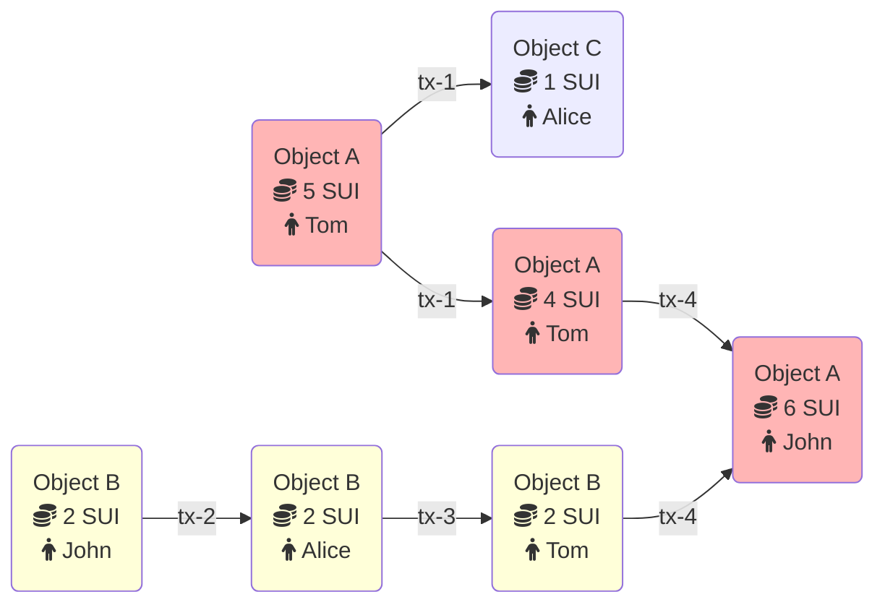

Sui에서의 모든 업데이트는 네트워크 자체에 대한 것이든 네트워크 위 object에 대한 것이든 transaction을 통해 발생한다.
Transaction은 object 생성과 asset mint부터 네트워크 operation 관리에 이르기까지 모든 것을 처리한다.

Sui에는 두 가지 유형의 transaction이 있다:

- **[Programmable transaction blocks (PTBs)](/guides/developer/transactions/ptbs/prog-txn-blocks):** smart contract 배포와 token 전송 같은 일상적인 네트워크 활동을 가능하게 한다. 누구나 PTB를 생성하고 제출할 수 있다.

- **System transactions:** epoch 변경과 checkpoint 생성 같은 네트워크 이벤트를 관리한다. 오직 validator만 system transactions를 제출할 수 있다.

## Transaction metadata

Programmable transaction blocks에는 다음 metadata field가 있다:

- **Sender address:** transaction을 보내는 사용자의 [address](/guides/developer/getting-started/get-address.mdx)이다.

- **Gas input:** transaction 실행과 저장 비용을 지불하는 데 사용하는 object를 가리키는 reference이다. sender address는 이 object를 소유해야 하며 이 object의 타입은 `sui::coin::Coin<SUI>`여야 한다.

- **Gas price:** transaction이 gas unit당 지불하는 native token 수를 지정하는 unsigned integer이다. gas price는 0보다 커야 한다.

- **Maximum gas budget:** transaction이 사용할 수 있는 gas unit의 최대 수이다. 실행이 이 예산을 초과하면 transaction은 gas input object에 비용을 청구하는 것을 제외하고 아무 effect 없이 abort된다. gas input object의 balance는 gas price와 maximum gas budget을 곱한 값보다 크거나 같아야 한다. 이 곱은 transaction이 청구할 수 있는 최대 금액을 나타낸다.

- **Epoch:** transaction이 대상으로 하는 epoch이다.

- **Type:** transaction이 call, publish, native transaction 중 무엇인지와 해당 타입별 데이터를 식별한다.

- **Authenticator:** 공개 키와 쌍을 이루는 암호학적 서명이다. 공개 키는 서명을 검증할 수 있어야 하며 sender address와 일치해야 한다.

- **Expiration:** 선택 사항이다. deadline 역할을 하는 epoch 번호이다. validator는 현재 epoch가 expiration epoch보다 작거나 같을 때만 transaction을 수락한다. deadline이 지나면 transaction은 실행되지 않는다. 기본적으로 transaction은 만료되지 않는다.

System transactions에는 gas input, price, budget이 없고 expiration도 없다.
system transaction의 sender address는 항상 `0x0`이다.

## Example of a transaction flow

object와 transaction의 관계는 [directed acyclic graph](https://en.wikipedia.org/wiki/Directed_acyclic_graph)(DAG)에 기록된다.
다음 예시는 Sui에서 object와 transaction이 서로 어떻게 연결되는지를 보여준다.

두 개의 object를 생각해 보자:

- Object A에는 5 SUI coin이 들어 있고 Tom의 것이다.

- Object B에는 2 SUI coin이 들어 있고 John의 것이다.

Tom은 Alice에게 1 SUI coin을 보내기로 결정한다.
이 경우 Object A가 이 transaction의 입력이며 이 object에서 1 SUI coin이 차감된다.
이 transaction의 출력은 다음과 같다:

- 여전히 Tom의 것이며 4 SUI coin을 가진 Object A.
- 1 SUI coin을 담고 Alice의 것이 된 새 Object C.

동시에 John은 Alice에게 2 SUI coin을 보내기로 결정한다.
이 transaction의 출력은 다음과 같다:

- 이제 Alice의 것이 된 2 SUI coin이 담긴 Object B.

두 transaction이 서로 다른 object와 상호작용하므로 두 번째 transaction은 Tom이 Alice에게 coin을 보내는 첫 번째 transaction과 병렬로 실행된다.

2 SUI coin을 받은 뒤 Alice는 그것을 Tom에게 보낸다.
이제 Tom은 Object A에서 온 4와 Object B에서 온 2를 합쳐 6 SUI coin을 가지게 된다.

마지막으로 Tom은 자신이 가진 모든 SUI coin을 John에게 보낸다.
이 transaction에서는 Object A와 Object B가 모두 입력이다.
Object B는 파기되고 그 값이 Object A에 더해진다.
그 결과 이 transaction의 출력은 값이 6 SUI인 Object A 하나뿐이다.

## Limits on transactions, objects, and data

Sui에는 transaction과 그에 사용되는 데이터에 대해 최대 크기와 사용 가능한 object 수 같은 몇 가지 제한이 있다.
이 제한은 Sui repo의 [`sui-protocol-config` crate](https://github.com/MystenLabs/sui/blob/main/crates/sui-protocol-config/src/lib.rs)에서 찾을 수 있다.
제한은 `ProtocolConfig` struct와 `get_for_version_impl` 함수에 설정된 값으로 정의되어 있다.