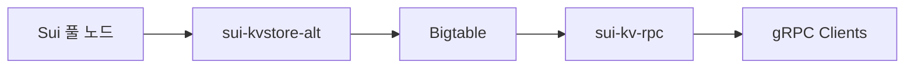

<ImportContent source="indexer-archival.mdx" mode="snippet" />

스택에 대한 자세한 내용은 [Archival Store and Service](/concepts/data-access/archival-store.mdx)를 참조하라.

## Architecture overview

이 스택은 세 가지 구성 요소로 이루어진다:

1. **Google Cloud Bigtable**: 11개 테이블에 걸쳐 모든 과거 chain 데이터를 저장하는 백엔드 스토어이다.
2. **`sui-kvstore-alt`** (인덱서): remote checkpoint store에서 checkpoint를 읽고 처리된 데이터를 Bigtable에 기록한다.
3. **`sui-kv-rpc`** (아카이브 서비스): Bigtable에서 데이터를 읽고 클라이언트에 [`LedgerService`](/references/fullnode-protocol) API를 노출하는 gRPC 서버이다.



<Tabs className="tabsHeadingCentered--small">
<TabItem value="prereq" label="Prerequisites">

- [Bigtable API](https://cloud.google.com/bigtable/docs/quickstart)가 활성화된 Google Cloud Platform(GCP) 프로젝트.
- 두 개의 GCP 서비스 계정:
   - 인덱서용 **읽기/쓰기 계정**. `roles/bigtable.user`가 필요하다(인덱서는 pipeline 데이터를 기록하고 자체 watermark도 읽는다).
   - gRPC 서비스용 **읽기 전용 계정**. `roles/bigtable.reader`가 필요하다.
- 대상 네트워크용 Sui checkpoint bucket 접근:
   - **Mainnet:** GCS bucket `mysten-mainnet-checkpoints` 또는 `https://checkpoints.mainnet.sui.io`
   - **Testnet:** GCS bucket `mysten-testnet-checkpoints` 또는 `https://checkpoints.testnet.sui.io`
- gRPC가 활성화된 [Sui full node](/guides/operator/sui-full-node.mdx). 초기 백필 이후에는 더 낮은 지연 시간을 위해 bucket을 폴링하는 대신 풀 노드에서 checkpoint를 스트리밍할 수 있다. [Steady-state operation](#steady-state-operation)을 참조하라.

</TabItem>
</Tabs>

## Authentication

인덱서와 gRPC 서비스는 모두 [Application Default Credentials (ADC)](https://cloud.google.com/docs/authentication/application-default-credentials)를 사용해 GCP에 인증한다. 동일한 자격 증명을 Bigtable 접근과 Google Cloud Storage(GCS) checkpoint bucket 읽기에 함께 사용한다.

**Google Kubernetes Engine(GKE)에서:** [Workload Identity](https://cloud.google.com/kubernetes-engine/docs/how-to/workload-identity)를 사용해 pod의 Kubernetes 서비스 계정을 GCP 서비스 계정에 바인딩하라. 키나 환경 변수는 필요 없으며, SDK가 metadata server에서 토큰을 자동으로 가져온다.

**GKE 외부에서:** `GOOGLE_APPLICATION_CREDENTIALS` 환경 변수를 서비스 계정 JSON 키 파일 경로로 설정하라.

```sh
export GOOGLE_APPLICATION_CREDENTIALS=/path/to/service-account.json
```

checkpoint bucket은 공개 읽기가 가능하지만, 인증된 요청은 익명 요청보다 더 높은 GCS 속도 제한을 받는다. 유효한 자격 증명과 함께 `--remote-store-gcs`를 사용하면 백필 중 throttling을 피할 수 있다.

## Bigtable setup

### Create a Bigtable instance

GCP 프로젝트에 Bigtable instance를 생성하라. 자세한 절차는 [Bigtable documentation](https://cloud.google.com/bigtable/docs/creating-instance)을 참조하라.

주요 결정 사항은 다음과 같다:

| 설정 | 권장 사항 |
|---------|---------------|
| 스토리지 유형 | SSD가 필요하다. HDD는 테스트되지 않았으며 권장하지 않는다. |
| 노드 수 | Mysten Labs는 현재 Mainnet에서 5개, Testnet에서 2개 노드를 시작점으로 운영한다. 백필에는 15개 노드까지 scale up하라. 정상 상태에서 필요한 노드 수는 read traffic에 따라 달라진다. autoscaling을 활성화하거나 CPU utilization을 모니터링하면서 수동으로 scale하라. |

**복제:** 단일 cluster instance를 기본값으로 권장한다. 여러 region에 read traffic을 제공해야 한다면 다른 zone에 cluster를 추가할 수 있다. Bigtable은 cluster 간에 데이터를 자동으로 복제하므로, 각 region마다 별도의 indexing stack을 운영하지 않아도 추가 region에서 저지연 읽기를 제공할 수 있다. 대신 스토리지 비용은 cluster 수에 비례해 증가한다(데이터가 각 cluster에 전체 복제되기 때문이다). 단일 cluster instance에는 app profile에서 single-cluster routing을 사용하고, multi-cluster routing이 필요한 경우에는 Bigtable이 가장 가까운 cluster로 요청을 라우팅하도록 설정하라.

### Create tables

다음 11개 테이블을 생성하라. 각 테이블은 `sui`라는 단일 column family를 가지며, 최신 cell version만 유지하는 GC policy를 사용한다:

| 테이블 | 설명 |
|-------|-------------|
| `checkpoints` | Checkpoint 요약, 서명, 내용 |
| `checkpoints_by_digest` | digest 기준 Checkpoint 조회 |
| `transactions` | transaction 데이터, effects, events, balance changes |
| `objects` | object ID와 version을 key로 하는 object 데이터 |
| `epochs` | system state를 포함한 epoch 시작 및 종료 데이터 |
| `watermark_alt` | 내부 인덱서 watermark 추적 |
| `protocol_configs` | epoch별 protocol configuration |
| `packages` | 원본 ID와 version을 key로 하는 package 메타데이터 |
| `packages_by_id` | ID 기준 package 조회 |
| `packages_by_checkpoint` | checkpoint 기준 package 조회 |
| `system_packages` | system package 데이터 |

`cbt` CLI 사용 예시는 다음과 같다:

```sh
for table in checkpoints checkpoints_by_digest transactions objects epochs \
    watermark_alt protocol_configs packages packages_by_id \
    packages_by_checkpoint system_packages; do
  cbt -project <GCP_PROJECT> -instance <INSTANCE_ID> createtable "$table"
  cbt -project <GCP_PROJECT> -instance <INSTANCE_ID> createfamily "$table" sui
  cbt -project <GCP_PROJECT> -instance <INSTANCE_ID> setgcpolicy "$table" sui maxversions=1
done
```

### Storage requirements

아래 storage footprint 추정치는 2026년 3월 초 기준 네트워크를 바탕으로 한 값이다. 이 수치는 방향성을 보여 주는 참고치이며, 네트워크 활동이 증가하면 함께 커진다.

**Mainnet(Genesis부터 전체 이력):**

| 테이블 | 크기 |
|-------|------|
| `transactions` | 8.1 TB |
| `objects` | 4.4 TB |
| `checkpoints` | 832 GB |
| `checkpoints_by_digest` | 15 GB |
| `watermark_alt` | 1.5 GB |
| `epochs` | 83 MB |
| `packages` | TBD (아직 백필되지 않음) |
| `packages_by_id` | TBD (아직 백필되지 않음) |
| `packages_by_checkpoint` | TBD (아직 백필되지 않음) |
| `protocol_configs` | TBD (아직 백필되지 않음) |
| `system_packages` | TBD (아직 백필되지 않음) |
| **합계** | **~13.3 TB** |

**Testnet(Genesis부터 전체 이력):**

| 테이블 | 크기 |
|-------|------|
| `transactions` | 2.5 TB |
| `objects` | 1.2 TB |
| `checkpoints` | 514 GB |
| `checkpoints_by_digest` | 18 GB |
| `watermark_alt` | 12 MB |
| `epochs` | 97 MB |
| `packages` | TBD (아직 백필되지 않음) |
| `packages_by_id` | TBD (아직 백필되지 않음) |
| `packages_by_checkpoint` | TBD (아직 백필되지 않음) |
| `protocol_configs` | TBD (아직 백필되지 않음) |
| `system_packages` | TBD (아직 백필되지 않음) |
| **합계** | **~4.3 TB** |

스토리지의 대부분은 `transactions`와 `objects` 테이블이 차지한다. `packages`, `packages_by_id`, `packages_by_checkpoint`, `protocol_configs`, `system_packages` pipeline은 새로 추가되었고 아직 백필되지 않았다. 백필이 완료되면 이들이 차지하는 storage 비중도 증가한다. 증가율은 네트워크 transaction volume에 따라 달라진다.

### Scaling

Bigtable은 수동과 자동 node scaling을 모두 지원한다. Mysten Labs는 더 나은 운영 제어를 위해 CPU 모니터링과 함께 수동 scaling을 사용하지만, 운영 개입을 줄이고 싶다면 autoscaling도 합리적인 선택이다.

모니터링할 핵심 임계값은 다음과 같다:

- **CPU utilization:** 60%(혼합 read/write) 또는 90%(write-only)를 지속적으로 넘으면 scale up하라.
- **Storage utilization:** 각 SSD node는 최대 5 TB를 지원하지만, Google은 급증 상황을 수용하기 위해 70%(node당 3.5 TB) 미만 유지를 권장한다. cluster가 compute와 storage 요구 사항을 모두 충족할 만큼 충분한 node를 갖추도록 하라.

### Backup policy

재해 복구를 위해 자동 백업을 구성하라. 일일 백업과 7일 보존 기간이 합리적인 기본값이다. 설정 방법은 [Bigtable backup documentation](https://cloud.google.com/bigtable/docs/backups)을 참조하라.

## Indexer setup

인덱서(`sui-kvstore-alt`)는 remote checkpoint store에서 checkpoint를 읽고 12개의 병렬 pipeline을 통해 데이터를 Bigtable에 기록한다.

#### Hardware requirements

**정상 상태(network tip 기준):**

- **CPU:** instance당 1 core(보수적 수치이며, 관측된 사용량은 약 0.1-0.2 cores이다)
- **Memory:** instance당 1 GB(보수적 수치이며, 관측된 사용량은 약 50 MB이다)

**백필:**

- **CPU:** 16 cores
- **Memory:** 32 GB

### Run `sui-kvstore-alt`

```sh
sui-kvstore-alt \
    --config <CONFIG_FILE> \
    --chain <CHAIN> \
    <INSTANCE_ID> \
    --remote-store-gcs <REMOTE_STORE_GCS_BUCKET>
```

| CLI parameter | 필수 | 설명 |
|---------------|----------|-------------|
| `--config` | 아니오 | TOML 구성 파일 경로이다. 생략하면 framework 기본값을 사용한다. [Indexer configuration](#indexer-configuration)을 참조하라. |
| `<INSTANCE_ID>` | 예 | Bigtable instance ID이다. |
| `--chain` | 예 | chain 식별자이다. `mainnet`, `testnet`, `unknown` 중 하나이다. |
| `--remote-store-gcs` | 소스 1개 필수 | checkpoint를 가져올 GCS bucket 이름이다(백필 권장). 다른 소스 플래그와 상호 배타적이다. |
| `--remote-store-url` | 소스 1개 필수 | remote checkpoint store의 HTTPS URL이다(`--remote-store-gcs`의 대안). 다른 소스 플래그와 상호 배타적이다. |
| `--rpc-api-url` | 소스 1개 필수 | checkpoint를 가져올 풀 노드 gRPC URL이다(정상 상태용). 다른 소스 플래그와 상호 배타적이다. |
| `--streaming-url` | 아니오 | live checkpoint 스트리밍용 풀 노드 gRPC URL이다. network tip에서 가장 낮은 지연 시간을 위해 `--rpc-api-url`과 함께 사용한다. |
| `--bigtable-project` | 아니오 | GCP 프로젝트 ID이다. 기본값은 서비스 계정 자격 증명과 연결된 프로젝트이다. |
| `--app-profile-id` | 아니오 | 라우팅용 Bigtable app profile ID이다. |
| `--write-legacy-data` | 아니오 | 설정하지 말라. deprecated data format 쓰기를 활성화하는 옵션이다. |
| `--first-checkpoint` | 아니오 | indexing을 시작할 checkpoint이다. 기본값은 0(Genesis)이다. |
| `--last-checkpoint` | 아니오 | indexing을 중지할 checkpoint이다. 범위가 제한된 백필 작업에 유용하다. |
| `--metrics-address` | 아니오 | Prometheus metrics bind address이다. 기본값: `0.0.0.0:9184`. |

#### Example (backfill from GCS bucket)

```sh
sui-kvstore-alt \
    --config kvstore.toml \
    --chain mainnet \
    my-bigtable-instance \
    --remote-store-gcs mysten-mainnet-checkpoints
```

#### Example (steady-state from fullnode)

```sh
sui-kvstore-alt \
    --chain mainnet \
    my-bigtable-instance \
    --rpc-api-url http://my-fullnode:9000 \
    --streaming-url http://my-fullnode:9000
```

### Indexer configuration {#indexer-configuration}

인덱서는 `--config`를 통해 선택적인 TOML 구성 파일을 받는다. chain tip indexing에서는 framework 기본값이 좋은 출발점이므로, 플래그를 완전히 생략해도 된다. 구성 튜닝은 주로 [Backfill rate limit sizing](#backfill-rate-limit-sizing)에 설명된 백필 상황에서 필요하다.

#### Top-level options

| 옵션 | 기본값 | 설명 |
|--------|---------|-------------|
| `total-max-rows-per-second` | unlimited | 모든 pipeline이 공유하는 전역 속도 제한(rows/sec)이다. 백필 중 Bigtable에 과도한 부하를 주지 않도록 이 값을 설정하라. |
| `max-rows-per-second` | unlimited | pipeline별 기본 속도 제한(rows/sec)이다. `total-max-rows-per-second`와 함께 모두 적용되므로, 특정 pipeline이 다른 pipeline을 굶기지 않도록 제한을 나눌 수 있다. 실제로는 대개 필요하지 않으므로 생략해도 된다. |
| `bigtable-connection-pool-size` | 10 | Bigtable connection pool의 gRPC channel 수이다. 경험칙으로 Bigtable node 수의 2배 정도를 사용하라. |
| `bigtable-channel-timeout-ms` | 60000 | Bigtable gRPC 호출에 대한 channel 수준 timeout(ms)이다. |

#### Committer settings (`[committer]`)

이 설정은 각 pipeline이 Bigtable에 데이터를 flush하는 방식을 제어한다. 최상위에 설정하면 모든 pipeline에 적용되고, pipeline별로 override할 수도 있다(아래 참조).

| 옵션 | 기본값 | 설명 |
|--------|---------|-------------|
| `write-concurrency` | 5 | pipeline당 동시 write task 수이다. 백필 중 high-throughput pipeline에서는 값을 늘려라. |
| `collect-interval-ms` | 500 | 버퍼링된 row를 flush하는 주기(ms)이다. |
| `watermark-interval-ms` | 500 | pipeline watermark를 갱신하는 주기(ms)이다. |

#### Per-pipeline overrides (`[pipeline.<name>]`)

12개 pipeline 각각은 전역 설정을 override할 수 있다. pipeline 수준 옵션은 `[pipeline.<name>]`, committer override는 `[pipeline.<name>.committer]`를 사용하라.

```toml
[pipeline.objects]
max-rows-per-second = 50000

[pipeline.objects.committer]
write-concurrency = 40
```

| 옵션 | 설명 |
|--------|-------------|
| `max-rows` | 이 pipeline의 Bigtable batch당 최대 row 수이다. |
| `max-rows-per-second` | 전역 `max-rows-per-second`를 override하는 pipeline별 속도 제한이다. |
| `committer.*` | 모든 committer 필드(`write-concurrency`, `collect-interval-ms`, `watermark-interval-ms`)를 pipeline별로 설정할 수 있다. |

15-node cluster에 권장되는 백필 구성은 [Backfill rate limit sizing](#backfill-rate-limit-sizing)을 참조하라.

추가적인 고급 옵션(channel size, fanout concurrency, backpressure threshold, ingestion setting 등)도 제공되지만, 드물게만 튜닝이 필요하다. 전체 참조는 [Pipeline architecture — Performance tuning](/concepts/data-access/pipeline-architecture#performance-tuning)을 참조하라.

### Pipelines

인덱서는 12개의 pipeline을 병렬로 실행한다. 아카이브 서비스의 전체 기능을 사용하려면 모든 pipeline이 필요하다:

| Pipeline | 대상 테이블 | 설명 |
|----------|-------------|-------------|
| `kvstore_checkpoints` | `checkpoints` | Checkpoint 요약, 서명, 내용 |
| `kvstore_checkpoints_by_digest` | `checkpoints_by_digest` | checkpoint digest와 sequence number의 매핑 |
| `kvstore_transactions` | `transactions` | effects, events, balance changes를 포함한 transaction |
| `kvstore_objects` | `objects` | 각 version에서 생성된 output object 데이터 |
| `kvstore_epochs_start` | `epochs` | system state와 gas price를 포함한 epoch 시작 데이터 |
| `kvstore_epochs_end` | `epochs` | epoch 종료 데이터 |
| `kvstore_protocol_configs` | `protocol_configs` | epoch별 protocol configuration 스냅샷 |
| `kvstore_epoch_legacy` | `epochs` | legacy epoch data format(`--write-legacy-data` 필요) |
| `kvstore_packages` | `packages` | 원본 package ID와 version을 key로 하는 package 메타데이터 |
| `kvstore_packages_by_id` | `packages_by_id` | package ID 기준 package 조회 |
| `kvstore_packages_by_checkpoint` | `packages_by_checkpoint` | 각 checkpoint에서 게시된 package |
| `kvstore_system_packages` | `system_packages` | system package 데이터 |

### Backfill

Genesis부터 indexing하려면 `--first-checkpoint` 없이 인덱서를 시작하라. 15-node SSD cluster와 16 CPU 인덱서 기준으로 Mainnet 전체 백필에는 약 **2-3일**이 걸린다.

백필에는 단일 인덱서 instance를 사용하라. 하나의 instance만으로도 15-node cluster를 완전히 포화시킬 만큼의 부하를 만들 수 있다. 16 CPU / 15-node 구성은 Mysten Labs가 테스트한 최대 규모이다. 더 큰 instance type과 cluster 크기도 동작할 수 있지만, 아직 확인되지 않은 소프트웨어 병목에 부딪힐 수 있다.

#### Recommended backfill strategy

1. 백필을 시작하기 전에 Bigtable cluster를 15개 node로 **scale up**하라.
2. 더 큰 머신(16 CPU / 32 GB RAM)에서 **인덱서 instance 하나를 실행**하고, checkpoint bucket을 데이터 소스로 사용하면서 공격적인 속도 제한(약 150,000 rows/sec)을 설정하라.
3. 백필이 network tip에 도달하면 **정상 상태로 전환**하라(아래 [Steady-state operation](#steady-state-operation) 참조).
4. Bigtable cluster를 5개 node로 **scale down**하라.

이후에는 cluster CPU utilization을 모니터링하면서 필요에 따라 node 수를 조정하라. Bigtable autoscaling을 사용해도 되고, 직접 모니터링하면서 수동으로 scale해도 된다.

#### Backfill rate limit sizing {#backfill-rate-limit-sizing}

TOML 구성에 설정하는 속도 제한은 Bigtable cluster 크기에 맞춰야 한다. 각 Bigtable SSD node는 CPU utilization 1%당 약 **111 rows/sec**를 유지할 수 있다. Google 권장 목표는 다음과 같다:

- concurrent read traffic이 없는 write-only 백필은 **CPU 90%**
- 백필 중 cluster가 읽기도 함께 처리한다면 **CPU 60%**

| 시나리오 | 목표 CPU | node당 rows/sec | 5 nodes | 10 nodes | 15 nodes |
|----------|-----------|-------------------|---------|----------|----------|
| Write-only 백필 | 90% | ~10,000 | ~50,000 | ~100,000 | ~150,000 |
| 읽기를 제공하면서 백필 | 60% | ~6,700 | ~33,500 | ~67,000 | ~100,000 |

이 수치는 가이드라인이다. 새 write-only cluster를 백필하는 경우 위 표의 값으로 속도 제한을 설정할 수 있다. 이미 read traffic을 처리 중인 cluster라면 더 낮은 값에서 시작하고, CPU utilization을 모니터링하면서 점진적으로 속도 제한을 올려라.

이에 맞춰 TOML 구성에서 `total-max-rows-per-second`를 설정하라. 다음 내용을 백필 구성 파일(예: `backfill.toml`)로 저장한 뒤 `--config backfill.toml`로 전달하라. 아래 예시는 15-node write-only 백필을 대상으로 한다.

```toml title="backfill.toml"
# Assumes a 15-node cluster targeting 90% CPU utilization (write-only).
# Scale linearly for smaller clusters, e.g. 50000 for 5 nodes, 100000 for 10.
total-max-rows-per-second = 150000
bigtable-connection-pool-size = 30

[pipeline.objects.committer]
write-concurrency = 40

[pipeline.transactions.committer]
write-concurrency = 20

[pipeline.checkpoints.committer]
write-concurrency = 10

[pipeline.checkpoints_by_digest.committer]
write-concurrency = 10
```

기본 `write-concurrency` 값은 5이며, 더 작은 pipeline에는 충분하다. 백필 중에는 high-throughput pipeline인 `objects`, `transactions`, `checkpoints`, `checkpoints_by_digest`만 더 높은 concurrency가 필요하다.

#### Checkpoint-range sharding

`--first-checkpoint`와 `--last-checkpoint`를 사용해 checkpoint 범위를 나누면 여러 인덱서 instance에 걸쳐 백필을 병렬화할 수 있다. 각 instance는 서로 다른 범위를 독립적으로 처리한다.

### Steady-state operation {#steady-state-operation}

백필이 완료되고 인덱서가 network tip을 따라잡으면, 가장 낮은 지연 시간을 위해 checkpoint bucket 대신 풀 노드 스트리밍으로 전환하라. 풀 노드의 gRPC endpoint를 가리키도록 `--remote-store-url`을 `--rpc-api-url`과 `--streaming-url`로 바꾸면 된다.

```sh
sui-kvstore-alt \
    --chain mainnet \
    my-bigtable-instance \
    --rpc-api-url http://my-fullnode:9000 \
    --streaming-url http://my-fullnode:9000
```

`--config`는 필요 없다. 정상 상태 indexing에는 framework 기본값이면 충분하다. full node는 gRPC만 활성화되어 있으면 된다. JSON-RPC는 필요 없다. Mysten Labs는 2주 리텐션 기간으로 full node를 운영하며, 백필에만 checkpoint bucket을 사용한다.

정상 상태에서 속도 제한을 설정하고 싶다면 tradeoff를 고려해야 한다. write throughput은 chain 자체에 의해 자연스럽게 제한되지만, 인덱서가 중단됐다가 복구되면 full node에서 가능한 한 빠르게 데이터를 따라잡는다. 속도 제한이 없으면 더 빨리 따라잡지만, 오래된 데이터를 기록하는 동안 read latency에 잠시 영향을 줄 수 있다. 속도 제한이 있으면 read latency는 안정적이지만 복구 시간이 더 길어진다.

:::info

Mysten Labs는 앞으로 공개 checkpoint bucket에 requester-pays를 활성화할 계획이다. 자체 full node에서 스트리밍하면 이러한 비용을 피할 수 있다.

:::

#### Running multiple instances

Bigtable write는 멱등적이므로 여러 인덱서 instance가 동일한 데이터를 안전하게 처리할 수 있다. Mysten Labs는 chain 업데이트가 지연되지 않도록 정상 상태에서 **3개의 인덱서 instance**를 실행해 rolling deployment를 지원한다.

백필 중에는 단일 instance면 충분하다. 하나의 instance로 15-node cluster를 포화시킬 수 있다.

## Archival Service setup

아카이브 서비스(`sui-kv-rpc`)는 Bigtable에서 데이터를 읽고 [`LedgerService`](/references/fullnode-protocol) API를 노출하는 gRPC 서버이다.

리소스 요구 사항은 read traffic에 따라 달라진다. CPU와 memory utilization을 모니터링하면서 그에 맞게 scale하라.

### Run `sui-kv-rpc`

```sh
sui-kv-rpc \
    <INSTANCE_ID> \
    <ADDRESS>
```

| CLI parameter | 필수 | 설명 |
|---------------|----------|-------------|
| `<INSTANCE_ID>` | 예 | Bigtable instance ID이다. |
| `<ADDRESS>` | 아니오 | gRPC listen address이다. 기본값: `[::1]:8000`. |
| `--credentials` | 아니오 | GCP 서비스 계정 JSON 키 파일 경로이다. 제공하지 않으면 [Application Default Credentials](https://cloud.google.com/docs/authentication/application-default-credentials)를 사용한다. |
| `--tls-cert` | 아니오 | TLS certificate PEM 파일 경로이다. |
| `--tls-key` | 아니오 | TLS private key PEM 파일 경로이다. |
| `--bigtable-project` | 아니오 | GCP 프로젝트 ID이다. 기본값은 서비스 계정 자격 증명과 연결된 프로젝트이다. |
| `--app-profile-id` | 아니오 | Bigtable app profile ID이다. |
| `--checkpoint-bucket` | 아니오 | 전체 checkpoint 데이터용 GCS bucket이다(더 풍부한 checkpoint 응답을 활성화한다). |
| `--bigtable-channel-timeout-ms` | 아니오 | Bigtable gRPC 호출의 channel 수준 timeout(밀리초)이다. 기본값: 60000. |

#### Example

```sh
sui-kv-rpc \
    my-bigtable-instance \
    "[::]:8000" \
    --credentials /etc/sui-kv-rpc/bigtable-ro-sa.json \
    --tls-cert /secrets/cert.pem \
    --tls-key /secrets/key.pem
```

### gRPC API

아카이브 서비스는 Sui 풀 노드가 노출하는 것과 동일한 [`LedgerService`](/references/fullnode-protocol) gRPC API를 구현한다. 기존 gRPC client는 endpoint URL만 바꾸면 아카이브 서비스를 조회할 수 있다.

| Method | 설명 | Batch limit |
|--------|-------------|-------------|
| `GetServiceInfo` | chain ID, 현재 epoch, 최신 checkpoint, server version을 반환한다. | - |
| `GetObject` | ID로 object를 조회한다. 필요하면 특정 version을 지정할 수 있다. | - |
| `BatchGetObjects` | object 일괄 조회이다. 정확한 version이 필요하다. | 1000 |
| `GetTransaction` | digest로 transaction을 조회한다. | - |
| `BatchGetTransactions` | transaction 일괄 조회이다. | 200 |
| `GetCheckpoint` | sequence number 또는 digest로 checkpoint를 조회한다. | - |
| `GetEpoch` | epoch number로 epoch 데이터를 조회한다. | - |

모든 method는 응답 크기를 줄이기 위해 `read_mask` parameter를 통한 field masking을 지원한다.

gRPC server reflection은 활성화되어 있으며(v1, v1alpha 모두), `grpcurl`과 Postman 같은 도구가 API schema를 발견할 수 있다.

### Health check

이 서비스는 8081 포트에서 `GET /health` HTTP 헬스 체크 endpoint를 노출한다.

### TLS

프로덕션 배포에서는 `--tls-cert`와 `--tls-key`를 제공해 TLS를 활성화하라. 서비스는 PEM 형식의 certificate와 private key 파일을 기대한다.

## Monitoring

인덱서와 아카이브 서비스는 모두 9184 포트의 `/metrics`에서 Prometheus metrics를 노출한다.

인덱서는 General-purpose Postgres 인덱서와 동일한 [indexer framework metrics](/concepts/data-access/indexer-runtime-perf)(ingestion, pipeline, watermark, commit metrics)를 사용하며, `kvstore_alt_` prefix와 pipeline별 label을 추가한다. 이미 Postgres 인덱서 스택을 운영하고 있다면 동일한 dashboard와 alert를 적용할 수 있다.

### Prometheus scrape configuration

```yaml
scrape_configs:
  - job_name: sui-kvstore
    static_configs:
      - targets: ['<INDEXER_HOST>:9184']
  - job_name: sui-kv-rpc
    static_configs:
      - targets: ['<RPC_HOST>:9184']
```

### Archival service metrics

아카이브 서비스는 다음 metrics를 노출한다:

| Metric | Type | 설명 |
|--------|------|-------------|
| `rpc_request_latency` | histogram | end-to-end 요청 지연 시간 |
| `rpc_requests` | counter | `status` label이 붙은 요청 수 |
| `rpc_inflight_requests` | gauge | `path` label이 붙은 동시 진행 중 요청 수 |
| `kv_get_latency_ms` | histogram | `table` label이 붙은 batch 요청당 Bigtable read latency |
| `kv_get_latency_ms_per_key` | histogram | `table` label이 붙은, batch 크기로 나눈 Bigtable read latency |
| `kv_scan_latency_ms` | histogram | `table` label이 붙은 Bigtable scan latency |
| `kv_bt_chunk_latency_ms` | histogram | `table` label이 붙은 응답 chunk당 Bigtable 내부 처리 시간 |
| `kv_get_success` | counter | `table` label이 붙은 성공한 Bigtable read 수 |
| `kv_scan_success` | counter | `table` label이 붙은 성공한 Bigtable scan 수 |
| `thread_stall_duration_sec` | histogram | Tokio thread stall duration |

### Recommended log levels

| 환경 | `RUST_LOG` |
|-------------|-----------|
| 프로덕션 | `info` |
| 디버깅 | `info,sui_kvstore=debug,sui_indexer_alt_framework=debug` |