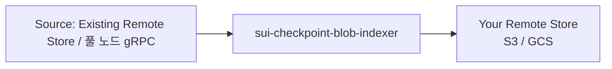

remote store는 protobuf로 인코딩된 checkpoint blob을 담는 object store(S3 또는 GCS)이다. 풀 노드는 여기서 state sync를 위해 읽고, indexer는 백필을 위해 읽는다. `sui-checkpoint-blob-indexer`는 source에서 checkpoint를 읽고 destination에 압축된 protobuf blob을 기록하여 이 store를 채운다.

## Architecture overview



<Tabs className="tabsHeadingCentered--small">
<TabItem value="prereq" label="Prerequisites">

- checkpoint source에 접근할 수 있어야 한다:
   - **Mysten's public buckets**: GCS bucket `mysten-mainnet-checkpoints`(Mainnet) 또는 `mysten-testnet-checkpoints`(Testnet). `https://checkpoints.mainnet.sui.io` 및 `https://checkpoints.testnet.sui.io`의 HTTPS로도 사용할 수 있다.
    - **Your own 풀 노드:** 정상 상태 스트리밍을 위해 gRPC가 활성화되어 있어야 한다.
- 쓰기 자격 증명이 있는 destination object store(S3 또는 GCS).
- `sui-checkpoint-blob-indexer` 바이너리.

</TabItem>
</Tabs>

## Pipelines

indexer는 세 개의 pipeline을 실행한다. 활성화해야 하는 것은 앞의 두 개뿐이다:

| Pipeline | Output | 설명 |
|----------|--------|------|
| `checkpoint_blob` | `{seq}.binpb.zst` | protobuf로 인코딩된 checkpoint blob. **이 형식을 사용해야 한다.** |
| `epochs` | `epochs.json` | epoch 경계 checkpoint sequence number의 정렬된 목록. 필수 metadata이다. |
| `checkpoint_bcs` | `{seq}.chk` | BCS로 인코딩된 checkpoint. **더 이상 사용되지 않으며 제거 중이다. 이 pipeline은 활성화하지 말라.** |

## Backfill from an existing bucket

자체 remote store를 채우는 가장 쉬운 방법은 Mysten의 공개 GCS bucket에서 백필하는 것이다. source로 `--remote-store-gcs`를 사용하고, destination flag(`--s3` 또는 `--gcs`)로 자신의 store에 기록한다.

#### Example: Backfill an S3 bucket from Mysten's GCS bucket (Mainnet)

```sh
sui-checkpoint-blob-indexer \
    --pipeline checkpoint_blob --pipeline epochs \
    --remote-store-gcs mysten-mainnet-checkpoints \
    --s3 my-checkpoint-bucket \
    --compression-level 3
```

Testnet에서는 `--remote-store-gcs mysten-testnet-checkpoints`를 사용한다.

`--remote-store-gcs` 대신 `--remote-store-url https://checkpoints.mainnet.sui.io`를 사용할 수도 있지만, HTTPS가 아니라 GCS API를 직접 사용하므로 백필에는 GCS 옵션이 더 빠르다.

:::info

Mysten Labs는 향후 공개 checkpoint bucket에 requester-pays를 활성화할 계획이다. 자체 풀 노드에서 스트리밍하면 이러한 비용을 피할 수 있다.

:::

## Alternative: Backfill from a full node

pruning되지 않은 풀 노드가 있다면 bucket 대신 이를 checkpoint source로 사용할 수 있다:

```sh
sui-checkpoint-blob-indexer \
    --pipeline checkpoint_blob --pipeline epochs \
    --rpc-api-url http://my-fullnode:9000 \
    --s3 my-checkpoint-bucket \
    --compression-level 3
```

## Steady-state operation

백필이 network tip을 따라잡으면 가장 낮은 지연 시간을 위해 풀 노드 gRPC 스트리밍으로 전환한다. checkpoint를 가져올 때는 `--rpc-api-url`을, 실시간 스트리밍에는 `--streaming-url`을 사용한다:

```sh
sui-checkpoint-blob-indexer \
    --pipeline checkpoint_blob --pipeline epochs \
    --rpc-api-url http://my-fullnode:9000 \
    --streaming-url http://my-fullnode:9000 \
    --s3 my-checkpoint-bucket \
    --compression-level 3
```

풀 노드에는 gRPC만 활성화되어 있으면 된다. JSON-RPC는 필요하지 않다.

### Running multiple instances

쓰기 작업은 멱등적이므로 여러 indexer instance가 같은 bucket에 안전하게 기록할 수 있다. 정상 상태에서는 체인의 업데이트를 지연시키지 않고 롤링 배포를 가능하게 하려면 **2-3개의 instance**를 실행한다. 백필 중에는 instance 하나면 충분하다.

## CLI reference

### Destination flags (mutually exclusive, one required)

| Flag | 설명 |
|------|------|
| `--s3 <BUCKET>` | AWS S3에 기록한다. Env: `AWS_ENDPOINT`, `AWS_ACCESS_KEY_ID`, `AWS_SECRET_ACCESS_KEY`, `AWS_DEFAULT_REGION`. |
| `--gcs <BUCKET>` | Google Cloud Storage에 기록한다. Env: `GOOGLE_SERVICE_ACCOUNT_PATH`. |
| `--http <URL>` | HTTP endpoint에 기록한다. |

### Source flags (mutually exclusive, one required)

| Flag | 설명 |
|------|------|
| `--remote-store-gcs <BUCKET>` | GCS bucket에서 checkpoint를 가져온다. 백필에 권장된다. |
| `--remote-store-url <URL>` | HTTPS remote store URL에서 checkpoint를 가져온다. |
| `--remote-store-s3 <BUCKET>` | S3 bucket에서 checkpoint를 가져온다. |
| `--rpc-api-url <URL>` | 풀 노드 gRPC endpoint에서 checkpoint를 가져온다. |

### Other flags

| Flag | Default | 설명 |
|------|---------|------|
| `--config <PATH>` | — | 선택적 TOML 구성 파일 경로. 대부분의 배포에는 framework 기본값이면 충분하다. [Configuration](#configuration-toml)을 참고한다. |
| `--compression-level <LEVEL>` | 없음(압축하지 않음) | Zstd 압축 레벨. **강력히 권장한다.** 이 플래그가 없으면 파일은 `.binpb.zst` 대신 `.binpb`로 기록된다. indexer framework는 remote store에서 읽을 때 `.binpb.zst`를 기대하므로 압축되지 않은 파일은 downstream consumer가 찾지 못한다. `3`이 좋은 기본값이다. |
| `--streaming-url <URL>` | — | 실시간 checkpoint 스트리밍용 풀 노드 gRPC URL. network tip에서 가장 낮은 지연 시간을 위해 `--rpc-api-url`과 함께 사용한다. |
| `--first-checkpoint <N>` | 0 | 인덱싱을 시작할 checkpoint. |
| `--last-checkpoint <N>` | — | 인덱싱을 중지할 checkpoint(포함). 범위가 있는 백필 작업에 유용하다. |
| `--pipeline <NAME>` | 모든 pipeline | 지정한 pipeline만 실행한다. 반복 지정할 수 있다. |
| `--request-timeout <DURATION>` | `30s` | object store 작업에 대한 HTTP request timeout. |
| `--metrics-address <ADDR>` | `0.0.0.0:9184` | Prometheus metrics 바인드 주소. |

## Configuration (TOML)

권장되는 두 개의 pipeline만 실행하고 deprecated된 BCS pipeline을 제외하려면 `--pipeline`을 사용한다:

```sh
--pipeline checkpoint_blob --pipeline epochs
```

object store 워크로드에 맞게 committer를 조정하려면 다음 TOML 구성 파일을 `--config`로 전달한다:

```toml
[committer]
write-concurrency = 500
watermark-interval-ms = 120000
watermark-interval-jitter-ms = 120000
```

- **`write-concurrency`**: object store에 최대 500개의 동시 쓰기를 허용한다. storage provider에서 강한 throttling이 관찰되면 이 값을 낮춘다.
- **`watermark-interval-ms`**: object store의 watermark file에서 hot-key 문제가 발생하지 않도록 framework 기본값보다 watermark update 빈도를 낮춘다.
- **`watermark-interval-jitter-ms`**: watermark interval에 무작위 jitter를 더해 여러 indexer instance를 실행할 때 동시에 같은 key에 기록하지 않도록 한다.

구성 옵션(`[ingestion]`, `[committer]`, `[pipeline.<name>]`)은 indexer framework의 표준 설정과 동일하다. 전체 참조는 [Pipeline architecture: Performance tuning](/concepts/data-access/pipeline-architecture#performance-tuning)을 참고한다.

## Output format

indexer는 destination object store에 다음 파일을 기록한다:

| Path | 설명 |
|------|------|
| `{seq}.binpb.zst` | Zstd로 압축된 protobuf checkpoint blob(`--compression-level`이 설정된 경우). **기대되는 형식이다.** |
| `{seq}.binpb` | 압축되지 않은 protobuf checkpoint blob(`--compression-level`이 없는 경우). **권장되지 않는다.** indexer framework는 remote store에서 수집할 때 `.binpb.zst`를 찾는다. |
| `epochs.json` | 정렬된 epoch 경계 checkpoint sequence number의 JSON 배열. |
| `_metadata/watermarks/` | 진행 상황을 추적하기 위해 indexer가 사용하는 내부 watermark 파일. |

## Monitoring

indexer는 port 9184의 `/metrics`에서 Prometheus metrics를 노출하며(`--metrics-address`로 구성 가능), metrics는 `checkpoint_blob_` 접두어를 사용한다. indexer는 다른 indexer와 동일한 [indexer framework metrics](/concepts/data-access/indexer-runtime-perf)를 사용하며(ingestion, pipeline, watermark, commit metrics), 여기에 pipeline별 label이 추가된다.

```yaml
scrape_configs:
  - job_name: sui-checkpoint-blob-indexer
    static_configs:
      - targets: ['<HOST>:9184']
```