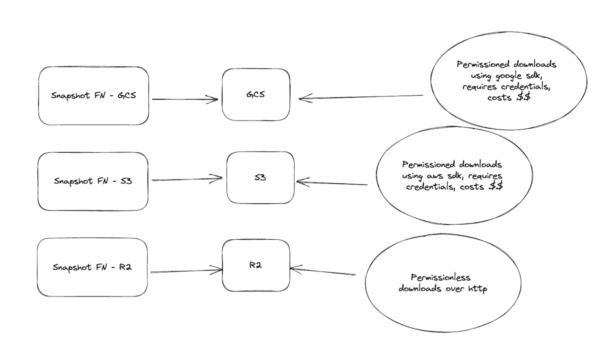

데이터베이스 스냅샷은 database store의 특정 시점 view를 제공한다. Sui에서 데이터베이스 스냅샷은 특정 node에서 한 epoch의 끝 시점에 실행 중인 database가 바라본 Sui network의 view를 포착한다. validators도 스냅샷을 활성화할 수 있지만, 일반적으로는 풀 노드 운영자에게 가장 가치가 크다.

Sui network의 스냅샷은 풀 노드 운영자가 genesis 이후 발생한 모든 transactions를 실행하지 않고도 풀 노드를 bootstrap할 수 있게 한다. 스냅샷은 S3, Google Cloud Storage, Azure Blob Storage 같은 remote object store와 유사 서비스에 업로드할 수 있다. 이러한 서비스는 일반적으로 export process를 백그라운드에서 실행하므로 풀 노드 성능이 저하되지 않는다. 스냅샷을 cloud에 저장하면 시스템이나 하드웨어의 catastrophic failures에서 더 쉽고 빠르게 복구할 수 있다.

건전한 Sui network를 유지하기 위해 Sui는 네트워크 전반에서 더 강한 data availability를 보장할 수 있도록 Sui community가 추가 스냅샷을 운영하기를 장려한다.

## Supported snapshot types

Sui는 두 가지 유형의 스냅샷을 지원한다:

- **RocksDB 스냅샷**은 database store의 특정 시점 view이다. 이는 snapshot이 snapshot을 생성한 순간의 시스템 state를, pruning되지 않은 data, 추가 indices, 기타 data를 포함해 유지한다는 뜻이다.
- **포멀 스냅샷**은 minimalistic한 database-agnostic format이다. 다시 말해, 지정한 epoch에서 node를 유효한 state로 복원하는 데 필요한 data만 담는다. 따라서 storage footprint가 훨씬 작고, 일반적으로 데이터베이스 스냅샷보다 복원이 더 빠르다. 포멀 스냅샷은 Sui protocol에서도 기본적으로 지원된다. 이 맥락에서 복원하려는 epoch의 committee가 제공한 commitment와 포멀 스냅샷의 내용을 암호학적으로 검증할 수 있다. 이 검증은 포멀 스냅샷 restore 중에 자동으로, 그리고 기본적으로 수행된다(명시적으로 우회하지 않는 한).

:::info

포멀 스냅샷은 과거 data lookup을 수행하는 RPC node를 운영하는 경우에는 적합하지 않다. node data management에 대한 자세한 내용은 [Data Management](./data-management.mdx)를 참고한다.

:::

풀 노드 스냅샷은 각 epoch 끝에서 state snapshot을 생성하도록 구성할 수 있다.
단일 풀 노드는 RocksDB 스냅샷, 포멀 스냅샷, 또는 둘 다 생성할 수 있다.

## Formal snapshots

포멀 스냅샷은 genesis 이후 발생한 모든 transactions를 실행하지 않고도, node가 과거의 특정 시점에 canonical state(epoch 끝 시점의 fully pruned and compacted node state)로 복원할 수 있는 메커니즘을 제공한다. 기존 데이터베이스 스냅샷과 달리, 이러한 포멀 스냅샷은 다음과 같은 속성을 가진다:

1. **Minimalism:** 포멀 스냅샷은 현재 epoch 끝의 live object set(향후 transactions의 input objects로 사용할 수 있는 모든 object versions의 집합)만 포함한다. Sui는 다른 중요한 chain 정보는 chain에서 동기화하거나 파생한다. 따라서 포멀 스냅샷은 node가 epoch boundary에서 시작해 network에 참여하는 데 필요한 data만 포함한다.
1. **Agnosticism:** 포멀 스냅샷은 본질적으로 protocol의 기반 database 선택이나 구현과 무관하다. live object set이 protocol에 의해 정의되므로 포멀 스냅샷도 마찬가지이다.
1. **Verifiability:** 포멀 스냅샷은 핵심 Sui protocol에서 first-class support를 받는다. 따라서 node operator는 다운로드할 때 이를 trustless/verifiable하게 확인할 수 있어야 한다. 이를 지원하기 위해 protocol은 epoch 끝의 live object state에 대한 commitment에 서명하고, restore 시점에 포멀 스냅샷은 이 commitment와 대조해 검사된다. 이 검증이 실패하면 node state는 snapshot restore를 시도하기 전 상태로 되돌아간다.

이 스냅샷에는 indexes가 없으므로 validators와 state sync 풀 노드(SSFNs)에 가장 즉각적으로 유용하다. 스냅샷은 S3, Google Cloud Storage, Azure Blob Storage 같은 remote object store와 유사 서비스에 업로드할 수 있다. 이러한 서비스는 일반적으로 export process를 백그라운드에서 실행하므로 풀 노드 성능이 저하되지 않는다. 스냅샷을 cloud에 저장하면 시스템이나 하드웨어의 catastrophic failures에서 더 효율적으로 복구할 수 있다.

## Restoring a full node using snapshots

### Restoring using RocksDB snapshots

RocksDB snapshot으로 복원하려면 다음 단계를 따른다:

1. 복원하려는 epoch의 snapshot을 local disk에 다운로드한다. S3 bucket에는 epoch마다 snapshot이 하나 있다.
1. snapshot을 fullnode.yaml file에서 `db-path` 값이 가리키는 directory에 둔다. 예를 들어 `db-path` 값이 `/opt/sui/db/authorities_db/full_node_db`를 가리키고 epoch 10에서 복원하려면 다음 명령으로 해당 directory에 snapshot을 복사한다:

   다운로드에 사용할 credentials가 있다면 AWS CLI를 사용할 수 있다:
   `aws s3 cp s3://<BUCKET_NAME>/epoch_10 /opt/sui/db/authorities_db/full_node_db/live --recursive --request-payer requester`.

1. `aws s3 cp`(또는 `gsutil cp`)를 사용하면 database는 `--path`에 전달한 위치 아래 `epoch_[NUM]`라는 이름의 directory로 복사된다. `epoch_[NUM]` directory를 node의 `db_path` 아래 `live/`로 이름 변경한다. 예를 들어 `cp -r /tmp/epoch_[NUM] /opt/sui/db/authorities_db/full_node_db/live`를 사용한다.
1. 다운로드한 directory의 ownership을 sui user(`sui-node`를 실행하는 Linux user)에 맞게 업데이트해야 한다.
   `sudo chown -R sui:sui  /opt/sui/db/authorities_db/full_node_db/live`.
1. Sui node를 시작한다.

:::info

스냅샷에서 풀 노드를 복원할 때는 `/opt/sui/db/authorities_db/full_node_db/live` 경로에 써야 한다. validator node를 복원할 때는 database 대상 경로를 `/opt/sui/db/authorities_db/live`로 줄일 수 있다. 경로 위치를 확인하려면 풀 노드 또는 Validator configs의 `db_path` field를 확인한다.

:::

### Restoring using formal snapshots

포멀 스냅샷으로 복원하려면 `sui-tool` binary를 사용한다. 다른 `sui` binaries와 함께 `sui-tool`을 다운로드할 수 있다.
자세한 내용은 [Install Sui](/guides/developer/getting-started/sui-install.mdx)를 참고한다.

다음 단계에 따라 포멀 스냅샷에서 node를 복원할 수 있다:

1. node가 실행 중이면 중지한다.
2. 다음 명령을 실행한다:
   ```
   sui-tool download-formal-snapshot --latest --genesis "<PATH-TO-GENESIS-BLOB>" \
        --network <NETWORK> --snapshot-bucket <BUCKET-NAME> --snapshot-bucket-type <TYPE> \
        --path <PATH-TO-NODE-DB> --num-parallel-downloads 50 --no-sign-request
   ```
   - `--epoch`: 다운로드하려는 epoch이다. Mysten Labs hosted buckets는 마지막 90개 epoch만 보관하므로, [suivision](https://suivision.xyz/)이나 [suiscan](https://suiscan.xyz/) 같은 sui explorers에서 최신 epoch를 확인할 수 있다.
   - `--latest`: `--epoch`로 epoch를 명시적으로 전달하는 대신 `--latest` flag를 전달하면 최신 snapshot이 자동으로 선택된다.
   - `--genesis`: network의 `genesis.blob` 위치 경로이다.
   - `--network`: snapshot을 다운로드할 network이다. 기본값은 `mainnet`이다.
   - `--path`: local filesystem의 snapshot directory 경로이다.
   - `--no-sign-request`: 설정하면 `--snapshot-bucket`과 `--snapshot-bucket-type`은 무시되고 Cloudflare R2를 사용한다.
   - `--snapshot-bucket`: source snapshot bucket 이름(예: `mysten-mainnet-snapshots`)이다. `--no-sign-request`와 함께 사용할 수 없다.
   - `--snapshot-bucket-type`: snapshot bucket 유형이다. 현재 GCS와 S3를 지원한다. `--no-sign-request`와 함께 사용할 수 없다.

   `--no-sign-request`가 설정되지 않은 경우 다음 environment variables를 사용한다:
   * *AWS*: `AWS_SNAPSHOT_ACCESS_KEY_ID`, `AWS_SNAPSHOT_SECRET_ACCESS_KEY`, `AWS_SNAPSHOT_REGION`
   * *GCS*: `GCS_SNAPSHOT_SERVICE_ACCOUNT_FILE_PATH`
   * *AZURE*: `AZURE_SNAPSHOT_STORAGE_ACCOUNT`, `AZURE_SNAPSHOT_STORAGE_ACCESS_KEY`


## Mysten Labs managed snapshots

Mysten Labs는 두 계층의 snapshot storage access를 호스팅한다. **High throughput, Requester Pays enabled buckets**와 **free, permissionless buckets**이다.

**High throughput, Requester Pays enabled buckets:**
* GCS와 S3는 둘 다 requester pays로 설정되어 있다. 따라서 이 buckets에서 다운로드할 때 유효한 AWS/GCP credentials 세트를 제공해야 한다.
[Requester Pays](https://cloud.google.com/storage/docs/requester-pays)는 snapshot data를 가져오는 egress 비용을 사용자가 부담한다는 뜻이다.
* 가장 빠른 다운로드 속도가 필요하다면 [transfer acceleration](https://aws.amazon.com/s3/transfer-acceleration/)이 활성화된 S3 buckets 사용을 권장한다.

**Free, permissionless buckets:**
* 이 buckets는 현재 Cloudflare R2에서 호스팅되며, 현재는 북미에만 있지만 곧 더 많은 regions를 추가할 계획이다.
* bucket이 인터넷에 공개되어 있으므로 cloud credentials를 제공할 필요가 없다.
* 무료 buckets(예: `sui-tool download-formal-snapshot --no-sign-request`)는 이제 _formal_ snapshots에서만 사용할 수 있다. db snapshot을 다운로드하려면 requester pays(S3 또는 GCS) buckets 중 하나를 사용해야 한다.

### Bucket names

**S3**

Testnet: `s3://mysten-testnet-snapshots/`, `s3://mysten-testnet-formal/`

Mainnet: `s3://mysten-mainnet-snapshots/`,  `s3://mysten-mainnet-formal/`

**GCS**

Testnet: `gs://mysten-testnet-snapshots/`, `gs://mysten-testnet-formal/`

Mainnet: `gs://mysten-mainnet-snapshots/`,  `gs://mysten-mainnet-formal/`



## Enabling snapshots

풀 노드는 기본적으로 스냅샷을 생성하지 않는다. 이 기능을 활성화하려면 풀 노드에 특정 configs를 적용해야 한다.

다음 단계에 따라 풀 노드의 configs를 변경한다:

1. node가 실행 중이면 중지한다.
2. `fullnode.yaml` config 파일을 열고 다음 섹션에 나온 대로 config 업데이트를 적용한다.
3. `fullnode.yaml` 파일을 저장한 뒤 node를 다시 시작한다.

### Enabling DB snapshots

config 파일에 `db-checkpoint-config` 항목을 추가한다. 예시는 Amazon의 S3 service를 사용한다:
   ```yaml
   db-checkpoint-config:
     perform-db-checkpoints-at-epoch-end: true
     perform-index-db-checkpoints-at-epoch-end: true
     object-store-config:
       object-store: "S3"
       bucket: "<BUCKET-NAME>"
       aws-access-key-id: “<ACCESS-KEY>”
       aws-secret-access-key: “<SHARED-KEY>”
       aws-region: "<BUCKET-REGION>"
       object-store-connection-limit: 20
   ```
   - `object-store`: snapshots를 업로드할 remote object store이다. 예시에서는 Amazon의 `S3` service로 설정한다.
   - `bucket`: snapshots를 저장할 S3 bucket 이름이다.
   - `aws-access-key-id`와 `aws-secret-access-key`: bucket에 write access가 있는 AWS 인증 정보이다.
   - `aws-region`: bucket이 있는 region이다.
   - `object-store-connection-limit`: object store에 대한 동시 연결 수이다.

### Enabling formal snapshots

 config 파일에 `state-snapshot-write-config` 항목을 추가한다. 예시는 Amazon의 S3 service를 사용한다:
   ```yaml
   state-snapshot-write-config:
     object-store-config:
       object-store: "S3"
       bucket: "<BUCKET-NAME>"
       aws-access-key-id: “<ACCESS-KEY>”
       aws-secret-access-key: “<SHARED-KEY>”
       aws-region: "<BUCKET-REGION>"
       object-store-connection-limit: 200
   ```
   예시에 나온 configuration settings는 AWS S3에 관한 것이지만, GCS, Azure Storage, Cloudflare R2도 모두 지원한다.