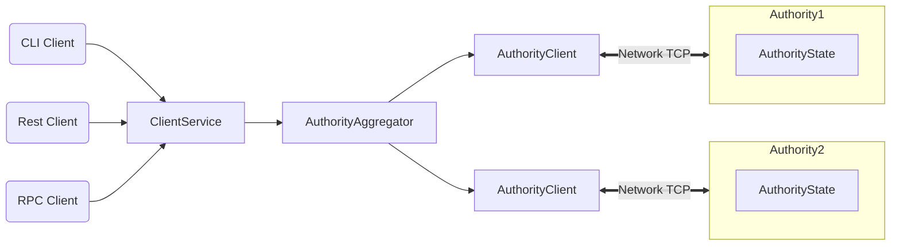

Sui 개발자 문서는 모든 페이지에 MarkdownX(`.mdx`) 형식을 사용한다.

MDX는 Markdown 콘텐츠 내에서 [JSX within Markdown content](https://mdxjs.com/)를 허용한다.

이 사이트는 admonitions 및 Mermaid 다이어그램과 같은 기본 제공 기능을 제공하는 오픈 소스 프레임워크인 Docusaurus를 사용한다.

또한 커뮤니티 플러그인과 문서 팀이 개발한 custom component도 활용한다.

이러한 기능은 기여에 필수는 아니지만, 독자의 경험을 향상한다면 포함할 수 있다.

## Custom frontmatter

모든 문서 페이지 상단의 frontmatter는 페이지 링크 미리보기에 표시되는 설명, 최적화된 검색 결과를 위한 키워드, 그리고 기타 선택적 형식 관련 component를 포함하여 페이지에 대한 추가 컨텍스트를 제공한다.

모든 페이지에 다음 component를 포함한다:

```
---
title: Title of Page
description: 1-2 sentences summarizing the page's content.
keywords: [ words, for, search, results ]
---
```

### Optional frontmatter

#### `beta`

기능 또는 주제의 beta 상태를 독자에게 알리기 위해 페이지 상단에 admonition box를 추가한다.

**Options:**
- `true` → 표준 beta box
- `devnet`, `testnet`, `mainnet` → 기능을 사용할 수 있는 environment를 표시함

**Example:**

```yaml
---
title: Page title
description: A page of information describing a beta feature.
beta: devnet, testnet
---
```

#### `effort`

end-to-end tutorial에 사용한다.

tutorial을 완료하는 데 필요한 effort를 나타내는 admonition box를 상단에 추가한다.

**Options:**

- `small`
- `medium`
- `large`

**Example:**

```yaml
---
title: A Guide
description: A guide on how to do this thing in Sui.
effort: medium
---
```

## `UnsafeLink`

URL에 대한 Docusaurus link checker를 건너뛰려면 `UnsafeLink`를 사용한다.

이것은 Docusaurus build가 자동 생성하는 페이지에 **필수**인데, 그러한 페이지는 link checker가 실행된 뒤에 생성되므로 그렇지 않으면 build error가 발생하기 때문이다.

:::info
로컬 개발에서는 `onBrokenMarkdownLinks: "warn"` 설정이 `"warn"`으로 유지되지만, 프로덕션에서는 build 프로세스가 여전히 build error를 발생시킨다.
:::

**Example:**

```jsx
<UnsafeLink href="link/to/path">Link title</UnsafeLink>
```

## Custom admonition boxes

Docusaurus 기본값(`info`, `note`, `warning`, `danger`) 외에도 checkpoint를 위한 custom admonition box가 하나 더 있다.

사용자 진행 상황을 검증하려면 end-to-end guide에서 checkpoint를 사용한다.

**Example:**

```
:::checkpoint

Run your app and make sure you can:
- Create an NFT.
- Initiate a trade.

:::
```

## Tabs

동일한 목표를 달성하지만 운영 체제, 프로그래밍 언어 또는 개발자 environment가 다른 콘텐츠를 구분하려면 `<Tabs>`와 `<TabItem>`을 사용한다.

Docusaurus는 모든 문서 페이지에 `<Tabs>`와 `<TabItem>` component를 자동으로 import한다.

직접 import할 필요는 없다.

문서는 `<Tabs>` component를 올바르게 렌더링하고 스타일링하기 위해 몇 가지 custom script를 사용한다.

이 script를 사용하면 페이지 형식을 깨뜨리지 않고 `<Tabs>`를 [`{@include:}` snippets](#snippets-include)와 함께 사용할 수 있다.

페이지 안에서 `<Tabs>` 인스턴스를 여러 개 사용할 때는 `groupId`를 사용하여 섹션 간 선택을 유지한다.

`groupId`를 사용하는 `<Tabs>` component 전반에서 각 `<TabItem>`의 이름은 탭이 올바르게 작동하도록 일치해야 한다.

탭 섹션을 만들려면:

1. 탭 콘텐츠가 들어갈 위치에 `<Tabs>` element를 추가한다.
1. 동일한 선택을 가진 다른 `Tabs`가 있다면 선택적 `groupId` 속성을 포함한다.
1. 콘텐츠의 각 섹션마다 `Tabs` element의 자식으로 `<TabItem>` element를 추가한다.
1. 각 `TabItem`에는 `value`와 `label` 속성값이 모두 필요하다.
1. 부모 `Tabs`에서 `groupId`를 사용하는 경우, 다른 `Tabs`에서 같은 `groupId` 값을 쓰는 `TabItem` 전반에서 `value`가 일관되게 유지되도록 한다.
1. 이렇게 하면 동일한 유형의 정보를 표시하도록 의도된 `TabItem`이 관련된 모든 `Tabs`에서 활성화된다.
1. 이 동작은 페이지와 세션 전반에 걸쳐 유지된다.
1. 각 `</TabItem>`과 부모 `</Tabs>`를 닫는다.

**Example:**

```md
<Tabs groupId="operating-systems">

  <TabItem value="linux" label="Linux">

    Linux-only content.

  </TabItem>

  <TabItem value="macos" label="macOS">

    macOS-only content.

  </TabItem>

  <TabItem value="windows" label="Windows">

    Windows-only content.

  </TabItem>

</Tabs>
```

:::info
콘텐츠, 여는 태그, 닫는 태그 사이에는 반드시 빈 줄을 추가해야 한다.
:::

:::info
그렇지 않으면 component가 올바르게 렌더링되지 않는다.
:::

## `<ImportContent>`

페이지에 code 또는 markdown을 주입하려면 `<ImportContent>` component를 사용한다.

### Snippet mode

`docs/content/snippets`에 저장된 재사용 가능한 Markdown 콘텐츠이다.

Snippet은 재사용 가능한 문장, 단락, admonition box, `<Tabs>`, 또는 code 조각일 수 있다.

데이터 표, 기술 요구 사항, 그리고 둘 이상의 주제 또는 대상과 관련된 기타 정보는 snippet으로 만들기 좋은 후보이다.

특히 그 정보가 바뀔 가능성이 높다면 더 그렇다.

Snippet은 유지보수를 줄이고, 중요한 정보를 위해 독자를 페이지 밖으로 이동하게 만들지 않도록 도와준다.

#### How to use snippets

1. `source` 인자를 `snippets` 폴더 안의 파일 경로로 설정한다.
1. `snippet` 디렉터리는 포함하지 않는다.
1. `mode` 인자를 `snippet`으로 설정한다.

`<ImportContent source="file.mdx" mode="snippet" />`

#### Prerequisite snippets

prerequisite 요구 사항이 있는 guide 및 tutorial에는 prerequisite tab 형식을 사용해야 한다.

guide 또는 tutorial이 다음 prerequisite를 사용한다면:

```
- [x] [Install the latest version of Sui](/guides/developer/getting-started/sui-install).

- [x] Set up your Sui account and CLI environment.

- [x] Obtain test tokens.
```

다음과 같이 재사용 가능한 snippet을 사용할 수 있다:

```jsx
<ImportContent source="prerequisites.mdx" mode="snippet" />
```

고유한 prerequisite가 있는 guide 및 tutorial에는 `className="tabsHeadingCentered--small"` 스타일링이 적용된 다음 `Tabs` component를 사용해야 한다:

```
<Tabs className="tabsHeadingCentered--small">
<TabItem value="prereq" label="Prerequisites">

- [x] Unique prerequisite.

</TabItem>
</Tabs>
```

### Code mode

필터링과 syntax highlighting을 지원하는 custom plugin을 사용하여 documentation 파일에 code를 직접 주입한다.

활성 repo에서는 source code가 자주 바뀐다.

그 source code를 문서에 복사해 붙여넣으면, 두 source는 빠르고 크게 서로 달라질 수 있다.

주입하는 code가 테스트된다면, 이 directive는 문서의 code도 테스트되도록 보장한다.

`<ImportContent />`를 사용해 docs를 live source code와 동기화한다.

이는 문서와 repo code 사이의 divergence를 막기 때문이다.

#### Considerations

`<ImportContent />`를 효과적으로 사용하려면 source 파일에 code comment가 필요한 경우가 많다.

문서 작업이 source 파일에 만들어낼 수 있는 comment chatter의 양과 문서의 세밀함 사이에서 균형을 잡아야 할 수 있다.

code 섹션을 포함할 때는, 그 code가 문서를 만들 때 참고한 상태와 독자가 실제로 소비할 시점의 상태가 달라질 수 있다는 점을 이해한다.

다른 프로세스가 관련 콘텐츠를 업데이트할 것이라고 가정하되, 안내 수준을 결정할 때 code가 바뀔 가능성을 염두에 둔다.

다만 그 code가 항상 유효하다는 점에서는 안심할 수 있다.

#### Referencing files within the Sui monorepo

파일은 상대 경로로 참조한다:

#### Referencing files from other repos

다른 repo에 있는 여러 code 파일을 여러 문서 페이지에서 참조해야 한다면, Sui 문서 팀이 이를 Sui repo의 **submodule**로 추가했을 수 있다.

Submodule은 저장소 간 symlink를 생성하는 GitHub 기능이다.

현재 Sui docs 안의 submodule은 다음과 같다:

- [TS SDK](https://github.com/MystenLabs/ts-sdks): `/docs/submodules/ts-sdks`

- [DeepBook](https://github.com/MystenLabs/deepbookv3): `/docs/submodules/deepbookv3`

Sui 문서 팀이 submodule 추가 여부를 결정한다.

커뮤니티 기여에서는 submodule을 추가하려고 시도하지 않아야 한다.

#### How to use

1. `source` 인자를 파일의 상대 경로로 설정한다.
1. `sui` root는 포함하지 않는다.
1. `mode` 인자를 `code`로 설정한다.
1. 필요에 따라 옵션을 포함한다.

전체 code 파일을 포함하려면:

```
<ImportContent source="examples/move/hero/sources/example.move" mode="code" />
```

특정 component 또는 섹션을 포함하려면 component에서 다음 인자를 사용한다:

- Module: `module="MODULE::NAME"`
- Function: `fun="FUNCTION_NAME,ANOTHER_FUNCTION"`
- Struct: `struct="STRUCT_NAME,ANOTHER_STRUCT"`
- Trait: `trait="TRAIT_NAME,ANOTHER_TRAIT"`
- Variables: `var="variableName,anotherVariable"`
- Move import: `dep="LIBRARY::NAME"`
- React component: `component="ComponentName"`
- Type declaration: `type="TypeName"`
- Enum declaration: `enumeration="EnumName"`

**Example:**
```
<ImportContent source="examples/move/example.source" mode="code" fun="buy_sword" />
```

#### Include nonlinear parts of code

:::info

이 접근 방식을 사용하기 전에 문서를 재구성하는 것을 고려한다.

이 기능은 일부 상황에서 유용하지만, source 파일의 comment chatter를 증가시킨다.

:::

code의 한 섹션을 포함하는 대신, 단일 문서 인스턴스에서 그 주변 code에 초점을 맞추고 싶다면 `// docs::#ID-pause` 형식의 source code comment로 주입을 일시 중지할 수 있다.

`// docs::#ID-resume` 형식의 두 번째 comment는 주입을 다시 시작한다.

1. 문서에서 `tag` 값을 이름으로 설정한다.
    ```ts
    <ImportContent source="examples/foo/bar.move" mode="code" tag="tagName" />
    ```
1. build 프로세스가 이 줄을 참조된 code로 대체하므로, code가 나타나야 할 위치에 둔다.
    ```ts
    // docs::#tagString
    import lib from "library";
    ...
    ```
1. source 파일에서 섹션이 시작되어야 하는 위치에 `// docs::#Tag` 형식의 comment를 추가한다.
    ```ts
    // docs::#tagString
    import lib from "library";
    ...
    ```
1. source 파일에서 주입이 일시 중지되어야 하는 위치와 다시 시작되어야 하는 위치에 comment를 추가한다.
    ```ts
    // docs::#tagString
    import lib from "library";
    ...

    // docs::#tagString-pause:TODO
    const Advanced = () => {};
    // docs::#tagString-resume
    ```
1. 선택적으로 pause directive에 콜론과 대체 텍스트를 덧붙인다.
    ```ts
    // docs::#tagString
    import lib from "library";
    ...

    // docs::#tagString-pause:TODO
    const Advanced = () => {};
    // docs::#tagString-resume
    ```
1. 대체 텍스트는 code 대신 문서에 표시된다.
    ```ts
    // docs::#tagString
    import lib from "library";
    ...

    // docs::#tagString-pause:
    // TODO
    const Advanced = () => {};
    ...

    // docs::#tagString-resume
    return book;

    // docs::/#tagString
    ...
    ```
1. source 파일에서 주입이 끝나야 하는 위치에 comment를 추가한다.
    ```ts
    // docs::#tagString
    import lib from "library";
    ...

    // docs::#tagString-pause:
    // TODO
    const Advanced = () => {};
    ...

    // docs::#tagString-resume
    return book;

    // docs::/#tagString
    ...
    ```

최종 결과는 문서에서 다음과 같이 된다:

```ts
import lib from "library";
...

// TODO
return book;
```

### Additional options

highlighting line 지정, title 제거 등을 위해 inject statement 끝에 추가 문자열을 덧붙일 수도 있다:

- `noComments` → comment 제거
- `noTests` → 테스트 제거
- `noTitle` → code block title 제거
- `singleSpace` → 간격 정규화
- `highlight` → 강조할 줄에 있는 고유 단어를 사용해 특정 줄 강조

**Example:**

```
<ImportContent source="examples/move/example.source" mode="code" module="example::example" noComments noTests />
```

## Collapsible components: Details and summary

접을 수 있는 콘텐츠를 만들려면 `<details>`와 `<summary>`를 사용한다.

이 방법은 긴 code 파일, command output, 또는 기타 큰 텍스트 블록을 `<details>` 안에 넣어 페이지 길이를 줄이는 데 유용하며, 페이지를 더 쉽게 스크롤할 수 있게 만든다.

콘텐츠, 여는 태그, 닫는 태그의 위와 아래에 빈 줄을 추가한다.

**Example:**

```html
<details>

  <summary>Example</summary>

  Collapsible details go here.

</details>
```

## Using step headings

프로세스에는 순서 있는 목록을 우선 사용하며, 각 step은 하나의 지시만 담도록 유지한다.

하지만 step 하나에 여러 하위 지시나 많은 컨텍스트가 필요하면, step heading(step/substep이 붙은 heading)을 사용해 콘텐츠를 그룹화한다.

Step 1이 여러 페이지에 걸치는 목록은 피하고 대신 step heading으로 전환한다.

Step heading은 긴 guide를 다시 시작하고 ToC를 통해 탐색하기 더 쉽게 만든다.

### How to use step headings

step heading을 만들려면 일반적인 heading level에 `step` 또는 `substep` 접미사를 추가한다.

예를 들어 level 2 heading을 만들려면 `##step Buy peanuts`라고 쓰며, 이는 `## Step 1: Buy peanuts`를 입력하는 것과 같다.

이 기능은 같은 방식으로 `substep` 접미사를 사용해 한 단계의 `nesting`을 지원한다.

이전 예제를 계속 사용하면 `###substep Buy Cracker Jacks`처럼 쓸 수 있으며, 이는 `### Step 1.1: Buy Cracker Jacks`를 입력하는 것과 같다.

부모 step과의 관계에 맞는 올바른 수의 hash를 사용하는 것을 잊지 않는다.

##step Buy peanuts

Buy me some peanuts.

###substep Buy Cracker Jacks

And Cracker Jacks.

##step Come back

I don't care if I ever come back.

## Mermaid graphs

Mermaid graph는 텍스트 기반 [Mermaid.js](https://mermaid.js.org) 다이어그램이다.

Mermaid는 Docusaurus에서 기본적으로 지원된다.

Docusaurus 구현은 더 새로운 graph type에 대한 지원 여부를 결정하며, 이들은 올바르게 렌더링되지 않을 수 있다.

### How to use

mermaid graph를 만들려면 code를 tick fencing 안에 넣고 언어로 `mermaid`를 지정한다.

문서에 아무것도 import할 필요는 없다.



<!----- not currently used

## YouTube player with thumbnail carousel

Use `YTCarousel` to display multiple videos.

**Example:**
```jsx
import YTCarousel from "@site/src/components/YTCarousel";

<YTCarousel ids={["dQw4w9WgXcQ","EwTZ2xpQwpA","1TewCPi92ro"]}/>
```

----->
