Visual Studio Code용 [Move Trace Debugger](https://marketplace.visualstudio.com/items?itemName=mysten.move-trace-debug) extension은 Move 단위 테스트와 온체인 transaction, 그리고 [PTB](/guides/developer/transactions/ptbs/prog-txn-blocks) debugging 지원을 위한 익숙한 [debugging interface](https://code.visualstudio.com/docs/debugtest/debugging)를 제공하며, PTB command의 상태를 검사하고, code 실행을 단계별로 진행하고, 지역 변수 값을 추적하고, 단위 테스트 또는 온체인 Move call에서 Move code에 줄 breakpoint를 설정할 수 있게 해준다.

Debugging은 trace 생성으로 활성화되며, trace는 [unit test execution](#debugging-unit-tests) 중 또는 온체인 [transaction replay](#debugging-on-chain-transactions) 중에 생성할 수 있다.

## Install

:::info
디버거는 [Move extension](./move.mdx)을 설치해 사용하며, 이 extension에는 Move Trace Debugger extension이 포함되어 있으므로 별도로 설치할 필요가 없지만, 경우에 따라 별도 설치가 필요할 수 있어 설치 지침을 포함한다.
:::

Move Trace Debugger extension은 Visual Studio Code Marketplace에서 사용할 수 있다.

**Extensions** 보기에서 `Move Trace Debugger`를 검색하거나, <kbd>Ctrl</kbd> + <kbd>P</kbd> 또는 <kbd>⌘</kbd> + <kbd>P</kbd>를 누른 뒤 `ext install mysten.move-trace-debug`를 입력한다.

또는 command line에서 `code --install-extension mysten.move-trace-debug`를 실행해 extension을 설치한다.

단위 테스트와 온체인 transaction debugging을 가능하게 하는 unit execution trace를 생성하려면 `tracing` 기능 플래그가 활성화된 `sui` 바이너리가 설치되어 있어야 한다.

release tarball, Homebrew, 그리고 Chocolatey 설치에 포함된 `sui` 바이너리에는 이 기능이 활성화되어 있다.

자세한 내용은 [Install Sui](/guides/developer/getting-started/sui-install)를 참고한다.

## Features

디버거는 Move 단위 테스트를 debugging하든 온체인 Move call을 debugging하든 모든 Move code debugging에 공통된 기능 집합을 제공한다.

온체인 transaction을 debugging할 때 Move call은 여러 PTB command 중 하나일 뿐이다.

디버거는 Move call 자체뿐 아니라 나머지 모든 native PTB command의 상태와 실행도 검사하도록 지원한다.

### Move code debugging features

현재 Move Trace Debugger는 execution trace를 따라 앞으로 진행하는 debugging을 지원한다.

역방향 debugging은 현재 사용할 수 없다.

#### Disassembly and source-level debugging

단위 테스트를 debugging할 때의 source code는 정의상 उपलब्ध하며, 단위 테스트용 debug session을 시작하면 source view에서 시작하게 된다.

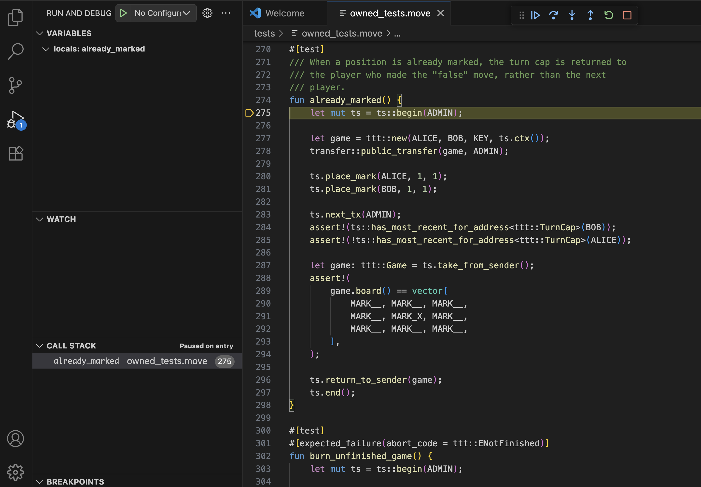

온체인 transaction을 debugging할 때는 transaction 안에서 실행된 Move call의 source code가 온체인에 저장되지 않으므로 기본적으로 사용할 수 없다.

debug session은 Move code가 디스어셈블된 bytecode로 표현되는 disassembly view에서 시작된다.

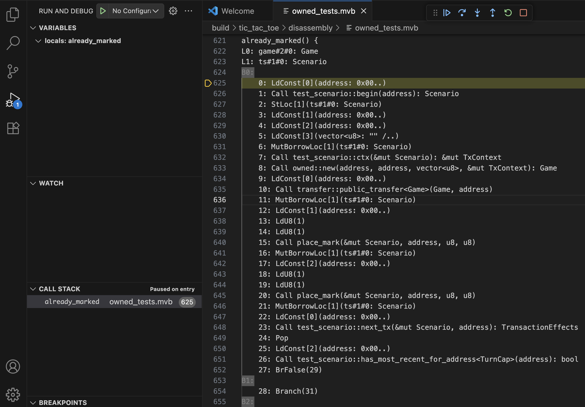

이것은 Move code의 더 낮은 수준 표현이지만 Move code의 동작과 실행 흐름에 대한 이해를 높이는 데 여전히 매우 유용하다.

또한 source view에 비해 한 가지 장점이 있는데, execution trace에 기록된 내용과 훨씬 더 잘 일치한다는 점이다.

Move compiler 최적화가 존재할 때 disassembly view는 궁극적인 source of truth이다.

예를 들어 source에 있는 일부 변수는 trace에는 더 이상 존재하지 않을 수 있으며, 이는 disassembly view에서 확인할 수 있다.

여전히 [source code for on-chain transactions by hand](#source-level-debugging-for-on-chain-transactions)를 제공해 source view를 활성화할 수 있다.

온체인 transaction용 source-level debugging을 자동화하는 지원은 향후 제공될 예정이다.

source code와 디스어셈블된 bytecode를 모두 사용할 수 있다면 command palette의 `Move: Toggle source view` 및 `Move: Toggle disassembly view` command를 통해 source view와 disassembly view 사이를 전환할 수 있다.

이 command는 macOS에서는 <kbd>Shift</kbd> + <kbd>⌘</kbd> + <kbd>P</kbd>, Windows/Linux에서는 <kbd>Ctrl</kbd> + <kbd>Shift</kbd> + <kbd>P</kbd>로 열 수 있다.

#### Stepping through code execution

Move Trace Debugger는 다음 표준 [debug actions](https://code.visualstudio.com/docs/debugtest/debugging#_debug-actions)을 지원한다:

- Step Over
- Step Into
- Step Out
- Continue
- Restart
- Stop

다른 function call 안으로 code를 단계 실행해 들어가면 왼쪽 사이드바의 call stack view가 업데이트된다.

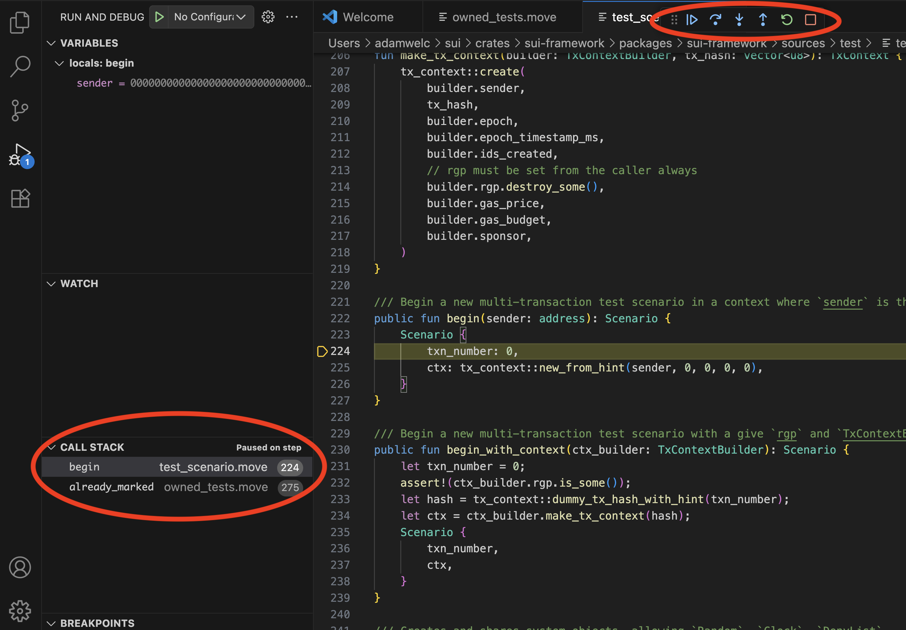

#### Tracking variable values

Move Trace Debugger는 primitive type, Move struct, 그리고 reference의 값을 표시하는 기능을 지원한다.

source code에 있는 일부 변수는 Move compiler에 의해 최적화로 제거될 수 있으며 기본 trace에서는 사용할 수 없다는 점에 유의한다.

따라서 해당 값은 디버거가 추적할 수 없다.

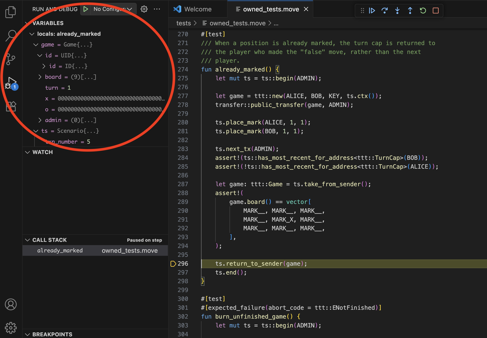

디버거는 현재 변수에 watch point를 설정하는 기능을 지원하지 않는다.

#### Line breakpoints

코드에서 원하는 줄에 커서를 두고 메인 메뉴에서 **Run** -> **Toggle Breakpoint**를 선택해 줄 breakpoint를 설정한다.

**Continue** debug command를 사용해 다음 breakpoint까지 실행을 진행할 수 있다.

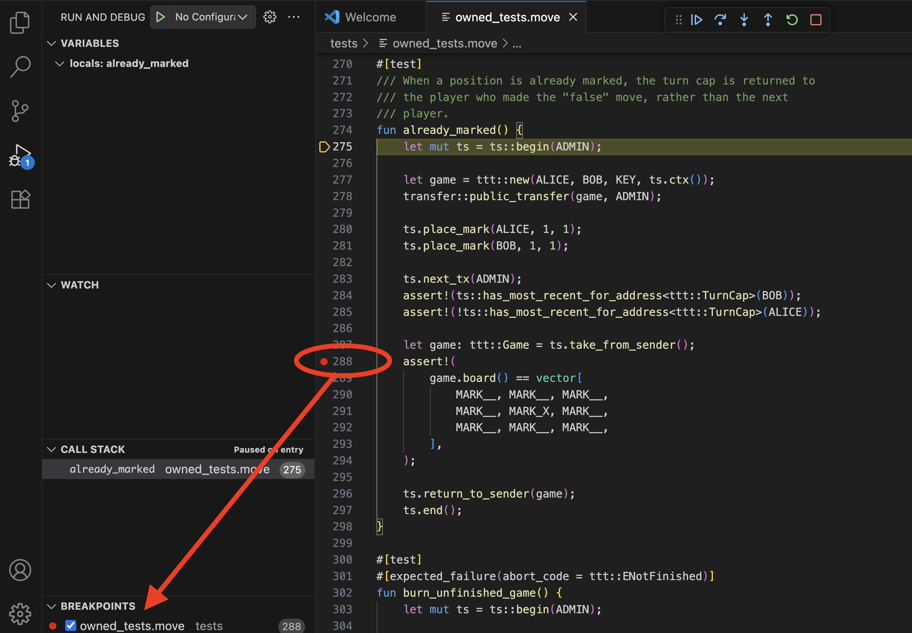

### PTB debugging features

PTB를 debugging할 때 디버거는 먼저 PTB 구조의 요약을 표시한다.

다음 예시에서는 debugging 중인 PTB가 여러 Move call과 여러 native PTB command(**Split Coins**, **Merge Coins**, **Transfer Objects**)로 구성되어 있음을 볼 수 있다.

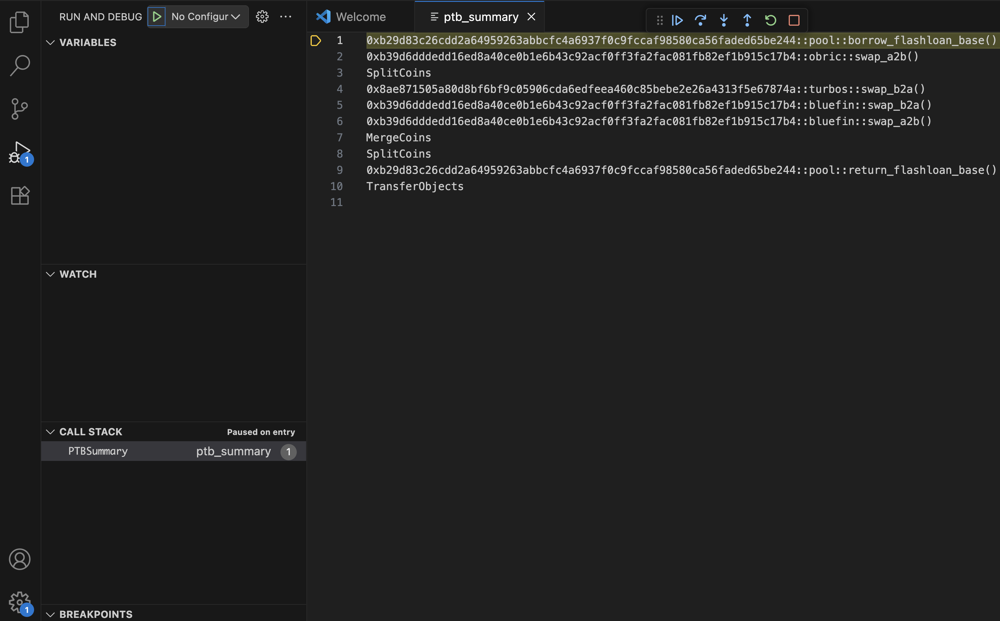

PTB summary에서는 Move code를 debugging할 때 function 안으로 step into 하거나 step over 하듯이 특정 command 안으로 step into 하거나 이를 step over 할 수 있다.

PTB summary view에서는 현재 breakpoint 설정을 지원하지 않는다.

Move function 안으로 step into 하면 관련된 모든 [features](#move-code-debugging-features), 즉 값 추적, breakpoint 등이 उपलब्ध한 상태로 Move code debugging이 시작된다.

native command 안으로 step into 하면 그 입력값과 결과값을 검사할 수 있다.

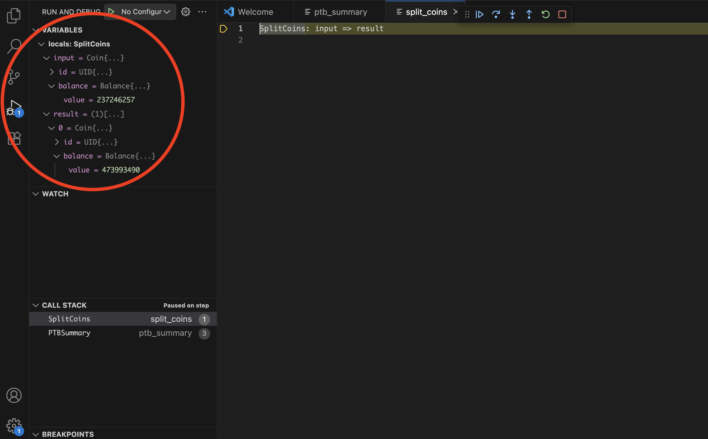

native command를 "통과하며" step하는 기능은 없다.

상태를 검사한 뒤에는 밖으로 step out 하거나 계속 step해서 다음 command로 이동할 수만 있다.

## Usage

디버거를 사용해 [replay tool](/references/cli/replay)을 통해 단위 테스트와 기존 온체인 transaction을 debugging하며, 여기에는 [PTB](/guides/developer/transactions/ptbs/prog-txn-blocks) debugging 지원도 포함된다.

### Debugging unit tests

Move 단위 테스트 debugging은 두 단계 과정이다:

**1. Generate execution traces**
- command palette를 연다(macOS에서는 <kbd>Shift</kbd> + <kbd>⌘</kbd> + <kbd>P</kbd>, Windows/Linux에서는 <kbd>Ctrl</kbd> + <kbd>Shift</kbd> + <kbd>P</kbd>).

- `Move: Trace Move test execution` command를 실행한다.

  <div class="image-scale-50">
  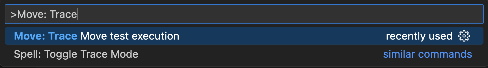
  </div>

  :::info
  이 command는 내부적으로 `sui` 바이너리를 사용하며, 이 바이너리는 [pre-installed](#install)되어 있어야 하고, 그 위치는 [Move extension](/references/ide/move#build-test-and-trace)이 찾을 수 있어야 한다.
  :::

- extension은 filter prompt를 표시한다.

- 특정 테스트를 대상으로 하려면 filter 문자열을 입력하고, 모든 테스트를 실행하려면 필드를 비워 둔 채 <kbd>Enter</kbd>를 누른다.

  <div class="image-scale-50">
  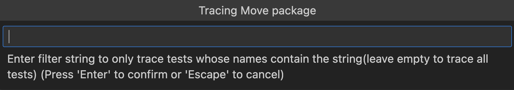
  </div>

- 생성된 trace는 `traces` 디렉터리에서 찾는다.

  :::info
  Visual Studio Code extension에서 어떤 이유로 trace 생성이 작동하지 않으면, 패키지 테스트를 추가 플래그와 함께 실행해 trace를 생성할 수 있다:
  ```bash
  sui move test  --trace-execution --disassemble
  ```
  :::

**2. Start debugging**
- 테스트가 들어 있는 Move 파일을 연다.

- 메인 메뉴에서 **Run** -> **Start Debugging**을 선택한다.

  <div class="image-scale-30">
  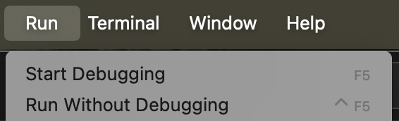
  </div>

- 파일에 테스트가 여러 개 있다면 드롭다운 메뉴에서 특정 테스트를 선택한다.

  <div class="image-scale-50">
  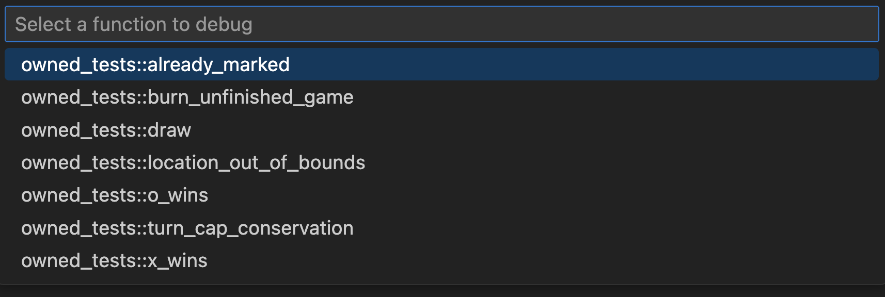
  </div>

### Debugging on-chain transactions

온체인 transaction debugging도 두 단계 과정이다:

**1. Generate execution trace**

trace를 생성하려면 transaction의 digest를 알아야 한다.

예를 들어 `0x42`가 있다.

```bash
sui replay --trace --digest 0x42
```

이 command는 transaction을 로컬에서 다시 실행하고, 실행 trace를 생성하고, 이 transaction을 debugging하는 데 필요한 모든 데이터를 다운로드한다.

데이터는 replay tool 출력 디렉터리의 하위 디렉터리에 저장되며, 기본값은 `.replay`지만 위치는 [configurable](../../references/cli/replay.mdx#usage)하다.

이 하위 디렉터리 이름은 transaction digest를 따른다.

**2. Start debugging**
- 주어진 digest를 가진 transaction에 대해 다운로드한 transaction 데이터가 들어 있는 하위 디렉터리를 연다.

- trace 파일 `trace.json.zst`를 연다.

  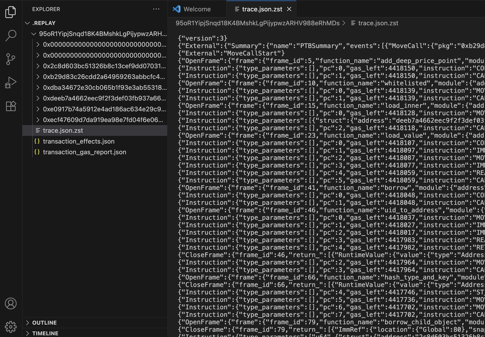

- 메인 메뉴에서 **Run** -> **Start Debugging**을 선택한다.

  <div class="image-scale-30">
  
  </div>

  :::info
  이 command를 처음 실행할 때 debugger type 선택을 요청받을 수 있으며, 이 경우 **Move Debugger**를 선택한다.
  :::

## Source-level debugging for on-chain transactions

transaction debugging을 위해 네트워크에서 다운로드한 데이터에는 transaction 전반에서 실행된 Move call의 source code가 포함되어 있지 않다.

하지만 source와 추가 debugging metadata를 직접 제공해 source-level debugging을 활성화할 수 있다.

transaction 전반에서 사용된 패키지의 source code에 접근할 수 있다면, 패키지를 빌드해 debugging metadata를 생성하고 이 데이터의 위치를 replay tool이 볼 수 있도록 만들 수 있다.

각 패키지의 source code version은 transaction에서 사용된 패키지를 빌드할 때 사용된 version과 동일해야 한다.

그렇지 않으면 온체인 데이터로 생성된 execution trace와 로컬에서 생성된 package debugging metadata 사이의 불일치로 인해 debugging 실패가 발생할 수 있다.

예를 들어 온체인 transaction이 어떤 public function `foo`를 호출하고, 이 function이 다시 어떤 private function `bar`를 호출하는 상황을 생각해 보자.

debugging metadata를 생성하는 데 사용된 패키지 source code에는 여전히 public function `foo`가 있지만, `foo`가 더 이상 `bar`를 호출하지 않는다고 하자.

이 경우 source-level debugging을 시도할 때, `bar` 호출이 execution trace의 일부였다면, 디버거는 debugging session 중 그 호출에 도달했을 때 표시할 function `bar`의 source를 갖지 못하게 된다.

패키지의 최신 version을 사용해도 여전히 작동할 수 있으며, 특히 기존 기능이 대체로 안정화되어 있고 source code가 거의 바뀌지 않는 패키지, 예를 들어 Sui framework package에서는 더욱 그렇다.

아래에는 이러한 단순화된 경우를 처리하는 방법과, 이어서 패키지의 정확한 version을 찾는 방법에 대한 지침이 있다.

다음을 가정한다: digest가 `95oR1YipjSnqd18K4BMshkLgPijypwzARHV988eRhMDs`인 mainnet transaction이 있고, 별도로 명시하지 않는 한 모든 command는 어떤 `$ROOT_DIR`(예: 홈 디렉터리)에서 실행한다.

먼저 이 transaction의 실행을 trace한다.

```bash
sui replay --digest 95oR1YipjSnqd18K4BMshkLgPijypwzARHV988eRhMDs  --trace
```

transaction을 replay하면 replay tool이 이 transaction에서 사용된 모든 Move package에 대한 데이터를 다운로드한다.

이 예시에서는 이들이 `$ROOT_DIR/.replay/95oR1YipjSnqd18K4BMshkLgPijypwzARHV988eRhMDs` 상위 디렉터리에 있으며, 하위 디렉터리 이름은 package ID이다:

    ```
    0x0000000000000000000000000000000000000000000000000000000000000001
    0x0000000000000000000000000000000000000000000000000000000000000002
    0x2c8d603bc51326b8c13cef9dd07031a408a48dddb541963357661df5d3204809
    0xb29d83c26cdd2a64959263abbcfc4a6937f0c9fccaf98580ca56faded65be244
    0xdba34672e30cb065b1f93e3ab55318768fd6fef66c15942c9f7cb846e2f900e7
    0xdeeb7a4662eec9f2f3def03fb937a663dddaa2e215b8078a284d026b7946c270
    0xe0917b74a5912e4ad186ac634e29c922ab83903f71af7500969f9411706f9b9a
    0xecf47609d7da919ea98e7fd04f6e0648a0a79b337aaad373fa37aac8febf19c8
    ```

목록의 두 번째 디렉터리는 Sui framework package의 ID에 해당한다.

이 package에 대해 source-level debugging을 활성화하려면 replay tool이 debugging metadata에 접근할 수 있게 해야 하므로, package source를 가져와 build한 뒤 metadata를 Sui framework package 하위 디렉터리의 특정 위치인 `source` 디렉터리로 복사한다.

<span id="metadata-generation">**Metadata generation**</span>

- 아직 Sui source code repository가 없다면 repository를 clone한다.

    ```bash
    git clone https://github.com/MystenLabs/sui.git
    ```

- Sui framework package source code를 build한다.

    ```bash
    cd sui/crates/sui-framework/packages/sui-framework; sui move build
    ```

- debugging metadata를 올바른 위치로 복사한다.

    ```bash
    cp -r $ROOT_DIR/sui/crates/sui-framework/packages/sui-framework/build/Sui $ROOT_DIR.replay/95oR1YipjSnqd18K4BMshkLgPijypwzARHV988eRhMDs/0x0000000000000000000000000000000000000000000000000000000000000002/source
    ```

debug session을 시작하고 debugging 중 Sui framework code에 도달하면, disassembly view가 아니라 source view에 있게 된다.

### Locating precise package versions

transaction 전반에서 사용된 모든 package, 즉 사용자 수준 package와 system package 모두에 대해 source-level debugging을 균일하게 활성화하고, 원활한 [debugging experience](#precise-versions-for-all-packages)를 위해 정확한 package version을 사용하려고 해야 한다.

항상 가능하지는 않지만, 그런 경우에도 [precise versions of system packages](#precise-versions-for-system-packages)를 찾으면 제한적 source-level debugging을 활성화할 수 있다.

transaction에서 실행된 Move code에 대한 정보를 조금 더 수집하기 위해 transaction debugging을 시작한다.

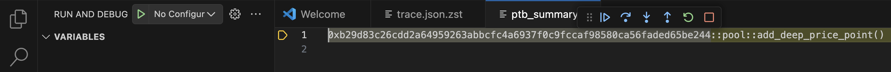

PTB summary를 보면 이 transaction이 module `pool`의 function `add_deep_price_point`에 대한 하나의 Move call만으로 구성되어 있고, 이 function은 사용자 package `0xb29d83c26cdd2a64959263abbcfc4a6937f0c9fccaf98580ca56faded65be244` 안에 있음을 알 수 있다.

이상적으로는 이 package에 대해 build 가능한 source code와 올바른 source code version을 모두 찾고 싶다.

그다음 이 package에 대한 debugging metadata를 build하면 모든 dependent package에 대한 정보도 자동으로 포함되어 균일한 source-level debugging이 가능해진다.

그렇게 할 수 없다면 적어도 system package의 올바른 source code version을 찾아 Sui framework code에 대한 source-level debugging이라도 가능하게 하고 싶을 수 있다.

#### Precise versions for all packages

사용자 package의 올바른 source code version을 찾으려면 Sui explorer([suiscan](https://suiscan.xyz) 등)와 Sui의 Move Package Registry([MVR](https://www.moveregistry.com/))를 활용한다.

Sui explorer에서 package를 검색한다.

<div class="image-scale-50">
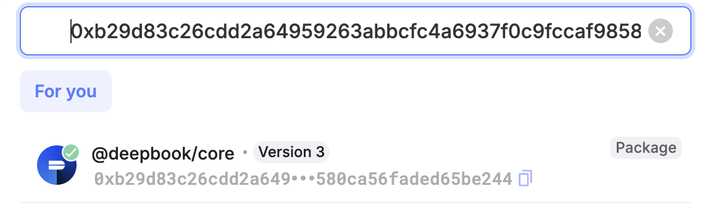
</div>

해당 package가 `deepbook/core`임을 확인할 수 있다.

explorer에서 이 package의 상세 정보를 본다.

<div class="image-scale-70">
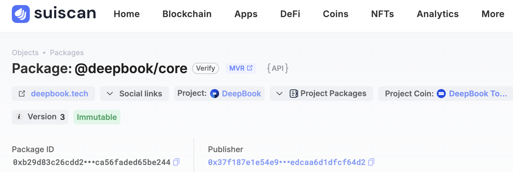
</div>

explorer의 package description에 MVR link가 포함되어 있음을 볼 수 있다.

그 link를 따라가면 이 package에 대한 다른 형태의 description이 있는 MVR 페이지로 이동한다.

MVR description에는 package source code repository에 대한 link와, 이 ID가 이 package의 3번째 version을 나타낸다는 정보가 포함되어 있다.

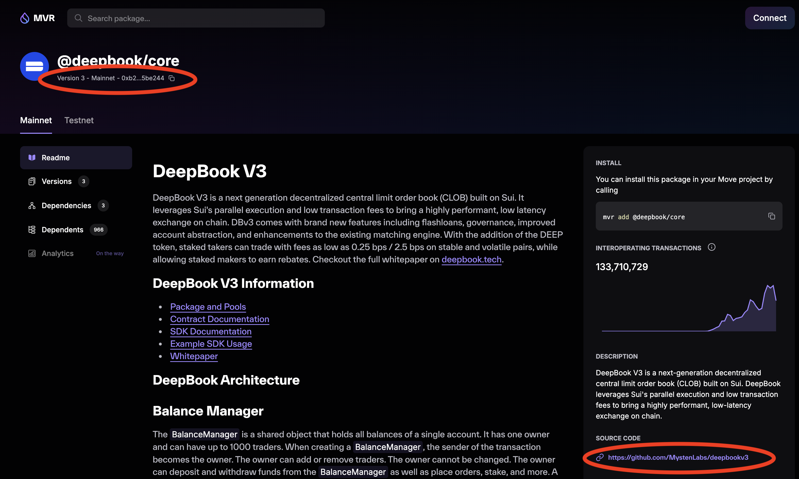

`deepbook/core`의 source code repository에는 서로 다른 package가 세 개 들어 있지만, PTB의 `pool` module은 `deepbook` package 안에서만 정의된다.

이제 package source code와 함께 제공해야 하는 debugging metadata를 생성하기 위해 이 package의 올바른 version을 build하는 작업을 진행한다.

별도 명시가 없는 한 모든 command는 `$ROOT_DIR`에서 실행한다고 가정한다.

- repository를 clone한다.

    ```bash
    git clone https://github.com/MystenLabs/deepbookv3.git
    ```

- `deepbook` package 디렉터리로 이동한다.

    ```bash
    cd deepbookv3/packages/deepbook
    ```

- version tag를 확인한다.

    ```bash
    git tag -l
    ```

    이 repository에서는 tag가 실제로 서로 다른 package version을 나타낸다.

    ```
    v1.0.0
    v2.0.0
    v3.0.0
    ```

    build할 정확한 package version을 선택한다.

    ```bash
    git checkout v3.0.0
    ```

    tag를 찾을 수 없으면 다음 단계로 바로 진행할 수는 있지만, repository의 최신 source code version이 온체인 package version과 일치한다는 보장은 없으며, 이는 debugging 기능에 영향을 줄 수 있다.

- package를 build하고 debugging metadata를 복사한다.

    ```bash
    sui move build
    ```

    그러면 `build` 디렉터리가 생성되고 그 안에 관련 metadata가 모두 들어 있는 `deepbook` 하위 디렉터리가 생기며, 이를 올바른 디렉터리로 복사한다.

    ```bash
    cp -r ~/deepbookv3/packages/deepbook/build/deepbook ~/.replay/0xb29d83c26cdd2a64959263abbcfc4a6937f0c9fccaf98580ca56faded65be244/source
    ```

#### Precise versions for system packages

사용자 package의 source를 찾을 수 없어도, 사용자 package가 의존하는 system package의 source code와 올바른 version은 여전히 찾을 수 있다.

이를 통해 debugging session 중에 최소한 system package의 source는 볼 수 있다.

Sui의 system package, 특히 Sui framework package는 Sui의 protocol version이 바뀔 때만 변경될 수 있다.

이러한 변경은 [tracked](https://github.com/MystenLabs/sui/blob/main/crates/sui-framework-snapshot/manifest.json)되며, protocol version 번호(3부터 시작)와 해당 protocol version에서의 Sui framework package source code 정확한 version을 나타내는 git revision 정보가 포함된다.

이를 통해 사용자 package가 온체인에 게시되었을 때 어떤 protocol version이 적용 중이었는지 찾을 수 있다.

Mainnet의 GraphQL [endpoint](https://graphql.mainnet.sui.io/graphql)에 대해 다음 query를 실행하는데, 여기서 `address` parameter는 사용자 package의 ID이며 이 예시에서는 `0xb29d83c26cdd2a64959263abbcfc4a6937f0c9fccaf98580ca56faded65be244`이다.

```
{
    object(address: "0xb29d83c26cdd2a64959263abbcfc4a6937f0c9fccaf98580ca56faded65be244") {
        previousTransaction {
            effects {
                epoch {
                    protocolConfigs {
                        protocolVersion
                    }
                }
            }
        }
    }
}
```

이 query 결과는 다음과 같다.

```
{
    "data": {
        "object": {
            "previousTransaction": {
                "effects": {
                    "epoch": {
                        "protocolConfigs": {
                            "protocolVersion": 84
                        }
                    }
                }
            }
        }
    }
}
```

이 예시에서 사용자 package는 protocol version 84에서 게시되었다.

protocol version tracking file에서 대응하는 git revision은 `25804c243d07dd73c0d199e7794383bd855cd436`이다.

이제 Sui framework code에 대한 debugging metadata generation [instructions](#metadata-generation)를 따르면 된다.

유일한 차이는 framework package를 build하기 전에 올바른 git revision을 선택해야 한다는 점이다.

```bash
git checkout 25804c243d07dd73c0d199e7794383bd855cd436
```
