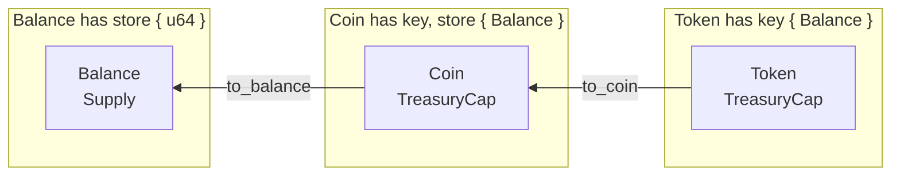
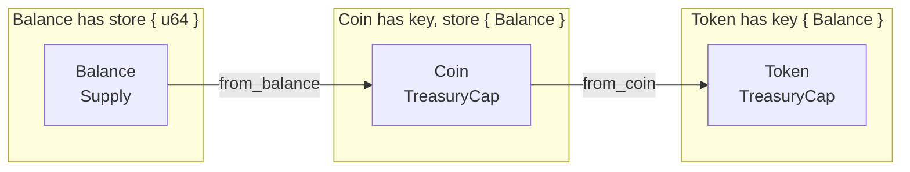

Closed-Loop Token 표준을 사용하면 토큰을 사용할 수 있는 애플리케이션을 제한하고 전송, 지출, 변환에 대한 커스텀 정책을 설정할 수 있다. the Sui framework에 있는 [`sui::token` module](https://github.com/MystenLabs/sui/blob/main/crates/sui-framework/docs/sui/token.md)이 이 표준을 정의한다.

## Background and use cases

[Currency Standard](/standards/currency.mdx)는 Sui의 오픈 루프 시스템의 예시이다. 코인은 자유로이 움직이며, [wrappable](/concepts/object-ownership/wrapped.mdx)이고, [freely transferable](/concepts/transfers/custom-rules.mdx#the-store-ability-and-transfer-rules)이며, 어떤 애플리케이션에도 저장할 수 있다. 가장 적절한 현실 세계의 비유는 현금으로, 이는 거의 규제되지 않으며 자유롭게 사용되고 전달될 수 있다.

그러나 일부 애플리케이션은 토큰의 범위를 특정 목적에 맞게 제한할 필요가 있다. 예를 들어, 일부 애플리케이션은 특정 서비스에서만 사용할 수 있는 토큰, 권한이 있는 계정만 사용할 수 있는 토큰, 또는 특정 계정의 사용을 차단할 수 있는 토큰이 필요할 수 있다. 현실 세계의 비유로는 규제를 받고, 은행이 통제하며, 특정 규칙과 정책을 준수하는 은행 계정이 있다.

## Difference with Coin





`key + store` abilities를 가지므로 wrapping과 공개 전송을 지원하는 Coin과 달리, Token은 `key` ability만 가지며 wrapped될 수 없고, dynamic field로 저장될 수 없으며, (이에 대한 커스텀 정책이 없는 한) 자유롭게 전송될 수 없다. 이 제한으로 인해 Token은 **계정에 의해서만 소유될 수 있으며** 애플리케이션에 저장될 수 없지만(다만, [지출할 수 있다](/standards/closed-loop-token/spending.mdx)).

```move
// defined in `sui::coin`
struct Coin<phantom T> has key, store { id: UID, balance: Balance<T> }

// defined in `sui::token`
struct Token<phantom T> has key { id: UID, balance: Balance<T> }
```

## Compliance and rules

생성하는 토큰의 전송, 지출, 변환에 대해 어떤 규칙이든 설정할 수 있다. 이 규칙은 [TokenPolicy](/standards/closed-loop-token/token-policy.mdx)에서 action별로 지정한다. [Rules](/standards/closed-loop-token/rules.mdx)는 요청 승인 또는 검증 로직을 구현하는 데 사용할 수 있는 커스텀 프로그래머블 제한이다.

예를 들어, 정책은 전송에 제한을 둘 수 있다 - 연산당 `X` 토큰; 또는 토큰을 지출하기 전에 사용자 검증을 요구할 수 있다; 또는 특정 서비스에서만 토큰 지출을 허용할 수 있다.

서로 다른 정책과 애플리케이션 전반에서 rules를 재사용할 수 있으며; rules를 자유롭게 결합해 복잡한 정책을 만들 수 있다.

## Public actions

토큰에는 토큰을 관리하기 위해 사용할 수 있는 public 및 protected action 집합이 있다. Public action은 누구나 사용할 수 있으며 어떤 승인도 필요하지 않다. 이들은 코인과 유사한 API를 가지지만 `Token` 타입에서 동작한다:

- `token::keep`: 토큰을 transaction sender에게 전송한다
- `token::join`: 두 토큰을 합친다
- `token::split`: 토큰 하나를 둘로 분할하며, 분할할 수량을 지정한다
- `token::zero`: 빈(잔액 0) 토큰을 생성한다
- `token::destroy_zero`: 잔액이 0인 토큰을 파괴한다

coin 및 token 메서드 비교는 [Coin Token Comparison](/standards/closed-loop-token/coin-token-comparison.mdx)을 참조한다.

## Protected actions

Protected action은 [`ActionRequest`](/standards/closed-loop-token/action-request.mdx)를 발행하는 action이며, 이는 트랜잭션이 성공하려면 반드시 해결되어야 하는 핫포테이토 struct이다. `ActionRequest`를 해결하는 주요 방법은 세 가지이며, 그중 가장 일반적인 방식은 [`TokenPolicy`](/standards/closed-loop-token/token-policy.mdx)를 통한 방식이다.

- `token::transfer`: 토큰을 지정된 address로 전송한다
- `token::to_coin`: 토큰을 코인으로 변환한다
- `token::from_coin`: 코인을 토큰으로 변환한다
- `token::spend`: 지정된 address에서 토큰을 지출한다

이전 메서드들은 기본 구현에 포함되어 있지만, 커스텀 action을 위한 `ActionRequest`s를 생성하는 것도 가능하다.

## Token policy and rules

Protected action은 기본적으로 비활성화되어 있지만 [`TokenPolicy`](/standards/closed-loop-token/token-policy.mdx)에서 활성화할 수 있다. 또한 특정 action이 성공하기 위해 만족해야 하는 커스텀 제한인 [rules](/standards/closed-loop-token/rules.mdx)를 설정할 수 있다.
