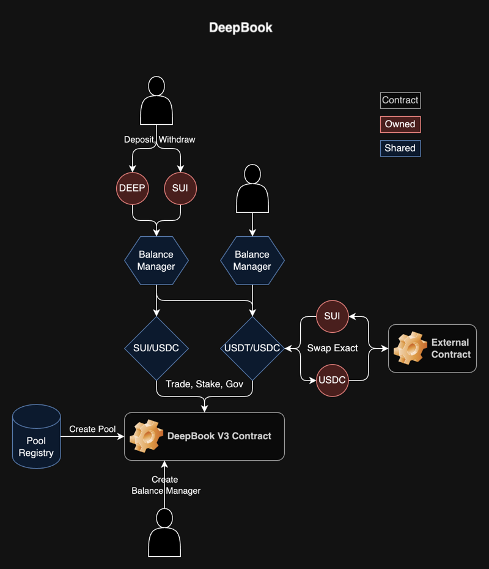
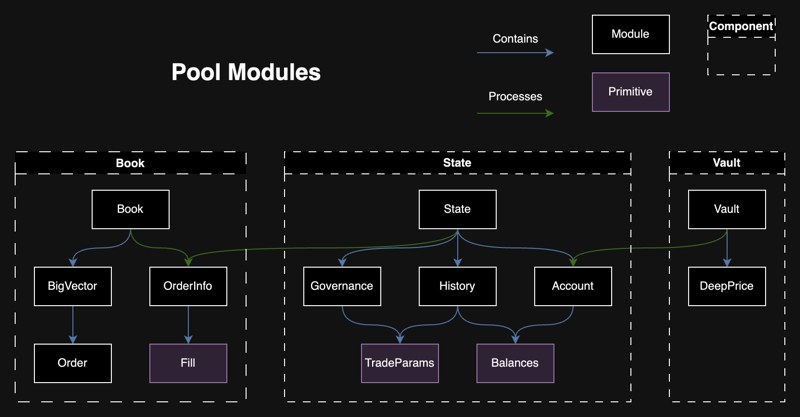
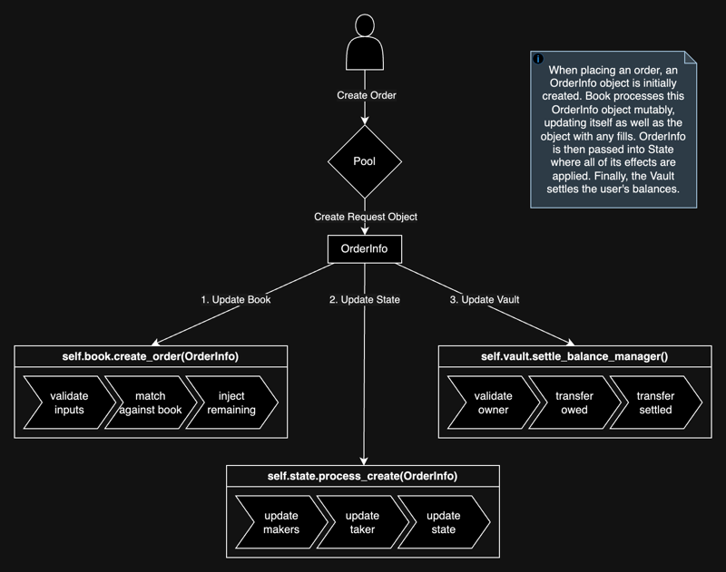

전체적으로 DeepBookV3 설계는 세 개의 shared object를 중심으로 한 다음 흐름을 따른다:

- `Pool`: 하나의 마켓을 나타내며 오더북, 사용자, stake 등을 관리하는 shared object이다. 자세한 내용은 [Pool shared object](#pool) 절을 참고한다.
- `PoolRegistry`: Pool 생성 시에만 사용되며, 중복 pool이 생성되지 않도록 하고 패키지 버전 관리를 유지한다.
- `BalanceManager`: 주문 시 사용자 자금의 출처로 사용되며, 하나의 `BalanceManager`를 모든 pool에서 공통으로 사용할 수 있다. 자세한 내용은 [BalanceManager](./balance-manager.mdx)를 참고한다.

## Pool shared object {#pool}

모든 공개 함수는 `Pool` shared object를 가변 또는 불변 참조로 받는다. `Pool`은 다음 세 가지 구성 요소로 이루어진다:

- [`Book`](#book)
- [`State`](#state)
- [`Vault`](#vault)

로직은 구성 요소 간에 분리되며, 각 구성 요소는 이전 구성 요소 위에 구축된다. Book, state, vault 순서의 관계를 유지함으로써 DeepBookV3는 데이터 가용성 보장을 제공하고, 코드 가독성을 높이며, 프로토콜 유지 및 업그레이드를 용이하게 한다.

### Book

이 구성 요소는 메인 `Book` 모듈과 `Fill`, `OrderInfo`, `Order` 모듈로 이루어진다. `Book` struct는 매수 또는 매도용 `BigVector<Order>` object 두 개와 일부 메타데이터를 유지한다. `Orders`의 저장, 매칭, 수정, 제거를 담당한다.

주문 시 먼저 `OrderInfo`가 생성된다. 해당되는 경우 기존 maker 주문과 먼저 매칭되며 그 과정에서 `Fill`이 누적된다. 남은 수량은 `Order` object를 만들어 book에 주입하는 데 사용된다. Book 처리 종료 시점에는 `OrderInfo` object에 모든 관련 사용자와 전체 state를 갱신할 정보가 갖춰진다.

### State

`State`는 `Governance`, `History`, `Account`를 저장한다. 모든 요청을 처리하며, 저장된 struct 중 최소 하나를 갱신한다.

#### Governance

`Governance` 모듈은 pool의 거래 파라미터들과 관련된 데이터를 저장한다. 이 파라미터들은 taker 수수료, maker 수수료, 필요 stake가 포함된다. 필요 stake는 taker, maker 인센티브를 받기 위해 사용자가 해당 pool에 stake해야 하는 DEEP 토큰 수량을 의미한다.

매 epoch마다 stake가 0이 아닌 사용자는 이 파라미터 변경 제안을 제출할 수 있다. 제안된 수수료는 상한이 있다.

| min_value (bps) | max_value (bps) | Pool type | Taker or maker |
| --- | --- | --- | --- |
| 1 | 10 | Volatile | Taker |
| 0 | 5 | Volatile | Maker |
| 0.1 | 1 | Stable | Taker |
| 0 | 0.5 | Stable | Maker |
| 0 | 0 | Whitelisted | Taker and maker |

사용자는 진행 중인 제안(live proposal)에 투표할 수 있다. 제안이 정족수를 넘으면, 새로운 거래 파라미터가 다음 epoch부터 적용되도록 대기열에 올라간다. 제안과 투표는 매 epoch마다 초기화된다. 사용자는 stake가 반영된 다음 epoch부터 제안 제출 및 투표를 시작할 수 있다. 정족수는 전체 투표력의 절반에 해당한다. 사용자 투표력은 ${V}$가 투표력, ${S}$가 stake 수량, ${V_c}$가 투표력 상한일 때 아래 공식으로 계산된다. ${V_c}$는 현재 100,000 DEEP로 설정되어 있다.

$\LARGE V=\min\lparen S,V_c \rparen + \max\lparen \sqrt{S} - \sqrt{V_c} ,0 \rparen$

다음 다이어그램은 거버넌스 생명 주기를 시각화하는 데 도움이 된다.

#### History

`History` 모듈은 현재 epoch 및 이전 epoch에 대한 집계 거래량, 거래 파라미터, 수집 수수료, 소각 대상 수수료를 저장한다. 주문 처리 중 fill은 총 거래량 계산 및 갱신에 사용된다. 또한 해당 거래의 maker가 충분한 stake를 보유한 경우 총 stake 거래량도 갱신된다.

매 epoch의 첫 연산이 갱신을 트리거하여 현재 epoch 데이터를 과거 데이터로 옮기고 현재 epoch 데이터를 초기화한다.

사용자 리베이트 계산은 이 모듈에서 수행된다. 매 epoch 동안 메이커는 필요 stake 이상의 DEEP를 stake했고 메이커 거래량에 기여한 경우 리베이트를 받을 자격이 있다. 메이커 수수료 계산에는 [Whitepaper: DeepBook Token](/doc/deepbook.pdf) 문서에서 인용한 다음 공식이 사용된다. 메이커 인센티브 상세는 백서 2.2절을 참고한다.

<blockquote cite="/doc/deepbook.pdf">

인센티브 계산은 epoch가 끝난 뒤에 이루어지며, 사전에 필요 DEEP 토큰 수를 stake한 메이커에게만 지급되고, 주어진 메이커 ${i}$에 대해 식 (3)으로 계산된다. 식 (3)은 여러 새 변수를 도입한다. 첫째, ${M}$은 충분한 DEEP 토큰을 stake한 메이커 집합을 가리키고, $\bar{M}$은 이 조건을 충족하지 않는 메이커 집합을 가리킨다. 둘째, ${F}$는 해당 epoch에 한 메이커의 거래량이 창출한 총 수수료를 가리키며, 이 수수료는 taker와 메이커 양쪽에서 징수된다. 셋째, ${L}$은 한 메이커가 제공한 총 유동성, 즉 견적만 한 유동성이 아니라 실제 거래된 유동성을 가리킨다. 마지막으로 핵심 점 ${p}$는 "phaseout" 점으로, 다른 메이커들이 제공한 총 유동성이 이 점을 넘으면 해당 epoch에서 해당 메이커의 인센티브는 0이 된다. 이 점 ${p}$는 한 pool과 epoch 내 모든 메이커에 대해 일정하다.

$\LARGE \textsf {Incentives }  \textsf {for } \textsf {Maker } i = \max\Bigg\lbrack F_i\Bigg\lparen 1 + \large\cfrac{\sum_{j \in \bar{M}} F_j} {\sum_{j \in M} F_j} \Bigg\rparen\Bigg\lparen \LARGE 1 - \large\cfrac{\sum_{j \in M \cup \bar{M}} L_j - L_i}{p}\Bigg\rparen \LARGE ,0 \Bigg\rbrack$ (3)

</blockquote>

요약하면, epoch 동안 총 거래량이 최근 28일 중앙값보다 크면 리베이트는 없다. 중앙값 대비 거래량이 낮을수록 리베이트가 더 많이 주어진다. epoch당 최대 리베이트는 해당 epoch에 수집된 DEEP 총량과 같다. 남은 DEEP은 소각된다.

#### Account

`Account`는 단일 사용자와 그에 관한 데이터를 나타낸다. 거래량, stake, 투표한 제안, 미수령 리베이트, 이체할 잔액과 관련된 모든 것이 포함된다. `BalanceManager`와 `Account`는 1대1 관계이다.

매 epoch 사용자가 수행하는 첫 동작이 해당 계정을 갱신하며, 이전 epoch의 잠재 리베이트 계산을 트리거하고 현재 epoch용 거래량을 초기화한다. 이전 epoch의 새 stake는 활성화된다.

각 계정에는 정산 잔액과 미납 잔액이 있다. 정산 잔액은 pool이 사용자에게 갚아야 할 금액이고, 미납 잔액은 사용자가 pool에 갚아야 할 금액이다. 예를 들어 주문 시 사용자의 미납 잔액이 늘어나 그 주문에 사용자가 지불해야 할 자금을 나타낸다. 그다음 다른 사용자가 메이커 주문을 체결하면 메이커의 정산 잔액이 늘어나 메이커에게 지급될 자금을 나타낸다.

### Vault

사용자가 DeepBookV3에서 수행하는 모든 transaction은 해당 사용자의 정산, 미납 잔액을 초기화한다. 볼트는 이 잔액을 사용자 대신 처리하며, `BalanceManager`에서 자금을 차감하거나 추가한다.

볼트는 `DeepPrice` struct도 저장한다. 이 object는 pool의 베이스 또는 견적 자산과 DEEP 간 환율을 나타내는 최대 100개의 데이터 포인트를 담는다. 이 데이터는 화이트리스트 pool인 DEEP/USDC 또는 DEEP/SUI에서 가져온다. 이 환율은 거래 수수료 지불에 필요한 DEEP 토큰 수량을 결정하는 데 사용된다.

### BigVector

`BigVector`는 임의 크기의 벡터형 데이터 구조이며, 온체인 B+ Tree를 사용해 거의 상수 시간(log base max_fan_out)의 랜덤 접근, 삽입 및 삭제를 지원하도록 구현되어 있다.

반복은 리프 노드(슬라이스)에 대한 접근을 노출하여 지원한다. 첫 슬라이스 찾기는 거의 상수 시간에 가능하고, 이전과 다음 슬라이스 찾기도 상수 시간에 가능하다.

B+ Tree의 노드는 `BigVector`에 매달린 개별 dynamic field로 저장된다.

## Place limit order flow

주문 배치 동작의 생명 주기를 보여주는 다음 다이어그램은 book, state, vault 순의 흐름을 시각화하는 데 도움이 된다.

### Pool

`Pool` 모듈에서 사용자 입력 파라미터로 `place_order_int`가 호출된다. 이 함수에서는 다음 네 가지가 순서대로 일어난다:

1. `OrderInfo`가 생성된다.
2. `Book` 함수 `create_order`가 호출된다.
3. `State` 함수 `process_create`가 호출된다.
4. `Vault` 함수 `settle_balance_manager`가 호출된다.

### Book

Book 내 주문 생성에는 다음 세 가지 주요 작업이 포함된다:

- 입력을 검증한다.
- 기존 주문과 매칭한다.
- 남은 수량을 지정가 주문으로 오더북에 주입한다.

입력 검증은 수량, 가격, 타임스탬프, 주문 유형이 기대 범위 내인지 확인한다.

`OrderInfo`를 book과 매칭하려면 book의 반대편 `Order` 목록을 순회한다. 가격이 겹치고 기존 메이커 주문이 만료되지 않았으면 DeepBookV3가 수량을 매칭하고 `Fill`을 생성한다. DeepBookV3는 해당 fill을 state에서 나중에 사용하기 위해 `OrderInfo` fills에 추가한다. DeepBookV3는 매칭마다 기존 메이커 주문 수량과 상태를 갱신하고, 완전 체결 또는 만료 시 book에서 제거한다.

마지막으로 `OrderInfo` object에 남은 수량이 있으면 DeepBookV3는 이를 간결한 `Order` object로 변환해 오더북에 주입한다. `Order`는 매칭에 필요한 최소 데이터를, `OrderInfo`는 일반 처리에 필요한 최대 데이터를 갖는다.

방향이나 주문 유형에 관계없이 DeepBookV3 매칭은 단일 함수에서 처리된다.

### State

`State`의 `process_create` 함수는 pool state 내 주문 생성 이벤트 처리를 담당하며, 주문에 대한 transaction 금액과 수수료를 계산하고 계정 거래량을 이에 맞게 갱신한다.

먼저 함수는 `OrderInfo` object의 fill 목록을 처리하며, 추적 중인 거래량을 갱신하고 관련 메이커들의 자금을 정산한다. 그다음 계정의 총 거래량과 활성 stake를 조회한다. Taker 수수료는 사용자 계정의 stake와 DEEP 토큰 거래량을 기준으로 계산하고, 메이커 수수료는 거버넌스 거래 파라미터에서 가져온다. Taker 수수료 할인을 받으려면 계정이 pool 최소 stake를 초과해야 하고, DEEP 토큰 거래량도 동일 임계값을 넘어야 한다. `OrderInfo` object에 수량이 남아 있으면 `Order`로 계정의 주문 목록에 추가되며, 이는 이미 `Book`에서 생성된 것이다.

마지막으로 함수는 taker와 메이커 수수료를 반영해 부분 taker fill과 메이커 주문 수량(해당되는 경우)을 계산한다. 이를 계정의 기존 정산 및 미납 잔액에 더한다. 거래 이력은 해당 주문에서 수집된 총 수수료로 갱신되고, 정산 및 미납 잔액 두 튜플이 (base, quote, DEEP) 형식으로 `Pool`에 반환되어 `Vault`에서 올바른 자산이 이체되도록 한다.

### Vault

`Vault`의 `settle_balance_manager` 함수는 `BalanceManager`에 대한 정산 및 미납 금액의 이체를 관리한다.

먼저 함수는 해당 트레이더가 `BalanceManager` 사용 권한이 있는지 검증한다.

그다음 자산 유형별로 `balances_out`과 `balances_in`을 비교한다. `balances_out` 합계가 `balances_in`을 초과하면 함수는 볼트 잔액에서 차액을 떼어 `BalanceManager`에 입금한다. 반대로 `balances_in` 합계가 `balances_out`을 초과하면 함수는 `BalanceManager`에서 차액을 인출해 볼트 잔액에 합친다.

이 과정을 base, quote, DEEP 자산 잔액에 대해 반복하여 볼트와 `BalanceManager` 간 모든 자산 잔액이 정확히 반영되고 정산되도록 한다.

## Related links

<RelatedLink href="https://github.com/MystenLabs/deepbookv3" label="DeepBookV3 repository" desc="The DeepBookV3 repository on GitHub." />
