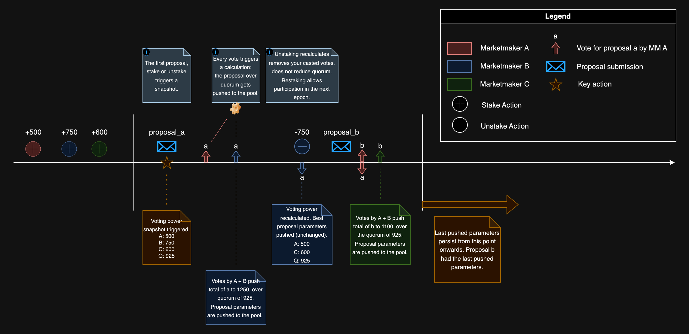

DeepBook의 새로운 거버넌스 접근 방식은 사용자가 단일 풀의 세 가지 파라메타를 업데이트할 수 있게 한다:

- Taker 수수료 비율
- Maker 수수료 비율
- Stake 필요량

Stake 필요량은 사용자가 taker 및 maker 인센티브를 활용하기 위해 풀에 staking 해 두어야 하는 DEEP 토큰의 양이다. 각 DeepBook 풀은 독립적인 거버넌스를 가지며, 거버넌스는 매 epoch마다 수행될 수 있다. 거버넌스에 대해 더 알아보려면 [Design](./design.mdx#governance)을 참고한다.

## API

`Pool`은 staking과 거버넌스를 위한 다음 엔드포인트를 제공한다.

### Stake

DEEP 토큰은 staking을 위해 `balance_manager`에서 사용 가능해야 한다. 사용자의 stake는 다음 epoch에서 활성화된다. 사용자의 활성 stake가 stake 필요량보다 크면, 사용자는 감소된 taker 수수료를 받을 수 있고 해당 epoch 동안 거래 수수료 리베이트를 누적할 수 있다.

<importcontent source="packages/deepbook/sources/pool.move" mode="code" org="MystenLabs" repo="deepbookv3" fun="stake" nocomments></importcontent>

### Unstake

사용자의 활성 및 비활성 stake는 모두 제거되어 `BalanceManager`로 다시 추가된다. 캐스트된 투표는 모두 제거된다. 해당 epoch의 maker 리베이트는 몰수되며, 남은 epoch 동안의 감소된 taker 수수료는 비활성화된다.

`balance_manager`는 충분한 staked DEEP 토큰을 보유해야 한다. `balance_manager` 데이터는 unstaked 금액으로 업데이트된다. Balance는 즉시 `balance_manager`로 전송된다.

<importcontent source="packages/deepbook/sources/pool.move" mode="code" org="MystenLabs" repo="deepbookv3" fun="unstake" nocomments></importcontent>

### Submit proposal

활성 stake가 0이 아닌 사용자는 제안을 제출할 수 있다. 사용자당 제안은 하나이다. 사용자는 자신이 제출한 제안에 자동으로 투표한다.

Taker 수수료, maker 수수료, stake 필요량를 변경하는 제안을 제출한다. 참여하려면 `balance_manager`에 충분한 staked DEEP 토큰이 있어야 한다. 각 `balance_manager`는 epoch당 하나의 제안만 제출할 수 있다. 최대 제안 수에 도달하면 가장 낮은 투표를 받은 제안이 제거된다. `balance_manager`의 의결권이 가장 낮은 투표를 받은 제안보다 작으면 제안이 추가되지 않는다.

<importcontent source="packages/deepbook/sources/pool.move" mode="code" org="MystenLabs" repo="deepbookv3" fun="submit_proposal" nocomments></importcontent>

### Vote

0이 아닌 의결권을 가진 사용자는 제안에 투표할 수 있다. 모든 의결권은 단일 제안에 사용된다. 사용자가 이 epoch 동안 다른 제안에 투표했다면 그 투표는 제거되고 새 제안으로 재투표된다. 참여하려면 `balance_manager`에 충분한 staked DEEP 토큰이 있어야 한다.

<importcontent source="packages/deepbook/sources/pool.move" mode="code" org="MystenLabs" repo="deepbookv3" fun="vote" nocomments></importcontent>

### Claim rebates

`claim_rebates`를 사용해 `balance_manager`의 보상을 청구한다. `balance_manager`에는 청구할 보상이 있어야 한다. `balance_manager` 데이터는 청구된 보상으로 업데이트된다.

<importcontent source="packages/deepbook/sources/pool.move" mode="code" org="MystenLabs" repo="deepbookv3" fun="claim_rebates" nocomments></importcontent>

## Related links

<relatedlink href="https://github.com/MystenLabs/deepbookv3" label="DeepBookV3 repository" desc="The DeepBookV3 repository on GitHub."></relatedlink>
