[Sagat](https://github.com/MystenLabs/sagat/tree/main)는 Sui multisig wallet을 위한 full-stack multisig 관리 플랫폼이다. 이는 backend에 Bun과 TypeScript API를, frontend에 React를 사용해 구축된다.

transaction을 서명하고, signature를 분석하며, multisig를 생성하고 관리하고, multisig invitation을 수락하거나 거부하며, proposal을 생성하고 이에 투표하고 실행하려면 [Sagat web interface](https://sagat.mystenlabs.com/)를 사용한다. 또는 이러한 작업을 programmatically 수행하려면 [Sagat SDK](https://github.com/MystenLabs/sagat/tree/main/sdk)를 사용한다. 

## What is multisig?

[Multisig](/guides/developer/cryptography/multisig)는 transaction이 실행되기 전에 서로 다른 party의 여러 signature를 요구하는 authentication 유형이다. 여러 address를 multisig group에 초대할 수 있다. Sagat에서는 초대된 모든 party가 수락해야 multisig가 생성된다.

각 multisig는 서로 다른 voting threshold를 가질 수 있다. 예를 들어 3명의 user가 포함된 multisig에서는, proposed transaction이 승인되기 위해 2명의 user만 서명하면 될 수 있다. 다른 시나리오에서는 모든 user가 transaction에 서명해야 할 수 있으며, 한 명이라도 이를 거부하면 proposed transaction은 취소된다. 각 threshold는 user별로 서로 다른 weight를 구성할 수 있어, 2개의 address만으로 6명 중 5명과 같은 무한한 조합을 가능하게 한다.

[TypeScript SDK for multisig](https://sdk.mystenlabs.com/typescript/cryptography/multisig) 사용 방법을 알아본다.

## Risks 

Sagat는 multisig 관리를 용이하게 하기 위해 proposal 데이터를 저장하는 목적으로 API layer와 frontend layer에 Mysten Labs 인프라를 사용한다.

애플리케이션의 frontend 역시 Mysten Labs 서비스를 통해 호스팅되며, 사용자는 이 서비스가 안전하다고 신뢰해야 한다. web interface만 보지 말고 wallet과 같은 2차 위치에서 transaction preview를 항상 검증한다.

### Mitigate risks by self-hosting Sagat

제어권을 갖고 trustless 방식으로 Sagat를 사용하려면 self-hosting할 수 있다. 이를 위해 먼저 GitHub repository를 다운로드한다:

```
$ git clone https://github.com/MystenLabs/sagat/tree/main
```

그 다음, 다음 command로 SDK를 build하고 frontend와 API를 실행한다:

```
$ bun run dev
```

:::tip

SDK는 custom URL을 받을 수 있으므로, build는 optional이다. 

:::

이는 dev mode에서 bun server를 실행하므로, 개발 중에는 변경 사항이 즉시 반영된다.

## Using the Sagat web interface 

Sagat [web interface](https://sagat.mystenlabs.com/)를 사용하여 다음을 수행한다:

- 브라우저 내에서 multisig를 생성한다. 브라우저는 각 multisig를 검증하고 real-time preview를 표시한다. 

- multisig composition에 참여하기 위한 invitation을 수락하거나 거부한다.

- 새 transaction을 제안한다.

- transaction을 preview하고 서명한다.

- link를 통해 transaction을 공유한다. 

- 기존 multisig group 밖에서 external proposer를 추가한다.

- voting threshold에 도달하면 transaction을 실행한다.

이러한 각 작업은 [programmatically](#using-sagat-programmatically)도 실행할 수 있다.

### Connecting a wallet 

먼저 [Slush](https://slush.app/) 또는 [Suilet](https://suiet.app/)과 같은 wallet을 Sagat web interface에 연결한다:

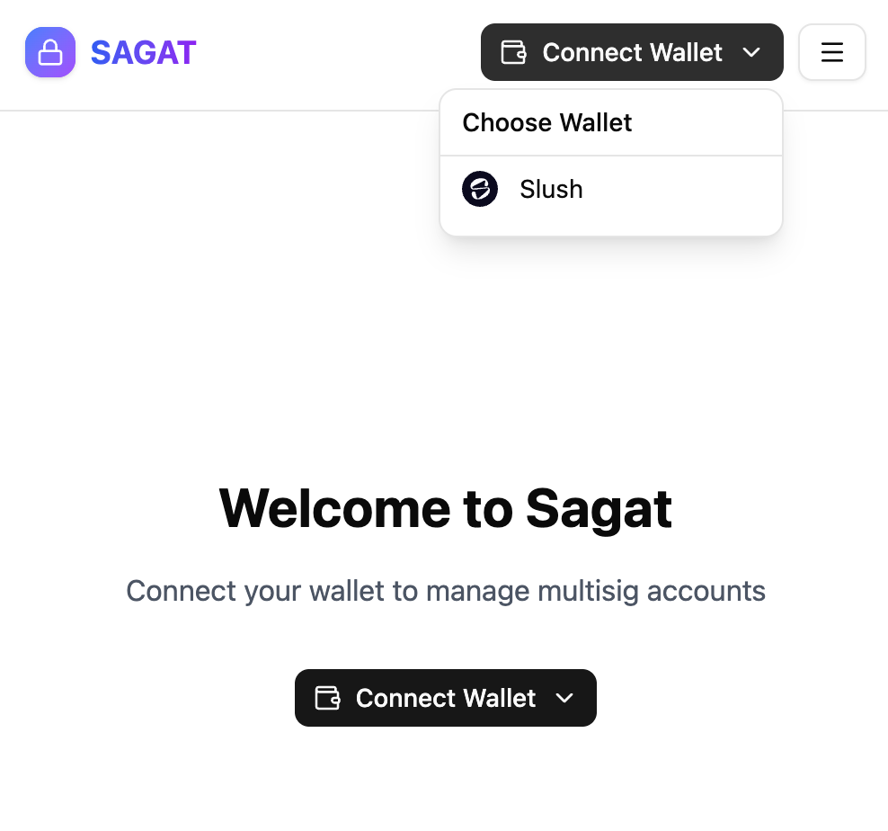

:::info 

ed25519, secp256r1 및 secp256k1을 지원하는 어떤 address든 지원된다. ZkLogin은 지원되지 않는다.

:::

wallet을 Sagat web interface에 연결하면 서비스에 wallet key가 등록된다. multisig에는 Sagat에 등록된 key만 포함할 수 있다. key는 [programmatically](#register-public-keys)도 등록할 수 있다.

:::tip 

"No wallets found. Install a wallet (ex. Slush Wallet) to continue." 메시지는 계속하려면 [install the Slush extension](https://chromewebstore.google.com/detail/slush-%E2%80%94-a-sui-wallet/opcgpfmipidbgpenhmajoajpbobppdil)을 해야 함을 나타낸다. 

:::

wallet을 unlock하고 초기 transaction을 승인한다. Sagat web interface는 wallet을 authenticate하기 위한 두 번째 transaction을 생성하도록 요청하며, 이는 confidentiality에 도움이 된다. 

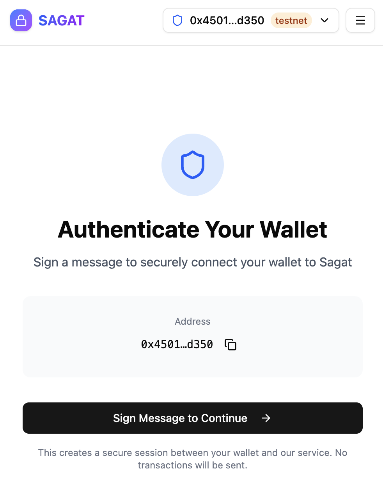

wallet에서 안내하는 단계에 따라 transaction을 서명하고 승인한 다음, account ownership를 검증한다.

#### Testnet versus Mainnet

account drop-down menu에는 **Test Mode** toggle option이 있다. Test mode는 켜면 Testnet 연결로 전환하고 끄면 Mainnet 연결로 전환한다. 

Testnet은 signing 및 submitting transaction에 fiat equivalent value가 없는 Testnet SUI token을 사용하므로 testing과 debugging에 권장된다. Mainnet에 transaction을 signing 및 submitting하면 fiat equivalent value가 있는 real SUI token이 비용으로 든다.

### Creating and managing multisig 

multisig는 execution 전에 user group이 transaction에 대해 vote하고 승인해야 하는 user group이다. multisig transaction을 생성하고 실행하려면 먼저 multisig를 생성해야 한다. 

Click **Create Your First Multisig**

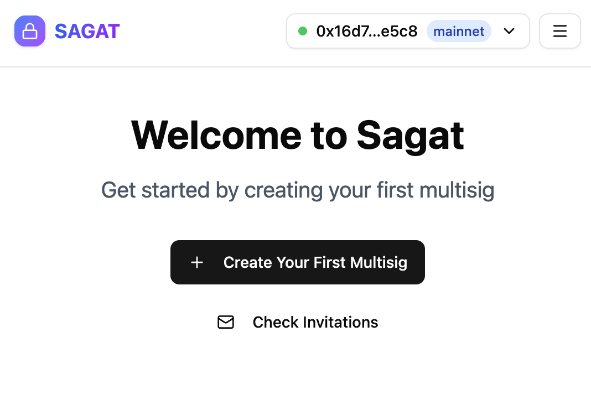

multisig를 생성하기 위해서는 최소 2개의 address를 추가하고, multisig가 생성되기 전에 approval threshold를 설정해야 한다.

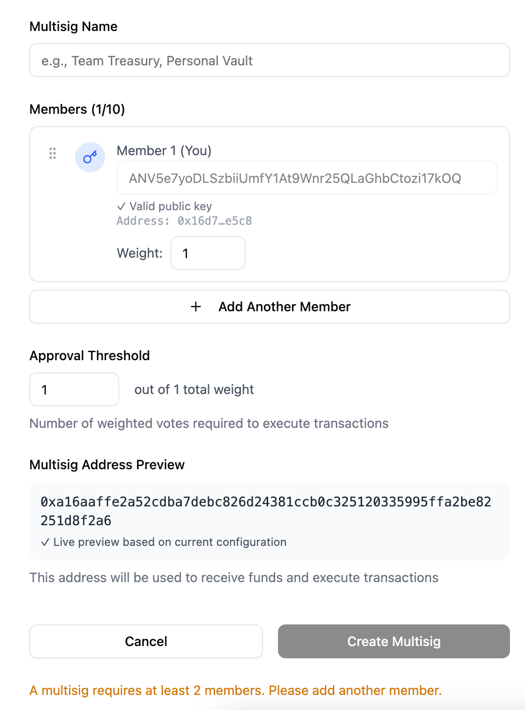

다른 member를 추가하려면 **Add Another Member**를 클릭한 다음 public key를 추가하고 approval weight를 구성한다.

user의 public key를 모르면, 돋보기 아이콘을 클릭할 수 있다:

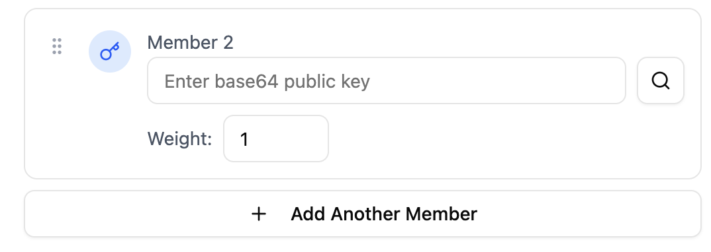

그 다음 Sui address를 입력한다. 그러면 해당 address의 public key가 반환된다.

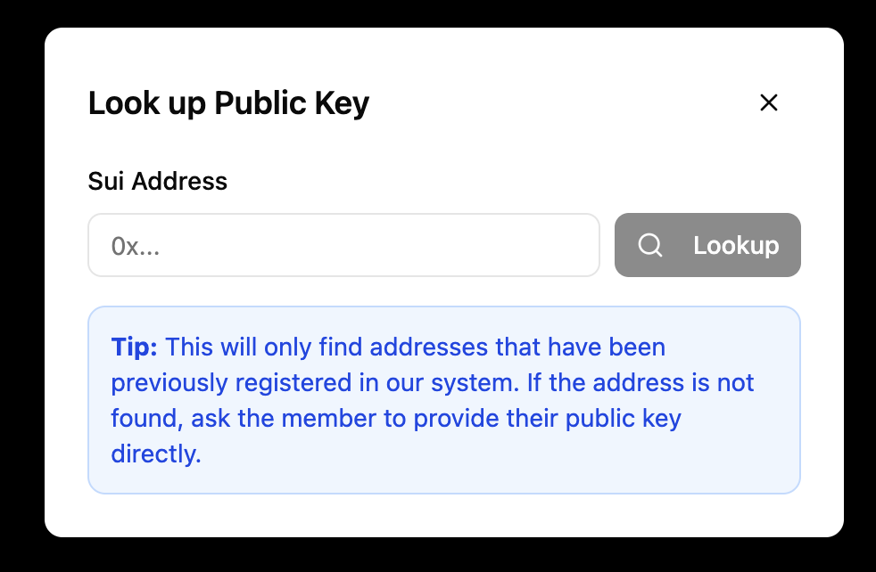

:::caution 

address는 multisig에 초대되기 전에 Sagat에 등록되어야 한다.

:::

multisig를 생성하기 전에 multisig preview가 표시된다. 

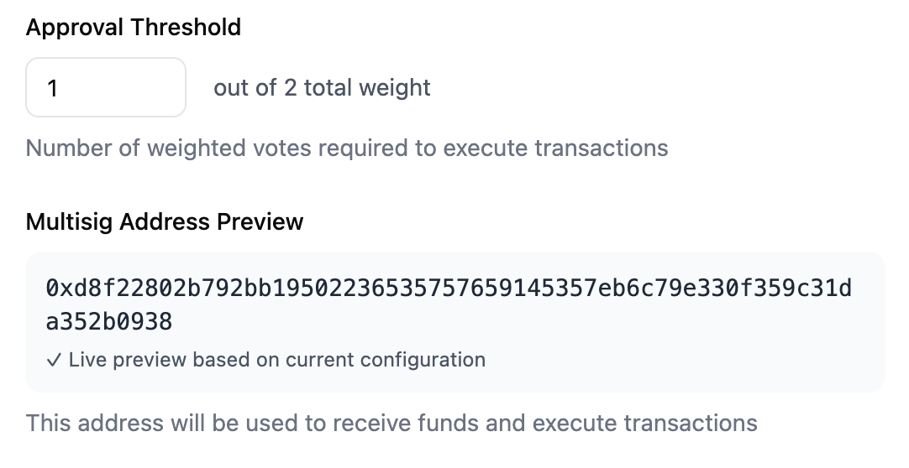

### Multisig invitations 

multisig가 생성되면, 추가된 address는 multisig에 참여하기 위한 invitation을 받는다. pending invitation은 **Invitations** tab에서 확인할 수 있다.

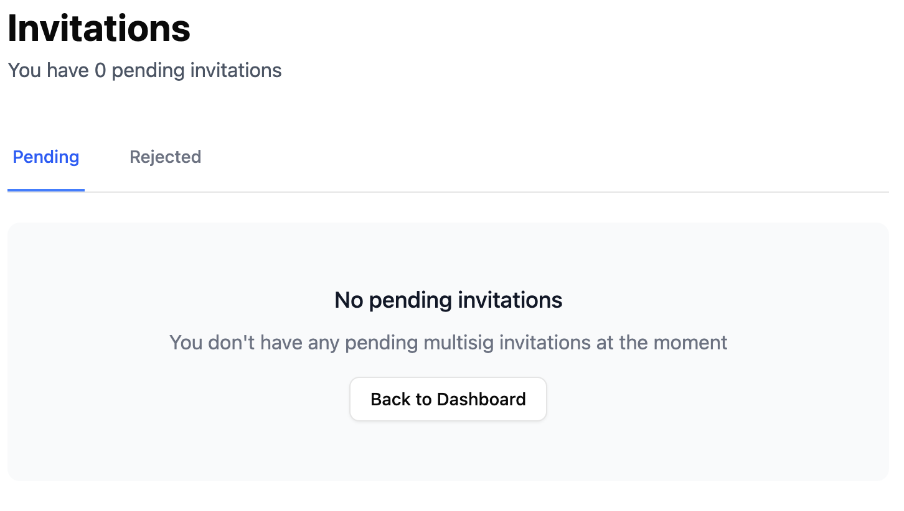

### Create and submit proposals 

Sagat dashboard에서는 proposal과 관련된 여러 세부 정보와 option을 확인할 수 있으며, 다음이 포함된다:

- 새 proposal을 생성하는 button.

- submitted 상태, pending 상태, 또는 executed 상태인 모든 proposal. proposal은 status별로 정렬된다. 

- multisig, member, 그리고 추가된 external proposer에 대한 overview.

- multisig가 소유한 asset에 대한 overview. 

committee member만 API에서 proposal을 쿼리할 수 있다.

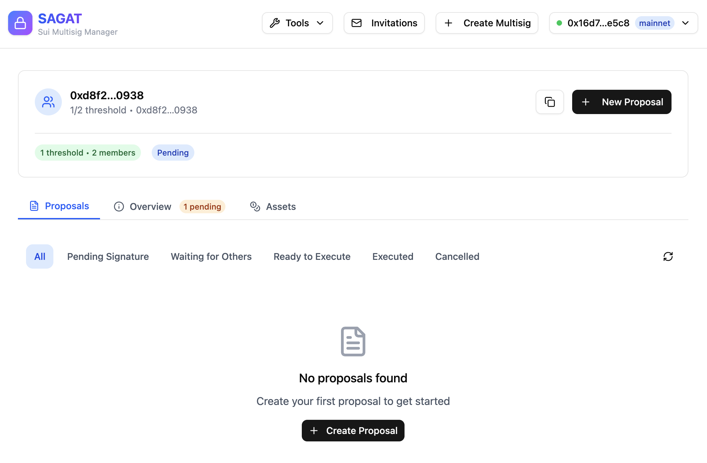

### Add external proposers 

external proposer는 multisig의 일부로 추가되지 않고도 multisig에 대한 proposal을 생성할 수 있다. external proposer는 multisig를 대신해 transaction을 승인하거나 실행할 수 없다. 

external proposer를 추가하려면 **Overview** tab을 클릭하고 **Proposers**까지 scroll down한 다음 **Add Proposer**를 클릭한다.

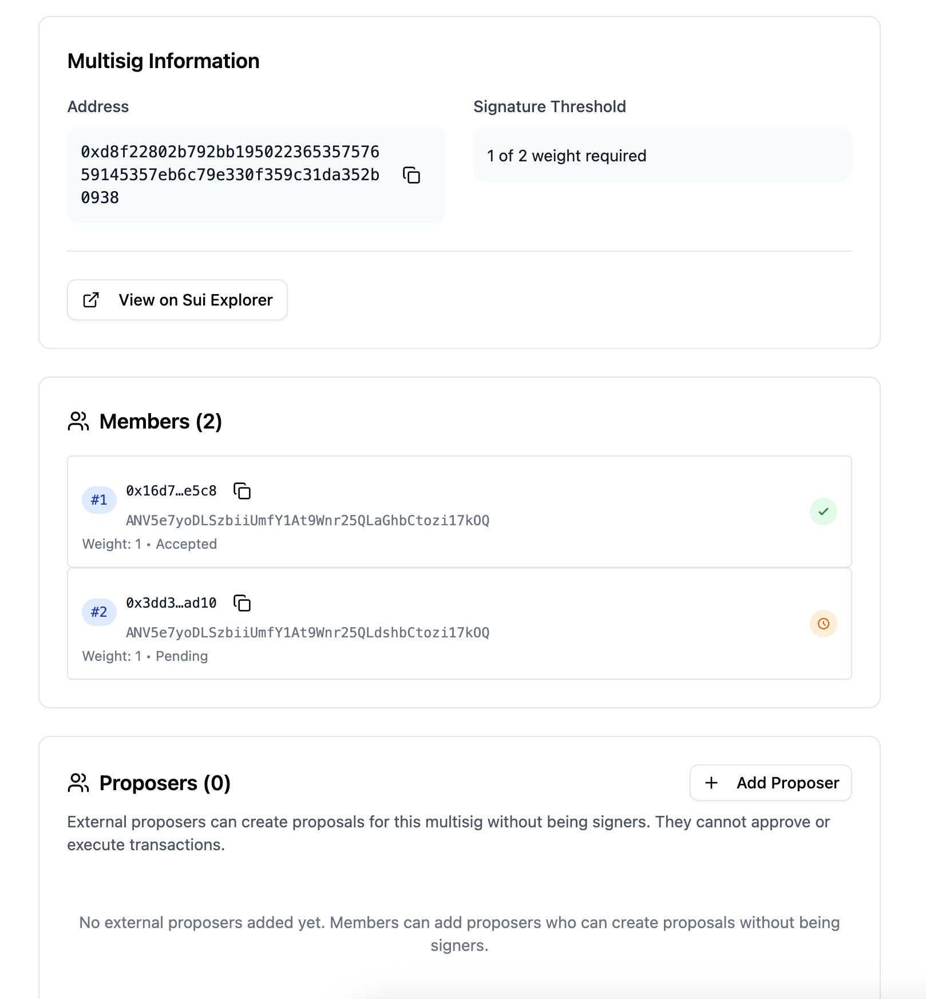

### Analyze signatures

[signature analyzer tool](https://sagat.mystenlabs.com/tools/signature-analyzer)은 base64-encoded signature를 분석하고 decode하는 데 사용된다. 이는 multisig와 single signature scheme을 모두 지원한다.

signature를 input box에 입력한다. decode된 signature와 해당 세부 정보가 반환된다:

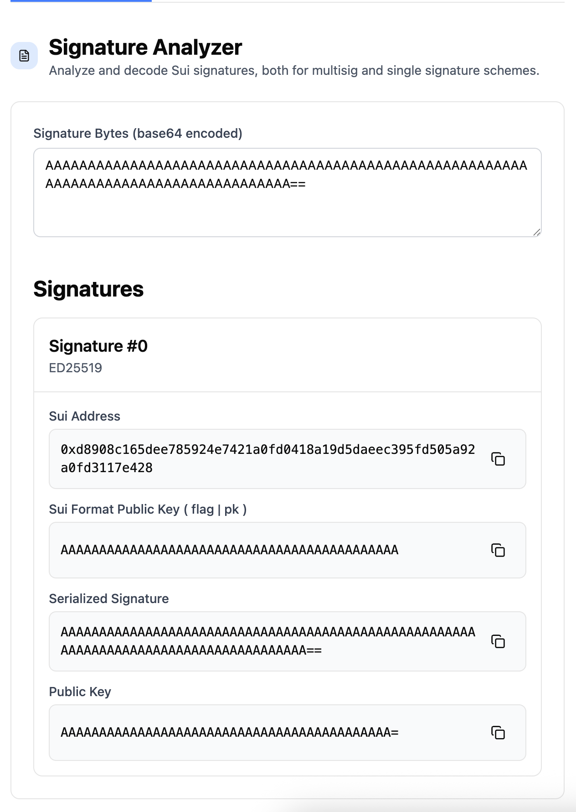

[SuiScan](https://suiscan.xyz/testnet/)과 같은 network explorer에서 [transaction's details](https://suiscan.xyz/testnet/tx/GPtGkR2F7wN1TAqDJmUE3wKTBeL7e9sVuv7UTGvp9E99)를 확인하고 **User signature** metadata field를 확인하면 transaction signature를 얻을 수 있다.

:::caution 

Sagat web interface가 **Test Mode**로 설정되어 있으면, Testnet에 배포된 transaction의 signature만 사용할 수 있다. Mainnet transaction의 경우 Sagat에서 account drop-down menu의 **Test mode**를 비활성화한다. 

:::

### Sign transactions 

[transaction signer tool](https://sagat.mystenlabs.com/tools/sign)은 web interface에 연결한 Slush wallet을 사용해 transaction을 preview하고 서명하는 데 사용할 수 있다.

raw JSON 또는 base64로 transaction 데이터를 입력한다. tool은 transaction을 서명할 option을 제공하기 전에 transaction preview를 반환한다.

:::caution 

Sagat web interface가 **Test Mode**로 설정되어 있으면, Testnet에 대한 transaction을 preview하거나 서명할 수 있다. Mainnet transaction의 경우 Sagat에서 account drop-down menu의 **Test mode**를 비활성화한다. 

:::


## Using Sagat programmatically

Sagat는 web browser를 통해 지원되는 동일한 작업을 실행하기 위해 [TypeScript SDK](https://github.com/MystenLabs/sagat/tree/main/sdk) 또는 [Sagat API](https://github.com/MystenLabs/sagat/tree/main/api)를 통해 사용할 수 있다. 아래 예시는 Sagat API를 사용한 test scenario를 시연한다. 

### Register public keys

multisig를 생성하기 전에 Sagat에 address를 등록한다:

<ImportContent
	source="/api/test/addresses.test.ts"
	mode="code"
	org="MystenLabs"
	repo="sagat"
	test="registers single user addresses"
	noComments
/>

multisig를 생성하기 전에 동일한 session에서 여러 address를 Sagat에 등록한다:

<ImportContent
	source="/api/test/addresses.test.ts"
	mode="code"
	org="MystenLabs"
	repo="sagat"
	test="registers multiple user addresses in same session"
	noComments
/>

[Sagat TypeScript SDK](https://github.com/MystenLabs/sagat/blob/313624a9d3b4b971b81b80be851b49e055067250/sdk/src/client.ts#L214-L222)를 사용해 이 작업을 실행하는 방법을 알아본다.

### Creating and managing multisig 

multisig는 execution 전에 user group이 transaction에 대해 vote하고 승인해야 하는 user group이다. multisig transaction을 생성하고 실행하려면 먼저 multisig를 생성해야 한다. proposed transaction이 multisig member의 majority approval을 받지 못하면, transaction은 취소된다. 

예를 들어, 2-of-2 multisig를 생성하고 검증한다: 

<ImportContent
	source="/api/test/multisig-api.test.ts"
	mode="code"
	org="MystenLabs"
	repo="sagat"
	test="create and verify 2-of-2 multisig"
	noComments
/>

2-of-2 multisig는 multisig에 속한 2명의 user가 있으며, proposed transaction에 대해 두 user 모두가 승인해야 함을 의미한다. [Sagat TypeScript SDK](https://github.com/MystenLabs/sagat/blob/313624a9d3b4b971b81b80be851b49e055067250/sdk/src/client.ts#L72-L94)를 사용해 이 작업을 실행하는 방법을 알아본다.

custom name으로 multisig를 생성할 수도 있다:

<ImportContent
	source="/api/test/multisig.test.ts"
	mode="code"
	org="MystenLabs"
	repo="sagat"
	test="creates multisig with custom name"
	noComments
/>

특정 address에 대한 multisig detail을 볼 수 있다:

<ImportContent
	source="/api/test/addresses.test.ts"
	mode="code"
	org="MystenLabs"
	repo="sagat"
	test="can look up registered address"
	noComments
/>

[Sagat TypeScript SDK](https://github.com/MystenLabs/sagat/blob/313624a9d3b4b971b81b80be851b49e055067250/sdk/src/client.ts#L96-L100)를 사용해 이 작업을 실행하는 방법을 알아본다. 또한 [public key information for a registered address](https://github.com/MystenLabs/sagat/blob/313624a9d3b4b971b81b80be851b49e055067250/sdk/src/client.ts#L279-L281)도 조회할 수 있다.

multisig에 대해 proposal을 생성할 수 있는 address를 관리한다:

<ImportContent
	source="/api/test/proposal-business-logic.test.ts"
	mode="code"
	org="MystenLabs"
	repo="sagat"
	test="Add proposer"
	noComments
/>

[Sagat TypeScript SDK](https://github.com/MystenLabs/sagat/blob/313624a9d3b4b971b81b80be851b49e055067250/sdk/src/client.ts#L297-L346)를 사용해 이 작업을 실행하는 방법을 알아본다.

### Multisig invitations 

multisig는 multisig에 초대된 모든 member가 참여 invitation을 수락하거나 거부하기 전까지 유효하지 않다. multisig가 생성되면, 모든 member public key는 [auto-registered](https://github.com/MystenLabs/sagat/blob/313624a9d3b4b971b81b80be851b49e055067250/sdk/src/client.ts#L283-L294)된다.

public key에 대해 pending multisig invitation을 조회하고 수락한다:

<ImportContent
	source="/api/test/multisig.test.ts"
	mode="code"
	org="MystenLabs"
	repo="sagat"
	test="member can accept multisig invitation"
	noComments
/>

[Sagat TypeScript SDK](https://github.com/MystenLabs/sagat/blob/313624a9d3b4b971b81b80be851b49e055067250/sdk/src/client.ts#L234-L251)를 사용해 invitation을 조회하는 방법을 알아보거나, [accept invitations with the SDK](https://github.com/MystenLabs/sagat/blob/313624a9d3b4b971b81b80be851b49e055067250/sdk/src/client.ts#L102-L113)로 invitation을 수락하는 방법을 알아본다. 또한 [reject an invitation](https://github.com/MystenLabs/sagat/blob/313624a9d3b4b971b81b80be851b49e055067250/sdk/src/client.ts#L115-L126)할 수도 있다.

### Proposal creation

multisig transaction을 실행하려면, 먼저 이를 제안해야 한다. 해당 multisig의 member는 proposed transaction에 대해 vote해야 하며, 구성된 majority가 transaction 실행에 동의해야 한다. 

검증된 multisig member만 proposal을 생성하고 이에 투표할 수 있다. 각 multisig member는 한 번 투표할 수 있다. proposal이 실행되려면 특정 voting threshold에 도달해야 한다. proposal이 실행되기 전에는, proposal을 만든 user가 이를 [canceled by the user](https://github.com/MystenLabs/sagat/blob/313624a9d3b4b971b81b80be851b49e055067250/sdk/src/client.ts#L197-L208)할 수 있다. 

<ImportContent
	source="/api/test/proposal-business-logic.test.ts"
	mode="code"
	org="MystenLabs"
	repo="sagat"
	test="creates proposal with correct initial state"
	noComments
/>

proposal을 생성하기 전에 transaction signature는 [verified](https://github.com/MystenLabs/sagat/blob/main/api/test/proposal-business-logic.test.ts#L41)되어야 한다. [Sagat TypeScript SDK](https://github.com/MystenLabs/sagat/blob/313624a9d3b4b971b81b80be851b49e055067250/sdk/src/client.ts#L128-L134)를 사용해 이 작업을 실행하는 방법을 알아본다.

### Viewing proposals 

status filter와 pagination으로 multisig에 대한 proposal을 browse할 수 있다:

<ImportContent
	source="/api/test/proposal-business-logic.test.ts"
	mode="code"
	org="MystenLabs"
	repo="sagat"
	test="Get paginated proposals"
	noComments
/>

[Sagat TypeScript SDK](https://github.com/MystenLabs/sagat/blob/313624a9d3b4b971b81b80be851b49e055067250/sdk/src/client.ts#L136-L171)를 사용해 이 작업을 실행하는 방법을 알아본다.

transaction digest로 proposal을 조회할 수 있다:

<ImportContent
	source="/api/test/proposal-business-logic.test.ts"
	mode="code"
	org="MystenLabs"
	repo="sagat"
	test="Get proposal by digest"
	noComments
/>

[Sagat TypeScript SDK](https://github.com/MystenLabs/sagat/blob/313624a9d3b4b971b81b80be851b49e055067250/sdk/src/client.ts#L173-L177)를 사용해 이 작업을 실행하는 방법을 알아본다.

### Voting on proposals

user는 accept 또는 reject하기 위해 proposal에 vote함으로써 transaction을 승인하거나 거부한다:

<ImportContent
	source="/api/test/multisig-api.test.ts"
	mode="code"
	org="MystenLabs"
	repo="sagat"
	test="full multisig workflow: creation -> verification -> proposal -> voting -> execution"
	noComments
/>

[Sagat TypeScript SDK](https://github.com/MystenLabs/sagat/blob/313624a9d3b4b971b81b80be851b49e055067250/sdk/src/client.ts#L179-L190)를 사용해 이 작업을 실행하는 방법을 알아본다. proposal은 [ID number](https://github.com/MystenLabs/sagat/blob/313624a9d3b4b971b81b80be851b49e055067250/sdk/src/client.ts#L258-L265) 또는 [transaction's digest](https://github.com/MystenLabs/sagat/blob/313624a9d3b4b971b81b80be851b49e055067250/sdk/src/client.ts#L267-L274)로 검증할 수 있다.
